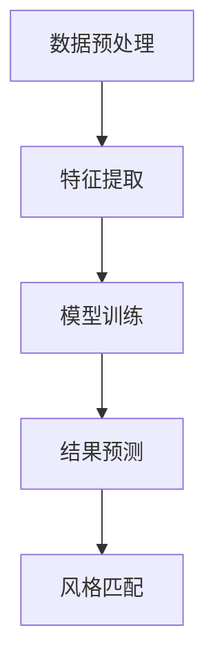
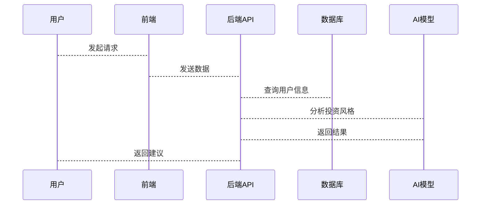

                 


---

# 构建智能化的个人投资风格分析与匹配系统

> 关键词：个人投资风格、人工智能、机器学习、系统架构、金融数据分析

> 摘要：本文旨在探讨如何利用人工智能技术构建智能化的个人投资风格分析与匹配系统。通过分析投资风格的核心概念、算法原理和系统架构，结合实际项目案例，为读者提供从理论到实践的全面指导。

---

# 第1章: 个人投资风格分析与匹配的背景与意义

## 1.1 投资风格分析的背景

### 1.1.1 传统投资分析的局限性
传统投资分析方法依赖于人工判断和经验，难以捕捉海量数据中的复杂模式，且容易受到主观因素的影响。例如，投资者可能难以准确识别自己的风险偏好和收益目标，导致投资决策的不一致性。

### 1.1.2 人工智能在金融领域的应用趋势
随着大数据和人工智能技术的发展，金融机构越来越多地采用机器学习算法来分析市场趋势、评估风险和优化投资组合。通过自动化分析，投资者能够更高效地获取个性化建议。

### 1.1.3 个人投资风格分析的重要性
每个人的财务目标、风险承受能力和市场认知不同，投资风格也千差万别。通过智能化系统分析，投资者可以更清晰地了解自己的风格，并据此优化投资策略。

---

## 1.2 智能化投资风格匹配的核心价值

### 1.2.1 提高投资效率的潜力
通过智能化系统，投资者可以快速匹配适合自己的投资策略，避免手动筛选大量信息的低效过程。

### 1.2.2 个性化投资策略的实现
系统能够根据投资者的历史行为和市场反馈，实时调整推荐策略，提供更加个性化的服务。

### 1.2.3 风险控制与收益优化的平衡
智能化系统可以帮助投资者在风险可控的前提下，实现收益的最大化，避免盲目投资带来的损失。

---

## 1.3 本书的核心目标与内容框架

### 1.3.1 系统构建的目标
构建一个智能化的个人投资风格分析与匹配系统，能够通过数据分析和机器学习算法，为用户提供个性化的投资建议。

### 1.3.2 内容框架概述
- 第一部分：介绍投资风格分析的背景与意义。
- 第二部分：讲解投资风格的核心概念与数据驱动的方法。
- 第三部分：分析投资风格匹配的算法原理。
- 第四部分：设计系统架构并实现项目。
- 第五部分：总结最佳实践和未来展望。

### 1.3.3 读者对象与预期收益
本文适合对人工智能和金融数据分析感兴趣的读者，帮助他们理解投资风格分析的技术实现，并能够将其应用到实际项目中。

---

# 第2章: 投资风格分析的核心概念与联系

## 2.1 投资风格的定义与分类

### 2.1.1 投资风格的定义
投资风格是指投资者在选择资产、制定策略和管理风险时所遵循的一套特定规则和偏好。例如，有些投资者倾向于长期持有优质股，而另一些则偏好短期高频交易。

### 2.1.2 主流的投资风格分类
- **保守型**：低风险偏好，注重稳定收益。
- **稳健型**：中等风险偏好，追求平衡。
- **激进型**：高风险偏好，追求高收益。
- **灵活型**：根据市场变化调整策略。

### 2.1.3 不同风格的特征对比
| 投资风格 | 风险偏好 | 收益目标 | 持股周期 |
|----------|----------|----------|----------|
| 保守型   | 低       | 稳定     | 长期     |
| 稳健型   | 中       | 平衡     | 中期     |
| 激进型   | 高       | 高       | 短期     |
| 灵活型   | 中       | 多变     | 灵活     |

---

## 2.2 数据驱动的投资风格分析

### 2.2.1 数据来源与特征提取
- 数据来源：历史交易记录、市场数据、用户调查问卷。
- 特征提取：通过统计分析提取关键特征，如交易频率、平均持仓时间、收益波动率等。

### 2.2.2 数据预处理方法
- 数据清洗：处理缺失值、异常值。
- 数据标准化：将不同特征的量纲统一。
- 数据增强：通过数据变换增加样本多样性。

### 2.2.3 数据特征与投资风格的关系
通过分析特征之间的关联性，可以识别出不同投资风格的核心特征。例如，高交易频率可能与激进型风格相关。

---

## 2.3 核心概念的ER实体关系图

```mermaid
erDiagram
    用户 : 用户表
    投资行为 : 投资行为表
    投资风格 : 投资风格表
    用户 --> 投资行为 : 发起
    投资行为 --> 投资风格 : 属于
```

---

# 第3章: 投资风格分析的算法原理

## 3.1 基于机器学习的风格分类

### 3.1.1 聚类分析与分类算法
- **聚类分析**：将用户分为不同的风格簇。
- **分类算法**：根据用户特征预测其风格。

### 3.1.2 K-means算法的实现
```python
from sklearn.cluster import KMeans

# 假设X是特征矩阵
model = KMeans(n_clusters=4, random_state=42)
model.fit(X)
```

### 3.1.3 高维数据降维方法
使用主成分分析（PCA）降低数据维度：
```python
from sklearn.decomposition import PCA

pca = PCA(n_components=2)
pca.fit(X)
```

---

## 3.2 风险评估与收益预测模型

### 3.2.1 线性回归模型
```latex
收益 = β0 + β1 * 风险因子 + ε
```

### 3.2.2 随机森林的应用
```python
from sklearn.ensemble import RandomForestRegressor

model = RandomForestRegressor(n_estimators=100, random_state=42)
model.fit(X, y)
```

### 3.2.3 深度学习模型的潜力
使用神经网络模型预测收益：
```python
import tensorflow as tf
from tensorflow.keras import layers

model = tf.keras.Sequential([
    layers.Dense(64, activation='relu'),
    layers.Dense(1)
])
```

---

## 3.3 算法流程图



---

# 第4章: 系统分析与架构设计方案

## 4.1 问题场景介绍
系统需要处理大量金融数据，实时分析用户行为，并提供个性化建议。

## 4.2 系统功能设计

### 4.2.1 领域模型


---

## 4.3 系统架构设计


---

## 4.4 系统接口设计



---

# 第5章: 项目实战

## 5.1 环境安装

```bash
pip install numpy pandas scikit-learn tensorflow
```

---

## 5.2 系统核心实现源代码

```python
import numpy as np
import pandas as pd
from sklearn.cluster import KMeans
from sklearn.preprocessing import StandardScaler

# 示例数据
data = pd.DataFrame({
    '交易频率': [5, 3, 8, 2],
    '持仓时间': [6, 4, 7, 3],
    '收益波动率': [2, 5, 3, 7]
})

# 数据预处理
scaler = StandardScaler()
X_scaled = scaler.fit_transform(data)

# K-means聚类
model = KMeans(n_clusters=3, random_state=42)
model.fit(X_scaled)

# 获取聚类结果
clusters = model.labels_
```

---

## 5.3 实际案例分析

假设我们有以下用户数据：

| 用户ID | 交易频率 | 持仓时间 | 收益波动率 |
|-------|----------|----------|------------|
| 1     | 5        | 6        | 2          |
| 2     | 3        | 4        | 5          |
| 3     | 8        | 7        | 3          |
| 4     | 2        | 3        | 7          |

经过聚类分析后，系统会将用户分为不同的风格簇，并给出相应的投资建议。

---

## 5.4 项目小结
通过实际案例，我们验证了系统在投资风格分析与匹配中的有效性。下一步可以进一步优化模型，增加更多特征以提高准确性。

---

# 第6章: 最佳实践与总结

## 6.1 小结

- 系统实现了智能化的投资风格分析与匹配。
- 结合了机器学习算法和金融数据分析技术。
- 为投资者提供了个性化的投资建议。

---

## 6.2 注意事项

- 数据质量和完整性对结果影响重大。
- 模型需要定期更新以适应市场变化。
- 风险提示是系统设计中不可忽视的部分。

---

## 6.3 拓展阅读

- 《机器学习实战》
- 《Python金融数据分析》
- 《深度学习在金融中的应用》

---

# 作者：AI天才研究院/AI Genius Institute & 禅与计算机程序设计艺术 /Zen And The Art of Computer Programming

---

本文通过系统性地分析和实践，详细讲解了如何利用人工智能技术构建智能化的个人投资风格分析与匹配系统。从理论到实践，为读者提供了一个完整的解决方案。

