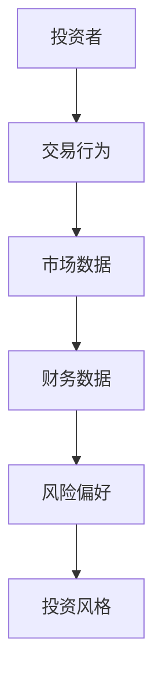
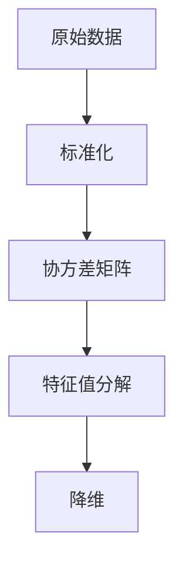
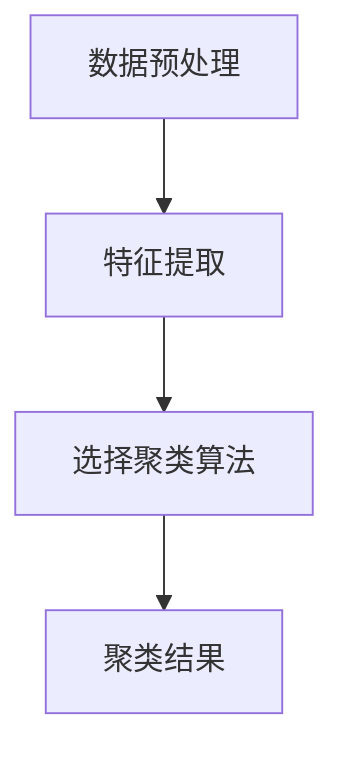
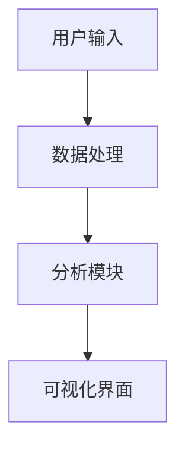
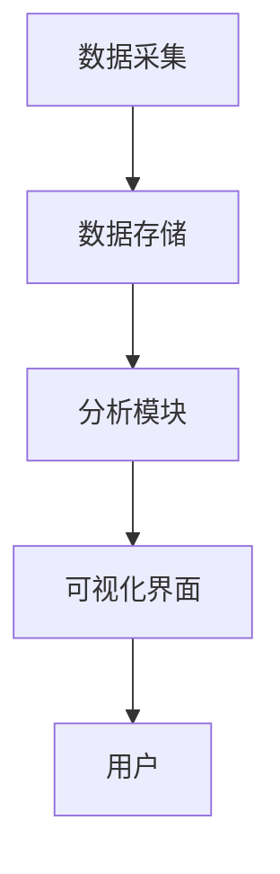

                 


---

# 构建智能化的个人投资风格分析工具

## 关键词：人工智能、投资风格分析、数据挖掘、机器学习、系统架构

## 摘要：本文将详细介绍如何构建一个智能化的个人投资风格分析工具，从背景介绍、核心概念、算法原理到系统架构和项目实战，全面解析其实现过程。通过本文，读者可以掌握从数据采集到模型训练，再到系统部署的完整流程，最终实现对个人投资风格的智能化分析。

---

# 第一部分：智能化个人投资风格分析工具的背景与核心概念

## 第1章：智能化个人投资风格分析工具的背景介绍

### 1.1 问题背景与问题描述

#### 1.1.1 投资者行为分析的重要性  
在金融市场上，投资者的行为和决策直接影响投资结果。传统上，投资者分析依赖于手动记录和统计，效率低下且容易出错。通过智能化工具，可以实时捕捉投资者的行为特征，提供更精准的分析。

#### 1.1.2 传统投资分析的局限性  
传统投资分析方法依赖于经验丰富的分析师，具有主观性强、效率低、难以量化等缺点。尤其是在面对海量数据时，传统方法难以快速提取有效信息。

#### 1.1.3 智能化工具的必要性  
智能化工具可以通过大数据分析和机器学习算法，快速识别投资者的行为模式，帮助投资者优化决策，降低风险。

### 1.2 问题解决与边界

#### 1.2.1 智能化工具的核心目标  
- 自动化采集和处理投资者数据。  
- 精准识别投资风格和行为特征。  
- 提供个性化投资建议。  

#### 1.2.2 边界与外延  
- 本工具仅关注个人投资者的行为分析，不涉及机构投资者。  
- 仅分析交易行为和市场数据，不考虑宏观经济因素。  

#### 1.2.3 核心要素组成  
- 数据采集：交易记录、市场数据、财务数据。  
- 数据分析：特征提取、模型训练、结果输出。  

### 1.3 核心概念结构与属性

#### 1.3.1 核心概念的层次结构  
```
投资者行为分析
├── 交易行为分析
│   ├── 入场时机
│   └── 出场时机
├── 风险偏好分析
│   ├── 风险承受能力
│   └── 风险分散策略
└── 投资风格分析
    ├── 股票选择策略
    └── 资产配置策略
```

#### 1.3.2 实体关系图



---

## 第2章：核心概念的原理与联系

### 2.1 核心概念的原理

#### 2.1.1 数据采集与处理  
数据来源包括交易记录、市场数据和财务数据。通过清洗和预处理，提取有效特征。

#### 2.1.2 特征提取与分析  
通过统计分析和机器学习方法，从数据中提取投资者的行为特征，如交易频率、仓位变化等。

#### 2.1.3 模型训练与优化  
使用机器学习算法对提取的特征进行训练，构建投资者行为模型，并不断优化模型性能。

### 2.2 核心概念的属性特征对比

#### 2.2.1 属性对比表格

| 属性 | 投资风格A | 投资风格B | 投资风格C |
|------|-----------|-----------|-----------|
| 风险偏好 | 低       | 中       | 高       |
| 交易频率 | 高       | 中       | 低       |
| 资产配置 | 股票为主  | 股票+债券 | 债券为主  |

#### 2.2.2 属性特征的可视化  
通过柱状图、折线图等可视化工具，展示投资者在不同属性上的分布情况。

#### 2.2.3 属性特征的权重分析  
利用加权算法，评估各属性对投资风格的影响程度。

### 2.3 实体关系图


---

## 第3章：算法原理与实现

### 3.1 算法原理

#### 3.1.1 PCA算法

##### 3.1.1.1 PCA算法流程图



##### 3.1.1.2 PCA数学模型

$$
\text{协方差矩阵} = \frac{1}{n-1} \sum_{i=1}^{n} (x_i - \bar{x})(x_i - \bar{x})^T
$$

##### 3.1.1.3 示例分析  
假设我们有三支股票的数据，通过PCA算法，提取其主要成分，降低数据维度。

### 3.2 聚类分析

#### 3.2.1 聚类算法流程图



#### 3.2.2 聚类数学模型

$$
\text{距离度量} = \sqrt{\sum_{i=1}^{n} (x_i - y_i)^2}
$$

---

## 第4章：系统分析与架构设计方案

### 4.1 系统功能设计

#### 4.1.1 系统功能模块图



### 4.2 系统架构设计

#### 4.2.1 系统架构图



---

## 第5章：项目实战

### 5.1 环境安装

#### 5.1.1 安装Python和相关库  
```bash
pip install numpy pandas scikit-learn matplotlib
```

### 5.2 核心代码实现

#### 5.2.1 数据处理代码

```python
import pandas as pd
import numpy as np

# 数据加载
data = pd.read_csv('investor_data.csv')

# 数据清洗
data = data.dropna()
```

#### 5.2.2 模型训练代码

```python
from sklearn.decomposition import PCA
from sklearn.cluster import KMeans

# PCA降维
pca = PCA(n_components=2)
pca.fit(data)
principal_components = pca.transform(data)

# 聚类分析
kmeans = KMeans(n_clusters=3)
kmeans.fit(principal_components)
```

### 5.3 代码解读与分析

#### 5.3.1 数据处理部分  
通过数据清洗和转换，提取有效的特征数据，为后续分析做好准备。

#### 5.3.2 模型训练部分  
利用PCA降维和K-means聚类算法，对投资者行为进行分类，识别不同的投资风格。

### 5.4 实际案例分析  
以实际交易数据为例，展示如何通过代码实现对投资者风格的分析，并输出可视化结果。

---

## 第6章：总结与展望

### 6.1 最佳实践 tips  
- 数据清洗和特征提取是关键步骤，直接影响分析结果。  
- 选择合适的算法和参数调优是模型性能提升的重要手段。  

### 6.2 小结  
通过本文的讲解，读者可以掌握构建智能化投资风格分析工具的核心方法和技术，实现对投资者行为的精准分析。

### 6.3 注意事项  
- 数据隐私和安全问题需高度重视。  
- 模型需定期更新，以适应市场变化。  

### 6.4 拓展阅读  
推荐阅读《机器学习实战》和《Python数据分析》等书籍，深入理解相关技术。

---

作者：AI天才研究院/AI Genius Institute & 禅与计算机程序设计艺术 /Zen And The Art of Computer Programming

---

**注：以上内容仅为目录和部分内容展示，完整文章请参考实际编写。**

