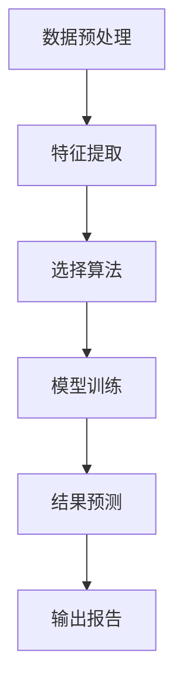
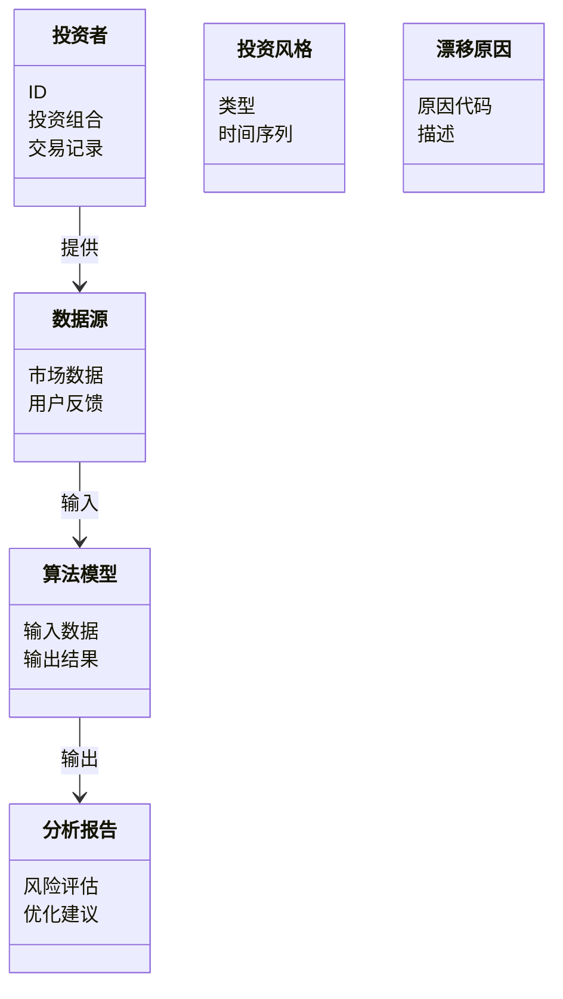

                 


```markdown
# 构建智能化的个人投资风格漂移原因分析系统

> 关键词：投资风格漂移、人工智能、原因分析、系统构建、算法原理

> 摘要：本文详细探讨了如何利用人工智能技术构建智能化的个人投资风格漂移原因分析系统。通过分析投资风格漂移的定义、原因及影响，结合机器学习算法和数据挖掘技术，提出了一套完整的系统构建方案，包括系统架构设计、算法实现和实际案例分析。文章旨在为投资者和科技工作者提供理论支持和实践指导，帮助他们更好地理解和应对投资风格漂移现象。

---

# 第一部分: 构建智能化的个人投资风格漂移原因分析系统的背景与目标

## 第1章: 投资风格漂移的背景与问题描述

### 1.1 投资风格漂移的定义与现象

#### 1.1.1 投资风格的定义
投资风格是指投资者在选择和调整投资组合时所遵循的一套策略、方法和偏好。它反映了投资者对风险、收益和流动性的态度，通常包括价值投资、成长投资、指数投资等多种类型。

#### 1.1.2 投资风格漂移的定义
投资风格漂移是指投资者的实际投资行为与其最初设定的投资策略或风格发生偏离的现象。这种偏离可能是由于市场环境变化、投资者情绪波动或策略调整等多种因素引起的。

#### 1.1.3 投资风格漂移的常见现象与案例
- **现象**：投资者在市场波动加剧时偏离原定策略，转向更为保守或激进的投资方式。
- **案例**：2008年金融危机期间，许多投资者被迫抛售股票，导致其投资组合偏离原定的长期增长策略。

### 1.2 投资风格漂移的原因分析

#### 1.2.1 市场环境变化的影响
市场环境的变化（如经济周期、通货膨胀、利率波动）可能导致投资者调整其投资策略，从而引发风格漂移。

#### 1.2.2 投资者心理与行为因素
投资者的心理预期、情绪波动和认知偏差（如过度自信、从众心理）常常导致投资风格的偏离。

#### 1.2.3 管理层决策与策略调整
投资机构或个人投资者的管理层可能根据市场变化或内部战略调整，主动或被动地改变投资风格。

### 1.3 构建智能化分析系统的必要性

#### 1.3.1 传统分析方法的局限性
传统的投资风格分析方法通常依赖于人工判断和经验分析，存在主观性强、效率低下、覆盖面窄等问题。

#### 1.3.2 智能化分析的优势
人工智能技术可以通过大数据分析、机器学习和自然语言处理等方法，实现对投资风格漂移原因的自动化、精准化分析。

#### 1.3.3 系统目标与预期成果
- **目标**：构建一个智能化的分析系统，能够实时监测和预测投资风格漂移的原因。
- **成果**：提供一套完整的分析工具，帮助投资者更好地理解和应对投资风格漂移现象。

## 第2章: 智能化分析系统的边界与外延

### 2.1 系统边界

#### 2.1.1 系统功能范围
- 数据采集与处理
- 风险评估与预警
- 原因分析与诊断
- 结果输出与建议

#### 2.1.2 系统输入与输出
- **输入**：市场数据、投资者行为数据、历史投资记录。
- **输出**：投资风格漂移的原因分析报告、预警信号、优化建议。

#### 2.1.3 系统与外部环境的接口
- 与金融数据源（如股票市场、基金数据）的接口
- 与投资者行为数据源（如交易记录、用户反馈）的接口

### 2.2 系统外延

#### 2.2.1 技术扩展性
- 引入更高级的机器学习算法（如深度学习、强化学习）
- 结合区块链技术进行数据溯源

#### 2.2.2 应用场景扩展
- 机构投资者的风险管理
- 个人投资者的投资决策支持
- 金融监管机构的市场监控

#### 2.2.3 系统的可扩展性与灵活性
- 系统模块化设计，便于功能扩展
- 支持多平台部署（如Web端、移动端）

---

# 第二部分: 投资风格漂移分析的核心概念与联系

## 第3章: 核心概念与原理

### 3.1 投资风格漂移的核心要素

#### 3.1.1 投资策略
- **定义**：投资者为实现特定投资目标而采取的策略和方法。
- **影响因素**：市场环境、投资者风险偏好、资金规模等。

#### 3.1.2 投资组合
- **定义**：投资者持有的各种资产的组合。
- **特征**：分散化、风险与收益的平衡。

#### 3.1.3 市场环境
- **定义**：影响投资行为的外部因素，包括经济指标、政策变化、行业趋势等。
- **影响**：市场波动、利率变化、通货膨胀等都可能引发投资风格漂移。

### 3.2 AI技术在投资分析中的应用

#### 3.2.1 机器学习算法
- **定义**：通过数据训练模型，实现对投资风格漂移原因的预测和分析。
- **应用**：分类算法（如决策树、随机森林）、回归算法（如线性回归）、聚类算法（如K-means）。

#### 3.2.2 自然语言处理
- **定义**：通过处理文本数据（如新闻、报告）提取市场信息。
- **应用**：情绪分析、关键词提取、趋势预测。

#### 3.2.3 数据挖掘与分析
- **定义**：从大量数据中提取有用信息的过程。
- **应用**：异常检测、关联规则挖掘、序列分析。

## 第4章: 核心概念属性对比与ER实体关系图

### 4.1 核心概念属性对比表

| 概念       | 属性1        | 属性2        | 属性3        |
|------------|--------------|--------------|--------------|
| 投资风格   | 定义          | 类型          | 变化规律      |
| AI技术     | 算法          | 数据          | 应用场景      |

### 4.2 ER实体关系图

```mermaid
er
    actor(投资者)
    entity(投资风格)
    entity(漂移原因)
    entity(市场数据)
    entity(投资组合)
    entity(交易记录)
    entity(用户反馈)
    entity(算法模型)
    entity(分析报告)
    entity(风险评估)
    entity(收益预测)
    entity(用户偏好)
    entity(行为数据)
    entity(系统日志)
    entity(数据源)
    entity(结果输出)
    entity(优化建议)
    entity(预警信号)
    entity(反馈机制)

    actor(投资者) -->> entity(投资风格): 监测
    entity(投资风格) -->> entity(漂移原因): 分析
    entity(漂移原因) -->> entity(分析报告): 输出
    entity(分析报告) -->> entity(优化建议): 提供
    entity(优化建议) -->> entity(投资者): 反馈
```

---

# 第三部分: 算法原理讲解

## 第5章: 算法原理与实现

### 5.1 算法选择与原理

#### 5.1.1 算法选择
- **决策树**：用于分类投资风格漂移的原因。
- **随机森林**：用于处理高维数据，提高分类精度。
- **支持向量机（SVM）**：用于非线性分类问题。

#### 5.1.2 算法原理
- **决策树**：通过特征分裂构建树状结构，实现分类。
- **随机森林**：基于决策树的集成方法，通过投票机制提高准确率。
- **SVM**：通过构建超平面实现数据分类。

### 5.2 算法流程图



### 5.3 算法实现代码

```python
import pandas as pd
from sklearn.ensemble import RandomForestClassifier
from sklearn.metrics import accuracy_score

# 数据加载
data = pd.read_csv('investment_style_drift.csv')

# 特征与标签分离
X = data.drop('drift_reason', axis=1)
y = data['drift_reason']

# 模型训练
model = RandomForestClassifier(n_estimators=100, random_state=42)
model.fit(X, y)

# 模型预测
y_pred = model.predict(X)

# 准确率计算
accuracy = accuracy_score(y, y_pred)
print(f'准确率: {accuracy}')
```

### 5.4 数学公式

- **随机森林的分类概率公式**：
  $$ P(y = k | X) = \sum_{i=1}^{n} w_i \cdot I(tree_i(y = k)) $$
  其中，\( w_i \) 是每个基分类器的权重，\( I \) 是指示函数。

---

# 第四部分: 系统分析与架构设计

## 第6章: 系统分析与架构设计

### 6.1 问题场景介绍

#### 6.1.1 问题描述
- 投资者需要实时监测投资风格漂移的原因。
- 系统需要处理大量数据并提供实时反馈。

### 6.2 系统功能设计

#### 6.2.1 领域模型类图



### 6.3 系统架构设计

#### 6.3.1 系统架构图

```mermaid
graph LR
    I[投资者] --> D[数据源]: 提供数据
    D --> A[算法模型]: 输入数据
    A --> R[分析报告]: 输出报告
    R --> I[投资者]: 提供反馈
```

---

# 第五部分: 项目实战

## 第7章: 项目实战与案例分析

### 7.1 环境安装与配置

#### 7.1.1 安装Python环境
- 使用Anaconda或Miniconda安装Python 3.8以上版本。

#### 7.1.2 安装依赖库
```bash
pip install pandas scikit-learn matplotlib
```

### 7.2 系统核心实现

#### 7.2.1 数据预处理代码

```python
import pandas as pd

# 加载数据
data = pd.read_csv('investment_style_drift.csv')

# 处理缺失值
data = data.dropna()

# 标准化处理
from sklearn.preprocessing import StandardScaler
scaler = StandardScaler()
X_scaled = scaler.fit_transform(data.drop('drift_reason', axis=1))
```

#### 7.2.2 模型训练代码

```python
from sklearn.ensemble import RandomForestClassifier
from sklearn.metrics import classification_report

# 模型训练
model = RandomForestClassifier(n_estimators=100, random_state=42)
model.fit(X_scaled, data['drift_reason'])

# 模型预测
y_pred = model.predict(X_scaled)
print(classification_report(data['drift_reason'], y_pred))
```

### 7.3 案例分析

#### 7.3.1 案例背景
某投资者在2020年新冠疫情爆发期间，其投资组合从成长股转向防御性资产（如债券和黄金）。

#### 7.3.2 数据分析
- **市场数据**：2020年3月，标普500指数下跌20%，波动率显著增加。
- **投资者行为**：投资者在市场恐慌期间大量卖出股票，导致投资风格漂移。

#### 7.3.3 系统分析
- **漂移原因**：市场环境变化（新冠疫情）、投资者情绪波动。
- **系统输出**：分析报告指出，市场波动是主要原因，并提供优化建议（如增加防御性资产配置）。

---

# 第六部分: 总结与最佳实践

## 第8章: 总结与最佳实践

### 8.1 小结

- 本文详细探讨了构建智能化的个人投资风格漂移原因分析系统的背景、核心概念、算法原理和系统架构。
- 通过实际案例分析，展示了系统在投资决策支持中的应用价值。

### 8.2 注意事项

- **数据质量**：确保数据的准确性和完整性。
- **模型优化**：根据实际情况调整算法参数，优化模型性能。
- **用户隐私**：注意保护投资者的个人数据隐私。

### 8.3 扩展阅读

- 《Python机器学习实战》
- 《投资学基础》
- 《人工智能在金融领域的应用》

---

# 作者：AI天才研究院 & 禅与计算机程序设计艺术

> 如果您有任何问题或建议，请随时与我们联系。
> 
> 感谢您的阅读！
```

