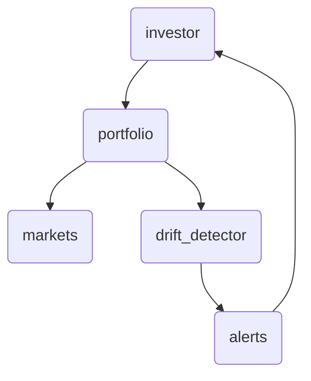
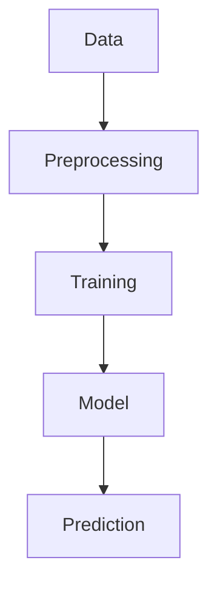
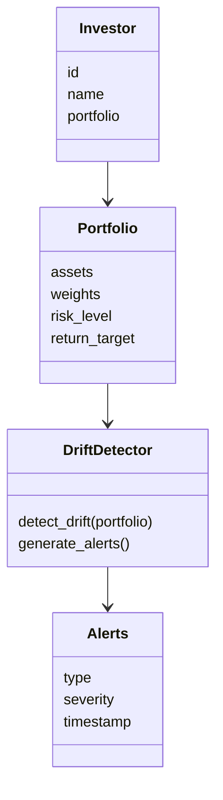
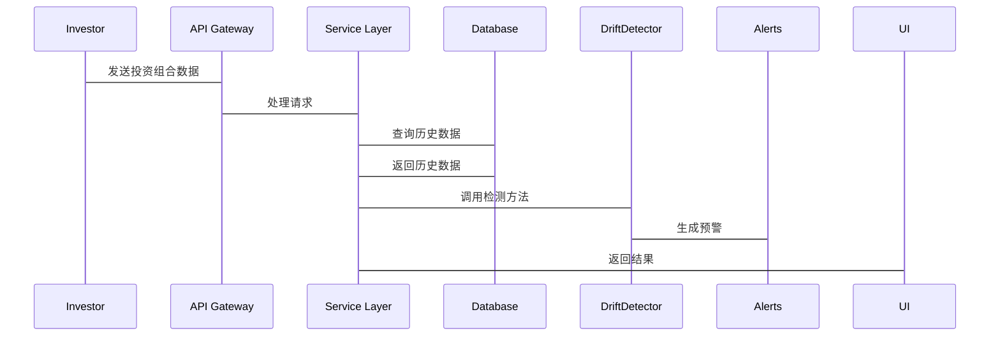

                 


# 构建智能化的个人投资风格漂移检测系统

## 关键词：投资风格漂移，智能化检测，机器学习，时间序列分析，金融数据分析

## 摘要：  
在金融投资领域，投资风格漂移是一个重要的现象，它指的是投资组合的实际表现与预定投资策略或风格的偏离。本文旨在探讨如何利用人工智能和大数据技术构建一个智能化的个人投资风格漂移检测系统。通过分析投资风格漂移的核心概念、算法原理、系统架构及实际应用案例，本文将为投资者提供一种高效、准确的检测方法，帮助他们更好地管理投资组合，降低投资风险。

---

## 第1章: 个人投资风格漂移检测的背景与问题定义

### 1.1 投资风格漂移的背景介绍  
投资风格漂移是指投资组合的实际表现与其预期的投资策略或风格发生偏离的现象。这种偏离可能是由于市场环境变化、投资者行为调整或外部干扰等因素引起的。在传统投资管理中，风格漂移的检测往往依赖于人工分析和经验判断，效率较低且容易受到主观因素的影响。  

随着人工智能和大数据技术的快速发展，智能化投资风格漂移检测系统逐渐成为可能。通过自动化数据采集、特征提取和模型训练，系统能够实时监控投资组合的表现，快速识别风格漂移现象，为投资者提供及时的预警和调整建议。

### 1.2 投资风格漂移的定义与问题描述  
#### 1.2.1 投资风格漂移的定义  
投资风格漂移是指投资组合的实际表现与其预定的投资策略或风格发生偏离的现象。这种偏离可能表现为资产配置的变化、风险水平的波动或收益目标的偏离。

#### 1.2.2 投资者行为与风格漂移的关系  
投资者的行为（如情绪化决策、过度交易等）是导致风格漂移的重要因素。此外，市场环境的变化（如经济周期波动、政策变化等）也会加剧风格漂移的发生。

#### 1.2.3 智能化检测系统的重要性  
传统的风格漂移检测方法依赖于人工分析，存在效率低、成本高、主观性强等问题。而智能化检测系统能够通过自动化数据处理和机器学习算法，实现高效、精准的风格漂移检测。

### 1.3 核心概念与概念结构  
投资风格漂移检测系统的核心概念包括：  
1. **投资风格**：指投资组合在资产配置、风险承受能力、收益目标等方面的特征。  
2. **风格漂移**：指投资组合的实际表现与其预定风格发生偏离的现象。  
3. **检测系统**：通过数据采集、特征提取和模型训练，实现风格漂移的自动检测和预警。

---

## 第2章: 投资风格漂移检测的核心概念与联系

### 2.1 投资风格漂移的核心原理  
投资风格漂移的检测需要从多个维度进行分析，包括资产配置、风险水平、收益目标等。通过对比实际表现与预期目标的差异，可以识别风格漂移的发生。

### 2.2 核心概念的属性特征对比  
下表对比了不同投资风格的核心特征：

| 投资风格 | 资产配置 | 风险水平 | 收益目标 |
|----------|----------|----------|----------|
| 稳健型   | 高比例债券、低风险资产 | 低风险 | 稳定收益 |
| 进攻型   | 高比例股票、高风险资产 | 高风险 | 高收益 |
| 平衡型   | 债券与股票均衡配置 | 中等风险 | 中等收益 |

### 2.3 实体关系图架构  
以下是投资风格漂移检测系统的实体关系图：



---

## 第3章: 投资风格漂移检测算法原理

### 3.1 时间序列分析与分类算法  
时间序列分析是投资风格漂移检测的重要方法。以下是时间序列分析的流程图：



#### 3.1.1 时间序列数据的预处理  
时间序列数据的预处理包括数据清洗（去除异常值）、数据平滑（移动平均法）和数据标准化等步骤。

#### 3.1.2 基于机器学习的分类算法  
常用的分类算法包括支持向量机（SVM）、随机森林（Random Forest）和神经网络（NN）等。

#### 3.1.3 模型训练与优化  
通过交叉验证和网格搜索等方法，优化模型的超参数，提高检测精度。

### 3.2 漂移检测的特征提取与模型选择  
#### 3.2.1 特征工程的实现  
特征工程包括选择关键特征（如资产配置比例、风险指标等）和构建特征组合。

#### 3.2.2 模型选择与调优  
通过比较不同模型的性能（如准确率、召回率等），选择最优模型。

#### 3.2.3 模型性能评估  
使用混淆矩阵、ROC曲线等方法评估模型的性能。

---

## 第4章: 投资风格漂移检测的数学模型

### 4.1 时间序列分析的数学模型  
时间序列分析的数学模型包括：

1. **均值与标准差计算**  
   $$ \mu = \frac{1}{n}\sum_{i=1}^{n}x_i $$
   $$ \sigma^2 = \frac{1}{n-1}\sum_{i=1}^{n}(x_i - \mu)^2 $$

2. **马科夫链模型**  
   状态转移概率矩阵用于描述不同状态之间的转移关系。

3. **隐马尔可夫模型**  
   用于捕捉时间序列中的潜在状态。

### 4.2 分类算法的数学模型  
支持向量机（SVM）的数学公式如下：

$$ \text{目标函数}：\min_{w,b,\xi} \frac{1}{2}w^Tw + C\sum_{i=1}^{n}\xi_i $$
$$ \text{约束条件}：y_i(w \cdot x_i + b) \geq 1 - \xi_i, \xi_i \geq 0 $$

---

## 第5章: 系统分析与架构设计

### 5.1 系统功能设计  
以下是系统功能模块的类图：



### 5.2 系统架构设计  
以下是系统的架构图：

```mermaid
graph TD
    UI --> API Gateway
    API Gateway --> Service Layer
    Service Layer --> Database
    Database --> Data Source
```

### 5.3 系统交互设计  
以下是系统的交互序列图：



---

## 第6章: 项目实战

### 6.1 环境安装  
需要安装的环境包括Python、Pandas、Scikit-learn等。

### 6.2 核心代码实现  
以下是核心代码示例：

```python
import pandas as pd
from sklearn.svm import SVC
from sklearn.model_selection import train_test_split
from sklearn.metrics import accuracy_score

# 数据预处理
data = pd.read_csv('portfolio_data.csv')
X = data.drop('drift', axis=1)
y = data['drift']

# 划分训练集和测试集
X_train, X_test, y_train, y_test = train_test_split(X, y, test_size=0.2)

# 模型训练
model = SVC()
model.fit(X_train, y_train)

# 模型预测
y_pred = model.predict(X_test)

# 模型评估
print(accuracy_score(y_test, y_pred))
```

### 6.3 案例分析  
通过实际案例分析，验证系统的检测能力。

---

## 第7章: 最佳实践与总结

### 7.1 小结  
本文详细介绍了投资风格漂移检测的核心概念、算法原理和系统架构，并通过实际案例展示了系统的实现过程。

### 7.2 注意事项  
在实际应用中，需要注意数据质量、模型调优和系统维护等问题。

### 7.3 拓展阅读  
推荐阅读相关领域的书籍和论文，进一步深入学习。

---

## 作者：AI天才研究院/AI Genius Institute & 禅与计算机程序设计艺术 /Zen And The Art of Computer Programming

