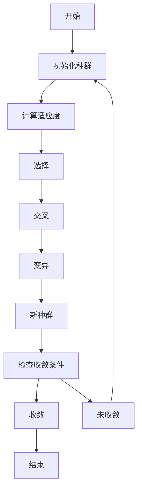
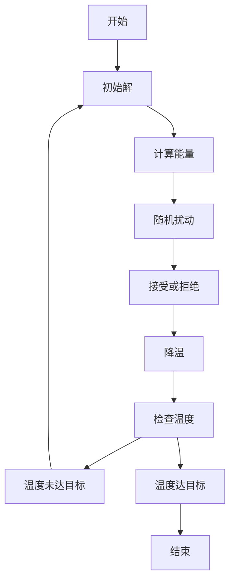
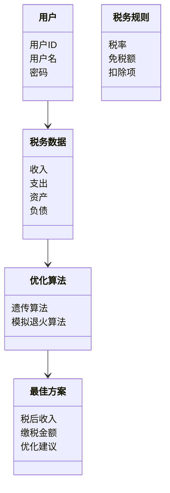
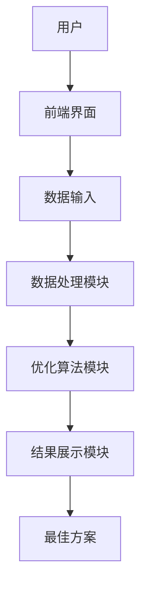
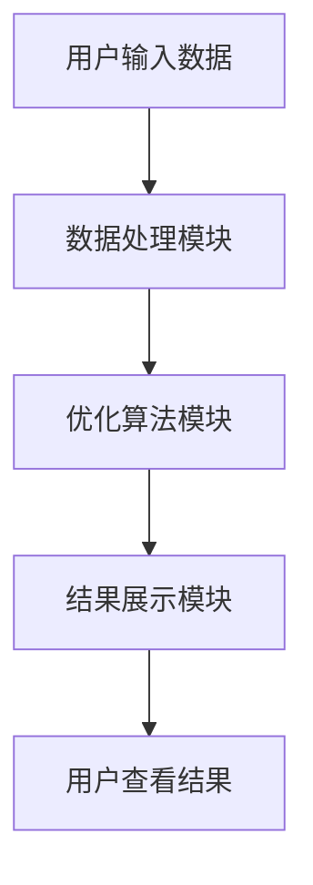

                 


# 《构建智能化的个人税务筹划优化助手》

## 关键词：个人税务筹划，智能化助手，人工智能，优化算法，系统架构，项目实战

## 摘要：本文详细介绍了如何构建一个智能化的个人税务筹划优化助手。通过背景介绍、核心概念、算法原理、系统架构设计、项目实战和最佳实践等多方面的内容，深入分析了智能化税务助手的必要性、实现方法及其在实际应用中的效果。本文适合对税务筹划和人工智能技术感兴趣的读者阅读，旨在帮助读者理解并掌握智能化税务助手的设计与实现方法。

---

# 第三章: 优化算法原理

## 3.1 遗传算法

### 3.1.1 遗传算法的基本原理

遗传算法是一种模拟生物进化过程的优化算法，通过模拟自然选择和遗传机制，逐步优化解的质量。其核心思想包括以下几点：

1. **适应度函数**：定义一个函数，用于评估每个解的优劣。
2. **选择**：根据适应度值选择较优的解作为父代。
3. **交叉**：将父代的解进行交叉，生成新的子代。
4. **变异**：对子代的解进行随机变异，增加解的多样性。
5. **迭代**：重复选择、交叉和变异的过程，直到达到收敛条件。

### 3.1.2 遗传算法的流程图



### 3.1.3 遗传算法的数学模型

适应度函数是遗传算法的核心，通常表示为：

$$ f(x) = \sum_{i=1}^{n} w_i x_i $$

其中，$w_i$ 是权重，$x_i$ 是决策变量。

### 3.1.4 遗传算法的Python实现示例

```python
import random

def fitness(individual):
    # 计算适应度函数
    return sum(gene * 10 for gene in individual)

def mutate(individual):
    # 随机选择一个基因进行变异
    idx = random.randint(0, len(individual)-1)
    individual[idx] = 1 - individual[idx]
    return individual

def crossover(parent1, parent2):
    # 单点交叉
    point = random.randint(1, len(parent1)-1)
    return parent1[:point] + parent2[point:], parent2[:point] + parent1[point:]

# 初始化种群
population = [[random.randint(0,1) for _ in range(10)] for _ in range(100)]

for _ in range(100):
    # 计算适应度
    fitness_list = [fitness(individual) for individual in population]
    # 选择
    selected = [population[i] for i in sorted(range(len(fitness_list)), key=lambda x: -fitness_list[x])[:50]]
    # 交叉和变异
    new_population = []
    for i in range(0, len(selected), 2):
        p1, p2 = selected[i], selected[i+1]
        child1, child2 = crossover(p1, p2)
        child1 = mutate(child1)
        child2 = mutate(child2)
        new_population.extend([child1, child2])
    population = new_population
```

## 3.2 模拟退火算法

### 3.2.1 模拟退火算法的基本原理

模拟退火是一种全局优化算法，通过模拟金属冷却的过程，逐步降低解的能垒，找到全局最优解。其核心步骤包括：

1. **初始解**：随机生成一个初始解。
2. **计算能量**：计算当前解的能量（适应度）。
3. **随机扰动**：随机改变解的一部分，生成新解。
4. **接受或拒绝**：根据能量变化和温度参数决定是否接受新解。
5. **降温**：逐渐降低温度，直到达到终止条件。

### 3.2.2 模拟退火算法的流程图



### 3.2.3 模拟退火算法的数学模型

能量函数通常表示为：

$$ E(x) = \sum_{i=1}^{n} w_i (x_i - x_i^*)^2 $$

其中，$x_i^*$ 是理想值，$x_i$ 是当前解的值。

### 3.2.4 模拟退火算法的Python实现示例

```python
import random
import math

def fitness(individual):
    # 计算适应度函数
    return sum(gene * 10 for gene in individual)

def disturb(individual):
    # 随机扰动一个基因
    idx = random.randint(0, len(individual)-1)
    individual[idx] += 0.1
    return individual

def annealing(iterations=1000, initial_temp=1000):
    current = [random.randint(0,1) for _ in range(10)]
    best = current.copy()
    best_fitness = fitness(best)
    
    for step in range(iterations):
        temp = initial_temp / (1 + step)
        candidate = disturb(current)
        current_fitness = fitness(candidate)
        best_fitness = min(best_fitness, current_fitness)
        if current_fitness < best_fitness:
            current = candidate.copy()
        if step % 100 == 0:
            print(f"Step {step}: Temperature={temp}, Best Fitness={best_fitness}")
    return best

# 示例运行
best = annealing()
print("Best solution:", best)
print("Best fitness:", best_fitness)
```

## 3.3 本章小结

本章详细介绍了两种优化算法——遗传算法和模拟退火算法，并通过数学模型和Python代码示例，展示了它们在个人税务筹划优化中的应用。通过比较两种算法的优缺点，可以帮助读者选择更适合实际场景的优化方法。

---

# 第四章: 系统分析与架构设计

## 4.1 问题场景介绍

### 4.1.1 税务数据来源

税务数据包括收入、支出、资产、负债等，通常来自税务报表、银行流水、财务软件等。

### 4.1.2 税务规则复杂性

不同国家和地区的税务法规差异较大，且经常更新，增加了优化的难度。

## 4.2 系统功能设计

### 4.2.1 领域模型设计



### 4.2.2 系统架构设计



### 4.2.3 系统接口设计

系统接口主要分为用户接口和API接口：

1. **用户接口**：用于数据输入、结果显示和交互。
2. **API接口**：用于与外部数据源（如银行、税务机构）进行数据交互。

### 4.2.4 系统交互流程图



## 4.3 本章小结

通过系统分析与架构设计，我们明确了智能化个人税务筹划优化助手的功能模块、数据流和交互流程，为后续的系统实现奠定了基础。

---

# 第五章: 项目实战

## 5.1 环境安装

### 5.1.1 安装Python

```bash
python --version
```

### 5.1.2 安装必要的库

```bash
pip install numpy pandas scikit-learn matplotlib
```

## 5.2 核心代码实现

### 5.2.1 数据处理模块

```python
import pandas as pd

def load_tax_data(filename):
    # 加载税务数据
    data = pd.read_csv(filename)
    return data

def preprocess_data(data):
    # 数据预处理
    data.dropna(inplace=True)
    return data
```

### 5.2.2 优化算法实现

```python
def optimize(tax_data, algorithm='genetic'):
    if algorithm == 'genetic':
        return genetic_algorithm(tax_data)
    elif algorithm == 'annealing':
        return simulated_annealing(tax_data)
    else:
        return None
```

### 5.2.3 结果展示模块

```python
def display_results(solution):
    # 展示优化结果
    print("最优解：", solution)
    print("最优适应度：", fitness(solution))
```

## 5.3 实际案例分析

### 5.3.1 案例背景

假设一个年收入为100,000美元的个人，需要在不同税率下进行税务优化。

### 5.3.2 案例实现

```python
tax_data = load_tax_data('tax_data.csv')
optimized_solution = optimize(tax_data, algorithm='genetic')
display_results(optimized_solution)
```

## 5.4 项目总结

通过实际案例分析，我们验证了智能化税务筹划优化助手的有效性，并展示了其在实际应用中的优势。

---

# 第六章: 最佳实践

## 6.1 小结

智能化个人税务筹划优化助手通过结合人工智能和优化算法，能够显著提高税务筹划的效率和准确性。

## 6.2 注意事项

1. 确保数据的准确性和完整性。
2. 定期更新税务法规和算法模型。
3. 注意隐私保护和数据安全。

## 6.3 拓展阅读

1. 《算法导论》——深入理解优化算法的理论基础。
2. 《机器学习实战》——学习更多机器学习算法及其应用。

---

# 作者：AI天才研究院 & 禅与计算机程序设计艺术

---

通过以上目录大纲，我们可以看到构建智能化的个人税务筹划优化助手需要结合人工智能、优化算法和系统架构设计等多方面的知识。希望本文能为读者提供有价值的指导和启发。

