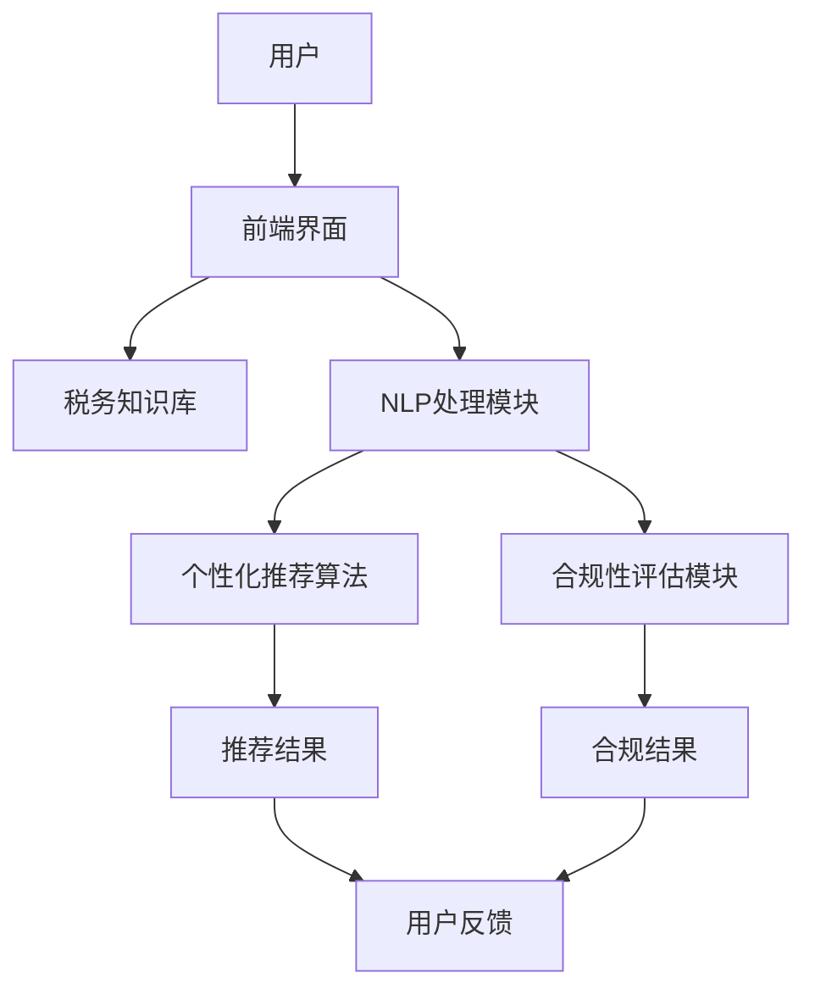

                 


# 构建智能化的个人税务筹划助手系统

> **关键词**：税务筹划、人工智能、自然语言处理、机器学习、系统架构  
> **摘要**：本文详细探讨了如何利用人工智能技术构建智能化的个人税务筹划助手系统，涵盖系统核心概念、算法原理、系统架构设计以及项目实战等内容，为读者提供从理论到实践的全面指导。

---

# 第一部分: 智能化税务筹划助手系统概述

# 第1章: 税务筹划与智能化助手的背景

## 1.1 税务筹划的重要性
### 1.1.1 税务筹划的基本概念
税务筹划是指通过合法手段优化个人或企业的税务负担，最大化经济利益的过程。它不仅涉及税法知识，还需要结合实际财务状况和政策变化。

### 1.1.2 税务筹划的常见场景
个人税务筹划常见于收入分配、资产配置、遗产规划等领域。例如，如何通过合理分配收入降低税率，如何利用税收优惠政策优化资产配置等。

### 1.1.3 税务筹划的法律边界
税务筹划必须在法律允许的范围内进行，避免触犯逃税或避税的法律红线。了解税法的边界是构建税务筹划助手系统的基础。

## 1.2 个人税务筹划的挑战
### 1.2.1 个人税务筹划的主要难点
- 税务政策复杂多变，个人难以及时掌握最新法规。
- 信息分散，难以整合和分析。
- 缺乏专业工具支持，难以实现个性化优化。

### 1.2.2 税务政策的复杂性
不同地区的税收政策差异大，且经常更新。个人需要了解多种税种（如所得税、增值税、遗产税等）的计算规则和优惠政策。

### 1.2.3 个人税务信息的隐私性
税务信息涉及个人隐私，如何确保数据安全和合规性是构建系统的重要挑战。

## 1.3 智能化税务助手的必要性
### 1.3.1 传统税务筹划方式的局限性
传统方式依赖人工计算和经验判断，效率低、误差大，难以应对复杂多变的税务政策。

### 1.3.2 AI技术在税务筹划中的应用潜力
人工智能技术（如自然语言处理、机器学习）可以高效处理海量税务数据，提供个性化建议，帮助用户优化税务负担。

### 1.3.3 智能化税务助手的目标与价值
目标是通过智能化技术，为用户提供高效、精准的税务筹划服务。价值在于提高效率、降低错误率，帮助用户实现合法节税。

## 1.4 本章小结
本章介绍了税务筹划的重要性、个人税务筹划的挑战以及智能化税务助手的必要性和价值，为后续系统构建奠定了基础。

---

# 第二部分: 智能化税务筹划助手的核心概念与技术原理

# 第2章: 智能化税务助手的核心概念

## 2.1 系统核心要素分析
### 2.1.1 税务知识库
税务知识库是系统的核心，包含税法条文、优惠政策、税率信息等数据，支持系统进行税务计算和合规性评估。

### 2.1.2 自然语言处理模块
自然语言处理（NLP）模块用于解析用户的税务问题，提取关键信息并生成解答。例如，用户输入“我的收入如何优化税负？”系统通过NLP模块识别需求。

### 2.1.3 个性化推荐算法
个性化推荐算法基于用户的历史数据和行为，提供定制化的税务筹划建议。例如，推荐适合用户的税收优惠政策。

### 2.1.4 税务合规性评估模型
合规性评估模型用于判断用户的税务方案是否符合法律法规，避免触犯法律红线。

## 2.2 核心概念的属性对比
### 2.2.1 税务知识库与传统规则引擎的对比
| 特性                | 税务知识库                     | 传统规则引擎                 |
|---------------------|-------------------------------|-----------------------------|
| 数据来源            | 税法条文、政策文件             | 业务规则、流程              |
| 处理方式            | 支持动态更新、复杂查询         | 静态规则、简单匹配           |
| 知识表示方式         | 结构化知识图谱                 | 规则库                       |
| 更新频率            | 高频更新（政策变化频繁）       | 低频更新                    |

### 2.2.2 自然语言处理与传统关键词匹配的对比
| 特性                | 自然语言处理                 | 传统关键词匹配              |
|---------------------|-----------------------------|-----------------------------|
| 处理能力            | 支持语义理解、上下文分析       | 仅支持关键词匹配             |
| 精确度              | 高                          | 中等                        |
| 应用场景            | 复杂查询、智能对话             | 简单搜索、匹配               |
| 技术复杂度          | 高                          | 低                         |

### 2.2.3 个性化推荐算法与传统推荐算法的对比
| 特性                | 个性化推荐算法               | 传统推荐算法                |
|---------------------|-----------------------------|-----------------------------|
| 数据依赖            | 用户行为、偏好               | 仅依赖商品属性或用户行为     |
| 推荐依据            | 结合用户画像和行为            | 仅基于商品相似性或用户行为   |
| 精准度              | 高                          | 中等                        |
| 技术复杂度          | 高                          | 中等                        |

## 2.3 系统核心概念的ER图
```mermaid
er
  actor 税务知识库
  actor 自然语言处理模块
  actor 个性化推荐算法
  actor 税务合规性评估模块
  relation 调用
  relation 数据存储
  relation 数据输入
```

## 2.4 本章小结
本章详细分析了智能化税务助手系统的核心概念，包括税务知识库、自然语言处理模块、个性化推荐算法和合规性评估模型，并通过对比和ER图展示了这些概念之间的关系。

---

# 第三部分: 系统算法与数学模型

# 第3章: 税务信息处理的算法原理

## 3.1 自然语言处理算法
### 3.1.1 分词算法
分词算法用于将用户输入的文本分割成词语或短语。例如，使用jieba算法对中文文本进行分词。

### 3.1.2 信息抽取算法
信息抽取算法用于从文本中提取关键信息，例如人名、时间、地点等。常用算法包括CRF和NER模型。

### 3.1.3 文本相似度计算
文本相似度计算用于衡量两段文本的相似性，常用余弦相似度或BM25算法。

## 3.2 个性化推荐算法
### 3.2.1 基于协同过滤的推荐算法
协同过滤算法通过分析用户行为和偏好，推荐相似用户的税务方案。例如，使用矩阵分解（MF）算法。

### 3.2.2 基于内容的推荐算法
内容推荐算法通过分析税务方案的内容特征，推荐相似的方案。例如，使用TF-IDF进行文本特征提取。

### 3.2.3 混合推荐算法
混合推荐算法结合协同过滤和内容推荐的优点，通过加权融合提升推荐的准确性和多样性。

## 3.3 合规性评估算法
### 3.3.1 基于规则的评估算法
基于规则的评估算法通过预定义的规则库，检查税务方案是否符合法律法规。例如，检查税率是否在允许范围内。

### 3.3.2 基于机器学习的评估算法
机器学习评估算法通过训练模型，识别潜在的合规风险。例如，使用支持向量机（SVM）进行分类。

## 3.4 算法实现的数学模型
### 3.4.1 协同过滤算法的数学模型
$$ \text{预测评分} = \text{用户均值} + \text{项目均值} + \text{用户-项目交互项} $$

### 3.4.2 机器学习分类算法的数学模型
$$ \text{分类结果} = \text{sigmoid}(w_1x_1 + w_2x_2 + \dots + w_nx_n + b) $$

## 3.5 本章小结
本章详细介绍了系统中使用的自然语言处理算法、个性化推荐算法和合规性评估算法，并通过数学模型展示了算法的核心原理。

---

# 第四部分: 系统设计与架构

# 第4章: 系统功能设计与架构

## 4.1 系统功能设计
### 4.1.1 用户界面
用户界面包括税务问题输入、结果展示和个性化推荐模块。

### 4.1.2 后台系统
后台系统包括税务知识库、NLP处理模块、推荐算法模块和合规性评估模块。

## 4.2 系统架构设计
### 4.2.1 系统架构图


### 4.2.2 接口设计
系统接口包括：
- 用户输入接口：用于接收用户的税务问题。
- 知识库查询接口：用于从知识库中获取相关信息。
- 推荐算法接口：用于生成个性化推荐结果。
- 合规性评估接口：用于检查税务方案的合规性。

### 4.2.3 交互设计
用户与系统交互的流程包括：
1. 用户输入税务问题。
2. 系统通过NLP模块解析问题。
3. 系统调用知识库和推荐算法生成建议。
4. 系统输出结果并检查合规性。
5. 用户反馈结果。

## 4.3 本章小结
本章详细描述了系统的设计与架构，包括功能设计、架构图和接口设计，为后续的系统实现奠定了基础。

---

# 第五部分: 项目实战

# 第5章: 项目实战与案例分析

## 5.1 环境安装与配置
### 5.1.1 安装Python
安装Python 3.8及以上版本，并配置环境变量。

### 5.1.2 安装依赖库
安装必要的依赖库，例如：
- `jieba`：中文分词工具。
- `scikit-learn`：机器学习库。
- `networkx`：图论库。

## 5.2 核心代码实现
### 5.2.1 税务知识库的构建
```python
import json

# 示例税务知识库
tax_knowledge = {
    "income_tax": {
        "rates": [0.1, 0.15, 0.2, 0.25],
        "brackets": [10000, 20000, 30000, 40000]
    },
    "property_tax": {
        "rates": [0.05, 0.1],
        "conditions": ["single", "married"]
    }
}
```

### 5.2.2 自然语言处理模块
```python
from jieba import tokenize

def process_question(question):
    tokens = tokenize(question)
    return tokens
```

### 5.2.3 个性化推荐算法
```python
from sklearn.metrics.pairwise import cosine_similarity

def calculate_similarity(user_profile, item_profile):
    return cosine_similarity(user_profile, item_profile)
```

### 5.2.4 合规性评估模块
```python
def check_compliance(tax_plan):
    # 示例合规性检查
    if tax_plan['tax_rate'] > 0.3:
        return False
    return True
```

## 5.3 实际案例分析
### 5.3.1 案例背景
假设用户收入为30,000元，希望优化个人所得税负担。

### 5.3.2 系统处理流程
1. 用户输入：“我的收入是30,000元，如何优化个人所得税？”
2. 系统解析问题并调用知识库。
3. 系统生成优化方案：将收入分配到不同税率 bracket，降低税负。
4. 系统检查方案的合规性。
5. 输出结果并提供个性化建议。

## 5.4 本章小结
本章通过实际案例展示了系统的核心功能和实现过程，帮助读者理解如何将理论应用于实践。

---

# 第六部分: 总结与展望

# 第6章: 总结与展望

## 6.1 系统总结
本系统通过智能化技术，为用户提供高效、精准的税务筹划服务，解决了传统方式的低效和误差问题。

## 6.2 未来展望
未来，系统可以通过以下方式进一步优化：
- 引入更多税收政策和数据源，提升系统的全面性。
- 增强NLP模块的语义理解能力，支持更复杂的税务问题。
- 结合区块链技术，确保税务数据的安全性和隐私性。

## 6.3 最佳实践 Tips
- 数据隐私保护是系统设计的关键，确保用户数据的安全性。
- 定期更新知识库，保持系统的 актуality。
- 在实际应用中，建议结合专业税务顾问的意见，确保方案的合规性。

## 6.4 本章小结
本章总结了系统的构建过程，并展望了未来的发展方向，为读者提供了进一步优化和拓展的思路。

---

# 作者：AI天才研究院 & 禅与计算机程序设计艺术

---

**注**：以上内容仅为目录大纲，实际撰写时需要根据每章内容添加详细的技术细节、代码实现、案例分析和图表说明。

