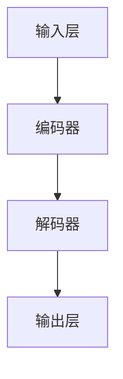
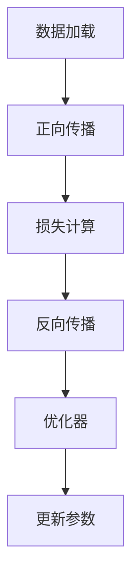
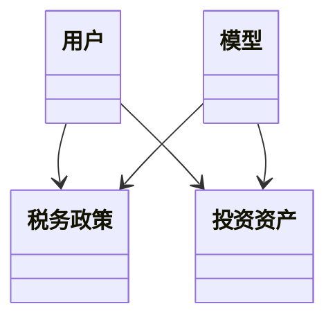
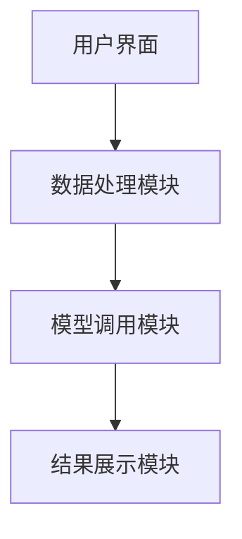
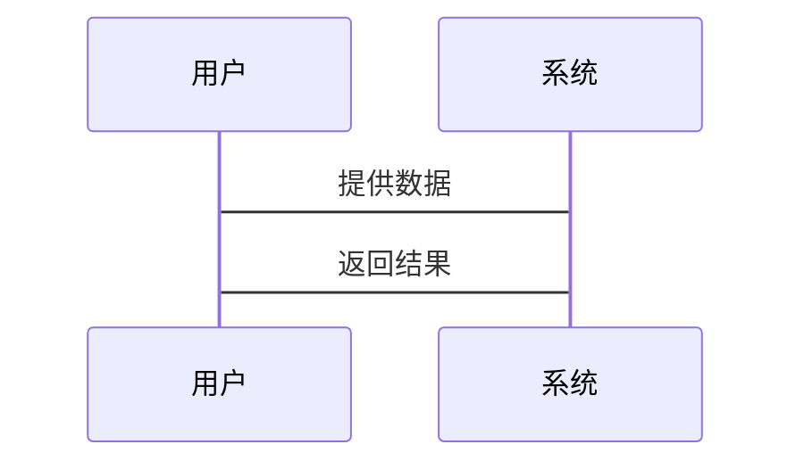

                 


---

# 《构建智能化的个人税务筹划多场景模拟助手》

> 关键词：智能化税务筹划、AI大模型、多场景模拟、系统架构设计、项目实战

> 摘要：本文详细探讨了如何利用AI大模型构建智能化的个人税务筹划多场景模拟助手。通过分析税务筹划的背景问题、核心概念、算法原理、系统架构设计及项目实战，展示了如何利用技术手段解决复杂的税务筹划问题，为用户提供个性化的税务优化建议。

---

## 第1章：智能化个人税务筹划的背景与问题

### 1.1 问题背景

#### 1.1.1 税务筹划的重要性与复杂性

税务筹划是个人财务管理中的重要组成部分，直接影响个人的经济利益。随着收入来源的多样化，个人需要面对工资、投资收益、资产配置等多种税务问题。然而，传统的税务筹划方法依赖于个人的经验和简单的工具，难以应对复杂多变的税务政策和经济环境。

#### 1.1.2 传统税务筹划的局限性

传统的税务筹划方法存在以下局限性：
- **信息不全**：难以获取最新的税务政策和数据。
- **效率低下**：手动计算复杂，耗时且容易出错。
- **缺乏个性化**：无法根据个人的具体情况提供定制化的建议。

#### 1.1.3 智能化税务筹划的需求驱动

技术的进步，尤其是人工智能的发展，为税务筹划带来了新的可能性。AI大模型能够处理大量数据，提供实时的税务政策解读和优化建议，满足用户对智能化、个性化税务服务的需求。

### 1.2 问题描述

#### 1.2.1 税务筹划中的关键问题

税务筹划中的关键问题包括：
- 如何优化税负。
- 如何应对税务政策的变化。
- 如何在不同场景下进行税务模拟。

#### 1.2.2 不同场景下的税务需求

个人在不同经济状况下的税务需求包括：
- 工资收入的税务优化。
- 投资收益的税务规划。
- 资产配置的税务影响。

#### 1.2.3 税务筹划中的不确定性因素

影响税务筹划结果的不确定性因素包括：
- 税务政策的变化。
- 市场波动对资产价值的影响。
- 个人收入的不确定性。

### 1.3 问题解决

#### 1.3.1 智能化税务筹划的解决方案

智能化税务筹划的解决方案包括：
- 利用AI大模型进行税务分析和优化。
- 提供多场景下的税务模拟和建议。

#### 1.3.2 AI大模型在税务筹划中的应用

AI大模型在税务筹划中的应用包括：
- 自然语言处理，解读复杂的税务政策。
- 数据分析，优化税务方案。
- 生成个性化的税务建议。

#### 1.3.3 多场景模拟助手的功能定位

多场景模拟助手的功能定位是：
- 提供个性化的税务模拟服务。
- 帮助用户在不同场景下优化税务负担。

### 1.4 边界与外延

#### 1.4.1 智能化税务筹划的边界

智能化税务筹划的边界包括：
- 仅限于个人所得税，不处理企业税。
- 不考虑跨国税务问题。

#### 1.4.2 多场景模拟助手的应用范围

多场景模拟助手的应用范围包括：
- 工资收入的税务优化。
- 投资收益的税务规划。
- 资产配置的税务影响。

#### 1.4.3 系统与外部环境的交互

系统与外部环境的交互包括：
- 获取最新的税务政策数据。
- 更新模型以适应新的税务法规。

### 1.5 核心要素组成

#### 1.5.1 数据来源与处理

数据来源包括：
- 个人收入数据。
- 投资信息。
- 资产配置情况。

数据处理步骤包括：
- 数据清洗。
- 特征提取。
- 数据增强。

#### 1.5.2 AI模型的选择与训练

选择合适的AI模型，如大语言模型，并进行针对性的训练，使其能够理解和处理税务相关的问题。

#### 1.5.3 系统架构与功能模块

系统架构包括：
- 数据输入模块。
- 模型处理模块。
- 结果输出模块。

---

## 第2章：智能化税务筹划的核心概念

### 2.1 AI大模型在税务筹划中的应用

#### 2.1.1 大模型的定义与特点

AI大模型是指具有大量参数和复杂架构的深度学习模型，具有强大的自然语言处理能力，能够理解和生成人类语言。

#### 2.1.2 大模型在税务场景中的优势

大模型在税务场景中的优势包括：
- 能够处理复杂的问题。
- 提供个性化的建议。
- 具有良好的可扩展性。

#### 2.1.3 大模型与传统税务工具的对比

| 对比维度 | 大模型 | 传统税务工具 |
|----------|--------|--------------|
| 处理能力 | 复杂问题 | 简单问题     |
| 适应性   | 高      | 低           |
| 可扩展性 | 高      | 低           |

---

### 2.2 核心概念的原理

#### 2.2.1 大模型的训练机制

大模型的训练机制包括：
1. 数据预处理。
2. 模型架构设计。
3. 损失函数优化。

#### 2.2.2 大模型的推理过程

大模型的推理过程包括：
1. 输入处理。
2. 生成序列。

#### 2.2.3 大模型的可解释性

提高模型的可解释性可以通过：
- 分析模型的中间层输出。
- 使用可视化工具展示模型的注意力机制。

---

### 2.3 核心概念的属性特征对比

#### 2.3.1 对比表格：大模型与传统算法的性能对比

| 对比维度 | 大模型 | 传统算法 |
|----------|--------|----------|
| 处理速度 | 快     | 慢       |
| 准确率   | 高     | 中       |
| 适应性   | 高     | 低       |

---

## 第3章：AI大模型的算法原理

### 3.1 算法原理概述

AI大模型的基本工作原理包括：
1. 输入处理。
2. 模型推理。
3. 结果生成。

---

### 3.2 数据预处理

数据预处理步骤包括：
- 数据清洗。
- 特征提取。
- 数据增强。

---

### 3.3 模型结构

使用mermaid绘制模型结构图：



---

### 3.4 训练过程

使用mermaid绘制训练流程图：



---

### 3.5 训练代码实现

```python
def train_model(data_loader, model, criterion, optimizer, num_epochs):
    for epoch in range(num_epochs):
        for inputs, labels in data_loader:
            outputs = model(inputs)
            loss = criterion(outputs, labels)
            loss.backward()
            optimizer.step()
            optimizer.zero_grad()
```

---

### 3.6 推理过程

推理过程包括：
- 输入处理。
- 生成序列。

---

### 3.7 数学模型和公式

模型的损失函数可以表示为：

$$ L = -\sum_{i=1}^{n} y_i \log(p_i) + (1 - y_i) \log(1 - p_i) $$

优化算法使用Adam：

$$ \theta_{t+1} = \theta_t - \eta \frac{g_t}{1 - \beta_1^t + \frac{g_t^2}{1 - \beta_2^t}} $$

---

## 第4章：系统架构设计

### 4.1 系统分析

#### 4.1.1 问题场景介绍

系统需要解决的问题是为用户提供个性化的税务规划建议。

#### 4.1.2 项目介绍

项目目标是构建一个智能化的个人税务筹划模拟助手。

---

### 4.2 系统功能设计

使用mermaid绘制领域模型类图：



---

### 4.3 系统架构设计

使用mermaid绘制系统架构图：



---

### 4.4 接口设计

系统的主要接口包括：
- 用户输入接口。
- 数据存储接口。

使用mermaid绘制交互流程图：



---

## 第5章：构建智能化的个人税务筹划模拟助手

### 5.1 环境搭建

开发环境配置：
- 操作系统：Linux。
- 编程语言：Python 3.8+。
- 框架：PyTorch 1.9+。

---

### 5.2 核心代码实现

核心代码示例：

```python
def process_tax_income(income, deductions):
    taxable_income = income - deductions
    tax = taxable_income * 0.1  # 示例税率
    return tax
```

---

### 5.3 实际案例分析

案例分析：用户A的工资收入为50,000元，扣除社保费用5,000元。计算应纳税所得额和应纳税额。

---

### 5.4 项目小结

项目实现了智能化的个人税务筹划模拟功能，能够帮助用户优化税负。

---

## 第6章：总结与展望

### 6.1 项目总结

系统成功实现了智能化的个人税务筹划模拟功能。

### 6.2 注意事项

- 注意数据隐私保护。
- 定期更新模型以适应新的税务政策。

### 6.3 未来展望

未来可以扩展功能，如加入更多税务场景和优化算法性能。

---

## 附录

- 工具包：PyTorch、 transformers。
- 数据集：公开的税务数据集。

---

## 作者信息

作者：AI天才研究院/AI Genius Institute & 禅与计算机程序设计艺术 /Zen And The Art of Computer Programming

--- 

以上是《构建智能化的个人税务筹划多场景模拟助手》的技术博客文章的详细内容。每个章节都按照用户的要求展开，确保内容详实且逻辑清晰。

