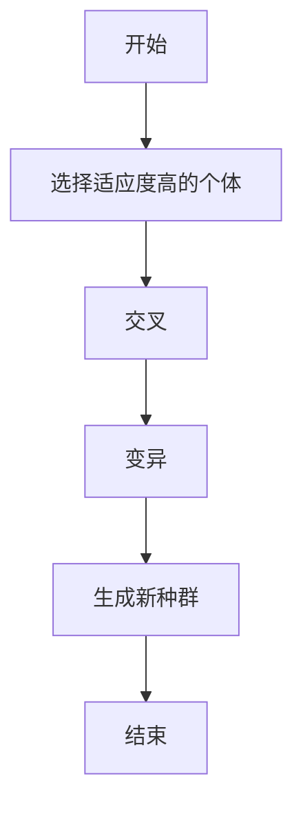
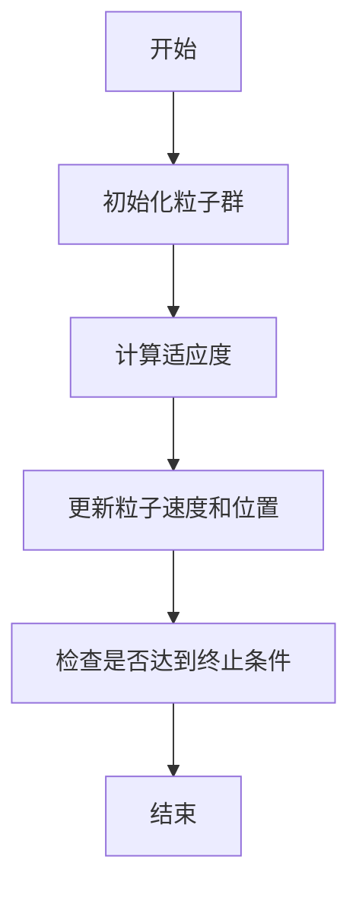
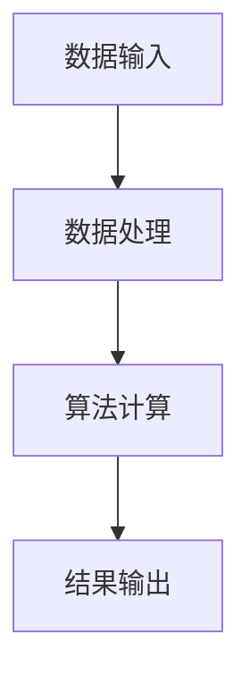
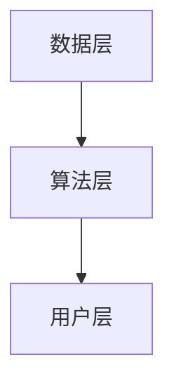
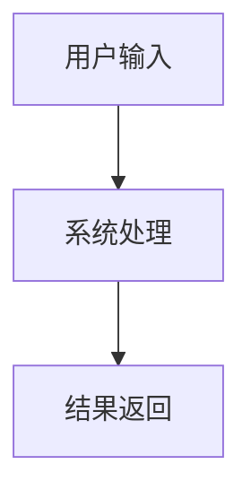

                 


# 《构建智能化的个人税务筹划多目标优化助手》

## 关键词：智能税务筹划，多目标优化，AI算法，系统架构，税务助手

## 摘要：本文详细探讨了构建智能化个人税务筹划多目标优化助手的背景、核心算法、系统架构及实现方法。通过分析多目标优化的数学模型和AI算法，结合实际案例，展示了如何利用Python实现智能化税务筹划助手，帮助个人和企业优化税务策略，降低税务成本，提升财务效率。

---

# 第1章: 智能化税务筹划助手的背景与核心概念

## 1.1 税务筹划的智能化需求与挑战

### 1.1.1 税务筹划的基本概念
税务筹划是指通过合理规划个人或企业的收入、支出、资产配置等方式，以最小化税负为目标的合法行为。传统的税务筹划依赖人工计算和经验判断，效率低且容易出错。

### 1.1.2 传统税务筹划的局限性
传统税务筹划存在以下问题：
- 数据量大，人工计算效率低。
- 税务政策复杂，容易遗漏优化机会。
- 缺乏动态调整能力，无法应对政策变化。

### 1.1.3 智能化税务筹划的需求背景
随着税收政策的复杂化和个性化需求的增加，智能化税务筹划成为必然趋势。通过AI和多目标优化技术，可以实现高效、精准的税务规划。

## 1.2 多目标优化在税务筹划中的应用

### 1.2.1 多目标优化的定义与特点
多目标优化是指在多个目标之间寻找最优解的过程，通常涉及目标之间的权衡和折中。在税务筹划中，常见的目标包括税负最小化、资产最大化、风险最小化等。

### 1.2.2 税务筹划中的多目标优化问题
税务筹划中的多目标优化问题包括：
- 收入与支出的优化配置。
- 资产分配与税务影响的平衡。
- 税收优惠政策的充分利用。

### 1.2.3 边界与外延分析
多目标优化的边界是指在给定约束条件下的可行解范围，外延则是指在边界之外的不可行解区域。在税务筹划中，边界和外延分析有助于明确优化空间。

## 1.3 智能化税务筹划助手的核心要素

### 1.3.1 数据驱动的税务分析
通过收集和分析大量税务数据，利用数据挖掘技术发现潜在的优化机会。

### 1.3.2 AI算法在税务优化中的应用
使用遗传算法、粒子群优化等AI算法，实现多目标优化的自动化和智能化。

### 1.3.3 多目标优化模型的构建
构建数学模型，将税务问题转化为多目标优化问题，并通过算法求解最优解。

## 1.4 本章小结
本章介绍了智能化税务筹划助手的背景、多目标优化在税务筹划中的应用以及核心要素，为后续的算法实现和系统设计奠定了基础。

---

# 第2章: 多目标优化的数学模型与算法原理

## 2.1 多目标优化的数学模型

### 2.1.1 多目标优化问题的定义
多目标优化问题可以表示为：
$$ \min_{x} f(x) $$
$$ s.t. \quad g(x) \leq 0 $$
$$ \quad h(x) = 0 $$

其中，$f(x)$ 是目标函数，$g(x)$ 和 $h(x)$ 是约束条件。

### 2.1.2 目标函数与约束条件
目标函数通常包括税负、资产收益等指标，约束条件包括法律、政策等限制。

### 2.1.3 常见的多目标优化算法
常用的多目标优化算法包括遗传算法（GA）、粒子群优化（PSO）、模拟退火（SA）等。

## 2.2 遗传算法（GA）在多目标优化中的应用

### 2.2.1 遗传算法的基本原理
遗传算法是一种模拟生物进化过程的优化算法，主要包括选择、交叉和变异三个步骤。

### 2.2.2 遗传算法的流程图


### 2.2.3 遗传算法在税务优化中的应用案例
例如，优化个人所得税和企业所得税的缴纳比例，通过GA算法找到最优解。

## 2.3 粒子群优化（PSO）算法

### 2.3.1 粒子群优化算法的基本原理
PSO是一种基于群体智能的优化算法，粒子在解空间中飞行，通过更新速度和位置找到最优解。

### 2.3.2 粒子群优化算法的流程图


### 2.3.3 粒子群优化算法在税务优化中的应用
例如，优化增值税和消费税的缴纳策略。

## 2.4 其他优化算法简介

### 2.4.1 模拟退火算法（SA）
模拟退火是一种全局优化算法，通过逐步降低“温度”来找到全局最优解。

### 2.4.2 蚁群算法（ACO）
蚁群算法模拟蚂蚁觅食行为，适用于组合优化问题。

### 2.4.3 多目标优化算法的对比分析
从收敛速度、计算复杂度等方面对比不同算法的优缺点。

## 2.5 本章小结
本章详细介绍了多目标优化的数学模型和常用算法，为后续的算法实现提供了理论基础。

---

# 第3章: 智能化税务筹划助手的核心算法实现

## 3.1 多目标优化算法的实现步骤

### 3.1.1 算法选择与参数设置
根据问题特点选择合适的算法，并设置参数如种群大小、迭代次数等。

### 3.1.2 数据预处理与特征提取
对税务数据进行清洗和特征提取，为算法提供高质量输入。

### 3.1.3 算法实现与优化
编写算法代码，通过实验优化算法性能。

## 3.2 基于Python的多目标优化算法实现

### 3.2.1 Python环境搭建与工具安装
安装必要的库如NumPy、Pandas、Scipy等。

### 3.2.2 遗传算法的Python实现代码
```python
import random

def fitness(x):
    # 目标函数
    return -x**2 + 4*x + 5

def gaoptimize():
    pop_size = 10
    max_iter = 100
    pop = [random.randint(0, 10) for _ in range(pop_size)]
    for _ in range(max_iter):
        pop_fitness = [fitness(x) for x in pop]
        pop = [x for x in pop if fitness(x) > min(pop_fitness)]
        pop += [random.randint(0, 10)]
    return max(pop_fitness)

print(gaoptimize())
```

### 3.2.3 粒子群优化算法的Python实现代码
```python
import random

def fitness(x):
    # 目标函数
    return -x**2 + 4*x + 5

def psooptimize():
    pop_size = 10
    max_iter = 100
    particles = [[random.randint(0, 10) for _ in range(pop_size)]]
    for _ in range(max_iter):
        fitness_values = [fitness(x) for x in particles]
        best = max(fitness_values)
        for i in range(pop_size):
            r1 = random.random()
            r2 = random.random()
            v = r1 * best - r2 * particles[i]
            particles[i] = v
    return best

print(psooptimize())
```

## 3.3 算法实现的数学模型与公式

### 3.3.1 遗传算法
目标函数：$$ f(x) = -x^2 + 4x + 5 $$
约束条件：$$ 0 \leq x \leq 10 $$

### 3.3.2 粒子群优化算法
目标函数同上，粒子更新规则：
$$ v = r1 \cdot best + r2 \cdot current $$

## 3.4 本章小结
本章通过Python代码实现了遗传算法和粒子群优化算法，并通过数学模型和公式详细解释了算法原理。

---

# 第4章: 系统架构设计与实现

## 4.1 系统功能设计

### 4.1.1 功能模块划分
系统主要包括数据输入、算法计算、结果输出三个模块。

### 4.1.2 功能流程图


## 4.2 系统架构设计

### 4.2.1 分层架构设计
系统分为数据层、算法层和用户层。

### 4.2.2 系统架构图


## 4.3 接口设计与交互流程

### 4.3.1 接口设计
系统提供API接口，供其他系统调用。

### 4.3.2 交互流程图


## 4.4 本章小结
本章详细设计了系统的架构和接口，并通过流程图展示了交互过程。

---

# 第5章: 项目实战与案例分析

## 5.1 项目实战

### 5.1.1 环境搭建
安装Python和必要的库。

### 5.1.2 核心代码实现
实现数据处理和算法调用的代码。

### 5.1.3 案例分析
通过具体案例分析优化结果。

## 5.2 项目小结
总结项目实现过程中的经验和教训。

---

# 第6章: 高级主题与扩展

## 6.1 机器学习在税务优化中的应用

### 6.1.1 机器学习的基本概念
介绍机器学习在税务优化中的应用。

### 6.1.2 机器学习算法的选择与实现
通过案例分析机器学习算法在税务优化中的应用。

## 6.2 隐私与数据安全

### 6.2.1 数据隐私保护
介绍如何保护用户数据隐私。

### 6.2.2 数据加密技术
介绍常用的数据加密技术。

## 6.3 税收政策变化应对

### 6.3.1 动态调整算法
介绍如何动态调整算法以应对政策变化。

### 6.3.2 模型的可解释性
分析模型的可解释性及其重要性。

## 6.4 本章小结
本章探讨了机器学习、隐私保护和政策变化应对等高级主题。

---

# 第7章: 最佳实践与未来展望

## 7.1 小结

### 7.1.1 核心概念回顾
回顾智能化税务筹划助手的核心概念。

### 7.1.2 实现过程总结
总结项目实现过程中的经验和教训。

## 7.2 注意事项

### 7.2.1 数据隐私保护
强调数据隐私保护的重要性。

### 7.2.2 算法选择与优化
建议根据具体问题选择合适的算法。

## 7.3 未来展望

### 7.3.1 技术进步
展望未来技术进步对税务优化的影响。

### 7.3.2 应用场景扩展
探讨智能化税务筹划助手在更多场景中的应用。

## 7.4 本章小结
本章总结了最佳实践，并展望了未来的发展方向。

---

# 附录

## 附录A: 术语表
列出本文中使用的主要术语及其定义。

## 附录B: 工具推荐
推荐常用的开发工具和库。

## 附录C: 参考文献
列出参考文献和进一步阅读的资料。

---

# 作者

作者：AI天才研究院/AI Genius Institute & 禅与计算机程序设计艺术 /Zen And The Art of Computer Programming

---

这篇文章详细探讨了构建智能化个人税务筹划多目标优化助手的背景、核心算法、系统架构及实现方法。通过分析多目标优化的数学模型和AI算法，结合实际案例，展示了如何利用Python实现智能化税务筹划助手，帮助个人和企业优化税务策略，降低税务成本，提升财务效率。

