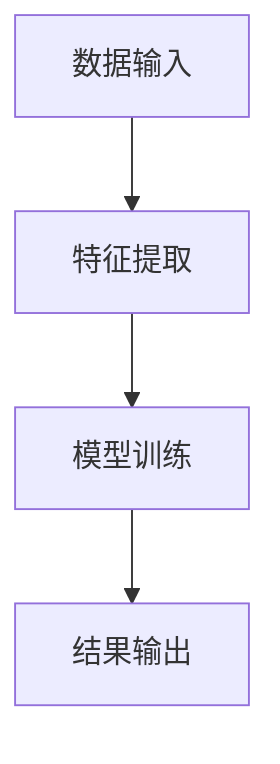
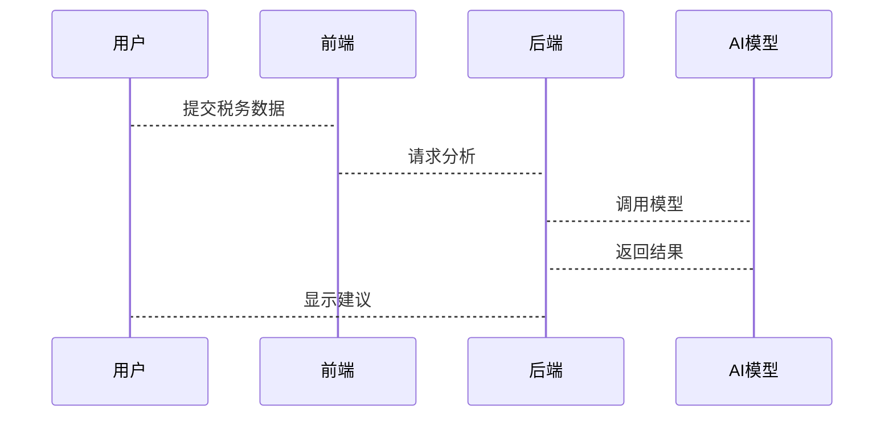

                 


# 构建智能化的个人税务筹划情景模拟助手

## 关键词：人工智能、税务筹划、自然语言处理、机器学习、系统架构设计

## 摘要：随着人工智能技术的快速发展，个人税务筹划领域的智能化需求日益增长。本文详细探讨了如何利用AI技术构建智能化的个人税务筹划情景模拟助手，从背景介绍、核心概念、算法原理、系统架构设计到项目实战，全面分析了该系统的构建过程。

---

## 第一部分: 智能化税务筹划助手的背景与核心概念

### 第1章: 个人税务筹划的背景与问题

#### 1.1 税务筹划的背景介绍

##### 1.1.1 税务筹划的基本概念
税务筹划是指通过合法的手段，优化个人或企业的税务负担，最大化经济利益的过程。它涉及税法、财务规划等多个领域。

##### 1.1.2 个人税务筹划的重要性
在个人财务管理中，税务筹划可以帮助减少税负，提高可支配收入。特别是在高税收国家，合理规划税务策略尤为重要。

##### 1.1.3 数字化时代对税务筹划的影响
随着数字化技术的发展，税务数据的收集和处理变得更加高效。AI技术的应用为税务筹划提供了新的可能性。

#### 1.2 智能化税务助手的必要性

##### 1.2.1 传统税务筹划的局限性
传统税务筹划依赖人工分析，效率低且容易出错。面对复杂的税法变化，人工处理难以及时响应。

##### 1.2.2 AI技术在税务筹划中的应用潜力
AI技术可以快速处理大量税务数据，提供个性化的税务建议，帮助用户做出最优决策。

##### 1.2.3 个人用户对智能化税务助手的需求
用户希望有一个便捷、高效、准确的工具，帮助他们优化税务规划，减少税务负担。

#### 1.3 问题背景与目标

##### 1.3.1 税务筹划的核心问题
如何在合法的前提下，最小化税务负担，最大化经济利益。

##### 1.3.2 问题的边界与外延
税务筹划需要考虑税法变化、收入结构、家庭状况等多种因素。

##### 1.3.3 目标与实现路径
通过AI技术，构建一个智能化的税务筹划助手，为用户提供个性化的税务建议。

#### 1.4 核心概念与联系

##### 1.4.1 智能化税务助手的核心概念
智能化税务助手通过AI技术分析税务数据，提供优化建议。

##### 1.4.2 关键概念的属性特征对比表
| 概念 | 属性 |
|------|------|
| 税务数据 | 结构化、非结构化 |
| AI模型 | 分析、预测 |
| 用户需求 | 个性化、动态变化 |

##### 1.4.3 ER实体关系图
```mermaid
entity 税务数据 {
    id
    收入类型
    支出类型
    时间范围
}
entity AI模型 {
    id
    模型类型
    训练数据
}
entity 用户需求 {
    id
    需求类型
    用户ID
}
```

### 第2章: AI技术在税务筹划中的应用原理

#### 2.1 智能化税务助手的核心算法

##### 2.1.1 自然语言处理（NLP）在税务文本分析中的应用
NLP技术可以自动解析税法文本，提取关键信息。

##### 2.1.2 机器学习在税务预测中的应用
机器学习模型可以预测税务风险，优化税务策略。

##### 2.1.3 算法原理的数学模型
$$ y = f(x) $$
其中，$x$ 是输入的税务数据，$y$ 是输出的税务建议。

#### 2.2 税务数据的特征提取与建模

##### 2.2.1 数据特征提取的流程
1. 数据清洗
2. 特征选择
3. 特征工程

##### 2.2.2 基于特征的分类算法
使用决策树或随机森林进行分类。

##### 2.2.3 算法流程图


#### 2.3 税务优化的数学模型

##### 2.3.1 基于线性规划的优化模型
$$ \text{max} \quad \sum w_i x_i $$

---

## 第二部分: 系统架构设计与实现

### 第3章: 系统架构设计

#### 3.1 问题场景介绍
智能化税务助手需要处理复杂的税务数据和用户需求。

#### 3.2 项目介绍
构建一个基于AI的税务筹划系统，为用户提供个性化的税务建议。

#### 3.3 系统功能设计

##### 3.3.1 领域模型


#### 3.4 系统架构设计

##### 3.4.1 系统架构图


#### 3.5 系统接口设计

##### 3.5.1 API接口
1. 数据接口：用于数据传输。
2. 模型接口：用于AI模型调用。

#### 3.6 系统交互设计

##### 3.6.1 序列图


---

## 第三部分: 项目实战与总结

### 第4章: 项目实战

#### 4.1 环境安装
安装Python、机器学习库（如scikit-learn）、NLP库（如spaCy）。

#### 4.2 系统核心实现

##### 4.2.1 税务数据处理
编写数据清洗和特征提取的代码。

##### 4.2.2 AI模型训练
训练机器学习模型，进行税务预测。

##### 4.2.3 代码实现
```python
import pandas as pd
from sklearn.tree import DecisionTreeClassifier

# 数据加载
data = pd.read_csv('tax_data.csv')

# 特征提取
X = data.drop('target', axis=1)
y = data['target']

# 模型训练
model = DecisionTreeClassifier().fit(X, y)

# 模型预测
predictions = model.predict(X)
```

#### 4.3 代码解读与分析
详细解读代码的功能和实现逻辑。

#### 4.4 案例分析
通过实际案例分析，展示系统的应用效果。

#### 4.5 项目小结
总结项目的实施过程和取得的成果。

### 第5章: 最佳实践

#### 5.1 小结
智能化税务助手的成功构建依赖于AI技术的有效应用。

#### 5.2 注意事项
确保数据隐私和合规性，定期更新模型。

#### 5.3 拓展阅读
推荐相关领域的书籍和论文，供读者深入学习。

---

## 作者：AI天才研究院/AI Genius Institute & 禅与计算机程序设计艺术 /Zen And The Art of Computer Programming

---

本文通过详细分析智能化个人税务筹划情景模拟助手的构建过程，从背景介绍、核心概念、算法原理到系统架构设计和项目实战，全面探讨了该系统的实现方法。通过本文的指导，读者可以深入了解如何利用AI技术优化税务筹划，为用户提供高效、准确的税务建议。

