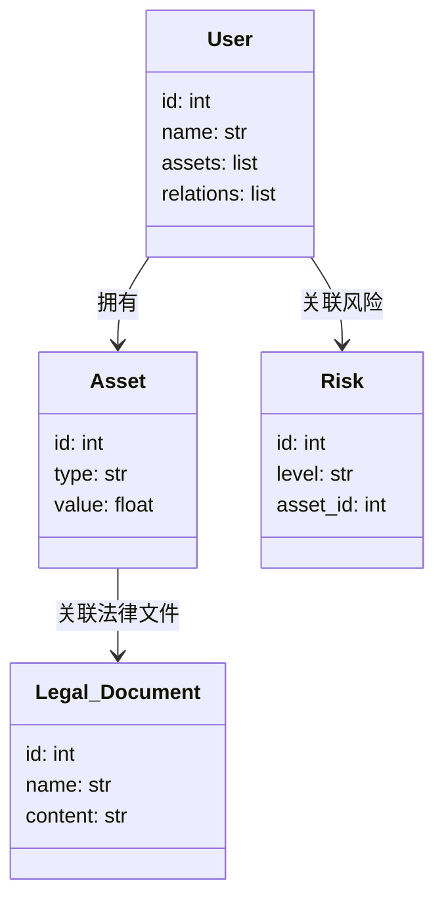
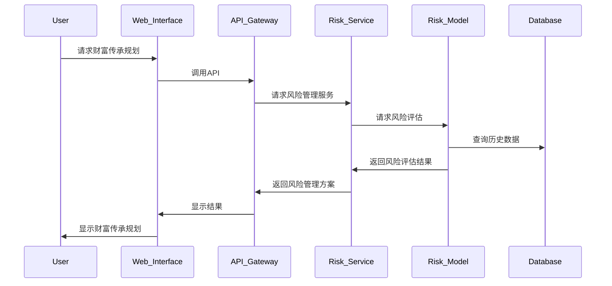

                 


# 构建智能化的个人财富传承规划助手

> 关键词：智能化、财富传承、AI技术、个人财富管理、遗产规划

> 摘要：本文探讨如何利用人工智能技术构建智能化的个人财富传承规划助手，帮助用户优化资产配置、降低风险、提高传承效率。通过分析智能化助手的核心功能、算法原理和系统架构，本文旨在为读者提供一个全面的技术指南，帮助他们理解并实现智能化的财富传承规划。

---

# 第一部分: 背景介绍

# 第1章: 构建智能化的个人财富传承规划助手概述

## 1.1 智能化财富传承的背景与意义

### 1.1.1 财富传承的传统方式与局限性

传统的财富传承方式主要包括遗嘱、信托、保险等。然而，这些方式存在效率低下、成本高昂、难以个性化定制等问题。例如，遗嘱的执行过程复杂且耗时，而信托的设立需要高昂的法律和管理费用。此外，传统方式难以根据市场变化和个人需求进行实时调整。

### 1.1.2 人工智能技术的快速发展

人工智能（AI）技术近年来取得了飞速发展，尤其是在自然语言处理、机器学习和深度学习领域。AI技术能够帮助我们更高效地处理复杂数据、预测市场趋势，并提供个性化的解决方案。

### 1.1.3 智能化财富传承助手的必要性与目标

智能化财富传承助手的目标是通过AI技术优化传统财富传承的流程，降低门槛，提高效率和个性化。其必要性在于满足人们对财富保值、增值和传承的需求，尤其是在面对复杂市场环境和个性化需求时，智能化助手能够提供及时、精准的建议。

---

## 1.2 AI技术在财富传承领域的应用现状

### 1.2.1 AI在金融领域的应用

AI技术已经在金融领域得到了广泛应用，包括智能投顾、风险评估、信用评分等。这些应用证明了AI在金融领域的巨大潜力。

### 1.2.2 AI在法律与税务规划中的潜力

AI技术可以辅助法律咨询、税务优化等，通过大数据分析和机器学习模型，AI可以帮助用户制定最优的税务规划和法律结构。

### 1.2.3 当前市场中的智能化财富传承工具

当前市场中，部分智能投顾工具已经具备初步的财富管理功能，但真正结合AI技术的智能化财富传承工具仍处于起步阶段。

## 1.3 本书的核心目标与意义

### 1.3.1 构建智能化助手的核心目标

本书旨在通过技术手段，构建一个能够根据用户需求和市场变化，提供实时、个性化的财富传承规划的智能化助手。

### 1.3.2 本书的创新点与价值

本书的创新点在于将AI技术与财富传承相结合，提供一套完整的系统设计方案和实现方法。其价值在于为读者提供一个可参考的框架，帮助他们快速进入智能化财富传承领域。

### 1.3.3 读者群体与学习目标

本书适合对AI技术感兴趣且希望将技术应用于财富管理领域的读者，尤其是CTO、技术总监和软件架构师。通过本书，读者将掌握构建智能化财富传承助手的核心技术和方法。

---

# 第二部分: 核心概念与联系

# 第2章: 财富传承智能化的核心概念

## 2.1 财富传承的定义与关键要素

### 2.1.1 财富传承的定义

财富传承是指通过法律、金融等手段，将个人资产传递给指定的继承人或受益人。其核心目标是确保财富的合法性和最大化。

### 2.1.2 财富传承的核心要素

财富传承的核心要素包括：资产种类、继承人关系、法律结构、税务规划和风险管理。这些要素相互关联，共同影响财富传承的效果。

### 2.1.3 财富传承的边界与外延

财富传承不仅包括资产的直接转移，还包括遗产税、继承税等税务规划，以及法律纠纷的预防和处理。

## 2.2 智能化助手的核心功能与属性

### 2.2.1 智能化助手的功能模块

智能化助手的功能模块包括：资产评估、风险管理、税务优化、法律咨询、执行监控等。

### 2.2.2 各功能模块的属性特征对比

以下是功能模块属性特征的对比表格：

| 功能模块       | 输入数据类型 | 输出数据类型 | 核心算法 | 目标 |
|----------------|--------------|--------------|----------|------|
| 资产评估       | 财产清单     | 风险等级     | 风险评估算法 | 识别高风险资产 |
| 风险管理       | 市场数据     | 风险控制方案 | 机器学习模型 | 降低资产风险 |
| 税务优化       | 税务信息     | 优化方案     | 线性规划算法 | 减少税务负担 |
| 法律咨询       | 法律文件     | 建议书       | 规则引擎 | 提供法律建议 |
| 执行监控       | 监控数据     | 报告         | 时间序列分析 | 监控执行情况 |

### 2.2.3 AI技术在财富传承中的实体关系架构

以下是AI技术在财富传承中的实体关系架构图：

```mermaid
graph TD
    User -> Wealth_Asset: 提供资产信息
    User -> Inheritance_Relation: 提供继承人关系
    User -> Legal_Document: 提供法律文件
    Wealth_Asset -> Risk_Assessment: 输入资产数据
    Inheritance_Relation -> Legal_Consulting: 输入继承人信息
    Legal_Document -> Tax_Optimization: 输入税务信息
    Risk_Assessment -> AI_Model: 输入风险数据
    Tax_Optimization -> AI_Model: 输入优化需求
    AI_Model -> Risk_Control_Scheme: 输出风险管理方案
    AI_Model -> Tax_Optimization_Report: 输出税务优化报告
    Risk_Control_Scheme -> Executor_Monitoring: 输入监控数据
```

---

# 第三部分: 算法原理

# 第3章: AI算法在财富传承中的应用

## 3.1 监督学习算法原理

### 3.1.1 监督学习的定义与特点

监督学习是一种机器学习方法，通过训练数据中的输入和输出对，预测新数据的输出。其特点是需要标注数据，并适用于回归和分类问题。

### 3.1.2 监督学习在财富传承中的应用

监督学习可以用于资产分类、风险评估等领域。例如，使用监督学习算法预测资产的风险等级。

### 3.1.3 监督学习的训练流程

以下是监督学习的训练流程图：

```mermaid
graph TD
    Training_Data -> Feature_Extraction: 提取特征
    Feature_Extraction -> Model_Training: 训练模型
    Model_Training -> Model_Evaluation: 评估模型
    Model_Evaluation -> Model_Deployment: 部署模型
```

### 3.1.4 监督学习的Python代码实现

以下是监督学习的Python代码示例：

```python
import pandas as pd
from sklearn.model import LinearRegression

# 加载数据
data = pd.read_csv('wealth.csv')

# 特征和目标变量
X = data[['asset', 'income']]
y = data['risk']

# 模型训练
model = LinearRegression()
model.fit(X, y)

# 预测
prediction = model.predict([[100000, 50000]])
print(prediction)
```

## 3.2 强化学习算法原理

### 3.2.1 强化学习的定义与特点

强化学习是一种通过与环境交互，学习策略以最大化累计奖励的方法。其特点是需要实时反馈和策略优化。

### 3.2.2 强化学习在财富传承中的应用

强化学习可以用于动态资产配置和风险控制。例如，通过强化学习算法优化资产分配策略。

### 3.2.3 强化学习的训练流程

以下是强化学习的训练流程图：

```mermaid
graph TD
    Agent -> Environment: 执行动作
    Environment -> Agent: 返回奖励和状态
    Agent -> Policy: 更新策略
    Policy -> Agent: 应用新策略
```

### 3.2.4 强化学习的Python代码实现

以下是强化学习的Python代码示例：

```python
import numpy as np
from gym import Env, spaces

class WealthEnv(Env):
    def __init__(self):
        self.action_space = spaces.Discrete(3)  # 0: 买入，1: 卖出，2: 持有
        self.observation_space = spaces.Box(low=0, high=1, shape=(1,))  # 资产价格

    def step(self, action):
        # 简化版的环境实现
        state = np.random.rand(1)
        reward = 0
        if action == 0:  # 买入
            reward = 1
        elif action == 1:  # 卖出
            reward = -1
        elif action == 2:  # 持有
            reward = 0
        return state, reward, False, {}

    def reset(self):
        return np.random.rand(1)

# 初始化环境
env = WealthEnv()

# 强化学习算法（简化版）
policy = np.random.rand(3)
actions = [0, 1, 2]

# 执行策略
for _ in range(10):
    state = env.reset()
    action = actions[np.argmax(policy)]
    next_state, reward, done, info = env.step(action)
    print(f"Action: {action}, Reward: {reward}")
    if done:
        break
```

---

# 第四部分: 系统分析与架构设计

# 第4章: 财富传承助手的系统架构设计

## 4.1 问题场景介绍

### 4.1.1 财富传承助手的目标用户

目标用户包括高净值个人、家族企业继承人等。

### 4.1.2 使用场景

用户可以通过助手进行资产评估、风险分析、税务优化等操作。

## 4.2 系统功能设计

### 4.2.1 领域模型设计

以下是领域模型设计图：



### 4.2.2 系统架构设计

以下是系统架构设计图：

```mermaid
graph TD
    User -> Web_Interface: 发起请求
    Web_Interface -> API_Gateway: 调用API
    API_Gateway -> Risk_Service: 调用风险管理服务
    API_Gateway -> Legal_Service: 调用法律咨询服务
    Risk_Service -> Risk_Model: 使用风险模型进行评估
    Legal_Service -> Legal_Model: 使用法律模型提供建议
    Risk_Model -> Database: 查询历史数据
    Legal_Model -> Database: 查询法律文件
    Risk_Service -> API_Gateway: 返回风险管理方案
    Legal_Service -> API_Gateway: 返回法律建议
    API_Gateway -> Web_Interface: 返回结果
    Web_Interface -> User: 显示结果
```

## 4.3 系统接口设计

### 4.3.1 REST API接口设计

以下是REST API接口设计：

```http
GET /api/risk?asset_id=123
POST /api/legal_document
PUT /api/optimization
DELETE /api/monitoring
```

## 4.4 系统交互设计

### 4.4.1 用户与系统的交互流程

以下是用户与系统的交互流程图：



---

# 第五部分: 项目实战

# 第5章: 财富传承助手的实现

## 5.1 环境安装与配置

### 5.1.1 安装Python环境

使用Anaconda安装Python 3.8及以上版本。

### 5.1.2 安装必要的库

安装以下Python库：

```bash
pip install numpy pandas scikit-learn gym matplotlib
```

## 5.2 核心代码实现

### 5.2.1 资产评估模块

以下是资产评估模块的代码：

```python
import pandas as pd
from sklearn.model import LinearRegression

# 加载数据
data = pd.read_csv('assets.csv')

# 特征和目标变量
X = data[['asset_value', 'market_trend']]
y = data['risk_level']

# 模型训练
model = LinearRegression()
model.fit(X, y)

# 预测
new_asset = [[500000, 'up']]
prediction = model.predict(new_asset)
print(f"预测风险等级为：{prediction[0]}")
```

### 5.2.2 风险管理模块

以下是风险管理模块的代码：

```python
import numpy as np
from gym import Env, spaces

class RiskEnv(Env):
    def __init__(self):
        self.action_space = spaces.Discrete(3)  # 0: 买入，1: 卖出，2: 持有
        self.observation_space = spaces.Box(low=0, high=1, shape=(1,))  # 风险指标

    def step(self, action):
        # 简化版的环境实现
        state = np.random.rand(1)
        reward = 0
        if action == 0:  # 买入
            reward = 1
        elif action == 1:  # 卖出
            reward = -1
        elif action == 2:  # 持有
            reward = 0
        return state, reward, False, {}

    def reset(self):
        return np.random.rand(1)

# 初始化环境
env = RiskEnv()

# 强化学习算法（简化版）
policy = np.random.rand(3)
actions = [0, 1, 2]

# 执行策略
for _ in range(10):
    state = env.reset()
    action = actions[np.argmax(policy)]
    next_state, reward, done, info = env.step(action)
    print(f"Action: {action}, Reward: {reward}")
    if done:
        break
```

## 5.3 案例分析与实现

### 5.3.1 实际案例分析

假设一位用户有100万元的资产，需要进行财富传承规划。通过智能化助手，用户可以进行资产分类、风险评估、税务优化等操作。

### 5.3.2 实现步骤与代码解释

以下是实现步骤与代码解释：

1. **加载数据**：加载用户的资产数据和市场数据。
2. **特征提取**：提取资产价值、市场趋势等特征。
3. **模型训练**：使用监督学习算法训练风险评估模型。
4. **预测风险**：根据用户资产，预测风险等级。
5. **优化资产配置**：根据风险评估结果，优化资产配置。

---

# 第六部分: 最佳实践

# 第6章: 构建智能化财富传承助手的最佳实践

## 6.1 数据质量管理

### 6.1.1 数据清洗与预处理

确保数据的完整性和准确性，去除异常值和重复数据。

### 6.1.2 数据增强与标注

通过数据增强技术，提高数据多样性，同时确保标注的准确性。

## 6.2 模型调优与优化

### 6.2.1 超参数优化

通过网格搜索等方法，找到最优的模型参数。

### 6.2.2 模型评估与验证

使用交叉验证等方法，评估模型的泛化能力。

## 6.3 系统部署与维护

### 6.3.1 系统部署

将训练好的模型部署到生产环境，提供API接口供用户调用。

### 6.3.2 系统维护

定期更新模型，监控系统性能，修复潜在问题。

## 6.4 性能优化与扩展

### 6.4.1 并行计算

通过并行计算技术，提高系统的处理能力。

### 6.4.2 模型压缩

通过模型压缩技术，降低模型的资源消耗。

## 6.5 注意事项

### 6.5.1 数据隐私与安全

确保用户数据的隐私和安全，避免数据泄露。

### 6.5.2 模型的可解释性

提高模型的可解释性，便于用户理解和信任。

### 6.5.3 法律与合规性

确保系统的法律合规性，遵守相关法律法规。

## 6.6 拓展阅读

### 6.6.1 推荐书籍

- 《人工智能: 一种现代的方法》
- 《机器学习实战》
- 《Python机器学习》

### 6.6.2 推荐博客与技术文章

- [Towards Data Science](https://towardsdatascience.com/)
- [Medium - AI & Machine Learning](https://medium.com/ai-and-machine-learning)
- [Kaggle](https://www.kaggle.com/)

---

# 第七部分: 小结与展望

## 7.1 小结

通过本文的介绍，我们了解了如何利用AI技术构建智能化的个人财富传承规划助手，涵盖了从背景介绍到系统实现的各个方面。

## 7.2 未来展望

未来，随着AI技术的不断发展，智能化财富传承助手将更加智能化和个性化，能够更好地满足用户的需求。

---

作者：AI天才研究院/AI Genius Institute & 禅与计算机程序设计艺术 /Zen And The Art of Computer Programming

