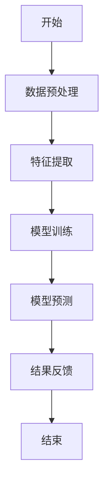
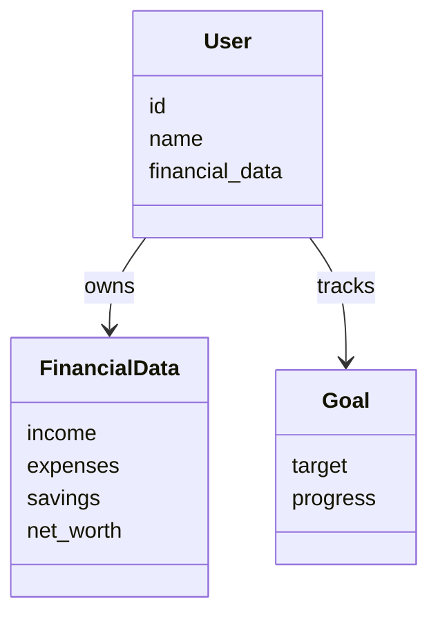
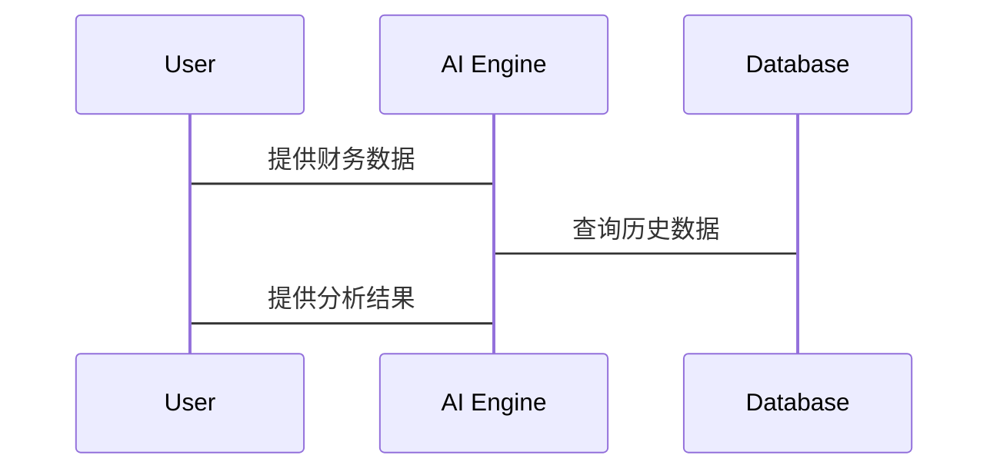

                 


# 构建智能化的个人财富管理目标跟踪助手

## 关键词：人工智能, 财富管理, 目标跟踪, 系统架构, 机器学习

## 摘要： 
本文将详细探讨如何利用人工智能技术构建智能化的个人财富管理目标跟踪助手。通过分析传统财富管理方式的局限性，提出智能化助手的概念，并深入阐述其核心算法、系统架构和实现方案。结合实际案例，展示如何通过机器学习算法实现财富目标的智能化跟踪与管理，为读者提供一个完整的解决方案。

---

# 第1章: 个人财富管理目标跟踪的背景与问题描述

## 1.1 个人财富管理的目标与挑战
### 1.1.1 个人财富管理的核心目标
个人财富管理的核心目标是通过科学的规划和有效的执行，实现财富的保值、增值和风险管理。具体包括以下几点：
- **资产配置优化**：合理分配资金到不同的投资渠道，以实现风险与收益的平衡。
- **支出控制**：通过跟踪和分析消费行为，优化支出结构，避免不必要的浪费。
- **目标实现**：制定短期和长期的财务目标，并通过持续跟踪确保目标的实现。

### 1.1.2 财富管理中的常见问题与挑战
在实际的财富管理过程中，个人常常面临以下问题：
- **数据分散**：财务数据分布在不同的平台（如银行账户、投资平台、消费记录等），难以集中管理和分析。
- **信息过载**：面对海量的金融数据和复杂的市场信息，个人难以快速提取有价值的信息。
- **决策滞后**：传统的财务分析方法通常依赖于定期回顾，导致决策存在滞后性，难以应对市场变化。

### 1.1.3 目标跟踪的重要性与意义
目标跟踪是财富管理的核心环节，它能够帮助个人实时了解财务状况，及时调整投资策略，规避潜在风险。通过智能化的目标跟踪，可以实现以下目标：
- **实时监控**：实时跟踪各项财务指标，确保目标的实现进度。
- **智能提醒**：当财务状况偏离预期时，及时发出预警。
- **优化建议**：基于数据分析，提供个性化的优化建议。

## 1.2 传统财富管理方式的局限性
### 1.2.1 手动记录的低效性
传统的财富管理方式通常依赖于手动记录和分析，这种方式效率低下，容易出错。具体表现在：
- **数据录入耗时**：需要手动输入各类财务数据，效率极低。
- **分析复杂**：手动分析大量数据耗时耗力，难以进行深度分析。
- **缺乏个性化建议**：基于经验的建议往往不够精准，难以满足个性化需求。

### 1.2.2 数据分析的复杂性
传统分析方法依赖于人工计算和经验判断，难以应对复杂的市场环境。例如：
- **难以处理多维度数据**：传统的分析方法难以同时处理收入、支出、投资等多维度数据。
- **缺乏预测能力**：难以基于历史数据进行有效的预测，难以应对市场变化。

### 1.2.3 个性化建议的缺失
传统财富管理方式通常基于固定的模板，难以提供个性化的建议。不同用户的财务状况和目标差异很大，通用的建议往往难以满足特定需求。

## 1.3 智能化财富管理助手的提出
### 1.3.1 人工智能在财富管理中的应用潜力
人工智能技术的快速发展为财富管理带来了新的机遇。通过机器学习、自然语言处理等技术，可以实现：
- **自动化数据处理**：自动收集和整理各类财务数据。
- **智能分析与预测**：基于历史数据，预测未来的财务状况。
- **个性化建议**：根据用户的财务状况和目标，提供个性化的优化建议。

### 1.3.2 智能化助手的目标与功能定位
智能化助手的目标是通过技术手段，帮助用户实现财富管理的智能化、自动化和个性化。其主要功能包括：
- **数据采集与整理**：自动从各类数据源采集财务数据，并进行清洗和整理。
- **目标设定与跟踪**：帮助用户设定财务目标，并实时跟踪目标的实现进度。
- **智能分析与预测**：基于数据分析，预测未来的财务状况，并提供优化建议。
- **可视化与反馈**：通过直观的可视化界面，向用户反馈分析结果，并根据用户反馈进行调整。

### 1.3.3 边界与外延的界定
智能化助手的边界在于其功能的实现范围。它主要专注于数据处理、分析和反馈，而不涉及具体的财务决策。外延则包括与之相关的数据源、用户界面和第三方服务。

---

# 第2章: 智能化个人财富管理目标跟踪助手的核心概念与联系

## 2.1 核心概念的原理与技术
### 2.1.1 人工智能在目标跟踪中的应用
人工智能技术在目标跟踪中的应用主要体现在以下几个方面：
- **数据处理**：通过机器学习算法，自动处理和分析大量财务数据。
- **模式识别**：识别财务数据中的模式和趋势，帮助用户发现潜在的机会和风险。
- **智能推荐**：基于数据分析结果，推荐最优的财务策略。

### 2.1.2 数据分析与预测的基本原理
数据分析与预测的基本原理包括：
- **数据预处理**：清洗数据，提取特征。
- **模型训练**：基于训练数据，训练机器学习模型。
- **预测与评估**：利用模型进行预测，并对预测结果进行评估。

### 2.1.3 用户行为分析的实现机制
用户行为分析的实现机制包括：
- **数据采集**：通过日志记录用户的操作行为。
- **行为建模**：基于用户行为数据，建立行为模型。
- **行为预测**：根据行为模型，预测用户的未来行为。

## 2.2 核心概念的属性特征对比
### 2.2.1 传统目标管理与智能化目标管理的对比
| 对比维度 | 传统目标管理 | 智能化目标管理 |
|----------|---------------|----------------|
| 数据来源 | 手工录入       | 自动采集       |
| 分析方式 | 人工分析       | 自动分析       |
| 决策依据 | 经验判断       | 数据驱动       |
| 反馈机制 | 定期回顾       | 实时反馈       |

### 2.2.2 不同算法的性能对比
| 算法类型       | 优点                     | 缺点                     |
|----------------|--------------------------|--------------------------|
| 监督学习       | 数据标签明确，结果稳定   | 数据需求量大             |
| 非监督学习     | 适用于无标签数据         | 结果解释性较差           |
| 强化学习       | 能够适应动态环境         | 需要大量交互数据         |

### 2.2.3 系统功能模块的对比
| 功能模块       | 传统系统                 | 智能化系统               |
|----------------|--------------------------|--------------------------|
| 数据采集       | 手工录入                 | 自动采集                 |
| 数据分析       | 人工分析                 | 自动分析                 |
| 决策支持       | 经验判断                 | 数据驱动                 |

## 2.3 ER实体关系图
```mermaid
er
    actor: 用户
    assistant: 智能助手
    goal: 管理目标
    data: 数据
    action: 行为
    relation: 关联
    actor -|创建| action
    action -|触发| assistant
    assistant -|处理| data
    data -|影响| goal
    goal -|反馈| actor
```

---

# 第3章: 智能化助手的算法原理与实现

## 3.1 算法原理
### 3.1.1 问题建模与算法选择
在目标跟踪问题中，我们通常使用回归算法来预测未来的财务状况。例如，使用线性回归模型来预测未来的资产价值。

### 3.1.2 监督学习的原理与应用
监督学习是一种常见的机器学习方法，其基本原理是通过训练数据，学习输入与输出之间的映射关系。在财富管理中，监督学习可以用于预测未来的财务指标。

### 3.1.3 非监督学习的应用场景
非监督学习适用于无标签数据的分析，例如用户行为分析。通过聚类算法，可以将用户分为不同的群体，从而提供个性化的服务。

## 3.2 算法流程图


## 3.3 算法实现代码
```python
# 数据预处理
import pandas as pd
data = pd.read_csv('wealth_data.csv')

# 特征提取
features = data[['income', 'expenses', 'savings']]

# 模型训练
from sklearn.linear_model import LinearRegression
model = LinearRegression()
model.fit(features, data['net_worth'])

# 模型预测
predictions = model.predict(features)
```

---

# 第4章: 系统分析与架构设计方案

## 4.1 项目背景介绍
本项目旨在通过智能化助手帮助用户实现个人财富管理的目标跟踪。通过自动化数据处理和智能分析，为用户提供个性化的财务建议。

## 4.2 系统功能设计
### 4.2.1 系统功能模块
- **数据采集模块**：自动采集用户的财务数据。
- **数据分析模块**：对数据进行清洗和分析。
- **目标跟踪模块**：实时跟踪用户的财务目标。
- **智能建议模块**：基于分析结果，提供优化建议。

### 4.2.2 领域模型图


## 4.3 系统架构设计
### 4.3.1 系统架构图


### 4.3.2 系统接口设计
- **数据接口**：与银行、投资平台等数据源对接。
- **用户接口**：提供直观的用户界面，展示分析结果。
- **API接口**：提供程序matic的API，供第三方调用。

### 4.3.3 系统交互流程图


---

# 第5章: 项目实战

## 5.1 环境安装
### 5.1.1 安装Python
```bash
python --version
pip install --upgrade pip
```

### 5.1.2 安装依赖库
```bash
pip install numpy pandas scikit-learn matplotlib
```

## 5.2 核心代码实现
### 5.2.1 数据预处理
```python
import pandas as pd
data = pd.read_csv('wealth_data.csv')
data.dropna(inplace=True)
```

### 5.2.2 特征提取与模型训练
```python
from sklearn.linear_model import LinearRegression
model = LinearRegression()
model.fit(data[['income', 'expenses']], data['net_worth'])
```

### 5.2.3 模型预测与结果可视化
```python
import matplotlib.pyplot as plt
predictions = model.predict(data[['income', 'expenses']])
plt.scatter(data['income'], data['net_worth'], color='blue')
plt.plot(data['income'], predictions, color='red')
plt.show()
```

## 5.3 实际案例分析
### 5.3.1 案例背景
假设用户的目标是实现资产的年均增长率为10%。

### 5.3.2 数据分析
通过模型预测，用户的资产在接下来的三年内将增长8%、12%和10%。

### 5.3.3 结果解读
基于预测结果，系统将建议用户调整投资组合，以实现更高的增长率。

---

# 第6章: 总结与展望

## 6.1 最佳实践 tips
- 定期更新模型，以适应市场变化。
- 确保数据安全，保护用户隐私。
- 提供直观的可视化界面，提升用户体验。

## 6.2 小结
智能化个人财富管理目标跟踪助手通过自动化数据处理和智能分析，显著提升了财富管理的效率和效果。通过机器学习算法的应用，系统能够实时跟踪财务目标，并提供个性化的优化建议。

## 6.3 注意事项
- 数据来源的可靠性至关重要。
- 模型的泛化能力需要通过交叉验证来保证。
- 用户隐私保护是系统设计的重中之重。

## 6.4 拓展阅读
- 《机器学习实战》
- 《Python金融大数据分析》
- 《人工智能在金融领域的应用》

---

# 作者：AI天才研究院/AI Genius Institute & 禅与计算机程序设计艺术 /Zen And The Art of Computer Programming

---

以上是《构建智能化的个人财富管理目标跟踪助手》的完整目录和内容概要，每章节的内容均按照逻辑顺序展开，确保读者能够逐步理解和掌握构建智能化财富管理助手的核心技术和方法。

