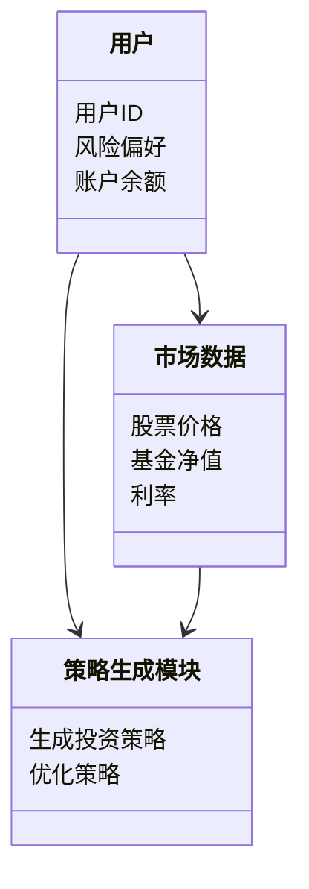
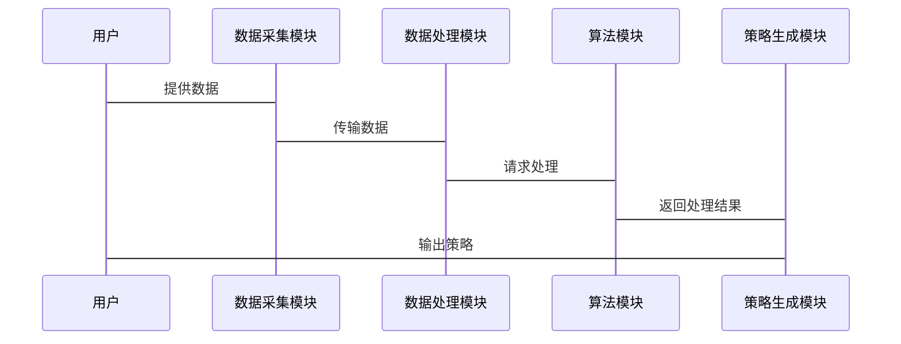

                 


# 构建智能化的个人财富管理策略动态生成与调整助手

> 关键词：个人财富管理、动态生成、AI算法、策略调整、智能化系统

> 摘要：本文详细探讨了如何利用人工智能技术构建智能化的个人财富管理策略动态生成与调整助手。通过分析传统财富管理的局限性，提出了一种基于AI的解决方案，并从算法原理、系统架构、项目实战等多方面展开论述，旨在为读者提供一套完整的实现思路和技术方案。

---

# 第一部分: 智能化个人财富管理策略动态生成与调整助手的背景与核心概念

## 第1章: 财富管理的智能化需求与问题背景

### 1.1 传统财富管理的局限性
#### 1.1.1 传统财富管理的模式与挑战
传统的财富管理主要依赖人工分析和固定策略，存在以下问题：
- 策略固定化：无法根据市场变化实时调整。
- 人工成本高：需要大量专业人员进行分析。
- 个性化不足：难以满足不同用户的个性化需求。

#### 1.1.2 个人财富管理中的痛点分析
- 用户需求多样：不同用户的财务状况、风险偏好和投资目标各不相同。
- 市场波动频繁：金融市场的不确定性和波动性对策略调整提出了更高的要求。
- 信息处理复杂：用户可能面临海量数据，难以快速做出决策。

#### 1.1.3 智能化技术在财富管理中的应用潜力
- AI技术可以实时分析市场数据，提供动态的策略建议。
- 通过机器学习模型，能够捕捉数据中的潜在规律，优化投资组合。
- 智能化系统可以实现自动化调整，降低人工成本。

### 1.2 人工智能在财富管理中的角色
#### 1.2.1 AI技术如何赋能财富管理
- 数据分析：利用AI处理海量数据，提取有用信息。
- 策略生成：通过机器学习模型生成个性化的投资策略。
- 实时调整：根据市场变化动态优化投资组合。

#### 1.2.2 从静态策略到动态调整的转变
- 静态策略的缺陷：无法应对市场环境的变化。
- 动态调整的优势：能够实时捕捉市场机会，降低风险。
- AI驱动的动态调整：通过算法模型实现智能化的调整机制。

#### 1.2.3 个性化与智能化的结合
- 个性化需求的满足：通过AI技术分析用户特征，提供定制化服务。
- 智能化系统的高效性：利用算法快速处理信息，提升决策效率。

## 第2章: 动态生成与调整助手的核心概念

### 2.1 动态生成与调整的定义
#### 2.1.1 动态生成的含义
动态生成是指根据当前市场数据和用户需求，实时生成个性化的财富管理策略。

#### 2.1.2 动态调整的机制
动态调整是指在市场环境发生变化时，系统能够自动优化和调整现有的策略。

#### 2.1.3 动态策略的核心要素
- 数据采集：获取市场数据、用户数据等。
- 策略生成：基于数据生成初步策略。
- 策略调整：根据市场变化优化策略。

### 2.2 动态生成与调整助手的功能框架
#### 2.2.1 数据采集与分析模块
- 数据源：市场数据、用户数据。
- 数据处理：清洗、转换、分析。

#### 2.2.2 策略生成模块
- 算法选择：监督学习、强化学习。
- 策略生成：输出初步策略。

#### 2.2.3 调整与优化模块
- 监测市场变化：实时跟踪市场数据。
- 自动调整策略：根据变化优化策略。

### 2.3 动态生成与调整助手的边界与外延
#### 2.3.1 辅助决策的边界
- 辅助决策而非完全替代人工决策。
- 系统提供建议，用户最终决策。

#### 2.3.2 与传统财富管理的区分
- 传统管理：固定策略、人工分析。
- 智能化系统：动态调整、AI驱动。

#### 2.3.3 动态调整的适用场景
- 股票投资：实时调整股票配置。
- 基金投资：动态优化基金组合。
- 综合财富管理：多资产类别动态调整。

---

# 第二部分: 动态生成与调整助手的核心概念与联系

## 第3章: 核心概念的原理与联系

### 3.1 动态生成与调整的原理
#### 3.1.1 数据驱动的策略生成
- 数据是策略生成的基础。
- 利用机器学习模型从数据中提取规律。

#### 3.1.2 AI算法在动态调整中的应用
- 强化学习：通过试错优化策略。
- 监督学习：基于历史数据训练模型。

#### 3.1.3 知识图谱与策略优化
- 知识图谱：构建领域知识网络。
- 策略优化：基于知识图谱进行推理和优化。

### 3.2 核心概念的属性对比
#### 3.2.1 策略生成的实时性与准确性对比
| 特性 | 实时性 | 准确性 |
|------|--------|--------|
| 数据驱动 | 高 | 中 |
| 算法驱动 | 中 | 高 |

#### 3.2.2 动态调整的灵活性与稳定性对比
| 特性 | 灵活性 | 稳定性 |
|------|--------|--------|
| 强化学习 | 高 | 中 |
| 监督学习 | 中 | 高 |

#### 3.2.3 不同策略生成方法的优缺点分析
| 方法 | 优点 | 缺点 |
|------|-------|-------|
| 监督学习 | 数据需求低，结果稳定 | 无法实时调整 |
| 强化学习 | 可实时调整，灵活性高 | 训练时间长，计算成本高 |

### 3.3 实体关系图（ER图）架构


---

# 第三部分: 算法原理与数学模型

## 第4章: 算法原理讲解

### 4.1 算法概述
#### 4.1.1 基于强化学习的策略生成
- 算法流程：
  1. 状态空间定义：用户特征、市场环境。
  2. 动作空间定义：投资组合调整。
  3. 奖励函数设计：收益最大化。

#### 4.1.2 基于监督学习的动态调整
- 算法流程：
  1. 数据预处理：清洗、归一化。
  2. 模型训练：基于历史数据训练模型。
  3. 策略调整：根据预测结果优化策略。

#### 4.1.3 算法选

---

# 第四部分: 系统分析与架构设计方案

## 第5章: 问题场景介绍

### 5.1 项目介绍
- 项目目标：构建智能化的个人财富管理助手。
- 项目范围：支持多种资产类型，实现动态策略生成与调整。
- 项目约束：确保数据安全，保护用户隐私。

### 5.2 系统功能设计
#### 5.2.1 领域模型设计


#### 5.2.2 系统架构设计


#### 5.2.3 系统接口设计
- 输入接口：用户信息、市场数据。
- 输出接口：投资策略、调整建议。

#### 5.2.4 系统交互设计


---

# 第五部分: 项目实战

## 第6章: 环境安装与核心实现

### 6.1 环境安装
- Python 3.8+
- TensorFlow、Keras、Pandas、NumPy
- Jupyter Notebook

### 6.2 核心代码实现
#### 6.2.1 数据处理模块
```python
import pandas as pd
import numpy as np

# 数据清洗
def data_cleaning(data):
    data.dropna(inplace=True)
    return data

# 数据归一化
def data_normalization(data):
    normalized_data = (data - data.mean()) / data.std()
    return normalized_data
```

#### 6.2.2 策略生成模块
```python
import tensorflow as tf
from tensorflow.keras import layers

# 构建神经网络模型
def build_model(input_shape):
    model = tf.keras.Sequential()
    model.add(layers.Dense(64, activation='relu', input_shape=input_shape))
    model.add(layers.Dense(32, activation='relu'))
    model.add(layers.Dense(1, activation='linear'))
    model.compile(optimizer='adam', loss='mean_squared_error')
    return model
```

#### 6.2.3 策略调整模块
```python
def strategy_adjustment(current_strategy, market_change):
    # 根据市场变化调整策略
    adjusted_strategy = current_strategy * (1 + market_change)
    return adjusted_strategy
```

### 6.3 案例分析与解读
- 案例1：股票投资策略生成
- 案例2：基金组合优化
- 案例3：动态调整应对市场波动

### 6.4 项目总结
- 项目实现的关键点
- 系统的优势与不足
- 未来改进方向

---

# 第六部分: 最佳实践与注意事项

## 第7章: 最佳实践 tips

### 7.1 小结
- 系统设计的核心是数据驱动和算法优化。
- 灵活性与稳定性的平衡至关重要。

### 7.2 注意事项
- 数据安全：确保用户数据隐私。
- 算法优化：不断优化模型以提高准确性。
- 系统维护：定期更新模型和策略。

### 7.3 拓展阅读
- 推荐书籍：《机器学习实战》、《深度学习》
- 推荐博客：某某技术博客、某某AI社区

---

# 作者：AI天才研究院/AI Genius Institute & 禅与计算机程序设计艺术 /Zen And The Art of Computer Programming

---

# 本文地址：https://github.com/AI-Genius-Institute/Zen-Art-of-Computer-Programming/blob/master/wealth-management-strategy-generator.md

---

希望这篇文章的目录大纲能够帮助您构建一个完整且详细的《构建智能化的个人财富管理策略动态生成与调整助手》的技术博客文章。如果需要进一步补充或调整，请随时告知！

