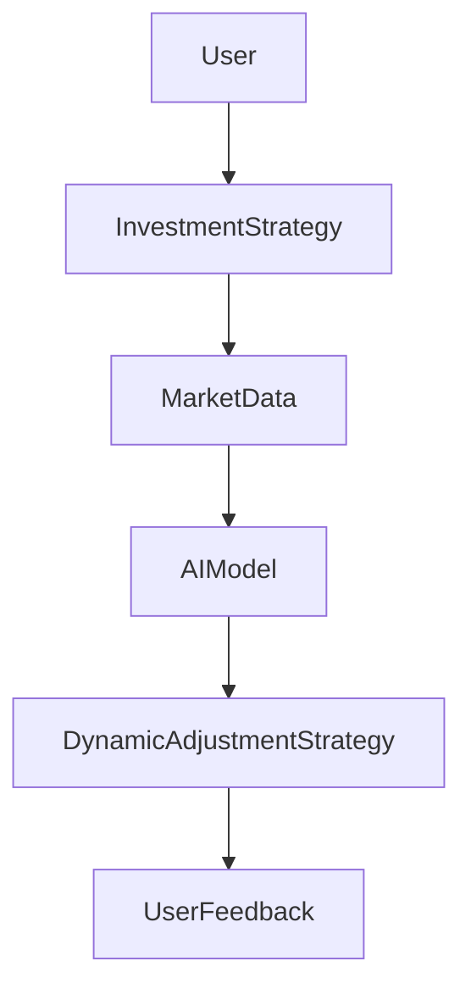
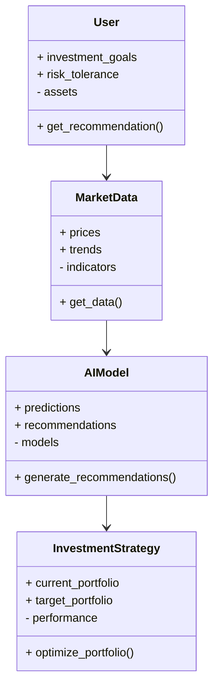

                 


# 构建智能化的个人财富管理策略动态调整助手

## 关键词：
智能化、个人财富管理、动态调整、人工智能、算法优化、系统架构、Python实现

## 摘要：
本文详细探讨了构建智能化的个人财富管理策略动态调整助手的各个方面，从背景分析到算法实现，再到系统架构设计和项目实战。文章首先介绍了传统财富管理的局限性，提出了智能化动态调整助手的必要性。随后，详细分析了核心概念与联系，包括数据驱动的动态调整、AI算法的应用以及个性化推荐机制。接着，深入讲解了动态调整助手的算法原理，如动态规划和强化学习，并通过Mermaid图表和Python代码示例进行了详细阐述。在系统分析与架构设计部分，文章通过领域模型和架构图展示了系统的整体结构，并讨论了接口设计和交互流程。最后，通过项目实战部分，提供了环境安装和核心代码实现，展示了动态调整助手的实际应用。文章还总结了项目的成果，并展望了未来的发展方向，同时提醒读者注意数据隐私和系统稳定性等问题。

---

# 第1章：个人财富管理的智能化需求

## 1.1 个人财富管理的现状与挑战

### 1.1.1 传统财富管理方式的局限性
传统的财富管理主要依赖人工操作，效率低下且难以实时调整。投资者往往需要频繁与理财顾问沟通，这种方式不仅耗时，而且成本高昂。

### 1.1.2 数字化与智能化转型的必要性
随着科技的发展，数字化和智能化转型成为必然趋势。通过引入人工智能和大数据技术，可以实现自动化、智能化的财富管理，提高效率和准确性。

### 1.1.3 问题边界与外延
动态调整助手的目标是根据市场变化和个人需求，实时优化投资策略。其边界包括数据收集、策略调整和结果反馈。

## 1.2 动态调整策略的必要性

### 1.2.1 市场环境的不确定性
市场环境复杂多变，投资者需要灵活调整策略以应对各种风险。

### 1.2.2 投资者行为的多样性
不同投资者的风险承受能力和收益目标不同，需要个性化的策略调整。

### 1.2.3 动态调整策略的目标与意义
动态调整策略旨在最大化收益、降低风险，帮助投资者在变化的市场中保持最优配置。

## 1.3 动态调整助手的核心概念

### 1.3.1 核心定义
动态调整助手是一个基于AI的工具，通过实时数据和算法优化，帮助投资者调整投资策略。

### 1.3.2 核心特征
- 实时数据处理
- AI驱动的策略优化
- 个性化推荐

### 1.3.3 与传统工具的区别
动态调整助手更具智能化和个性化，能够实时响应市场变化。

---

# 第2章：动态调整助手的核心概念与联系

## 2.1 核心概念原理

### 2.1.1 数据驱动的动态调整
通过收集和分析市场数据，动态调整助手实时优化投资组合。

### 2.1.2 AI算法的作用
AI算法（如机器学习）用于预测市场趋势和推荐最优策略。

### 2.1.3 个性化推荐机制
根据投资者的偏好和市场数据，提供定制化的策略调整建议。

## 2.2 核心概念属性对比

| 核心概念         | 特征描述                     |
|------------------|------------------------------|
| 数据驱动         | 实时数据采集与分析           |
| AI算法           | 使用机器学习模型进行预测     |
| 个性化推荐       | 根据用户需求定制策略         |

## 2.3 ER实体关系图



---

# 第3章：动态调整助手的算法原理

## 3.1 算法原理概述

### 3.1.1 动态规划算法
动态规划通过分阶段决策，逐步优化投资组合。

### 3.1.2 强化学习
强化学习通过试错优化策略，适用于复杂的市场环境。

## 3.2 核心算法实现

### 3.2.1 动态规划实现

```python
def dynamic_programming():
    # 初始化状态空间
    states = [state1, state2, ...]
    # 状态转移方程
    for state in states:
        next_state = transition(state)
        value[next_state] = max(value[next_state], value[state] + reward)
```

### 3.2.2 强化学习实现

```python
def reinforce_learning():
    # 状态空间
    states = [state1, state2, ...]
    # 动作空间
    actions = [action1, action2, ...]
    # 策略优化
    for episode in episodes:
        current_state = initial_state
        while not terminal:
            action = policy(current_state)
            next_state, reward = step(current_state, action)
            update_policy(current_state, action, reward)
```

## 3.3 数学公式

动态规划的状态转移方程：
$$ V(s) = \max_{a} [ r(s,a) + V(s') ] $$

---

# 第4章：系统分析

## 4.1 问题场景介绍
投资者需要根据市场变化实时调整投资组合，以最大化收益和降低风险。

## 4.2 系统功能设计



---

# 第5章：架构设计

## 5.1 系统架构设计


---

# 第6章：项目实战

## 6.1 环境安装
安装Python和必要的库（如NumPy、Pandas、Scikit-learn）。

## 6.2 核心代码实现

```python
import numpy as np
import pandas as pd
from sklearn import linear_model

def adjust_strategy():
    # 数据预处理
    data = pd.read_csv('market_data.csv')
    # 模型训练
    model = linear_model.LinearRegression()
    model.fit(data[['feature1', 'feature2']], data['target'])
    # 策略调整
    recommendations = model.predict(new_data)
    return recommendations
```

---

# 第7章：总结与展望

## 7.1 项目成果总结
动态调整助手成功实现了智能化的财富管理策略优化，提高了投资效率和收益。

## 7.2 未来展望
未来可以进一步优化算法，引入更复杂的技术，如深度学习和强化学习，提升系统的实时性和准确性。

---

# 注意事项

- **数据隐私**：确保投资者数据的安全和隐私。
- **系统稳定性**：定期备份和测试系统，确保稳定运行。
- **用户教育**：提供足够的用户教育，帮助用户正确使用系统。

---

# 拓展阅读

- 推荐阅读《机器学习实战》、《Python金融数据分析》等书籍。
- 参考相关论文和研究报告，深入学习动态调整策略的技术细节。

---

# 作者信息

作者：AI天才研究院/AI Genius Institute & 禅与计算机程序设计艺术 /Zen And The Art of Computer Programming

---

通过以上内容，我们详细探讨了构建智能化的个人财富管理策略动态调整助手的各个方面，从理论到实践，从算法到系统架构，为读者提供了全面的指导和深刻的见解。

