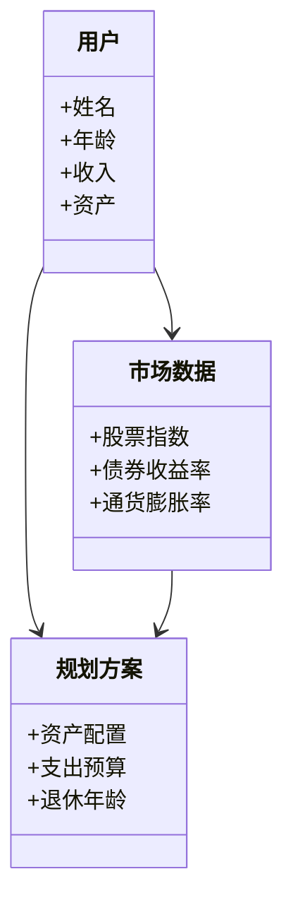
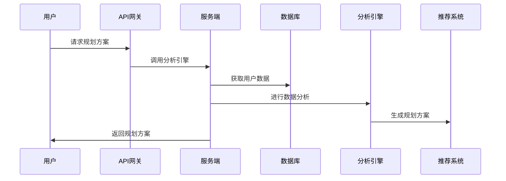

                 


# 构建智能化的个人退休收入规划工具

---

## 关键词：
- 退休收入规划、人工智能、大数据分析、优化算法、个性化推荐系统

---

## 摘要：
随着人口老龄化的加剧，个人退休收入规划变得越来越重要。传统的退休规划方法依赖于简单的财务计算和经验判断，难以满足个性化和动态调整的需求。本文通过构建智能化的个人退休收入规划工具，结合人工智能、大数据分析和优化算法，提供个性化的退休规划方案。文章详细介绍了工具的背景、核心概念、算法原理、系统架构，并通过实际案例展示了工具的应用价值，为读者提供了一套高效、智能的退休规划解决方案。

---

# 第一部分: 个人退休收入规划工具的背景与需求

## 第1章: 退休收入规划的背景与挑战

### 1.1 退休规划的重要性
#### 1.1.1 退休规划的核心目标
退休规划的核心目标是确保个人在退休后能够维持一定的生活水平，同时最大化资产的保值与增值。传统的退休规划方法依赖于固定的利率假设和简单的财务计算，难以应对实际生活中的不确定性。

#### 1.1.2 传统退休规划的局限性
传统的退休规划方法存在以下问题：
- **假设固定利率**：忽略了市场波动和通货膨胀的影响。
- **缺乏个性化**：每个人的收入水平、消费习惯和风险承受能力不同，通用的规划方案难以满足个性化需求。
- **动态调整能力不足**：市场环境和生活状况的变化可能导致规划方案失效，但调整成本高且复杂。

#### 1.1.3 智能化退休规划的必要性
智能化退休收入规划工具通过引入人工智能和大数据分析，能够实时动态调整规划方案，提供个性化建议，并帮助用户做出更明智的财务决策。

---

### 1.2 个人退休收入规划工具的现状

#### 1.2.1 当前市场上的工具类型
目前市场上的退休规划工具主要包括以下几种类型：
- **基础计算器**：仅提供简单的资产计算和固定利率假设。
- **综合规划工具**：结合资产配置和生命周期模型，提供基本的财务建议。
- **智能化工具**：基于人工智能和大数据分析，提供个性化和动态调整的规划方案。

#### 1.2.2 用户需求的多样性
用户的退休规划需求具有多样性：
- **资产规模差异**：高净值用户需要更复杂的资产配置策略。
- **风险偏好差异**：不同用户对风险的承受能力不同，影响投资组合的选择。
- **生命周期差异**：不同年龄段的用户面临不同的财务挑战，例如年轻人需要关注养老金储备，中年人需要平衡当前消费和长期储蓄。

#### 1.2.3 技术驱动的工具发展趋势
随着技术的进步，智能化退休规划工具正在快速发展：
- **人工智能**：用于个性化推荐和动态调整。
- **大数据分析**：通过分析海量数据，提供更精准的预测和建议。
- **实时交互**：通过用户反馈实时优化规划方案。

---

### 1.3 智能化工具的核心优势

#### 1.3.1 数据驱动的精准分析
智能化工具通过收集和分析用户的财务数据、市场数据和生活数据，提供更精准的预测和建议。

#### 1.3.2 个性化定制方案
基于用户的个性化需求，工具能够生成定制化的退休规划方案，满足不同用户的具体需求。

#### 1.3.3 实时动态调整能力
智能化工具能够实时跟踪市场变化和用户财务状况，动态调整规划方案，确保规划的持续有效性。

---

## 第2章: 智能化退休收入规划工具的核心概念

### 2.1 数据驱动的分析模型

#### 2.1.1 数据采集与处理
智能化工具需要采集以下数据：
- **用户数据**：收入、支出、资产、负债等。
- **市场数据**：股票、债券、基金等金融市场的实时数据。
- **宏观经济数据**：通货膨胀率、利率、GDP增长等。

#### 2.1.2 数据分析方法
常用的分析方法包括：
- **回归分析**：用于预测退休收入与相关变量的关系。
- **时间序列分析**：用于分析和预测未来市场走势。
- **聚类分析**：用于识别不同用户的消费习惯和风险偏好。

#### 2.1.3 数据可视化
通过数据可视化工具（如图表、仪表盘）帮助用户和分析师更直观地理解数据。

---

### 2.2 优化算法与决策支持

#### 2.2.1 常用优化算法概述
常用的优化算法包括：
- **线性规划**：用于解决线性关系的优化问题。
- **非线性规划**：用于解决非线性关系的优化问题。
- **动态规划**：用于解决多阶段决策问题。

#### 2.2.2 优化算法在退休规划中的应用
优化算法可以用于以下方面：
- **资产配置优化**：在给定风险偏好下，优化投资组合的收益和风险。
- **退休年龄优化**：确定最佳退休年龄以最大化退休收入。
- **支出预算优化**：在有限的退休收入下，优化支出结构以提高生活质量。

---

### 2.3 个性化推荐系统

#### 2.3.1 推荐系统的基本原理
个性化推荐系统通过分析用户的特征和行为，推荐适合的退休规划方案。

#### 2.3.2 个性化方案生成
基于用户的风险偏好、资产规模和生命周期阶段，生成定制化的退休规划方案。

#### 2.3.3 用户反馈与模型调优
通过用户反馈不断优化推荐算法，提高推荐的准确性和满意度。

---

## 第3章: 智能化退休收入规划工具的算法原理

### 3.1 优化算法的数学模型

#### 3.1.1 线性规划模型
线性规划模型用于解决以下问题：
- **目标函数**：最大化或最小化某个线性函数。
- **约束条件**：满足一系列线性约束。

示例：
$$
\text{最大化 } z = 3x + 2y \\
\text{约束条件} \\
x + y \leq 5 \\
x \geq 0, y \geq 0
$$

#### 3.1.2 非线性规划模型
非线性规划模型用于解决非线性关系的优化问题：
- **目标函数**：非线性函数。
- **约束条件**：非线性约束。

示例：
$$
\text{最小化 } f(x) = x^2 + 2xy + y^2 \\
\text{约束条件} \\
x + y \leq 10 \\
x \geq 0, y \geq 0
$$

#### 3.1.3 动态规划模型
动态规划模型用于解决多阶段决策问题：
- **状态转移方程**：描述状态之间的关系。
- **最优子结构**：分解问题为子问题，逐层求解。

---

### 3.2 常用优化算法实现

#### 3.2.1 遗传算法
遗传算法是一种模拟自然进化过程的优化算法，包括以下步骤：
1. 初始化种群。
2. 计算适应度。
3. 选择适应度高的个体进行交配。
4. 通过变异操作生成新的种群。
5. 重复步骤2-4，直到满足终止条件。

#### 3.2.2 模拟退火算法
模拟退火算法是一种全局优化算法，适用于复杂问题：
1. 初始化当前解。
2. 计算目标函数值。
3. 产生新解。
4. 如果新解更好，接受新解；否则，以一定概率接受新解。
5. 降低温度，重复步骤3-4，直到满足终止条件。

#### 3.2.3 蚁群算法
蚂蚁算法模拟蚂蚁寻找最短路径的行为，适用于组合优化问题：
1. 初始化蚂蚁种群。
2. 计算路径成本。
3. 根据路径成本更新信息素。
4. 重复步骤2-3，直到找到最优解。

---

### 3.3 机器学习在退休规划中的应用

#### 3.3.1 监督学习模型
监督学习用于预测退休收入和支出：
- **输入特征**：年龄、收入、资产等。
- **输出标签**：退休收入、支出建议。

#### 3.3.2 非监督学习模型
非监督学习用于用户聚类和市场分析：
- **聚类分析**：将用户分为不同的消费习惯和风险偏好群体。
- **异常检测**：识别潜在的财务风险。

#### 3.3.3 强化学习模型
强化学习用于动态调整退休规划方案：
- **状态空间**：当前市场和用户财务状况。
- **动作空间**：可能的调整方案。
- **奖励函数**：根据方案的有效性给予奖励。

---

## 第4章: 智能化退休收入规划工具的系统架构

### 4.1 问题场景介绍
退休收入规划工具需要解决以下问题：
- 如何实时跟踪市场变化和用户财务状况？
- 如何动态调整规划方案以适应变化？
- 如何保证数据安全和用户隐私？

---

### 4.2 项目介绍
本项目旨在开发一个智能化的退休收入规划工具，通过以下功能实现目标：
- **数据采集**：收集用户的财务数据和市场数据。
- **数据分析**：利用机器学习和优化算法生成规划方案。
- **用户交互**：提供友好的用户界面，实时反馈规划结果。

---

### 4.3 系统功能设计

#### 4.3.1 领域模型（Mermaid 类图）


---

#### 4.3.2 系统架构（Mermaid 架构图）
```mermaid
container 用户端 {
    API网关
    用户界面
}
container 服务端 {
    数据库
    分析引擎
    推荐系统
}
用户端 --> API网关 --> 服务端
服务端 --> 数据库
服务端 --> 分析引擎
服务端 --> 推荐系统
```

---

#### 4.3.3 系统接口设计
- **数据接口**：与金融机构和市场数据源对接，获取实时数据。
- **用户接口**：提供注册、登录、数据输入和查询功能。
- **规划接口**：生成和调整退休规划方案。

---

#### 4.3.4 系统交互（Mermaid 序列图）


---

## 第5章: 项目实战

### 5.1 环境安装
- **开发环境**：Python 3.8+、Jupyter Notebook
- **依赖库**：Pandas、NumPy、Scikit-learn、Plotly

---

### 5.2 系统核心实现源代码

#### 5.2.1 数据采集与处理
```python
import pandas as pd

# 数据采集
def collect_data():
    # 示例：从数据库中读取数据
    data = pd.read_csv(' retirement_data.csv ')
    return data

# 数据清洗
def preprocess_data(data):
    data.dropna()
    return data

# 数据分析
def analyze_data(data):
    # 示例：计算平均退休收入
    average_income = data['退休收入'].mean()
    return average_income
```

---

#### 5.2.2 算法实现

```python
from sklearn.linear_model import LinearRegression

# 示例：线性回归模型
def create_model(X_train, y_train):
    model = LinearRegression()
    model.fit(X_train, y_train)
    return model

# 示例：模型预测
def predict(model, X_test):
    y_pred = model.predict(X_test)
    return y_pred
```

---

### 5.3 实际案例分析

#### 5.3.1 案例背景
假设一个35岁的用户，年收入50万元，现有资产200万元，希望在60岁退休。

#### 5.3.2 数据分析与建模
1. 数据采集：收集用户数据和市场数据。
2. 数据清洗：处理缺失值和异常值。
3. 数据分析：使用线性回归模型预测退休收入。
4. 模型优化：使用遗传算法优化资产配置。

#### 5.3.3 实施方案
1. 资产配置：将资产分配为60%股票、30%债券、10%现金。
2. 支出预算：根据预测的退休收入调整支出结构。
3. 动态调整：每年根据市场变化和用户财务状况调整规划方案。

---

## 第6章: 最佳实践与小结

### 6.1 最佳实践

#### 6.1.1 数据质量管理
- 确保数据的准确性、完整性和及时性。
- 定期更新数据，保证模型的准确性。

#### 6.1.2 模型优化
- 定期评估模型性能，根据反馈优化算法。
- 引入新的数据和市场信息，提升模型的预测能力。

#### 6.1.3 用户教育
- 提供用户教育，帮助用户理解规划方案的制定过程。
- 提供交互式界面，让用户参与决策过程。

---

### 6.2 小结

智能化的个人退休收入规划工具通过结合人工智能和大数据分析，为用户提供个性化的退休规划方案。本文详细介绍了工具的背景、核心概念、算法原理和系统架构，并通过实际案例展示了工具的应用价值。未来，随着技术的不断发展，智能化退休规划工具将更加精准和智能，为用户提供更好的服务。

---

## 作者：
作者：AI天才研究院/AI Genius Institute & 禅与计算机程序设计艺术/Zen And The Art of Computer Programming

