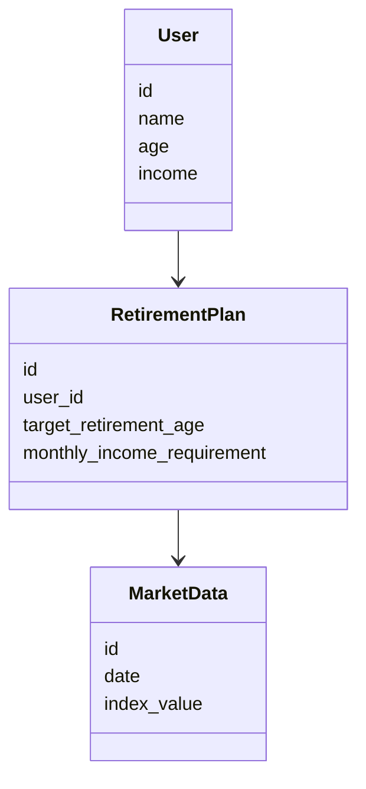
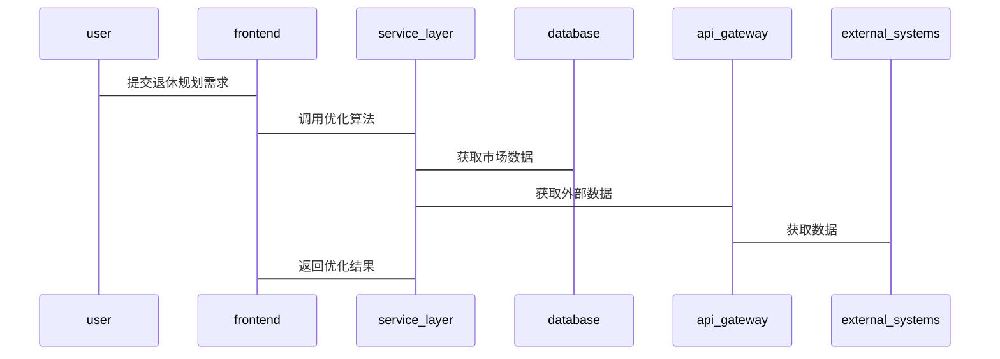

                 


```markdown
# 构建智能化的个人退休规划优化助手

## 关键词：退休规划，人工智能，优化算法，数据驱动，系统架构

## 摘要：本文详细探讨了构建智能化个人退休规划优化助手的全过程。首先，我们从退休规划的背景出发，分析了传统方法的局限性，提出了智能化助手的必要性。接着，我们介绍了核心概念，包括问题建模和数据特征分析。随后，详细讲解了算法原理，将退休规划问题转化为数学模型，并通过优化算法求解。在系统架构设计部分，我们展示了模块化设计和接口实现。最后，通过项目实战，验证了系统的可行性和有效性，总结了最佳实践经验和未来研究方向。

---

# 第一部分：智能化个人退休规划优化助手的背景与核心概念

## 第1章：背景介绍

### 1.1 问题背景

#### 1.1.1 退休规划的重要性
退休规划是个人财务管理中至关重要的一部分，直接关系到个人在退休后的生活质量。随着人口老龄化加剧，人们对退休规划的需求日益增长。

#### 1.1.2 传统退休规划的局限性
传统退休规划方法依赖于固定公式和假设，难以适应个人的复杂需求和市场变化。

#### 1.1.3 智能化退休规划的需求
人工智能和大数据技术的发展为退休规划提供了新的可能性，能够实现个性化、动态化的规划。

### 1.2 问题描述

#### 1.2.1 退休规划的核心要素
包括收入、支出、储蓄、投资、寿命预测等关键因素。

#### 1.2.2 用户需求的多样性
不同用户有不同的财务状况、风险偏好和目标，需要个性化的解决方案。

#### 1.2.3 数据驱动的必要性
通过分析大量数据，能够更准确地预测市场变化和用户需求。

### 1.3 问题解决

#### 1.3.1 人工智能在退休规划中的应用
利用机器学习算法，对用户数据进行分析和预测，提供优化建议。

#### 1.3.2 数据分析与优化算法的结合
通过数据分析提取特征，利用优化算法找到最优退休计划。

#### 1.3.3 智能化助手的核心功能
包括数据采集、规划生成、动态调整、可视化展示等功能。

### 1.4 边界与外延

#### 1.4.1 退休规划的边界条件
明确目标人群、时间范围和规划范围。

#### 1.4.2 相关领域的外延
涉及金融学、人工智能、数据科学等多个领域。

#### 1.4.3 系统设计的限制与扩展
系统设计需要考虑性能和可扩展性，以便应对不同规模的数据和用户需求。

### 1.5 核心要素组成

#### 1.5.1 数据来源
包括用户数据、市场数据和历史数据。

#### 1.5.2 模型构建
基于机器学习和优化算法构建数学模型。

#### 1.5.3 用户交互
通过用户友好的界面实现数据输入和结果展示。

## 第2章：核心概念与联系

### 2.1 核心概念原理

#### 2.1.1 退休规划的数学模型
建立优化模型，考虑目标函数和约束条件。

#### 2.1.2 人工智能的优化算法
利用遗传算法、粒子群优化等算法进行求解。

#### 2.1.3 数据分析的关键技术
包括数据清洗、特征提取和预测建模。

### 2.2 核心概念属性对比

| 核心概念 | 描述 | 示例 |
|----------|------|------|
| 数据来源 | 数据的来源和类型 | 用户收入、支出数据 |
| 模型类型 | 模型的类型和特点 | 线性回归、随机森林 |
| 优化目标 | 规划的目标和指标 | 最大化退休收入 |

### 2.3 ER实体关系图

```mermaid
erDiagram
    user {
        id
        name
        age
        income
    }
    retirement_plan {
        id
        user_id
        target_retirement_age
        monthly_income_requirement
    }
    market_data {
        id
        date
        index_value
    }
    user "1..n" retirement_plan
    retirement_plan "1..n" market_data
```

---

# 第二部分：算法原理与系统架构设计

## 第3章：算法原理

### 3.1 问题建模

#### 3.1.1 数学模型建立
目标函数：最大化退休收入。
约束条件：满足基本生活需求、投资风险限制等。

$$\text{目标函数：} \max \sum_{t=1}^{T} r_t$$

$$\text{约束条件：} r_t \geq \text{基本生活支出}$$

#### 3.1.2 算法选择
选择适合的优化算法，如线性规划和动态规划。

### 3.2 算法实现

#### 3.2.1 线性规划实现

```python
import numpy as np
from scipy.optimize import linprog

# 定义目标函数系数
c = [-1, -2]

# 定义约束条件
A = [[1, 1], [0, 1]]
b = [10, 5]

# 线性规划求解
result = linprog(c, A, b, bounds=(0, None), method='highs')

print("最优解：", result.x)
```

#### 3.2.2 动态规划实现

```python
def dynamic_planning():
    # 状态转移方程
    pass

dynamic_planning()
```

### 3.3 算法优化

#### 3.3.1 参数优化
通过网格搜索或随机搜索优化算法参数。

#### 3.3.2 并行计算
利用多线程或分布式计算加速算法运行。

### 3.4 算法效果

#### 3.4.1 算法性能对比
比较不同算法在退休规划问题中的表现。

#### 3.4.2 实验结果分析
展示不同算法在不同数据集上的表现。

---

## 第4章：系统架构设计

### 4.1 问题场景

#### 4.1.1 系统目标
构建智能化的退休规划优化助手。

#### 4.1.2 功能模块
数据采集、模型构建、用户交互、结果展示。

### 4.2 项目介绍

#### 4.2.1 项目目标
为用户提供个性化的退休规划建议。

#### 4.2.2 项目范围
涵盖数据采集、模型训练、结果展示全过程。

### 4.3 系统功能设计

#### 4.3.1 领域模型



#### 4.3.2 系统架构


### 4.4 系统接口设计

#### 4.4.1 接口定义
RESTful API接口，如`POST /api/retire-plan`。

#### 4.4.2 接口实现
使用Flask或Django框架实现接口。

### 4.5 系统交互设计

#### 4.5.1 交互流程



---

# 第三部分：项目实战与优化

## 第5章：项目实战

### 5.1 环境配置

#### 5.1.1 技术选型
选择Python、TensorFlow、Pandas等工具。

#### 5.1.2 环境搭建
安装必要的库，如`numpy`, `pandas`, `scipy`。

### 5.2 核心实现

#### 5.2.1 数据采集与预处理

```python
import pandas as pd

# 读取数据
data = pd.read_csv('retire_data.csv')

# 数据清洗
data.dropna(inplace=True)
data = pd.get_dummies(data)
```

#### 5.2.2 模型训练

```python
from sklearn.linear_model import LinearRegression

model = LinearRegression()
model.fit(X_train, y_train)
```

#### 5.2.3 结果分析

```python
y_pred = model.predict(X_test)
print('预测结果：', y_pred)
```

### 5.3 实际案例分析

#### 5.3.1 案例描述
以一位40岁用户的退休规划为例，展示系统如何优化其退休计划。

#### 5.3.2 数据分析

```python
user_data = {
    'age': 40,
    'income': 80000,
    'expenses': 5000
}

# 数据处理
import pandas as pd
data = pd.DataFrame(user_data)
```

#### 5.3.3 结果解读
展示优化后的退休计划，并对比传统方法的结果。

### 5.4 项目小结

#### 5.4.1 系统优势
智能化、个性化、动态调整。

#### 5.4.2 系统不足
数据依赖性强、模型泛化能力有限。

---

## 第6章：最佳实践与小结

### 6.1 最佳实践

#### 6.1.1 数据质量的重要性
确保数据的准确性和完整性。

#### 6.1.2 模型调优
通过交叉验证优化模型参数。

#### 6.1.3 用户隐私保护
确保用户数据的安全性。

### 6.2 小结

本文详细介绍了智能化个人退休规划优化助手的构建过程，从背景分析到系统实现，提供了全面的技术指导。

### 6.3 注意事项

- 数据隐私保护
- 模型的可解释性
- 系统的可扩展性

### 6.4 拓展阅读

- 推荐书籍和论文
- 相关技术领域的发展趋势

---

# 作者

作者：AI天才研究院/AI Genius Institute & 禅与计算机程序设计艺术 /Zen And The Art of Computer Programming
```

