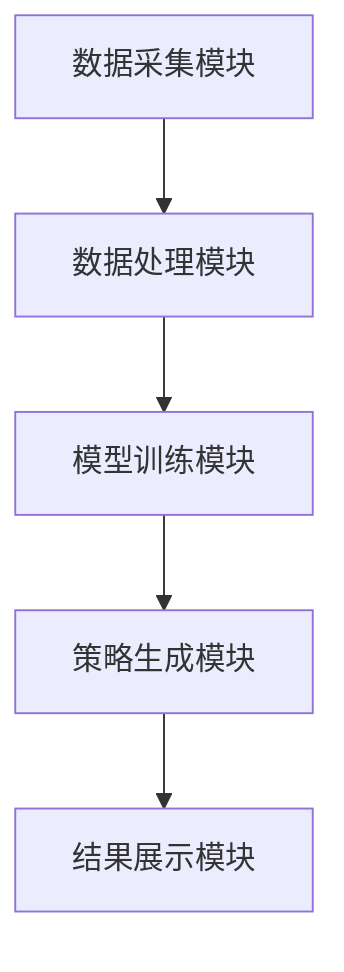

                 


# 构建智能化的个人退休金投资组合动态调整助手

## 关键词：智能化投资组合、动态调整、机器学习、退休金投资、金融风险管理

## 摘要：  
随着金融市场日益复杂化和个体退休规划需求的增加，智能化投资组合动态调整成为实现个人退休金保值增值的重要手段。本文通过详细分析智能化投资组合的核心概念、数学模型、算法原理、系统架构设计及项目实战，为读者提供一套构建智能化退休金投资组合动态调整助手的完整解决方案。文章结合理论与实践，深入探讨了机器学习在金融投资中的应用，并通过实际案例分析展示了如何利用智能化方法优化投资组合，确保退休金的长期稳健增长。

---

## 第1章：智能化个人退休金投资组合的背景与意义

### 1.1 退休金投资的重要性

#### 1.1.1 退休金投资的基本概念  
退休金是个人在退休后的主要收入来源之一，其投资管理直接关系到退休生活质量。退休金投资的基本目标是在风险可控的前提下实现资产的保值与增值。随着通货膨胀和市场波动的影响，定期调整投资组合是确保退休金长期稳健增长的关键。

#### 1.1.2 退休金投资的目标与挑战  
退休金投资的目标包括：  
1. **保值与增值**：在通货膨胀背景下，确保资金的实际购买力不下降。  
2. **风险控制**：避免因市场波动导致的重大损失。  
3. **资产配置优化**：根据市场变化和个人风险偏好，动态调整资产配置比例。  

然而，传统的人工投资组合管理存在以下挑战：  
1. **信息滞后**：人工决策依赖于历史数据，难以及时捕捉市场变化。  
2. **情绪干扰**：投资者的非理性决策（如过度恐慌或贪婪）会影响投资效果。  
3. **计算复杂性**：复杂的资产配置计算需要大量时间和资源。  

#### 1.1.3 智能化投资的优势  
智能化投资通过机器学习和大数据分析，能够实时捕捉市场信号，快速计算最优资产配置，从而实现投资组合的动态调整。其优势包括：  
1. **高效性**：算法可以在短时间内完成复杂计算。  
2. **准确性**：基于历史数据和市场规律，提供科学的投资建议。  
3. **适应性**：能够根据市场变化和个体需求实时调整策略。  

### 1.2 个人退休金投资组合动态调整的需求

#### 1.2.1 投资组合动态调整的必要性  
投资组合动态调整是指根据市场环境和个人财务状况的变化，定期优化资产配置的过程。动态调整的必要性体现在：  
1. **应对市场变化**：不同资产类别的表现会随市场波动而变化，动态调整可以捕捉市场机会。  
2. **适应个人需求**：随着退休计划的变化（如提前退休或延长工作时间），投资策略需要相应调整。  
3. **风险管理**：通过动态调整，降低单一资产波动对整体投资组合的影响。  

#### 1.2.2 传统投资组合管理的局限性  
传统投资组合管理依赖于人工分析和经验判断，存在以下局限性：  
1. **主观性**：投资决策容易受到主观因素（如情绪）的影响。  
2. **效率低下**：人工计算复杂，难以快速响应市场变化。  
3. **缺乏个性化**：传统方法难以满足每个人的个性化需求。  

#### 1.2.3 智能化调整的潜在价值  
智能化调整通过机器学习和自动化技术，能够实现投资组合的实时优化。其潜在价值包括：  
1. **提高投资效率**：算法可以快速计算最优资产配置。  
2. **降低人为错误**：通过自动化决策减少人为失误。  
3. **个性化服务**：可以根据个人风险偏好和财务状况提供定制化建议。  

---

## 第2章：智能化投资组合的核心概念

### 2.1 机器学习在投资组合管理中的应用

#### 2.1.1 机器学习的基本概念  
机器学习是一种人工智能技术，通过训练模型从数据中学习规律，并用于预测或决策。在投资组合管理中，机器学习可以用于：  
1. **市场预测**：预测股票价格、利率变化等市场走势。  
2. **风险评估**：评估投资组合的风险敞口。  
3. **资产配置**：优化资产配置比例。  

#### 2.1.2 机器学习在金融领域的应用案例  
以下是一些机器学习在金融领域的典型应用：  
1. **股票价格预测**：利用LSTM网络预测股票价格走势。  
2. **风险管理**：通过聚类分析识别市场风险。  
3. **信用评分**：使用随机森林模型评估客户的信用风险。  

#### 2.1.3 智能化投资组合的核心算法  
智能化投资组合的核心算法包括：  
1. **回归算法**：用于预测资产收益。  
2. **聚类算法**：用于识别市场趋势。  
3. **强化学习**：用于动态调整投资策略。  

### 2.2 投资组合动态调整的原理

#### 2.2.1 投资组合调整的基本原理  
投资组合调整的基本原理是通过优化算法，在给定风险承受能力下，找到最优的资产配置比例，以最大化预期收益或最小化风险。  

#### 2.2.2 传统投资组合管理的局限性  
传统投资组合管理依赖于历史数据和静态模型，难以适应市场变化。  

#### 2.2.3 智能化调整的数学模型  
智能化调整的数学模型包括：  
1. **均值-方差模型**：用于优化资产配置比例。  
2. **马科维茨投资组合理论**：通过数学优化找到最优投资组合。  

---

## 第3章：智能化投资组合的数学模型与算法

### 3.1 投资组合优化的数学模型

#### 3.1.1 均值-方差模型  
均值-方差模型是投资组合优化的经典模型，目标是最小化投资组合的方差（即风险），在给定收益下，或在给定风险下，最大化收益。  

数学公式如下：  
$$ \min_{w} \sigma^2 = w^T \Sigma w $$  
$$ \text{subject to} \quad w^T \mu = \text{target return} $$  
其中，$w$ 是资产权重向量，$\mu$ 是资产收益均值向量，$\Sigma$ 是资产收益的协方差矩阵。  

#### 3.1.2 资本资产定价模型（CAPM）  
CAPM用于评估资产的预期收益，公式为：  
$$ E(R_i) = R_f + \beta_i (R_m - R_f) $$  
其中，$E(R_i)$ 是资产$ i $的预期收益，$R_f$ 是无风险利率，$\beta_i$ 是资产$ i $的贝塔系数，$R_m$ 是市场预期收益。  

#### 3.1.3 其他优化模型  
除了均值-方差模型和CAPM，还有马科维茨的有效前沿模型、风险中性模型等。  

### 3.2 机器学习算法在投资组合调整中的应用

#### 3.2.1 线性回归模型  
线性回归模型用于预测资产收益，公式为：  
$$ y = \beta_0 + \beta_1 x_1 + \beta_2 x_2 + \dots + \beta_n x_n + \epsilon $$  
其中，$y$ 是目标变量（如收益），$x_i$ 是自变量（如市场指数）。  

#### 3.2.2 支持向量机（SVM）  
SVM用于分类和回归，可以用于预测资产的涨跌趋势。  

#### 3.2.3 随机森林与梯度提升树  
随机森林和梯度提升树用于特征重要性分析和预测。  

### 3.3 算法实现与优化

#### 3.3.1 算法选择的策略  
选择算法时需要考虑数据特征、模型复杂度和计算资源。  

#### 3.3.2 算法优化与调参  
通过交叉验证和网格搜索优化模型参数。  

#### 3.3.3 算法的可解释性与鲁棒性  
模型的可解释性通过特征重要性分析实现，鲁棒性通过交叉验证和模型集成提升。  

---

## 第4章：智能化投资组合的系统架构设计

### 4.1 系统整体架构

#### 4.1.1 系统模块划分  
系统模块包括数据采集、数据处理、模型训练、策略生成和结果展示。  

#### 4.1.2 系统功能流程  
数据采集 → 数据处理 → 模型训练 → 策略生成 → 结果展示。  

#### 4.1.3 系统架构图（Mermaid）



### 4.2 数据流与接口设计

#### 4.2.1 数据采集模块  
负责从金融市场数据源（如Yahoo Finance）获取实时数据。  

#### 4.2.2 数据处理模块  
对数据进行清洗、标准化和特征工程。  

#### 4.2.3 算法执行模块  
执行投资组合优化算法并生成调整策略。  

#### 4.2.4 结果展示模块  
将调整结果以可视化形式展示给用户。  

---

## 第5章：智能化投资组合的项目实战

### 5.1 项目环境搭建

#### 5.1.1 开发工具安装  
安装Python、Jupyter Notebook、Pandas、NumPy、Scikit-learn等工具。  

#### 5.1.2 数据源获取  
从Yahoo Finance获取历史数据。  

#### 5.1.3 环境配置  
安装必要的库并配置开发环境。  

### 5.2 核心算法实现

#### 5.2.1 数据预处理代码  
```python
import pandas as pd
import numpy as np

# 读取数据
data = pd.read_csv('data.csv')
# 数据清洗
data = data.dropna()
# 标准化
from sklearn.preprocessing import StandardScaler
scaler = StandardScaler()
data_scaled = scaler.fit_transform(data)
```

#### 5.2.2 算法实现代码  
使用随机森林模型预测资产收益：  
```python
from sklearn.ensemble import RandomForestRegressor
model = RandomForestRegressor(n_estimators=100, random_state=42)
model.fit(X_train, y_train)
```

#### 5.2.3 结果分析代码  
```python
from sklearn.metrics import mean_squared_error
y_pred = model.predict(X_test)
print(mean_squared_error(y_test, y_pred))
```

### 5.3 实际案例分析

#### 5.3.1 数据集介绍  
使用过去5年的股票数据进行分析。  

#### 5.3.2 算法应用与结果解读  
通过随机森林模型预测股票收益，并优化投资组合。  

#### 5.3.3 案例总结与优化建议  
根据模型预测结果，动态调整资产配置比例，实现收益最大化。  

---

## 第6章：最佳实践与注意事项

### 6.1 智能化投资组合管理的注意事项

#### 6.1.1 数据质量的重要性  
确保数据的完整性和准确性。  

#### 6.1.2 模型的可解释性  
避免使用过于复杂的模型，确保模型可解释。  

#### 6.1.3 风险管理策略  
制定合理的风险管理策略，控制投资风险。  

### 6.2 项目实施中的常见问题与解决方案

#### 6.2.1 数据不足的处理方法  
通过数据增强和特征工程提升数据质量。  

#### 6.2.2 模型过拟合的解决策略  
使用交叉验证和正则化方法防止过拟合。  

#### 6.2.3 性能优化的技巧  
通过并行计算和模型优化提升性能。  

---

## 小结

智能化个人退休金投资组合动态调整助手通过机器学习和数学优化，能够实时捕捉市场变化，优化资产配置，帮助个人实现退休金的长期稳健增长。本文从背景、概念、算法、系统架构到项目实战，为读者提供了一套完整的解决方案。希望本文能为读者在构建智能化投资组合方面提供有价值的参考。

---

## 作者：AI天才研究院/AI Genius Institute & 禅与计算机程序设计艺术 /Zen And The Art of Computer Programming

