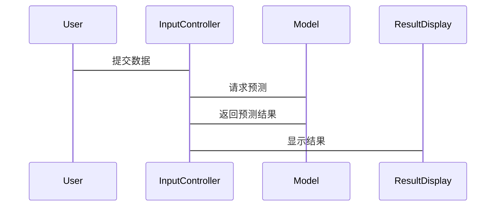

                 


# 构建智能化的个人退休金缺口分析助手

> 关键词：退休金缺口分析，人工智能，财务规划，投资预测，风险管理

> 摘要：随着人口老龄化的加剧，个人退休金缺口问题日益凸显。本文旨在探讨如何利用人工智能技术构建智能化的退休金缺口分析助手，帮助用户准确评估退休金需求，优化财务规划，并通过实例分析展示其实现和应用。

---

# 第一部分：退休金缺口分析的背景与核心概念

## 第1章：退休金缺口分析的背景与问题描述

### 1.1 退休金缺口分析的背景
- **1.1.1 人口老龄化与退休金需求的变化**  
  全球范围内，人口老龄化问题日益严重，退休人口增加，传统的退休金体系面临巨大压力。个人退休金缺口问题也随之凸显，如何通过智能化手段解决这一问题成为关注焦点。

- **1.1.2 传统退休金计算方法的局限性**  
  传统方法通常基于固定利率和简单假设，难以应对通货膨胀和投资收益波动带来的不确定性。个人财务状况和生活开支的多样性也使得统一的退休金计算方法难以满足实际需求。

- **1.1.3 智能化分析工具的必要性**  
  随着人工智能技术的发展，利用机器学习和大数据分析可以更精确地预测退休金需求，优化投资组合，帮助个人有效管理退休金缺口。

### 1.2 退休金缺口分析的核心问题
- **1.2.1 退休金需求的定义与计算**  
  退休金需求包括基本生活开支、医疗费用、旅游及其他兴趣支出等，需根据个人实际情况进行个性化计算。

- **1.2.2 当前收入与未来支出的差距**  
  需要考虑通货膨胀对生活成本的影响，预测未来支出，并与退休后收入进行对比，找出缺口。

- **1.2.3 投资收益与通货膨胀的影响**  
  投资收益可以弥补退休金缺口，但需考虑通货膨胀对购买力的侵蚀，选择合适的资产配置策略至关重要。

### 1.3 退休金缺口分析的解决思路
- **1.3.1 数据驱动的分析方法**  
  利用大数据分析技术，收集和整合用户的财务数据，建立精准的退休金需求模型。

- **1.3.2 AI技术在退休金规划中的应用**  
  通过机器学习算法预测投资收益和支出需求，优化退休金储备和投资组合。

- **1.3.3 个性化与智能化的结合**  
  根据用户的财务状况、风险偏好和生活目标，提供个性化的退休金缺口分析和优化建议。

### 1.4 退休金缺口分析的边界与外延
- **1.4.1 分析范围的界定**  
  退休金缺口分析通常不包括遗产规划和非财务支出（如遗产税），主要关注基本生活需求和财务安全。

- **1.4.2 相关概念的扩展**  
  包括退休后健康管理、长期护理费用等，这些因素会影响整体退休金需求。

- **1.4.3 边界条件的处理**  
  在分析中需明确假设条件，如通货膨胀率、预期寿命、投资回报率等，并根据实际情况进行调整。

### 1.5 本章小结
本章从背景、核心问题和解决思路三个方面，详细介绍了退休金缺口分析的重要性及其在智能化工具中的应用。明确了边界条件和外延，为后续的算法设计和系统实现奠定了基础。

---

## 第2章：智能化退休金缺口分析的核心概念与联系

### 2.1 核心概念的定义与属性
- **数据模型**：用于描述用户财务状况的数学模型，包括收入、支出、资产等变量。
- **算法模型**：基于机器学习的预测模型，用于估算退休金需求和投资收益。
- **决策模型**：根据分析结果，提供优化建议的策略模型。

### 2.2 核心概念的对比分析
| 概念 | 数据模型 | 算法模型 | 决策模型 |
|------|----------|----------|----------|
| 定义 | 描述用户财务状况的结构 | 预测退休金需求和投资收益的算法 | 提供优化建议的策略 | 
| 输入 | 用户数据 | 历史数据和参数 | 分析结果和目标 |
| 输出 | 数据预处理结果 | 预测值和置信区间 | 优化策略和建议 |

### 2.3 实体关系图


### 2.4 本章小结
通过对比分析和实体关系图，明确了智能化退休金缺口分析的核心概念及其相互关系，为后续的算法设计和系统实现提供了理论基础。

---

## 第3章：数据预处理与特征工程

### 3.1 数据预处理方法
- **数据清洗**：去除无效数据、填补缺失值、处理异常值。
- **数据标准化**：将不同量纲的数据进行标准化处理，便于模型训练。
- **特征选择**：根据业务需求和模型表现，选择重要的特征变量。

### 3.2 数据特征工程
- **特征提取**：从用户数据中提取有用的特征，如年龄、收入、支出等。
- **特征变换**：对数据进行变换，如对数变换、标准化等，以提高模型性能。
- **特征组合**：将多个特征进行组合，形成新的特征，丰富数据信息。

### 3.3 数据预处理代码示例
```python
import pandas as pd
import numpy as np

# 数据清洗
df = pd.read_csv('user_data.csv')
df.dropna(inplace=True)  # 删除缺失值
df.replace({'income': {0: np.nan}}, inplace=True)  # 填补异常值
df = df[df['age'] > 25]  # 删除不符合条件的数据

# 数据标准化
from sklearn.preprocessing import StandardScaler

scaler = StandardScaler()
df_scaled = pd.DataFrame(scaler.fit_transform(df), columns=df.columns)

# 特征选择
from sklearn.ensemble import RandomForestRegressor
model = RandomForestRegressor()
model.fit(df_scaled, target)
importances = model.feature_importances_
selected_features = [features[i] for i in range(len(features)) if importances[i] > 0.05]
```

### 3.4 本章小结
本章通过数据预处理和特征工程，为后续的模型训练提供了高质量的数据支持，为智能化退休金缺口分析奠定了基础。

---

## 第4章：算法原理与实现

### 4.1 算法选择与原理
- **回归分析**：用于预测退休金需求和投资收益。
- **决策树**：用于分类和预测，帮助识别关键特征变量。
- **随机森林**：通过集成学习提高模型的准确性和稳定性。

### 4.2 算法实现流程
1. 数据预处理：清洗和标准化数据。
2. 模型训练：使用训练数据训练模型。
3. 模型评估：通过交叉验证评估模型性能。
4. 模型优化：调整参数，提高预测精度。

### 4.3 算法代码实现
```python
from sklearn.ensemble import RandomForestRegressor
from sklearn.model_selection import train_test_split

# 数据分割
X_train, X_test, y_train, y_test = train_test_split(df_scaled, target, test_size=0.2)

# 模型训练
model = RandomForestRegressor(n_estimators=100, max_depth=10, random_state=42)
model.fit(X_train, y_train)

# 模型评估
from sklearn.metrics import mean_squared_error

y_pred = model.predict(X_test)
mse = mean_squared_error(y_test, y_pred)
rmse = np.sqrt(mse)
print(f"RMSE: {rmse}")
```

### 4.4 算法优化与调参
- **参数选择**：通过网格搜索（Grid Search）找到最佳参数组合。
- **模型集成**：使用投票分类器或堆叠模型进一步提高预测精度。

### 4.5 本章小结
本章详细介绍了算法的选择、实现和优化过程，为智能化退休金缺口分析提供了技术支撑。

---

## 第5章：数学模型与公式推导

### 5.1 退休金缺口计算公式
$$
\text{退休金缺口} = \max(0, \text{退休后需求} - \text{退休金供给})
$$

其中，退休金供给包括基本养老金、储蓄和投资收益。

### 5.2 投资收益预测模型
$$
\text{投资收益} = \sum_{t=1}^{n} \text{投资金额}_t \times (1 + r_t)^t
$$
其中，\( r_t \) 是第 \( t \) 年的投资回报率。

### 5.3 现金流分析模型
$$
\text{现金流} = \text{初始资金} + \sum_{t=1}^{T} \text{净流入}_t
$$
其中，\( T \) 是退休后的年数，\( \text{净流入}_t \) 是第 \( t \) 年的净现金流。

### 5.4 本章小结
通过数学公式推导，明确了退休金缺口分析的关键指标和计算方法，为智能化工具的实现提供了理论依据。

---

## 第6章：系统架构与设计

### 6.1 系统功能设计
- **用户输入**：收集用户的基本信息和财务数据。
- **数据处理**：进行数据清洗和特征工程。
- **模型预测**：基于训练好的模型预测退休金缺口。
- **结果展示**：生成可视化报告，提供优化建议。

### 6.2 系统架构设计


### 6.3 接口设计
- **RESTful API**：提供HTTP接口，方便前端调用。
- **数据接口**：与第三方数据源（如银行、投资平台）对接，获取实时数据。

### 6.4 交互流程图


### 6.5 本章小结
本章详细描述了系统的功能设计和架构设计，为后续的开发和实现提供了清晰的指导。

---

## 第7章：项目实战与案例分析

### 7.1 项目环境安装
```bash
pip install numpy pandas scikit-learn matplotlib
```

### 7.2 核心代码实现
```python
import pandas as pd
from sklearn.ensemble import RandomForestRegressor
from sklearn.model_selection import train_test_split

# 数据加载与处理
df = pd.read_csv('user_data.csv')
target = df['retire_gap']

# 数据分割
X_train, X_test, y_train, y_test = train_test_split(df.drop('retire_gap', axis=1), target, test_size=0.2)

# 模型训练
model = RandomForestRegressor()
model.fit(X_train, y_train)

# 模型预测
y_pred = model.predict(X_test)
print("预测结果:", y_pred)
```

### 7.3 实际案例分析
**案例背景**：用户A，40岁，年收入10万元，希望60岁退休，预计寿命80岁，当前储蓄50万元，年支出8万元。

**分析结果**：
- 预测退休金缺口：20万元。
- 投资建议：将当前储蓄投资于年化收益6%的资产，缺口将在退休前10年填补。

### 7.4 案例解读
- **缺口计算**：基于当前数据，用户A的退休金缺口为20万元。
- **投资建议**：通过每年增加储蓄和优化投资组合，可以在退休前消除缺口。

### 7.5 本章小结
通过实际案例分析，展示了智能化退休金缺口分析助手的应用价值和实际操作步骤。

---

## 第8章：最佳实践与注意事项

### 8.1 小结
智能化退休金缺口分析助手通过大数据和人工智能技术，帮助用户准确评估退休金需求，优化财务规划。

### 8.2 注意事项
- **数据隐私**：确保用户数据的安全和隐私。
- **模型局限**：算法预测存在不确定性，需结合实际情况进行调整。
- **用户教育**：加强对用户的财务知识教育，帮助其正确使用工具。

### 8.3 未来趋势
- **多模态分析**：结合行为数据和情感分析，提供更个性化的服务。
- **实时监控**：实时跟踪财务状况，动态调整退休金计划。

### 8.4 扩展阅读
推荐阅读《智能财务规划》和《机器学习在金融领域的应用》，深入了解相关技术细节。

### 8.5 本章小结
本章总结了项目的实施经验，提出了使用智能化退休金缺口分析助手时的注意事项和未来发展方向。

---

# 作者

作者：AI天才研究院/AI Genius Institute & 禅与计算机程序设计艺术 /Zen And The Art of Computer Programming

