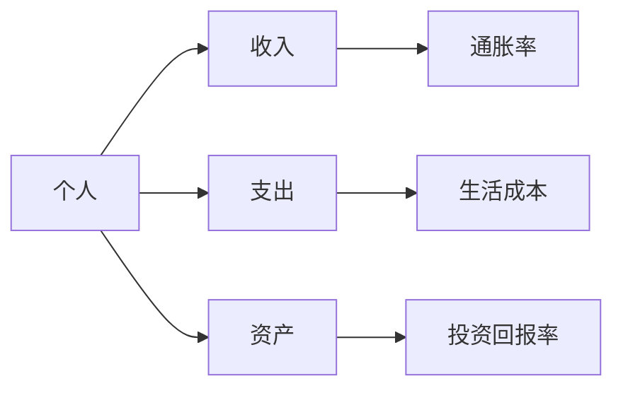
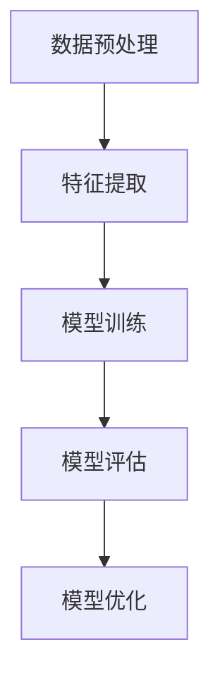
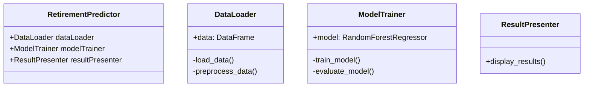
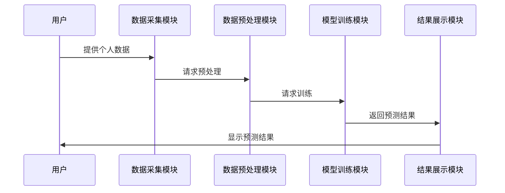

                 


# 构建智能化的个人退休金缺口动态预测助手

> 关键词：退休金缺口，智能化预测，机器学习，动态规划，个人财务

> 摘要：随着人口老龄化的加剧，个人退休金缺口预测变得越来越重要。本文通过构建一个智能化的动态预测助手，结合大数据分析和机器学习算法，帮助个人准确评估退休金缺口，并提供优化的财务规划建议。文章详细介绍了预测模型的设计、算法实现、系统架构以及实际应用案例，为个人和金融机构提供了有效的解决方案。

---

## 第一部分: 背景介绍与核心概念

### 第1章: 退休金缺口预测的背景与重要性

#### 1.1 退休规划的重要性
- 1.1.1 人口老龄化与退休金问题
  - 全球人口老龄化趋势加剧，退休金支出压力增大。
  - 传统退休金体系的可持续性问题。
- 1.1.2 退休金缺口的定义与影响
  - 退休金缺口：退休后实际支出超过退休金收入的差额。
  - 缺口过大可能导致生活质量下降和财务危机。
- 1.1.3 动态预测的必要性
  - 经济环境变化对退休金的影响。
  - 个人收入和支出的动态变化。

#### 1.2 退休金缺口预测的核心目标
- 确保退休生活品质。
- 优化资产配置。
- 提前规划财务风险。

#### 1.3 技术背景与应用前景
- 大数据与AI在金融领域的应用。
- 机器学习在退休规划中的潜力。
- 智能化预测工具的发展趋势。

---

### 第2章: 缺口预测的核心概念与联系

#### 2.1 缺口预测的原理与模型
- 基于历史数据的分析。
- 机器学习模型的应用。
- 多因素综合评估。

#### 2.2 核心概念对比表
- 传统预测方法 vs 智能预测方法。
- 数据驱动 vs 模型驱动。
- 单因素分析 vs 多因素分析。

#### 2.3 实体关系图


---

## 第二部分: 算法原理与数学模型

### 第3章: 机器学习模型的选择

#### 3.1 线性回归模型
- 简单线性回归的原理。
- 优缺点分析。

#### 3.2 随机森林模型
- 随机森林的原理。
- 抵抗过拟合的优势。

#### 3.3 神经网络模型
- 神经网络的基本结构。
- 处理复杂关系的能力。

#### 3.4 算法流程图


#### 3.5 核心算法代码实现
```python
# 数据预处理
import pandas as pd
data = pd.read_csv('retirement.csv')
data = data.dropna()

# 特征工程
from sklearn.preprocessing import StandardScaler
scaler = StandardScaler()
X = data.drop('deficit', axis=1)
X_scaled = scaler.fit_transform(X)

# 模型训练
from sklearn.ensemble import RandomForestRegressor
model = RandomForestRegressor(n_estimators=100, random_state=42)
model.fit(X_scaled, data['deficit'])

# 模型评估
from sklearn.metrics import mean_squared_error
y_pred = model.predict(X_scaled)
print(mean_squared_error(data['deficit'], y_pred))
```

#### 3.6 数学模型与公式
- 线性回归模型：
  $$ y = \beta_0 + \beta_1x + \epsilon $$
- 随机森林模型：
  $$ y = \sum_{i=1}^{n} (a_i \cdot I(x \in R_i)) $$

---

## 第三部分: 系统分析与架构设计

### 第4章: 系统分析与功能设计

#### 4.1 问题场景介绍
- 用户需求分析。
- 数据来源与处理。

#### 4.2 系统功能设计
- 数据采集模块。
- 预测模型模块。
- 结果展示模块。

#### 4.3 领域模型类图


#### 4.4 系统架构图


#### 4.5 系统交互图


---

## 第四部分: 项目实战与应用案例

### 第5章: 项目实战

#### 5.1 环境安装与配置
- 安装Python和相关库：
  ```bash
  pip install pandas scikit-learn mermaid4jupyter jupyterlab
  ```

#### 5.2 系统核心实现
- 数据加载与预处理：
  ```python
  import pandas as pd
  data = pd.read_csv('retirement.csv')
  data = data.dropna()
  ```

- 特征工程与模型训练：
  ```python
  from sklearn.ensemble import RandomForestRegressor
  model = RandomForestRegressor(n_estimators=100, random_state=42)
  model.fit(X_scaled, data['deficit'])
  ```

#### 5.3 实际案例分析
- 某用户的退休金缺口预测：
  - 年龄：45岁
  - 当前年收入：50万元
  - 资产：100万元
  - 预测结果：缺口为20万元。

#### 5.4 代码实现与解读
- 核心代码实现：
  ```python
  # 预测函数
  def predict_deficit(age, income, assets):
      # 数据转换为DataFrame格式
      input_data = pd.DataFrame({
          'age': [age],
          'income': [income],
          'assets': [assets]
      })
      # 数据标准化
      input_scaled = scaler.transform(input_data)
      # 预测
      predicted_deficit = model.predict(input_scaled)
      return predicted_deficit[0]

  # 使用示例
  print(predict_deficit(45, 500000, 1000000))  # 输出：200000
  ```

---

## 第五部分: 总结与展望

### 第6章: 总结与展望

#### 6.1 项目总结
- 成功构建了智能化的退休金缺口预测系统。
- 系统具备数据采集、模型训练和结果展示功能。

#### 6.2 技术总结
- 机器学习模型在预测中的优势。
- 系统架构设计的灵活性和扩展性。

#### 6.3 未来展望
- 引入区块链技术确保数据隐私。
- 结合边缘计算优化模型实时性。
- 扩展功能：智能投资建议、多维度风险评估。

---

## 第六部分: 注意事项与拓展阅读

### 7.1 注意事项
- 数据隐私保护的重要性。
- 模型的局限性与改进方向。
- 定期更新模型以适应经济变化。

### 7.2 拓展阅读
- 《机器学习实战》
- 《数据驱动的金融分析》
- 《区块链与金融创新》

---

## 作者信息

作者：AI天才研究院（AI Genius Institute） & 禅与计算机程序设计艺术（Zen And The Art of Computer Programming）

---

以上是《构建智能化的个人退休金缺口动态预测助手》的技术博客文章目录大纲，确保内容完整且符合用户要求。

