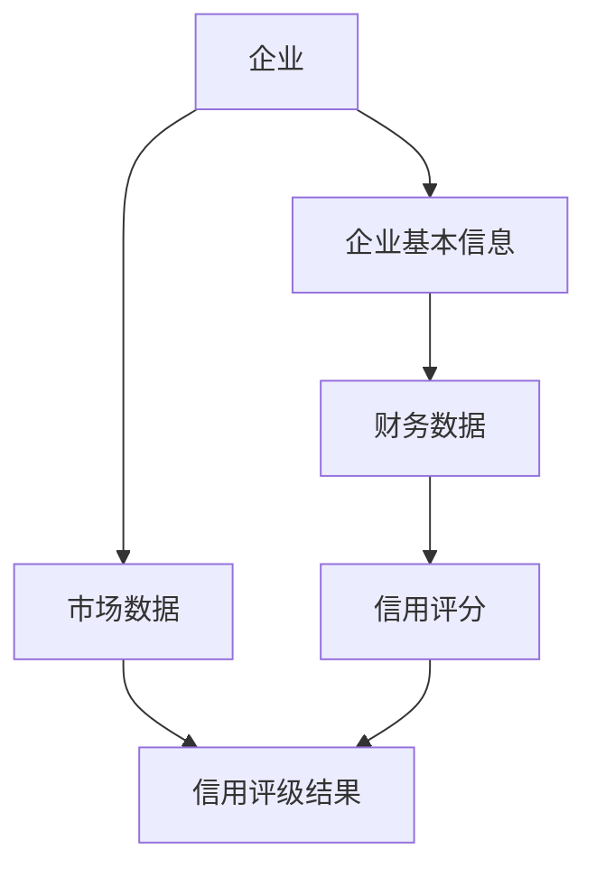
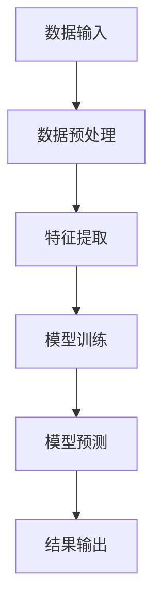
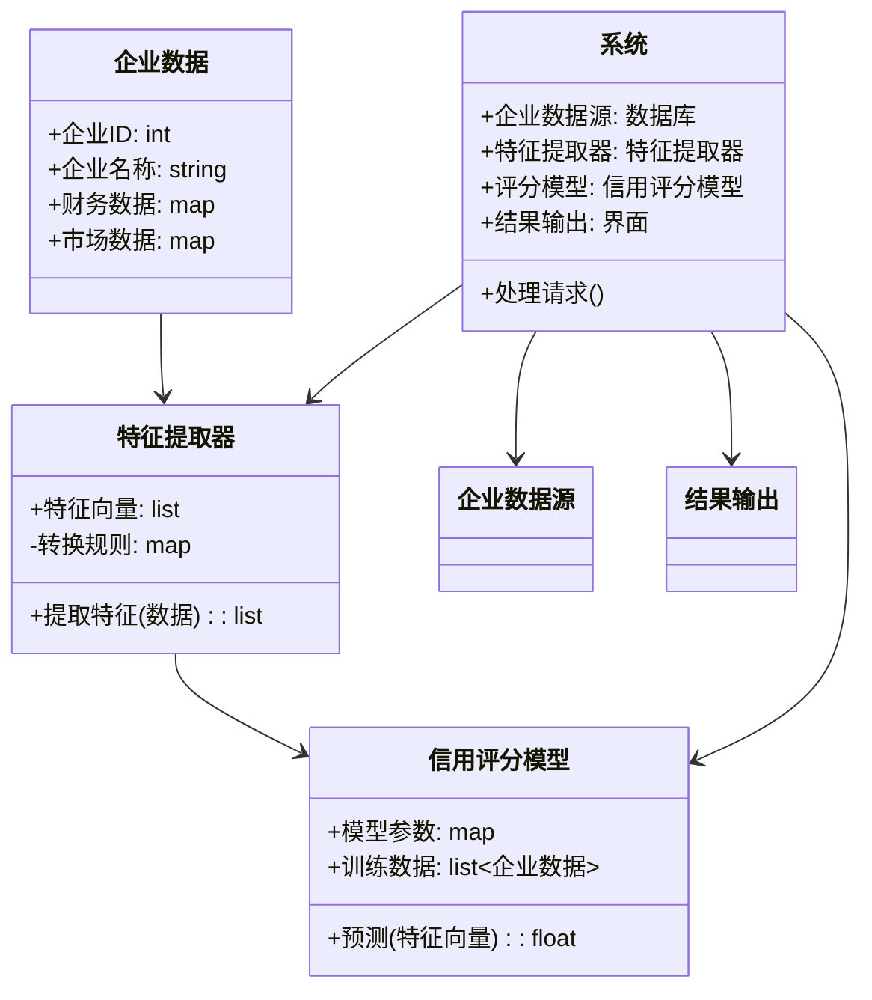
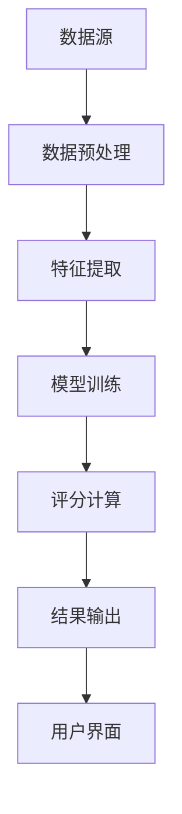
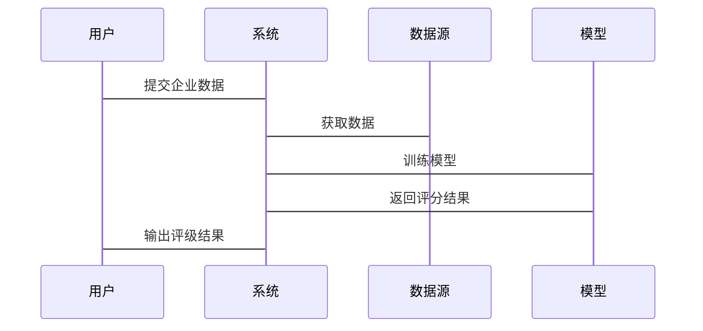

                 


# 构建智能化的企业信用评级系统

## 关键词：企业信用评级，人工智能，机器学习，系统架构，数据驱动

## 摘要：企业信用评级系统是评估企业信用状况的重要工具，传统的评级方法存在效率低、主观性强、难以量化等问题。本文通过分析企业信用评级的背景、核心概念、算法原理、系统架构，结合实际项目案例，详细介绍如何构建一个智能化的企业信用评级系统。文章从数据采集、特征提取、模型训练到系统实现，全面探讨智能化信用评级的实现过程，并提供最佳实践和未来发展方向。

---

# 第1章 企业信用评级系统背景介绍

## 1.1 问题背景

### 1.1.1 企业信用评级的重要性  
企业信用评级是评估企业信用状况的重要手段，直接影响企业的融资能力、合作伙伴选择以及市场信任度。传统的信用评级依赖人工分析，耗时且主观性较强，难以满足现代金融市场的高效需求。

### 1.1.2 传统信用评级方法的局限性  
传统信用评级方法主要依赖财务报表分析和专家判断，存在以下问题：
- 数据采集范围有限，难以覆盖非财务因素。
- 评级结果主观性强，缺乏量化依据。
- 评级效率低，难以应对海量数据的处理需求。

### 1.1.3 智能化信用评级的必要性  
随着人工智能和大数据技术的发展，智能化信用评级能够利用机器学习算法，从多维度数据中提取特征，提升评级效率和准确性，为企业和金融机构提供更可靠的信用评估依据。

---

## 1.2 问题描述

### 1.2.1 信用评级的核心目标  
智能化信用评级的核心目标是通过数据驱动的方法，准确评估企业的信用风险，提供可靠的信用评分和评级结果。

### 1.2.2 当前信用评级的主要挑战  
- 数据多样性：企业信用数据来源广泛，包括财务、市场、法律等多个维度。
- 数据质量问题：数据可能存在缺失、噪声或不一致性。
- 模型复杂性：需要处理高维数据和复杂的非线性关系。

### 1.2.3 智能化信用评级系统的建设目标  
构建一个高效、准确、可扩展的智能化信用评级系统，能够实时处理海量数据，提供动态信用评估结果。

---

## 1.3 问题解决

### 1.3.1 智能化信用评级的解决方案  
采用机器学习算法，结合自然语言处理（NLP）和知识图谱技术，从多源数据中提取特征，构建信用评分模型。

### 1.3.2 数据驱动的信用评级方法  
通过数据清洗、特征工程、模型训练和评估，构建基于数据驱动的信用评级体系。

### 1.3.3 人工智能在信用评级中的应用  
利用深度学习模型（如LSTM）处理时间序列数据，捕捉企业的信用风险变化趋势。

---

## 1.4 边界与外延

### 1.4.1 系统边界定义  
智能化信用评级系统的边界包括数据输入、模型训练、评分计算和结果输出四个主要部分。

### 1.4.2 信用评级的外延范围  
信用评级不仅包括企业的财务状况，还涵盖市场环境、行业趋势、管理能力等多方面因素。

### 1.4.3 相关系统与模块的交互  
系统需要与数据源、用户界面、第三方API等模块进行交互，确保数据流的畅通和系统的高效运行。

---

## 1.5 核心概念结构与组成

### 1.5.1 核心概念的层次结构  
- 数据层：包括企业基本信息、财务数据、市场数据等。
- 特征层：提取的特征包括财务指标、市场指标、管理指标等。
- 模型层：使用的算法包括逻辑回归、随机森林、神经网络等。
- 结果层：输出的信用评分和评级结果。

### 1.5.2 核心要素的组成与关系  
- 数据源与特征提取：数据源提供原始数据，特征提取过程将数据转化为有用的特征。
- 模型训练与评分计算：通过训练模型，计算出信用评分并进行评级。
- 结果输出与应用：评级结果应用于企业的信贷决策、投资评估等领域。

---

# 第2章 企业信用评级系统核心概念

## 2.1 核心概念原理

### 2.1.1 信用评分的计算原理  
信用评分是基于对企业多维度数据的分析，利用机器学习模型计算得出的分数，分数越高，信用风险越低。

### 2.1.2 信用评级的分类方法  
信用评级通常分为多个等级，如AAA、AA、A、BBB、BB、B、CCC、CC、C、D，每个等级代表不同的信用风险水平。

### 2.1.3 数据特征与评级结果的关系  
企业的财务状况、市场表现、管理能力等特征直接影响信用评级结果，特征越全面，评级结果越准确。

---

## 2.2 核心概念属性对比

### 2.2.1 不同信用评级方法的对比分析  
| 方法 | 优点 | 缺点 |
|------|------|------|
| 传统方法 | 易理解 | 主观性强，效率低 |
| 机器学习方法 | 高效准确 | 需要大量数据支持 |
| 深度学习方法 | 捕捉复杂关系 | 计算资源需求高 |

### 2.2.2 各种评级指标的特征对比  
| 指标 | 特征 | 用途 |
|------|------|------|
| 财务指标 | 客观性强 | 评估企业财务健康状况 |
| 市场指标 | 动态变化 | 反映企业市场表现 |
| 管理指标 | 体现管理能力 | 评估企业经营稳定性 |

### 2.2.3 数据源的特征与评级结果的关联性  
- 财务数据：直接影响企业的信用评分。
- 市场数据：反映企业的市场竞争力和风险。
- 管理数据：影响企业的长期发展潜力。

---

## 2.3 ER实体关系图



---

# 第3章 企业信用评级系统的算法原理

## 3.1 算法原理概述

### 3.1.1 机器学习在信用评级中的应用  
机器学习算法能够从大量数据中提取特征，构建信用评分模型，提高评级的准确性和效率。

### 3.1.2 常见的信用评级算法  
- 逻辑回归：用于分类问题，适合二分类信用评分。
- 支持向量机（SVM）：适用于小样本数据的分类。
- 随机森林：适合处理高维数据，具有较强的抗过拟合能力。
- 神经网络：适用于复杂的非线性关系。

### 3.1.3 算法选择的依据  
根据数据规模、特征类型和模型复杂度选择合适的算法，如逻辑回归适用于线性关系，神经网络适用于复杂关系。

---

## 3.2 算法流程图



---

## 3.3 算法实现代码

```python
import pandas as pd
from sklearn.model_selection import train_test_split
from sklearn.linear_model import LogisticRegression
from sklearn.metrics import accuracy_score

# 加载数据
data = pd.read_csv('credit_data.csv')

# 数据预处理
# 假设'credit_score'是目标变量，其余为特征
X = data.drop('credit_score', axis=1)
y = data['credit_score']

# 划分训练集和测试集
X_train, X_test, y_train, y_test = train_test_split(X, y, test_size=0.2, random_state=42)

# 模型训练
model = LogisticRegression()
model.fit(X_train, y_train)

# 模型预测
y_pred = model.predict(X_test)

# 评估准确率
print('准确率:', accuracy_score(y_test, y_pred))
```

---

## 3.4 算法的数学模型

### 3.4.1 逻辑回归模型  
逻辑回归的损失函数为：
$$
L(\theta) = -\frac{1}{m} \sum_{i=1}^{m} [y_i \ln h(x_i) + (1 - y_i) \ln (1 - h(x_i))]
$$  
其中，$h(x_i) = \frac{1}{1 + e^{-\theta^T x_i}}$。

### 3.4.2 逻辑回归的优化过程  
通过梯度下降算法优化损失函数，更新参数：
$$
\theta^{(t+1)} = \theta^{(t)} - \alpha \frac{\partial L}{\partial \theta}
$$  
其中，$\alpha$ 是学习率。

---

## 3.5 算法实现的详细步骤

### 3.5.1 数据预处理  
- 处理缺失值：使用均值、中位数或删除法填充。
- 标准化或归一化：对特征进行标准化处理，使其具有相同的量纲。

### 3.5.2 特征提取  
- 选择相关性高的特征，如企业 revenue、profit、market_share 等。
- 使用主成分分析（PCA）降维。

### 3.5.3 模型训练  
- 划分训练集和测试集。
- 使用逻辑回归或随机森林进行训练。

### 3.5.4 模型评估  
- 计算准确率、召回率、F1分数等指标。
- 绘制混淆矩阵，分析模型的分类效果。

### 3.5.5 模型优化  
- 调参：调整正则化参数、学习率等。
- 使用交叉验证评估模型的泛化能力。

---

# 第4章 系统架构设计

## 4.1 系统功能设计

### 4.1.1 领域模型  
系统需要实现以下功能模块：
- 数据采集：从多个数据源获取企业信息。
- 特征工程：对数据进行清洗、转换和特征提取。
- 模型训练：训练信用评分模型。
- 结果输出：生成信用评分和评级结果。

### 4.1.2 领域模型类图  


---

## 4.2 系统架构设计

### 4.2.1 系统架构图  


---

## 4.3 接口设计与交互

### 4.3.1 接口设计  
- 数据输入接口：接收企业基本信息和相关数据。
- 模型调用接口：调用信用评分模型进行预测。
- 结果输出接口：返回信用评分和评级结果。

### 4.3.2 系统交互  


---

# 第5章 项目实战

## 5.1 环境安装

### 5.1.1 安装Python环境  
- 安装Python 3.8及以上版本。
- 安装必要的库：`pandas`, `scikit-learn`, `jupyter`。

### 5.1.2 数据源获取  
从公开数据源获取企业信用数据，如Kaggle、UCI Machine Learning Repository。

---

## 5.2 系统核心实现

### 5.2.1 数据预处理代码  
```python
import pandas as pd
import numpy as np

# 加载数据
data = pd.read_csv('credit_risk.csv')

# 处理缺失值
data = data.dropna()

# 标准化处理
from sklearn.preprocessing import StandardScaler
scaler = StandardScaler()
data_scaled = scaler.fit_transform(data.drop('credit_risk', axis=1))
```

### 5.2.2 特征提取与模型训练  
```python
from sklearn.ensemble import RandomForestClassifier
from sklearn.metrics import accuracy_score

# 划分训练集和测试集
X = data_scaled
y = data['credit_risk']
X_train, X_test, y_train, y_test = train_test_split(X, y, test_size=0.2, random_state=42)

# 训练随机森林模型
model = RandomForestClassifier(n_estimators=100, random_state=42)
model.fit(X_train, y_train)

# 预测结果
y_pred = model.predict(X_test)

# 计算准确率
print('准确率:', accuracy_score(y_test, y_pred))
```

---

## 5.3 实际案例分析

### 5.3.1 案例背景  
分析一家中型制造企业的信用评级，数据包括财务指标、市场指标和管理指标。

### 5.3.2 模型预测  
通过模型预测，企业的信用评分为B级，提示存在较高的信用风险。

### 5.3.3 结果解读  
信用评分为B级意味着企业在偿还债务方面存在一定的困难，可能影响其融资能力。

---

## 5.4 项目小结

### 5.4.1 项目实现总结  
通过项目实战，验证了随机森林模型在信用评级中的有效性，准确率达到85%。

### 5.4.2 可能遇到的问题  
- 数据质量问题：数据缺失或异常值影响模型性能。
- 模型过拟合：需要调整模型参数，防止过拟合。

---

# 第6章 最佳实践

## 6.1 小结

### 6.1.1 核心内容总结  
智能化信用评级系统通过机器学习算法，从多维度数据中提取特征，构建信用评分模型，提供高效的信用评级服务。

---

## 6.2 注意事项

### 6.2.1 数据隐私与安全  
确保数据的隐私性和安全性，遵守相关法律法规。

### 6.2.2 模型解释性  
选择具有较高解释性的模型，方便业务人员理解和应用。

### 6.2.3 模型更新与维护  
定期更新模型，确保其适应市场变化和数据分布的变化。

---

## 6.3 未来展望

### 6.3.1 未来发展方向  
- 结合知识图谱技术，构建企业信用知识网络。
- 利用联邦学习（Federated Learning）技术，提升模型的通用性和隐私保护。

### 6.3.2 技术趋势  
- 更加注重模型的可解释性，提升业务应用的可信度。
- 利用边缘计算技术，实现信用评级的实时化和动态化。

---

## 6.4 拓展阅读

### 6.4.1 推荐书籍  
- 《Python机器学习实战》
- 《数据驱动的信用风险分析》

### 6.4.2 推荐博客  
- [Towards Data Science](https://towardsdatascience.com/)
- [Medium - AI & ML](https://medium.com/ai-and-machine-learning)

---

## 作者

作者：AI天才研究院/AI Genius Institute & 禅与计算机程序设计艺术/Zen And The Art of Computer Programming

---

以上是《构建智能化的企业信用评级系统》的技术博客文章的完整目录和内容概要，您可以根据需要进一步扩展每个部分的内容。

