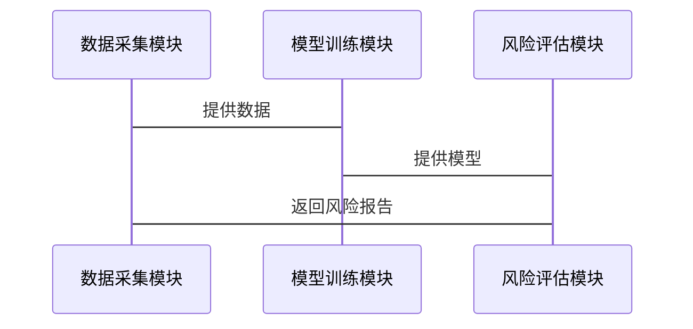

                 


# 构建智能化的企业信用风险传导模型

---

## 关键词：
企业信用风险、风险传导模型、智能化、机器学习、图论模型、系统架构、Python实现

---

## 摘要：
本文系统性地探讨了构建智能化企业信用风险传导模型的关键步骤和方法。首先，介绍了信用风险的基本概念、传导机制及其智能化的必要性；接着，详细分析了模型的核心概念、算法原理及系统架构；最后，通过实际案例展示了模型的实现过程和应用效果。文章内容涵盖理论、方法、系统设计和实战，旨在为读者提供一个全面的视角，帮助其理解并掌握智能化信用风险模型的构建方法。

---

# 第1章: 信用风险的基本概念与问题背景

## 1.1 信用风险的定义与特征
### 1.1.1 信用风险的定义
信用风险是指由于债务人或交易对手无法履行其 contractual obligations（合同义务）而导致的损失风险。在企业层面，信用风险主要体现在企业与供应商、客户、银行等外部主体的交易中。

### 1.1.2 信用风险的核心特征
- **主体性**：信用风险与具体交易主体的信用状况密切相关。
- **传染性**：信用风险可能通过供应链或金融市场传导至其他企业或机构。
- **复杂性**：涉及多种因素，如经济周期、行业风险、企业内部管理等。
- **可量化性**：通过数据和模型可以量化信用风险的大小和影响范围。

### 1.1.3 信用风险的分类与应用场景
- **企业信用风险**：主要涉及企业与企业、企业与银行之间的信用关系。
- **供应链信用风险**：企业与其供应商或客户的信用风险。
- **金融市场信用风险**：企业作为投资者或融资者面临的信用风险。
- **应用场景**：企业信贷审批、供应链金融、风险预警系统等。

## 1.2 企业信用风险传导的背景与问题描述
### 1.2.1 企业信用风险传导的定义
信用风险传导是指信用风险从一个企业（或机构）传递到另一个企业（或机构）的过程。这种传导可能通过直接的交易关系（如供应商-客户关系）或间接的市场关系（如金融市场）实现。

### 1.2.2 信用风险传导的机制与路径
- **直接传导**：通过供应链或直接的交易关系，如企业A违约影响企业B。
- **间接传导**：通过金融市场（如债券市场、股票市场）或中间机构（如银行、保险公司）实现。
- **系统性传导**：当多个企业同时面临信用风险时，可能导致系统性风险。

### 1.2.3 企业信用风险传导中的关键问题
- **风险识别**：如何准确识别企业的信用风险？
- **风险量化**：如何量化信用风险的大小和影响范围？
- **风险传导路径分析**：如何确定信用风险的传导路径？
- **风险防控**：如何通过模型和系统进行风险预警和防控？

## 1.3 传统信用风险模型的局限性
### 1.3.1 传统信用风险模型的概述
传统的信用风险模型主要基于统计分析和经验判断，如 `5C` 分析法（Character、Capacity、Capital、Collateral、Condition）和 `3C` 分析法（Cash flow、Collateral、Character）。这些模型通常依赖于历史数据和经验判断，缺乏智能化和自动化。

### 1.3.2 传统模型在企业信用风险传导中的不足
- **数据依赖性强**：传统模型依赖于历史数据，难以应对数据稀缺或不完整的情况。
- **缺乏动态性**：传统模型难以捕捉实时风险变化，难以应对快速变化的市场环境。
- **难以处理复杂关系**：传统模型难以处理复杂的信用风险传导路径和非线性关系。
- **主观性高**：依赖于人工判断，主观性强，难以实现标准化和自动化。

### 1.3.3 智能化信用风险模型的必要性
- **数据驱动**：通过机器学习和大数据技术，可以更准确地识别和量化信用风险。
- **动态性**：智能化模型可以实时更新，适应市场变化。
- **复杂关系处理**：通过图论和网络分析，可以更好地理解信用风险的传导路径。
- **自动化与标准化**：智能化模型可以实现自动化评估和标准化输出。

---

## 1.4 本章小结
本章从信用风险的基本概念出发，分析了信用风险的传导机制及其在企业中的应用。同时，指出了传统信用风险模型的局限性，并提出了智能化信用风险模型的必要性。下一章将详细探讨信用风险传导模型的核心概念与联系。

---

# 第2章: 企业信用风险传导模型的核心概念与联系

## 2.1 核心概念与原理
### 2.1.1 信用风险传导的核心概念
- **信用风险主体**：企业、供应商、客户等。
- **信用风险关系**：直接或间接的信用关系。
- **信用风险传导路径**：从一个主体到另一个主体的路径。

### 2.1.2 信用风险传导的数学模型
$$ R_i = f(R_j, R_k, \ldots) $$
其中，\( R_i \) 表示企业 \( i \) 的信用风险，\( R_j \)、\( R_k \) 等表示相关主体的信用风险。

### 2.1.3 信用风险传导的关键属性特征对比
| 属性       | 传统模型特征 | 智能化模型特征 |
|------------|--------------|---------------|
| 数据来源   | 历史数据为主 | 大数据与实时数据 |
| 分析方法   | 统计分析为主 | 机器学习与图论分析 |
| 处理复杂性 | 低           | 高             |

## 2.2 ER实体关系图架构
### 2.2.1 实体关系图的定义
ER（Entity-Relationship）图用于描述系统中的实体及其关系。在信用风险模型中，实体包括企业、供应商、客户、银行等。

### 2.2.2 信用风险传导模型的ER图设计
```mermaid
erd
  entity 企业 (Enterprise) {
    id
    名称 (Name)
    信用评分 (CreditScore)
  }
  entity 供应商 (Supplier) {
    id
    名称 (Name)
    信用评分 (CreditScore)
  }
  entity 客户 (Customer) {
    id
    名称 (Name)
    信用评分 (CreditScore)
  }
  enterprise 实体关系：企业-供应商-客户 (Enterprise-Supplier-Customer)
```

### 2.2.3 ER图的实现与应用
通过ER图，我们可以清晰地看到企业与供应商、客户的信用关系，为后续的信用风险分析提供数据基础。

## 2.3 核心概念与联系的总结
通过ER图和数学模型，我们可以看到信用风险传导模型的核心概念和联系。智能化模型通过大数据和机器学习，可以更准确地分析信用风险的传导路径。

---

## 2.4 本章小结
本章详细探讨了信用风险传导模型的核心概念和联系，通过ER图和数学模型，为后续的模型构建奠定了基础。下一章将深入分析模型的算法原理与实现。

---

# 第3章: 信用风险传导模型的算法原理与实现

## 3.1 算法原理概述
### 3.1.1 信用风险传导模型的算法选择
基于图论和机器学习的算法，如图神经网络（Graph Neural Network, GNN）和随机森林（Random Forest）。

### 3.1.2 算法的核心思想与实现步骤
- **数据预处理**：清洗数据，提取特征。
- **模型训练**：使用GNN或随机森林进行训练。
- **风险预测**：通过模型预测企业的信用风险。
- **风险传导分析**：分析风险的传导路径。

### 3.1.3 算法的优缺点分析
- **优点**：能够处理复杂关系，预测精度高。
- **缺点**：计算复杂，需要大量数据支持。

## 3.2 算法实现的数学模型与公式
### 3.2.1 数学模型的构建
使用图神经网络模型，节点表示为企业的信用风险，边表示企业之间的关系。

### 3.2.2 关键公式的推导与解释
$$ f(x) = \sum_{i=1}^{n} w_i x_i $$
其中，\( w_i \) 是权重，\( x_i \) 是特征。

### 3.2.3 公式的应用与验证
通过训练数据验证模型的准确性。

## 3.3 算法实现的代码示例
### 3.3.1 环境安装与配置
安装必要的库，如 `networkx` 和 `tensorflow`。

### 3.3.2 核心算法的Python代码实现
```python
import networkx as nx
import tensorflow as tf

# 创建图结构
G = nx.Graph()
G.add_nodes_from(["Enterprise", "Supplier", "Customer"])
G.add_edges_from([("Enterprise", "Supplier"), ("Enterprise", "Customer")])

# 构建图神经网络模型
model = tf.keras.Sequential([
    tf.keras.layers.Dense(64, activation='relu'),
    tf.keras.layers.Dense(1, activation='sigmoid')
])
```

### 3.3.3 代码的功能解读与优化建议
- **功能解读**：代码创建了一个简单的图结构，并构建了一个基本的图神经网络模型。
- **优化建议**：可以增加层数，使用更复杂的模型结构。

## 3.4 算法的测试与验证
### 3.4.1 测试数据的准备
准备训练数据和测试数据。

### 3.4.2 算法的测试过程与结果分析
通过测试数据验证模型的准确率。

### 3.4.3 测试结果的可视化与解读
使用混淆矩阵等工具分析模型的性能。

---

## 3.5 本章小结
本章详细介绍了信用风险传导模型的算法原理与实现，通过Python代码和数学公式，帮助读者理解模型的实现过程。下一章将从系统分析与架构设计的角度，进一步探讨模型的构建。

---

# 第4章: 信用风险传导模型的系统分析与架构设计

## 4.1 系统分析与需求分析
### 4.1.1 系统目标与功能需求
- **目标**：构建智能化信用风险传导模型。
- **功能需求**：数据采集、风险评估、风险传导分析。

### 4.1.2 系统的输入与输出
- **输入**：企业数据、交易数据。
- **输出**：信用风险评估报告、风险传导路径。

### 4.1.3 系统的性能与安全性要求
- **性能要求**：高效处理大数据。
- **安全性要求**：数据加密，访问控制。

## 4.2 系统架构设计
### 4.2.1 系统架构的总体设计
采用微服务架构，包括数据采集、模型训练、风险评估等模块。

### 4.2.2 系统架构的模块划分
- **数据采集模块**：负责数据的采集和预处理。
- **模型训练模块**：负责模型的训练和优化。
- **风险评估模块**：负责信用风险的评估和传导分析。

### 4.2.3 系统架构的实现与优化
使用容器化技术（如Docker）部署系统，优化性能。

## 4.3 系统接口设计
### 4.3.1 系统接口的定义与设计
- **输入接口**：接收企业数据。
- **输出接口**：输出风险评估报告。

### 4.3.2 接口的实现与测试
通过API测试接口的性能和稳定性。

### 4.3.3 系统交互的 mermaid 序列图


---

## 4.4 本章小结
本章从系统分析与架构设计的角度，详细探讨了信用风险传导模型的构建过程。通过模块划分和接口设计，为系统的实现提供了指导。下一章将通过项目实战，进一步验证模型的可行性。

---

# 第5章: 项目实战与案例分析

## 5.1 环境安装与配置
### 5.1.1 安装必要的库
安装 `networkx`、`tensorflow` 等库。

## 5.2 系统核心实现源代码
### 5.2.1 数据采集与预处理
```python
import pandas as pd

# 数据采集
data = pd.read_csv('credit_data.csv')

# 数据预处理
data_cleaned = data.dropna()
```

### 5.2.2 模型训练与优化
```python
model.compile(optimizer='adam', loss='binary_crossentropy', metrics=['accuracy'])
model.fit(data_cleaned, labels, epochs=10, batch_size=32)
```

### 5.2.3 模型评估与风险传导分析
```python
loss, accuracy = model.evaluate(data_cleaned, labels)
print(f"Loss: {loss}, Accuracy: {accuracy}")
```

## 5.3 代码的功能解读与分析
- **数据采集**：从CSV文件中读取数据。
- **数据预处理**：删除缺失值。
- **模型训练**：使用Adam优化器训练模型。
- **模型评估**：评估模型的准确率。

## 5.4 实际案例分析
### 5.4.1 案例背景
假设某企业与多个供应商和客户存在信用关系。

### 5.4.2 模型应用
通过模型评估企业的信用风险，并分析风险的传导路径。

### 5.4.3 结果解读与分析
- **风险评估**：企业的信用风险较高。
- **风险传导路径**：通过供应链传导至多个客户。

## 5.5 项目小结
通过项目实战，验证了模型的有效性，并分析了实际案例中的信用风险传导路径。

---

## 5.6 本章小结
本章通过项目实战，详细展示了信用风险传导模型的实现过程和应用效果。实际案例分析进一步验证了模型的可行性和有效性。

---

# 第6章: 最佳实践与总结

## 6.1 最佳实践
### 6.1.1 数据处理
- 确保数据的完整性和准确性。
- 使用大数据技术处理海量数据。

### 6.1.2 模型优化
- 使用更复杂的模型结构。
- 调参优化模型性能。

### 6.1.3 系统部署
- 使用容器化技术部署系统。
- 定期更新模型和数据。

## 6.2 小结
通过本文的系统介绍，读者可以全面了解智能化企业信用风险传导模型的构建方法。从理论到实践，模型可以帮助企业更好地管理和防控信用风险。

## 6.3 注意事项
- **数据隐私**：确保数据的安全性和隐私性。
- **模型更新**：定期更新模型以适应市场变化。
- **团队协作**：跨团队协作，确保系统的高效运行。

## 6.4 拓展阅读
- 推荐阅读《机器学习实战》和《图论与网络流》。

---

## 作者：
AI天才研究院/AI Genius Institute & 禅与计算机程序设计艺术/Zen And The Art of Computer Programming

---

以上是《构建智能化的企业信用风险传导模型》的完整目录和内容大纲。接下来，我将根据这一大纲，逐步完成每章的具体内容撰写。

