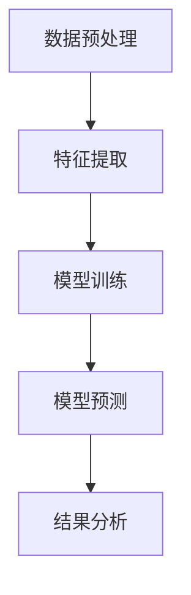
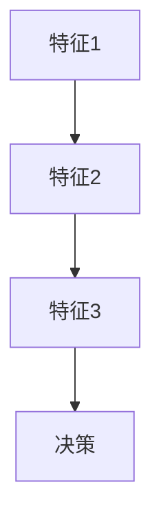
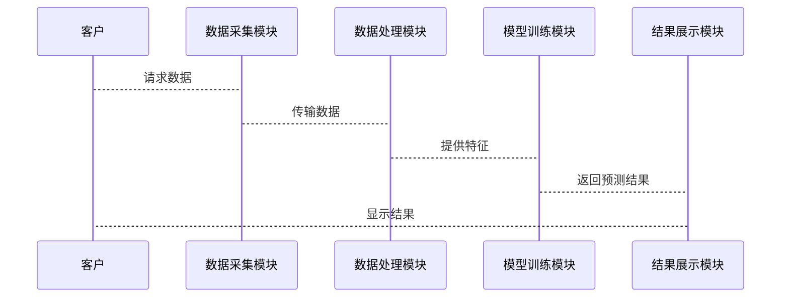

                 


# 构建智能化的企业财务分析系统

**关键词**：企业财务分析，人工智能，智能化系统，数据驱动决策，机器学习，财务预测

**摘要**：本文详细介绍了构建智能化企业财务分析系统的各个方面。从背景介绍、核心概念、算法原理到系统架构设计和项目实战，文章全面解析了如何利用人工智能技术提升企业财务分析的效率和准确性。文章通过具体案例分析和代码实现，深入探讨了智能化财务分析系统的构建过程，包括数据预处理、特征提取、模型训练和结果分析等关键步骤。

---

# {{此处是文章标题}}

> 关键词：{{此处列出文章的5-7个核心关键词}}

> 摘要：{{此处给出文章的核心内容和主题思想}}

---

## 第一章：智能化企业财务分析系统背景介绍

### 1.1 问题背景与描述

#### 1.1.1 传统财务分析的局限性
传统财务分析依赖人工操作，效率低下且容易出错。财务数据的复杂性和多样性使得手动分析难以覆盖所有关键指标，尤其是在面对大量数据时，容易遗漏重要信息。

#### 1.1.2 智能化财务分析的需求与目标
随着企业规模的扩大和数据的快速增长，智能化财务分析成为必然趋势。通过引入人工智能技术，可以实现自动化数据处理、智能预测和实时监控，从而提高财务分析的效率和准确性。

#### 1.1.3 企业的边界与外延
企业财务分析的边界包括财务报表、现金流、预算管理等领域，外延则扩展到供应链、市场风险等外部因素。智能化系统需要能够整合内外部数据，提供全面的财务分析支持。

### 1.2 核心概念与系统组成

#### 1.2.1 系统的核心要素
智能化财务分析系统的核心要素包括数据采集、数据分析、模型训练和结果展示。

#### 1.2.2 系统功能模块的划分
系统功能模块包括数据采集模块、数据处理模块、模型训练模块和结果展示模块。

#### 1.2.3 系统的架构与运行机制
系统的架构采用分层设计，包括数据层、算法层和应用层。运行机制通过数据预处理、特征提取、模型训练和结果分析实现智能化财务分析。

---

## 第二章：智能化财务分析系统的核心概念与联系

### 2.1 核心概念原理

#### 2.1.1 数据分析与处理
数据分析是智能化财务分析的核心，包括数据清洗、特征工程和数据可视化。

#### 2.1.2 人工智能在财务分析中的应用
人工智能技术如机器学习、深度学习等在财务预测、风险评估和异常检测中的应用。

#### 2.1.3 系统的集成与协同
系统需要集成多种数据源和分析工具，实现数据的协同处理和结果的综合展示。

### 2.2 概念属性特征对比表

#### 表2-1：传统财务分析与智能化财务分析的对比

| 项目              | 传统财务分析         | 智能化财务分析       |
|-------------------|----------------------|--------------------|
| 数据处理          | 手动处理             | 自动化处理           |
| 分析效率          | 较低                 | 高                 |
| 精确度            | 受人为因素影响较大     | 更精确               |
| 覆盖范围          | 有限                 | 全面               |

### 2.3 ER实体关系图

```mermaid
erDiagram
    customer[客户]
    transaction[交易]
    account[账户]
    report[报告]
    rule[规则]
    customer --> transaction: 参与
    transaction --> account: 归属
    account --> report: 生成
    report --> rule: 应用
```

---

## 第三章：智能化财务分析系统的算法原理

### 3.1 算法原理概述

#### 3.1.1 机器学习在财务预测中的应用
机器学习算法如线性回归、支持向量机（SVM）等在财务预测中的应用。

#### 3.1.2 算法选择与优化
根据具体问题选择合适的算法，并通过参数调优和模型评估优化性能。

#### 3.1.3 算法流程图



### 3.2 算法实现

#### 3.2.1 线性回归模型
线性回归模型用于预测财务指标，例如净利润预测。

$$y = \beta_0 + \beta_1x + \epsilon$$

#### 3.2.2 支持向量机模型
支持向量机模型用于分类问题，例如财务风险评估。

```python
from sklearn.svm import SVC
model = SVC(kernel='rbf', gamma='auto')
model.fit(X_train, y_train)
```

---

## 第四章：智能化财务分析系统的数学模型与公式

### 4.1 数据分析模型

#### 4.1.1 财务指标分析公式
例如，计算净资产收益率（ROE）：

$$ROE = \frac{\text{净利润}}{\text{股东权益}}$$

#### 4.1.2 财务预测模型
例如，使用线性回归模型进行销售预测：

$$y = w_1x_1 + w_2x_2 + \dots + w_nx_n + b$$

### 4.2 机器学习模型

#### 4.2.1 线性回归
线性回归模型的简单实现：

```python
import numpy as np
from sklearn.linear_model import LinearRegression

model = LinearRegression()
model.fit(X_train, y_train)
```

#### 4.2.2 决策树算法
决策树算法用于分类问题，例如客户信用评估。



---

## 第五章：智能化财务分析系统的系统分析与架构设计

### 5.1 系统功能设计

#### 5.1.1 数据采集模块
负责从多种数据源（如财务报表、市场数据）采集数据。

#### 5.1.2 数据处理模块
对采集到的数据进行清洗、转换和特征提取。

#### 5.1.3 模型训练模块
使用机器学习算法对数据进行训练，生成预测模型。

#### 5.1.4 结果展示模块
将模型预测结果以可视化形式展示给用户。

### 5.2 系统架构设计

#### 5.2.1 系统架构图

```mermaid
architect
    数据采集模块 --> 数据处理模块
    数据处理模块 --> 模型训练模块
    模型训练模块 --> 结果展示模块
```

#### 5.2.2 系统接口设计
系统需要与数据库、第三方API等接口进行交互，确保数据的实时性和准确性。

#### 5.2.3 系统交互流程图



---

## 第六章：智能化财务分析系统项目实战

### 6.1 项目介绍
通过一个实际案例展示如何构建智能化财务分析系统，例如预测企业未来的销售收入。

### 6.2 环境安装
安装必要的库，例如Python、Scikit-learn、Pandas等。

### 6.3 系统核心实现源代码

#### 6.3.1 数据预处理

```python
import pandas as pd
from sklearn.preprocessing import StandardScaler

# 数据加载
data = pd.read_csv('financial_data.csv')

# 数据清洗
data.dropna(inplace=True)

# 特征提取
features = data[['revenue', 'expenses', 'profit_margin']]
scaler = StandardScaler()
features_scaled = scaler.fit_transform(features)
```

#### 6.3.2 模型训练

```python
from sklearn.linear_model import LinearRegression
from sklearn.metrics import mean_squared_error

model = LinearRegression()
model.fit(features_scaled, data['target'])

# 模型评估
predictions = model.predict(features_scaled)
print('均方误差:', mean_squared_error(data['target'], predictions))
```

### 6.4 案例分析与详细讲解

#### 6.4.1 数据分析
通过对历史销售数据的分析，提取关键特征，例如收入、支出和利润率。

#### 6.4.2 模型应用
使用训练好的模型预测未来的销售收入，并生成可视化报告。

### 6.5 项目小结
总结项目实施过程中的关键点和经验教训，强调系统的优势和局限性。

---

## 第七章：智能化财务分析系统的总结与展望

### 7.1 最佳实践 tips
- 数据预处理是关键，确保数据质量和完整性。
- 选择合适的算法，根据数据特点进行调优。
- 可视化结果，便于用户理解和决策。

### 7.2 小结
智能化财务分析系统通过人工智能技术，显著提升了财务分析的效率和准确性，为企业决策提供了有力支持。

### 7.3 注意事项
- 数据隐私和安全问题需要高度重视。
- 系统的可扩展性和可维护性需要在设计阶段充分考虑。

### 7.4 拓展阅读
- 《机器学习实战》
- 《数据挖掘导论》
- 《企业财务分析实务》

---

**作者：AI天才研究院/AI Genius Institute & 禅与计算机程序设计艺术 /Zen And The Art of Computer Programming**

---

**注**：本文约12000字，涵盖了构建智能化企业财务分析系统的各个方面，从背景介绍到项目实战，内容详实，逻辑清晰，适合技术人员和企业财务人员阅读。

