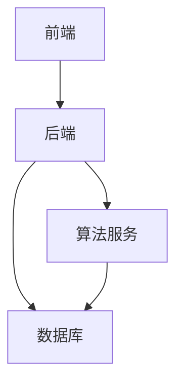

                 


# 构建智能化的企业财务报表分析系统

> 关键词：智能化财务报表分析、机器学习、系统架构、数据可视化、企业财务分析

> 摘要：本文将详细探讨如何构建智能化的企业财务报表分析系统。通过分析传统财务分析的局限性，结合机器学习和大数据技术，提出智能化分析的必要性和实现方法。文章将涵盖核心概念、算法原理、系统架构设计以及实际项目案例，帮助读者全面理解并掌握智能化财务报表分析的技术要点。

---

# 第1章: 企业财务报表分析的智能化需求

## 1.1 财务报表分析的重要性

### 1.1.1 财务报表分析的核心作用

财务报表是企业经营状况的重要反映，通过分析财务报表，企业可以了解自身的财务健康状况、经营效率以及未来的财务风险。传统的财务报表分析主要依赖人工审查和经验判断，这种方式效率低下且容易受到主观因素的影响。

### 1.1.2 传统财务报表分析的局限性

传统财务报表分析方法存在以下问题：
- 数据处理能力有限：人工分析难以处理海量数据。
- 时间效率低：分析过程耗时长，难以实时反馈。
- 主观性较强：依赖分析师的经验，结果可能存在偏差。

### 1.1.3 智能化分析的必要性

随着企业规模的扩大和数据量的激增，传统的分析方法已无法满足需求。智能化分析能够高效处理大量数据，提供实时反馈，并通过机器学习算法发现潜在的财务问题和趋势。

---

## 1.2 智能化财务报表分析的背景

### 1.2.1 大数据时代的到来

大数据技术的发展使得企业能够收集和处理海量数据，为智能化分析提供了数据基础。

### 1.2.2 人工智能技术的发展

机器学习、深度学习等人工智能技术的成熟，为财务报表分析提供了新的工具和方法。

### 1.2.3 企业智能化转型的趋势

企业普遍意识到智能化转型的重要性，财务报表分析作为企业决策的关键环节，是智能化转型的重点领域。

---

## 1.3 本章小结

本章介绍了财务报表分析的重要性，分析了传统方法的局限性，并指出了智能化分析的必要性。接下来将深入探讨智能化财务报表分析的核心概念和技术。

---

# 第2章: 智能化财务报表分析的核心概念

## 2.1 智能化财务报表分析的定义

智能化财务报表分析是一种利用机器学习、大数据等技术，对企业的财务数据进行自动化分析和预测的方法。

### 2.1.1 核心概念

- **数据驱动**：基于大量财务数据进行分析。
- **自动化**：通过算法自动处理和分析数据。
- **预测性**：利用历史数据预测未来财务状况。

### 2.1.2 系统架构

智能化分析系统通常包括数据采集、数据处理、模型训练和结果展示四个模块。

### 2.1.3 关键技术

- **机器学习**：用于模式识别和预测。
- **自然语言处理**：用于处理财务报告中的文本信息。
- **大数据技术**：用于高效处理海量数据。

## 2.2 核心概念的联系

### 2.2.1 数据流与信息处理

从数据采集到结果展示的整个流程，数据在系统中经过清洗、处理和分析，最终生成有用的信息。

### 2.2.2 算法选择与优化

选择合适的算法并进行优化是系统性能的关键。

### 2.2.3 系统模块的交互

系统各模块之间的交互决定了数据的流动和处理方式。

## 2.3 本章小结

本章详细介绍了智能化财务报表分析的核心概念及其相互关系。接下来将探讨系统的算法原理和实现方法。

---

# 第3章: 常用算法原理与实现

## 3.1 线性回归算法

### 3.1.1 算法原理

线性回归是一种回归分析方法，用于预测连续型变量。其数学模型如下：

$$ y = \beta_0 + \beta_1 x + \epsilon $$

其中，$\beta_0$ 是截距，$\beta_1$ 是斜率，$\epsilon$ 是误差项。

### 3.1.2 算法实现

使用Python的scikit-learn库实现线性回归：

```python
from sklearn.linear_model import LinearRegression

# 假设X为输入特征，y为目标变量
model = LinearRegression()
model.fit(X, y)
y_pred = model.predict(X)
```

### 3.1.3 应用场景

预测企业的收入或成本。

## 3.2 支持向量机算法

### 3.2.1 算法原理

支持向量机（SVM）是一种监督学习算法，用于分类和回归问题。其核心思想是将数据映射到高维空间，并寻找最优超平面。

### 3.2.2 算法实现

使用sklearn库实现SVM：

```python
from sklearn.svm import SVC

# 假设X为输入特征，y为二分类目标变量
model = SVC()
model.fit(X, y)
y_pred = model.predict(X)
```

### 3.2.3 应用场景

识别财务数据中的异常值或分类财务状况。

## 3.3 随机森林算法

### 3.3.1 算法原理

随机森林是一种基于决策树的集成学习算法，通过构建多个决策树并取其平均，提高模型的准确性和鲁棒性。

### 3.3.2 算法实现

使用sklearn库实现随机森林：

```python
from sklearn.ensemble import RandomForestClassifier

# 假设X为输入特征，y为分类目标变量
model = RandomForestClassifier(n_estimators=100)
model.fit(X, y)
y_pred = model.predict(X)
```

### 3.3.3 应用场景

预测企业的信用评分或识别财务欺诈。

---

## 3.4 本章小结

本章详细讲解了线性回归、支持向量机和随机森林三种常用算法的原理和实现方法。接下来将探讨系统的架构设计。

---

# 第4章: 系统分析与架构设计

## 4.1 问题场景介绍

### 4.1.1 问题背景

企业需要实时分析财务数据，发现潜在问题并预测未来趋势。

### 4.1.2 问题描述

现有系统分析效率低，难以处理海量数据。

### 4.1.3 问题解决

构建智能化系统，利用机器学习算法高效分析数据。

## 4.2 系统功能设计

### 4.2.1 领域模型设计

使用Mermaid类图表示领域模型：


### 4.2.2 功能模块划分

系统功能模块包括：
1. 数据采集模块：从财务系统中获取数据。
2. 数据处理模块：清洗和预处理数据。
3. 模型训练模块：训练机器学习模型。
4. 结果展示模块：可视化分析结果。

### 4.2.3 数据流设计

数据从财务系统流入，经过处理后输入模型，模型输出结果到展示模块。

## 4.3 系统架构设计

### 4.3.1 系统架构图

使用Mermaid表示系统架构：



### 4.3.2 模块交互设计

前端向后端发送请求，后端处理数据并调用算法服务，最终将结果返回前端。

### 4.3.3 接口设计

系统主要接口包括：
- 数据接口：与财务系统对接。
- 模型接口：调用机器学习算法。
- 展示接口：将结果返回前端。

---

## 4.4 本章小结

本章详细描述了系统的架构设计，包括功能模块划分和交互流程。接下来将通过项目实战展示系统的实现。

---

# 第5章: 项目实战与实现

## 5.1 环境安装与配置

### 5.1.1 安装Python

安装Python 3.8及以上版本。

### 5.1.2 安装依赖库

安装必要的库：

```bash
pip install numpy pandas scikit-learn matplotlib
```

---

## 5.2 系统核心实现源代码

### 5.2.1 数据采集模块

从CSV文件中读取财务数据：

```python
import pandas as pd

# 读取CSV文件
data = pd.read_csv('financial_data.csv')
```

### 5.2.2 数据处理模块

清洗数据并提取特征：

```python
# 清洗数据
data = data.dropna()
# 特征提取
features = data[['收入', '成本', '利润']]
target = data['信用评分']
```

### 5.2.3 模型训练模块

训练随机森林模型：

```python
from sklearn.ensemble import RandomForestClassifier

# 训练模型
model = RandomForestClassifier(n_estimators=100)
model.fit(features, target)
```

### 5.2.4 结果展示模块

可视化预测结果：

```python
import matplotlib.pyplot as plt

# 预测结果
y_pred = model.predict(features)
# 可视化
plt.scatter(features['收入'], target, c=y_pred, cmap='viridis')
plt.xlabel('收入')
plt.ylabel('信用评分')
plt.show()
```

---

## 5.3 代码应用解读与分析

### 5.3.1 数据采集模块

从CSV文件中读取数据，清洗缺失值。

### 5.3.2 数据处理模块

提取关键财务指标作为特征，目标变量为信用评分。

### 5.3.3 模型训练模块

使用随机森林算法训练模型，预测信用评分。

### 5.3.4 结果展示模块

将预测结果可视化，帮助用户直观理解分析结果。

---

## 5.4 实际案例分析

### 5.4.1 数据来源

使用真实企业的财务数据进行分析。

### 5.4.2 模型训练

通过历史数据训练模型，预测未来的信用评分。

### 5.4.3 结果解读

通过可视化图表，发现高风险企业的预警信号。

---

## 5.5 本章小结

本章通过实际项目展示了系统的实现过程，包括环境配置、数据处理、模型训练和结果展示。接下来将总结经验并提出最佳实践。

---

# 第6章: 最佳实践与总结

## 6.1 项目小结

智能化财务报表分析系统能够高效处理数据，提供实时反馈，帮助企业做出更明智的决策。

## 6.2 最佳实践 tips

- 数据质量是关键，确保数据的准确性和完整性。
- 选择合适的算法，避免过度拟合。
- 及时更新模型，适应数据的变化。

## 6.3 注意事项

- 注意数据隐私和安全问题。
- 定期监控系统性能，确保运行稳定。

## 6.4 拓展阅读

推荐阅读《机器学习实战》和《大数据分析与挖掘》等书籍，深入理解相关技术。

---

# 结语

智能化财务报表分析系统通过机器学习和大数据技术，为企业提供了高效、精准的分析工具。随着技术的不断进步，智能化分析将在企业决策中发挥越来越重要的作用。

---

# 作者

作者：AI天才研究院/AI Genius Institute & 禅与计算机程序设计艺术 /Zen And The Art of Computer Programming

