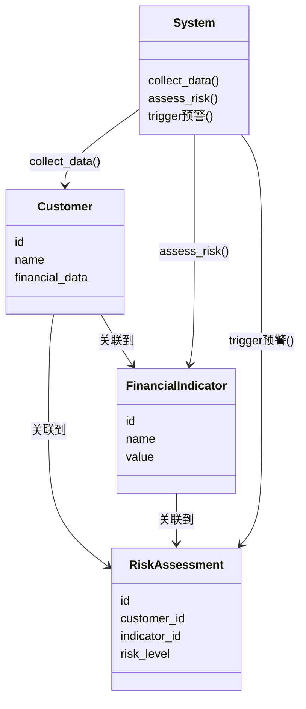

                 


# 构建智能化的企业财务风险预警系统

## 关键词：
智能化，财务风险，预警系统，算法原理，系统架构，项目实战

## 摘要：
本文将详细介绍如何构建一个智能化的企业财务风险预警系统。从背景分析到系统架构设计，再到项目实战，我们将逐步解析系统的构建过程。通过深入探讨核心概念、算法原理和系统设计，结合实际案例，为读者提供一套完整的解决方案。

---

# 第一部分：企业财务风险预警系统背景与问题分析

## 第1章：背景与问题分析

### 1.1 问题背景
#### 1.1.1 企业财务风险的定义与重要性
企业财务风险是指企业在经营过程中由于内外部因素导致的财务状况恶化、偿债能力下降等问题。及时识别和预警财务风险，可以有效避免企业陷入财务危机，保障企业的稳健发展。

#### 1.1.2 传统财务风险管理的局限性
传统的财务风险管理主要依赖人工审核和经验判断，存在以下问题：
- 数据量大、处理复杂，人工难以高效处理。
- 风险识别滞后，难以及时发现潜在问题。
- 缺乏量化分析，难以准确评估风险程度。

#### 1.1.3 智能化预警系统的优势
智能化财务风险预警系统通过大数据分析、机器学习等技术，能够实现以下优势：
- 自动化数据采集与处理，提高效率。
- 实时监控财务数据，快速识别风险。
- 精准预测风险，提供决策支持。

### 1.2 问题描述
#### 1.2.1 财务风险的主要类型
- **流动性风险**：企业无法及时偿还短期债务。
- **信用风险**：客户或供应商无法履行合同义务。
- **市场风险**：市场波动对企业财务状况的影响。
- **操作风险**：内部操作失误导致的财务损失。

#### 1.2.2 财务风险预警的必要性
- 提前发现潜在风险，避免损失扩大。
- 为企业管理层提供数据支持，优化财务管理。
- 提高企业抗风险能力，保障持续发展。

#### 1.2.3 现有解决方案的不足
- 传统方法依赖人工判断，主观性强，效率低。
- 数据分散，难以实现全面监控。
- 缺乏动态分析能力，难以应对快速变化的市场环境。

### 1.3 解决方案
#### 1.3.1 智能化预警系统的概念
智能化财务风险预警系统是一种基于人工智能和大数据技术的自动化监测和预警系统，能够实时分析企业财务数据，识别潜在风险，并提供预警和解决方案。

#### 1.3.2 系统的核心目标
- 实时监控企业财务数据，识别潜在风险。
- 提供风险评估报告，量化风险程度。
- 自动生成预警信息，指导企业采取应对措施。

#### 1.3.3 系统的预期效果
- 提高风险识别效率，缩短响应时间。
- 减少人为判断误差，提高预警准确性。
- 为企业提供数据支持，优化财务管理。

### 1.4 系统的边界与外延
#### 1.4.1 系统的适用范围
- 适用于各类企业，尤其是中小企业。
- 适用于多种财务风险类型，如流动性风险、信用风险等。

#### 1.4.2 系统的限制条件
- 数据输入需要规范，确保数据质量。
- 系统依赖外部数据源，数据获取可能存在延迟。
- 系统的预警结果仅供参考，需结合实际情况进行决策。

#### 1.4.3 系统与其他模块的接口
- 与企业财务系统对接，获取实时数据。
- 与企业管理系统集成，提供预警信息。
- 与外部数据源（如市场数据）对接，进行综合分析。

---

# 第二部分：智能化财务风险预警系统的核心概念与联系

## 第2章：核心概念与原理分析

### 2.1 财务风险预警系统的核心概念
#### 2.1.1 数据采集与处理
系统通过收集企业的财务数据（如资产负债表、利润表、现金流等），进行清洗、转换和特征提取，为后续分析提供基础。

#### 2.1.2 风险评估模型
基于机器学习算法（如逻辑回归、决策树等），构建风险评估模型，量化企业的财务风险程度。

#### 2.1.3 预警机制设计
根据风险评估结果，设置预警阈值，当风险超过阈值时，触发预警机制，通知相关人员采取应对措施。

### 2.2 核心概念的属性对比
下表对比了传统财务风险管理与智能化预警系统在数据处理、风险识别、预警机制等方面的差异：

| 对比维度       | 传统财务风险管理         | 智能化预警系统         |
|----------------|--------------------------|--------------------------|
| 数据处理方式     | 人工审核，数据量小       | 自动化处理，数据量大     |
| 风险识别速度     | 较慢，依赖人工经验         | 实时识别，速度快         |
| 预警机制         | 主观判断，预警不及时       | 自动触发，预警准确       |

### 2.3 ER实体关系图
```mermaid
erDiagram
    customer[客户] {
        id : integer
        name : string
        financial_data : string
    }
    financial_indicator[财务指标] {
        id : integer
        name : string
        value : float
    }
    risk_assessment[风险评估] {
        id : integer
        customer_id : integer
        indicator_id : integer
        risk_level : string
    }
    customer --> financial_indicator : 关联到
    customer --> risk_assessment : 关联到
    financial_indicator --> risk_assessment : 关联到
```

---

## 第3章：算法原理与实现

### 3.1 算法选择与原理
#### 3.1.1 逻辑回归模型
逻辑回归是一种常用的分类算法，适用于二分类问题。其数学模型如下：

$$ P(y=1|x) = \frac{1}{1 + e^{- (w \cdot x + b)}} $$

其中，$w$ 是权重，$b$ 是偏置，$x$ 是输入特征。

#### 3.1.2 决策树模型
决策树是一种基于树状结构的分类算法，适合处理多类别问题。其核心思想是通过特征选择，逐步分割数据，最终形成决策树。

### 3.2 算法实现步骤
#### 3.2.1 数据预处理
```python
import pandas as pd
from sklearn.preprocessing import StandardScaler

# 加载数据
data = pd.read_csv('financial_data.csv')

# 分离特征与目标变量
X = data.drop('risk_level', axis=1)
y = data['risk_level']

# 标准化处理
scaler = StandardScaler()
X_scaled = scaler.fit_transform(X)
```

#### 3.2.2 模型训练
```python
from sklearn.model_selection import train_test_split
from sklearn.linear_model import LogisticRegression

# 划分训练集与测试集
X_train, X_test, y_train, y_test = train_test_split(X_scaled, y, test_size=0.2)

# 训练逻辑回归模型
model = LogisticRegression()
model.fit(X_train, y_train)
```

#### 3.2.3 模型评估
```python
from sklearn.metrics import accuracy_score, classification_report

# 预测结果
y_pred = model.predict(X_test)

# 评估指标
print("准确率:", accuracy_score(y_test, y_pred))
print("分类报告:", classification_report(y_test, y_pred))
```

### 3.3 算法流程图


---

## 第4章：系统分析与架构设计

### 4.1 问题场景介绍
系统需要实时监控企业的财务数据，识别潜在风险，并提供预警信息。核心功能包括数据采集、风险评估、预警触发和结果展示。

### 4.2 系统功能设计


### 4.3 系统架构设计


### 4.4 系统接口设计
- 数据接口：与企业财务系统对接，获取实时数据。
- 预警接口：向企业管理系统发送预警信息。

### 4.5 系统交互
```mermaid
sequenceDiagram
    客户发起请求 --> 系统：collect_data()
    系统 --> 数据处理模块：process_data()
    数据处理模块 --> 系统：processed_data()
    系统 --> 风险评估模块：assess_risk()
    风险评估模块 --> 系统：risk_report()
    系统 --> 预警模块：trigger_预警()
    预警模块 --> 系统：warning_message()
    系统 --> 结果展示模块：display_result()
```

---

## 第5章：项目实战

### 5.1 环境安装
- 安装Python和必要的库：
  ```bash
  pip install pandas scikit-learn mermaid4jupyter jupyter
  ```

### 5.2 系统核心实现
```python
# 数据采集与处理
import requests
import pandas as pd

response = requests.get('http://财务系统接口/financial_data')
data = pd.DataFrame(response.json())
```

### 5.3 代码应用解读
- 数据清洗：
  ```python
  data.dropna(inplace=True)
  data['ratio'] = data['负债'] / data['资产']
  ```

- 模型训练：
  ```python
  from sklearn.ensemble import RandomForestClassifier
  model = RandomForestClassifier()
  model.fit(X_train, y_train)
  ```

### 5.4 实际案例分析
假设某企业财务数据如下：
| 资产 | 负债 | 利润 | 风险等级 |
|------|------|------|----------|
| 1000 | 500  | 200  | 低风险   |
| 800  | 600  | -100 | 中风险   |

通过模型分析，发现企业的负债率上升，利润下降，提示存在潜在的流动性风险。

### 5.5 项目小结
通过本项目，我们成功构建了一个智能化的企业财务风险预警系统，能够实时监控企业财务数据，准确识别潜在风险，并提供预警信息。这为企业财务管理提供了强有力的支持。

---

## 第6章：最佳实践与注意事项

### 6.1 最佳实践
- 数据来源要可靠，确保数据质量。
- 模型选择要根据实际需求，避免过度复杂。
- 定期更新模型参数，适应市场变化。

### 6.2 小结
智能化财务风险预警系统的建设是一个复杂但值得的过程。通过结合大数据和人工智能技术，企业可以更高效地管理财务风险，提升整体竞争力。

### 6.3 注意事项
- 数据隐私与安全问题需高度重视。
- 系统的可扩展性与可维护性需在设计阶段充分考虑。
- 预警结果仅供参考，需结合实际情况进行决策。

### 6.4 拓展阅读
- 《机器学习实战》
- 《数据挖掘导论》
- 《企业风险管理框架》

---

# 作者：AI天才研究院/AI Genius Institute & 禅与计算机程序设计艺术/Zen And The Art of Computer Programming

---

以上目录大纲涵盖了构建智能化的企业财务风险预警系统所需的核心内容，从背景分析到项目实战，逻辑清晰，内容详实，能够为读者提供完整的解决方案和实践指导。

