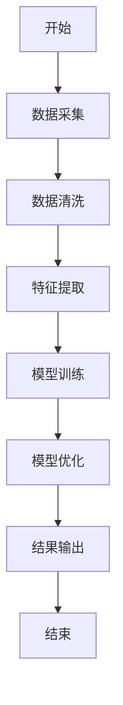
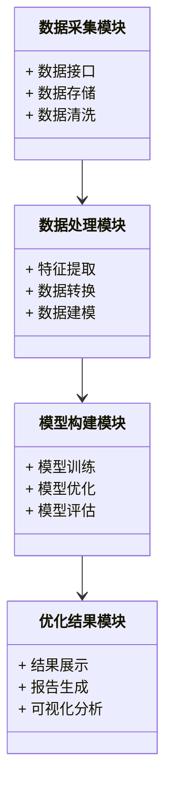
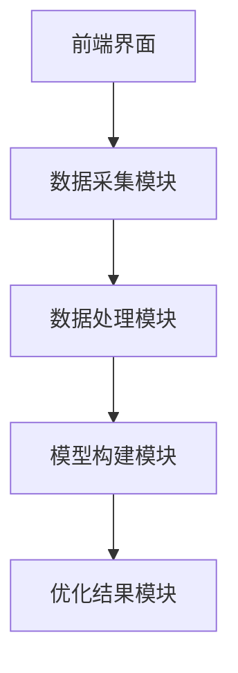

                 


# 构建智能化的企业资本结构优化平台

---

## 关键词：
智能化、资本结构优化、人工智能、机器学习、企业财务管理

---

## 摘要：
随着人工智能技术的飞速发展，企业资本结构优化的传统方法逐渐显现出其局限性。本文旨在探讨如何利用智能化技术构建一个高效的资本结构优化平台，通过结合机器学习和深度学习算法，实现对企业资本结构的智能优化。文章从背景介绍、核心概念、算法原理、系统架构到项目实战，全面解析智能化资本结构优化平台的构建过程，为企业财务管理提供新的思路和解决方案。

---

## 第一部分：企业资本结构优化的背景与挑战

### 第1章：企业资本结构优化的背景与问题

#### 1.1 企业资本结构优化的背景

企业资本结构是指企业在筹集资金时，权益资本和债务资本的比例关系。优化资本结构是企业财务管理的重要任务之一，旨在在降低资本成本的同时，提高企业的资本回报率。传统的资本结构优化方法主要包括加权平均资本成本模型（WACC）和资本资产定价模型（CAPM）等，但这些方法通常依赖于假设条件，忽略了市场环境的动态变化和企业内部数据的复杂性。

#### 1.2 问题背景

传统资本结构优化方法存在以下主要问题：
- 数据依赖性：传统方法通常依赖于市场平均风险溢价等外部数据，难以适应企业的个性化需求。
- 静态性：传统方法假设市场环境和企业经营状况不变，而实际市场环境是动态变化的。
- 计算复杂性：复杂的数学模型可能导致计算过程繁琐，且难以实时更新。

#### 1.3 问题解决

智能化技术的应用为企业资本结构优化提供了新的可能性。通过机器学习和深度学习算法，可以实时分析企业内外部数据，捕捉市场变化趋势，从而实现动态优化。智能化优化方法的优势在于：
- 数据驱动：基于企业的实际经营数据，构建个性化优化模型。
- 实时性：能够根据市场变化和企业经营状况实时调整资本结构。
- 高效性：通过算法优化，减少人工计算的复杂性和时间成本。

---

## 第二部分：智能化资本结构优化平台的核心概念与联系

### 第2章：智能化资本结构优化平台的核心概念

#### 2.1 AI技术在资本结构优化中的应用

人工智能技术，特别是机器学习和深度学习，能够从海量数据中提取有用信息，并通过训练模型实现预测和优化。在资本结构优化中，AI技术可以用于以下方面：
- 数据清洗与特征提取：处理企业财务数据，提取关键特征。
- 模型训练：基于历史数据训练优化模型。
- 实时预测：根据市场变化预测最优资本结构。

#### 2.2 数据驱动的优化方法

数据驱动的优化方法通过分析企业的财务数据和市场数据，构建数学模型，并利用算法求解最优资本结构。这种方法的优势在于能够充分利用企业的历史数据，发现潜在的规律和趋势。

#### 2.3 平台的模块化设计

智能化资本结构优化平台通常由以下几个模块组成：
- 数据采集模块：负责收集企业财务数据和市场数据。
- 数据处理模块：对数据进行清洗、转换和特征提取。
- 模型构建模块：基于数据构建优化模型。
- 优化结果模块：展示优化结果并生成报告。

---

## 第三部分：算法原理与实现

### 第3章：算法原理

#### 3.1 机器学习与深度学习在资本结构优化中的应用

机器学习和深度学习算法在资本结构优化中主要用于数据建模和预测。例如，可以使用线性回归模型预测最优资本结构，或者使用神经网络模型捕捉复杂的非线性关系。

#### 3.2 算法流程图

以下是一个简化的算法流程图：



#### 3.3 数学模型与公式

资本结构优化的数学模型可以表示为：

$$
\text{目标函数：} \quad \min \left( \text{资本成本} \right)
$$

$$
\text{约束条件：} \quad \sum_{i=1}^{n} w_i \cdot k_i = \text{资本成本}
$$

其中，\( w_i \) 是第 \( i \) 种资本的权重，\( k_i \) 是第 \( i \) 种资本的成本。

---

## 第四部分：系统分析与架构设计

### 第4章：系统功能设计

#### 4.1 应用场景

智能化资本结构优化平台的应用场景包括：
- 企业内部财务管理：帮助企业优化资本结构，降低资本成本。
- 投资者决策支持：为投资者提供资本结构优化建议。
- 金融机构风险评估：用于评估企业的财务健康状况。

#### 4.2 功能设计

以下是平台的主要功能模块：



#### 4.3 系统架构设计

以下是系统的架构设计：



---

## 第五部分：项目实战

### 第5章：项目实战

#### 5.1 环境安装

为了构建智能化资本结构优化平台，需要安装以下工具和库：
- Python 3.x
- NumPy
- Pandas
- Scikit-learn
- TensorFlow
- Jupyter Notebook

#### 5.2 核心代码实现

以下是一个简单的资本结构优化模型的Python代码示例：

```python
import numpy as np
import pandas as pd
from sklearn.linear_model import LinearRegression

# 数据加载
data = pd.read_csv('capital_structure.csv')

# 特征提取
features = data[['revenue', 'profit', 'debt']]
target = data['capital_cost']

# 模型训练
model = LinearRegression()
model.fit(features, target)

# 预测结果
predicted_cost = model.predict(features)
```

#### 5.3 案例分析

以下是一个案例分析的简要说明：
1. 数据采集：收集某企业的财务数据。
2. 数据处理：清洗数据并提取特征。
3. 模型训练：训练资本成本预测模型。
4. 优化结果：根据模型预测结果优化资本结构。

---

## 第六部分：总结与展望

### 第6章：总结与展望

#### 6.1 总结

本文详细介绍了智能化资本结构优化平台的构建过程，包括背景分析、核心概念、算法原理、系统架构和项目实战。通过人工智能技术的应用，企业能够实现资本结构的动态优化，降低资本成本，提高资本回报率。

#### 6.2 展望

未来，随着人工智能技术的不断发展，智能化资本结构优化平台将更加智能化和自动化。可能的研究方向包括：
- 更复杂的优化模型：引入强化学习算法，实现多目标优化。
- 更高效的计算方法：通过分布式计算和并行处理提高计算效率。
- 更广泛的应用场景：扩展平台的应用范围，支持更多类型的资本结构优化需求。

---

## 作者信息

作者：AI天才研究院/AI Genius Institute & 禅与计算机程序设计艺术/Zen And The Art of Computer Programming

---

通过以上内容，我们构建了一个智能化的企业资本结构优化平台，为企业财务管理提供了新的解决方案。

