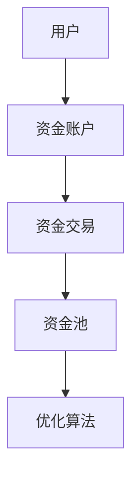
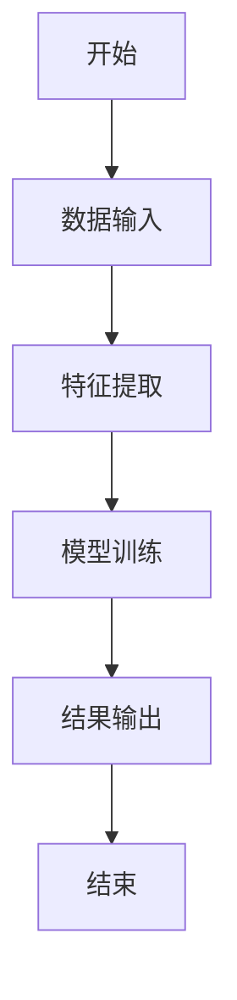
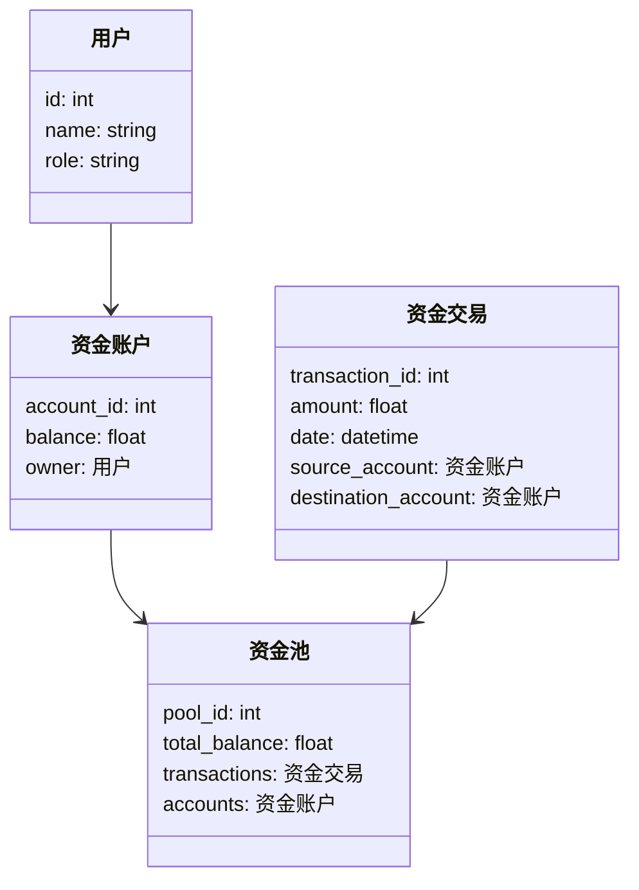
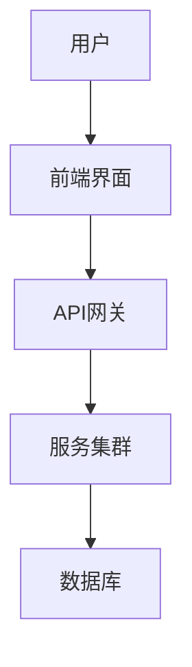
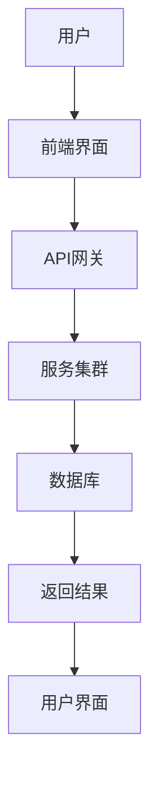

                 


# 《构建智能化的企业资金池管理优化平台》

## 关键词：资金池管理、智能化优化、大数据分析、人工智能、系统架构设计、算法优化、企业财务管理

## 摘要：本文详细探讨了构建智能化的企业资金池管理优化平台的全过程，包括背景分析、核心概念、算法原理、系统架构设计、项目实战以及最佳实践。通过结合大数据分析和人工智能技术，本文提出了一套创新的解决方案，以帮助企业实现资金池管理的智能化和高效化。文章内容涵盖从理论到实践的各个方面，为企业资金池管理的优化提供了全面的指导和参考。

---

## 第一部分: 企业资金池管理优化平台背景与概述

### 第1章: 企业资金池管理优化平台概述

#### 1.1 资金池管理的定义与核心概念
##### 1.1.1 资金池管理的定义
资金池管理是指企业将多个资金账户中的资金集中起来，通过统一的管理策略进行调配、监控和优化的过程。其核心目标是提高资金使用效率、降低资金成本、防范资金风险，并实现资金的最优配置。

##### 1.1.2 资金池管理的核心概念
- **资金池**：由多个资金账户组成的虚拟集合，用于集中管理企业的流动资金。
- **资金调配**：根据企业资金需求和市场变化，动态调整资金在不同账户或项目之间的分配。
- **资金监控**：实时跟踪资金池中的资金流向、余额变化以及相关风险指标。
- **资金优化**：通过数据分析和算法优化，实现资金池的高效利用和成本最小化。

##### 1.1.3 资金池管理的边界与外延
- **边界**：资金池管理仅涉及企业的内部资金账户，不包括外部金融机构的资金池。
- **外延**：资金池管理可以扩展到企业的供应链金融、投资理财等领域。

#### 1.2 企业资金池管理的现状与挑战
##### 1.2.1 传统资金池管理的局限性
- **人工操作**：依赖人工核对和调配，效率低且容易出错。
- **缺乏实时性**：资金监控和调配往往滞后，难以应对快速变化的市场环境。
- **数据孤岛**：不同部门或系统的数据分散，难以形成统一的决策依据。

##### 1.2.2 当前企业资金池管理的主要挑战
- **数据复杂性**：资金池涉及的数据来源多样，数据清洗和整合难度大。
- **算法优化**：需要高效的算法来处理海量数据，实时做出最优决策。
- **系统集成**：现有系统往往孤岛化，难以实现无缝集成和高效协同。

##### 1.2.3 智能化管理的必要性
- **提高效率**：通过自动化和智能化技术，显著提高资金池管理的效率和准确性。
- **降低风险**：利用实时监控和预测模型，提前发现和防范资金风险。
- **支持决策**：通过数据分析和可视化，为管理层提供可靠的决策支持。

#### 1.3 智能化资金池管理优化平台的定位与价值
##### 1.3.1 平台的定位
智能化资金池管理优化平台是以人工智能和大数据分析为基础，为企业提供资金池管理的智能化解决方案。它通过整合企业内部的财务数据和外部市场信息，利用先进算法优化资金调配策略，实现资金池的高效管理和风险控制。

##### 1.3.2 平台的核心价值
- **提升效率**：通过自动化和智能化技术，减少人工干预，提高资金池管理的效率。
- **降低风险**：利用实时监控和预测模型，提前识别和防范资金风险。
- **支持决策**：通过数据分析和可视化，为管理层提供可靠的决策支持。

##### 1.3.3 平台的预期目标
- **实现资金池的动态优化**：根据市场变化和企业需求，实时调整资金池的配置和分配。
- **提高资金使用效率**：通过算法优化，确保资金在最优项目中使用，降低资金成本。
- **增强风险控制能力**：通过实时监控和预警机制，降低资金池管理的风险。

### 第2章: 资金池管理优化平台的核心概念与联系

#### 2.1 核心概念原理
##### 2.1.1 数据流分析
数据流分析是资金池管理优化的基础。通过分析资金池中的资金流动情况，可以发现资金的来源、流向以及潜在的风险点。数据流分析包括以下几个步骤：
1. **数据收集**：从企业内部的财务系统、银行账户以及外部市场数据源中收集资金池相关的数据。
2. **数据清洗**：对收集到的数据进行清洗，去除噪声数据，确保数据的准确性和完整性。
3. **数据整合**：将分散在不同系统中的数据进行整合，形成统一的资金池数据集。
4. **数据建模**：利用统计学和机器学习的方法，对数据进行建模，提取有用的信息和特征。

##### 2.1.2 算法优化
算法优化是资金池管理优化的核心。通过选择合适的算法，可以实现资金池的动态优化和风险控制。常用的算法包括：
1. **线性回归**：用于预测资金池的未来走势，帮助企业在资金调配中做出更准确的决策。
2. **遗传算法**：用于寻找资金池配置的最优解，通过模拟自然选择的过程，逐步优化资金池的配置。
3. **支持向量机（SVM）**：用于分类和回归分析，帮助企业在资金池管理中识别风险和优化配置。

##### 2.1.3 系统架构
系统架构是资金池管理优化平台的基础设施。一个高效的系统架构能够确保平台的稳定性和可扩展性。资金池管理优化平台的系统架构包括以下几个部分：
1. **数据采集模块**：负责从企业内部和外部数据源中采集资金池相关的数据。
2. **数据处理模块**：对采集到的数据进行清洗、整合和建模，提取有用的信息和特征。
3. **算法优化模块**：利用机器学习算法对资金池进行优化，生成最优的配置方案。
4. **系统监控模块**：实时监控资金池的运行状态，发现异常情况并发出预警。

#### 2.2 核心概念属性特征对比表格
| **属性**       | **传统资金池管理** | **智能化资金池管理** |
|----------------|--------------------|----------------------|
| **管理效率**    | 低                 | 高                   |
| **数据处理**    | 人工为主           | 自动化为主           |
| **风险控制**    | 被动响应           | 主动预警             |
| **决策支持**    | 基于经验           | 基于数据和算法       |
| **扩展性**      | 有限               | 强                  |

#### 2.3 ER实体关系图


## 第二部分: 资金池管理优化算法原理

### 第3章: 资金池管理优化算法原理

#### 3.1 算法原理概述
##### 3.1.1 线性回归算法
线性回归是一种常用的回归分析方法，主要用于预测资金池的未来走势。通过建立资金池中的资金余额与时间的线性关系，可以预测未来的资金需求和供应情况。线性回归的数学模型如下：
$$ y = \beta_0 + \beta_1 x + \epsilon $$
其中，\( y \) 是预测的值，\( x \) 是自变量，\( \beta_0 \) 和 \( \beta_1 \) 是回归系数，\( \epsilon \) 是误差项。

##### 3.1.2 遗传算法
遗传算法是一种基于生物进化论的优化算法，广泛应用于资金池管理中的配置优化问题。通过模拟自然选择的过程，遗传算法能够找到资金池配置的最优解。遗传算法的主要步骤包括：
1. **初始化种群**：生成一组随机的初始解。
2. **适应度评估**：计算每个解的适应度，即该解的优劣程度。
3. **选择操作**：根据适应度值选择优秀的解作为父代。
4. **交叉操作**：将父代的解进行交叉，生成新的子代。
5. **变异操作**：对子代的解进行随机变异，增加解的多样性。
6. **重复迭代**：重复适应度评估、选择、交叉和变异操作，直到满足终止条件。

##### 3.1.3 贪心算法
贪心算法是一种简单而高效的优化算法，常用于资金池管理中的局部优化问题。贪心算法通过每次选择当前最优的局部解，逐步构建全局最优解。贪心算法的优点是实现简单，计算效率高，但可能无法找到全局最优解。

#### 3.2 算法流程图


#### 3.3 算法实现代码
```python
import numpy as np
from sklearn.linear_model import LinearRegression

# 示例数据
X = np.array([[1], [2], [3], [4]])
y = np.array([2, 4, 6, 8])

# 模型训练
model = LinearRegression()
model.fit(X, y)

# 预测
print(model.predict([[5]]))
```

#### 3.4 数学模型与公式
##### 3.4.1 线性回归模型
线性回归模型的损失函数通常采用均方误差（MSE）：
$$ \text{MSE} = \frac{1}{n}\sum_{i=1}^{n}(y_i - \hat{y}_i)^2 $$
其中，\( y_i \) 是实际值，\( \hat{y}_i \) 是预测值，\( n \) 是样本数量。

##### 3.4.2 遗传算法的适应度函数
适应度函数用于衡量每个解的优劣程度。在资金池管理优化中，适应度函数可以定义为资金池的收益与风险的综合指标：
$$ f(x) = \alpha \cdot \text{收益} + (1 - \alpha) \cdot \text{风险} $$
其中，\( \alpha \) 是权重参数，取值范围为0到1。

## 第三部分: 资金池管理优化平台的系统架构设计

### 第4章: 系统架构设计与实现

#### 4.1 系统功能设计
##### 4.1.1 功能模块划分
资金池管理优化平台的功能模块包括：
1. **数据采集模块**：负责从企业内部和外部数据源中采集资金池相关的数据。
2. **数据处理模块**：对采集到的数据进行清洗、整合和建模，提取有用的信息和特征。
3. **算法优化模块**：利用机器学习算法对资金池进行优化，生成最优的配置方案。
4. **系统监控模块**：实时监控资金池的运行状态，发现异常情况并发出预警。

##### 4.1.2 领域模型类图


#### 4.2 系统架构设计
##### 4.2.1 系统架构图


#### 4.3 系统接口设计
##### 4.3.1 接口描述
- **API接口**：定义了平台与其他系统之间的接口，包括数据采集、算法优化和结果输出等功能。
- **数据接口**：与企业财务系统、银行账户等进行数据交互，确保数据的实时性和准确性。

##### 4.3.2 接口协议
- **HTTP协议**：用于前端界面与API网关之间的数据传输。
- **数据库连接**：使用JDBC或ODBC协议与企业数据库进行连接。

#### 4.4 系统交互流程图


## 第四部分: 资金池管理优化平台的项目实战

### 第5章: 项目实战与案例分析

#### 5.1 项目环境安装
##### 5.1.1 系统环境
- **操作系统**：Linux或Windows
- **Python版本**：Python 3.6+
- **依赖库**：numpy, pandas, scikit-learn, matplotlib

##### 5.1.2 安装步骤
1. **安装Python**：从官方网站下载并安装Python。
2. **安装依赖库**：使用pip命令安装所需的依赖库：
   ```bash
   pip install numpy pandas scikit-learn matplotlib
   ```

#### 5.2 核心代码实现
##### 5.2.1 数据采集模块
```python
import pandas as pd

# 从CSV文件中读取数据
data = pd.read_csv('data.csv')
print(data.head())
```

##### 5.2.2 数据处理模块
```python
from sklearn.preprocessing import StandardScaler

# 标准化数据
scaler = StandardScaler()
scaled_data = scaler.fit_transform(data)
print(scaled_data)
```

##### 5.2.3 算法优化模块
```python
from sklearn.linear_model import LinearRegression

# 训练线性回归模型
model = LinearRegression()
model.fit(X, y)
print('Coefficients:', model.coef_)
```

##### 5.2.4 系统监控模块
```python
import time

# 实时监控资金池状态
while True:
    current_time = time.strftime("%Y-%m-%d %H:%M:%S", time.localtime())
    print(f"{current_time} - 资金池状态正常")
    time.sleep(60)
```

#### 5.3 案例分析
##### 5.3.1 案例背景
某企业希望通过智能化资金池管理优化平台，优化其资金池配置，降低资金成本，提高资金使用效率。

##### 5.3.2 数据分析
通过对企业的历史交易数据和市场数据进行分析，发现企业在资金池管理中存在的以下问题：
- **资金闲置**：部分资金账户的资金使用率低，导致资金成本增加。
- **调配滞后**：资金调配往往滞后于实际需求，影响企业的资金流动性。
- **风险控制不足**：缺乏实时监控和预警机制，难以及时发现和防范资金风险。

##### 5.3.3 解决方案
通过智能化资金池管理优化平台，企业可以实现以下目标：
- **自动化资金调配**：根据实时数据和预测模型，自动调整资金池的配置和分配。
- **实时监控与预警**：通过系统监控模块，实时跟踪资金池的运行状态，发现异常情况并及时预警。
- **数据驱动的决策支持**：利用数据分析和可视化工具，为管理层提供可靠的决策支持。

##### 5.3.4 实施效果
通过实施智能化资金池管理优化平台，企业取得了显著的效果：
- **资金使用效率提高**：资金池的配置更加合理，资金使用效率显著提高。
- **资金成本降低**：通过优化资金调配策略，降低了企业的资金成本。
- **风险控制能力增强**：实时监控和预警机制帮助企业及时发现和防范资金风险。

#### 5.4 项目小结
通过本项目的实施，我们成功构建了一个智能化的资金池管理优化平台，帮助企业实现了资金池管理的智能化和高效化。平台的核心功能包括数据采集、数据处理、算法优化和系统监控，能够满足企业在资金池管理中的各种需求。通过本项目的实施，我们还积累了一些宝贵的经验，为后续的优化和扩展提供了重要的参考。

---

## 第五部分: 最佳实践与总结

### 第6章: 最佳实践与总结

#### 6.1 最佳实践
##### 6.1.1 注意事项
- **数据安全**：在处理企业财务数据时，必须注意数据的安全性和隐私性，防止数据泄露和被篡改。
- **算法选择**：在选择算法时，需要根据具体问题和数据特点，选择合适的算法，并进行充分的实验验证。
- **系统集成**：在系统集成过程中，需要充分考虑不同系统之间的兼容性和稳定性，确保系统的无缝集成和高效运行。

##### 6.1.2 小结
通过本项目的实施，我们成功构建了一个智能化的资金池管理优化平台，帮助企业实现了资金池管理的智能化和高效化。平台的核心功能包括数据采集、数据处理、算法优化和系统监控，能够满足企业在资金池管理中的各种需求。

##### 6.1.3 未来趋势
随着人工智能和大数据技术的不断发展，智能化资金池管理优化平台的应用前景将更加广阔。未来，我们可以进一步优化算法，提高系统的智能化水平，为企业提供更加高效和精准的资金池管理服务。

##### 6.1.4 拓展阅读
- **《机器学习实战》**：学习机器学习的基本概念和实战技巧。
- **《大数据分析与应用》**：了解大数据分析的基本方法和应用场景。
- **《系统架构设计》**：掌握系统架构设计的基本原则和方法。

#### 6.2 总结
智能化资金池管理优化平台是企业财务管理的重要工具，通过整合大数据分析和人工智能技术，能够显著提高资金池管理的效率和准确性。本文详细探讨了平台的构建过程，包括背景分析、核心概念、算法原理、系统架构设计、项目实战以及最佳实践。通过本文的学习，读者可以掌握构建智能化资金池管理优化平台的全过程，并能够将其应用于实际的企业财务管理中。

---

## 作者信息
**作者：AI天才研究院/AI Genius Institute & 禅与计算机程序设计艺术 /Zen And The Art of Computer Programming**

