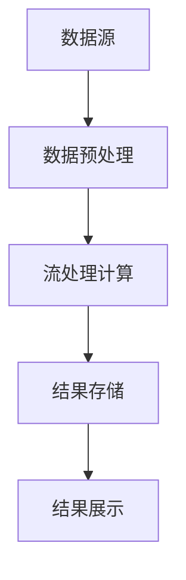
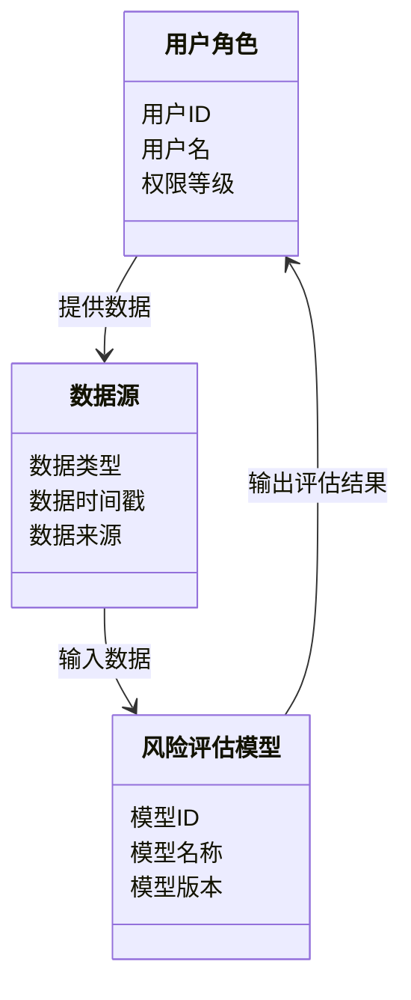
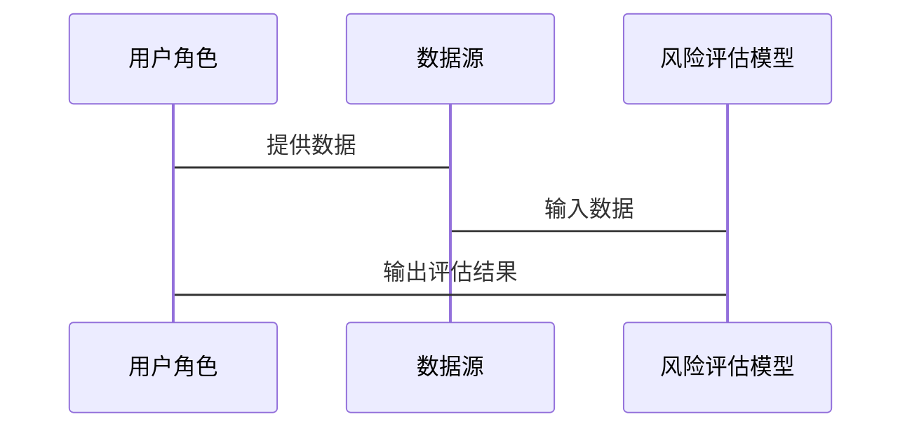

                 


# 构建智能化的企业资金流动性风险动态管理平台

## 关键词：企业资金管理、流动性风险、动态管理、人工智能、风险管理、实时数据流处理

## 摘要：  
本文详细探讨了如何构建一个智能化的企业资金流动性风险动态管理平台。通过分析资金流动性风险的核心概念、算法原理、系统架构设计以及项目实战，本文为读者提供了一套完整的解决方案。文章结合理论与实践，深入浅出地解释了如何利用人工智能和大数据技术实现企业资金流动性风险的实时监控与动态管理。  

---

# 第1章: 资金流动性风险概述  

## 1.1 问题背景与描述  

### 1.1.1 企业资金流动性风险的定义  
资金流动性风险是指企业在一定时间范围内，无法以合理成本获得足够资金来满足其资产增长、偿债需求或运营需要的风险。  

### 1.1.2 流动性风险对企业的影响  
- 影响企业的短期偿债能力，可能导致企业无法按时偿还债务。  
- 影响企业的运营稳定性，可能导致业务中断。  
- 影响企业的信用评级，进而增加融资成本。  

### 1.1.3 当前企业资金管理的主要问题  
- 数据分散，难以实时监控资金流动情况。  
- 风险评估方法单一，缺乏动态调整能力。  
- 缺乏智能化工具，难以快速响应风险事件。  

## 1.2 问题解决与边界  

### 1.2.1 动态管理的核心目标  
- 实时监控资金流动情况。  
- 自动识别潜在风险并发出预警。  
- 提供优化建议，降低流动性风险。  

### 1.2.2 平台解决的主要问题  
- 实现资金流动数据的实时采集与分析。  
- 提供多维度的风险评估模型。  
- 支持决策者快速响应风险事件。  

### 1.2.3 平台的边界与外延  
- 边界：仅关注资金流动性风险，不涉及信用风险或市场风险。  
- 外延：可与其他风险管理平台集成，提供更全面的解决方案。  

## 1.3 概念结构与核心要素  

### 1.3.1 平台的核心功能模块  
1. 数据采集与处理模块。  
2. 风险评估模块。  
3. 预警与响应模块。  
4. 数据可视化模块。  

### 1.3.2 关键技术与实现方式  
- 数据采集：通过API接口实时获取资金流动数据。  
- 数据处理：使用Flink进行实时流处理。  
- 风险评估：基于数学模型进行实时计算。  

### 1.3.3 平台的用户角色与权限  
- 管理员：负责平台配置与权限管理。  
- 风险评估员：负责风险分析与决策支持。  
- 普通用户：负责数据录入与查看。  

## 1.4 本章小结  
本章从问题背景、核心概念和解决思路三个方面，详细介绍了企业资金流动性风险动态管理平台的建设目标和实现方式。  

---

# 第2章: 核心概念与联系  

## 2.1 核心概念原理  

### 2.1.1 流动性风险管理的数学模型  
$$ R = \alpha \cdot F + \beta \cdot V + \gamma \cdot T $$  
其中：  
- $R$ 表示风险值  
- $F$ 表示资金流动速度  
- $V$ 表示资金波动性  
- $T$ 表示时间因素  
- $\alpha, \beta, \gamma$ 为权重系数  

### 2.1.2 数据流处理的核心算法  
- 基于Flink的流处理流程：  


### 2.1.3 平台架构的关键技术  
- 实时数据处理：使用Flink进行流处理。  
- 风险评估：基于数学模型进行实时计算。  
- 可视化展示：使用D3.js进行数据可视化。  

## 2.2 概念属性对比表  

### 2.2.1 不同资金管理方法的对比  
| 方法 | 优点 | 缺点 |  
|------|------|------|  
| 静态管理 | 实现简单 | 无法动态调整 |  
| 动态管理 | 灵活高效 | 实施成本高 |  

### 2.2.2 各种风险评估模型的优缺点  
| 模型 | 优点 | 缺点 |  
|------|------|------|  
| 线性回归 | 计算简单 | 精度低 |  
| 支持向量机 | 精度高 | 计算复杂 |  

### 2.2.3 各种数据处理算法的性能对比  
| 算法 | 处理速度 | 内存占用 |  
|------|----------|----------|  
| Flink | 快 | 高 |  
| Spark | 中 | 中 |  

## 2.3 ER实体关系图  

```mermaid
erDiagram
    actor 用户角色 {
        <属性> 用户ID
        <属性> 用户名
        <属性> 权限等级
    }
    actor 数据源 {
        <属性> 数据类型
        <属性> 数据时间戳
        <属性> 数据来源
    }
    actor 风险评估模型 {
        <属性> 模型ID
        <属性> 模型名称
        <属性> 模型版本
    }
    用户角色 --> 数据源 : 提供数据
    数据源 --> 风险评估模型 : 输入数据
    风险评估模型 --> 用户角色 : 输出评估结果
```

## 2.4 本章小结  
本章通过数学模型、数据流处理算法和ER实体关系图，详细分析了企业资金流动性风险动态管理平台的核心概念与实现方式。  

---

# 第3章: 算法原理讲解  

## 3.1 实时数据流处理算法  

### 3.1.1 基于Flink的流处理流程  


### 3.1.2 算法数学模型  
$$ R = \alpha \cdot F + \beta \cdot V + \gamma \cdot T $$  

### 3.1.3 代码实现示例  
```python
import pandas as pd
from pyflink.datastream import StreamExecutionEnvironment

# 环境配置
env = StreamExecutionEnvironment.get_execution_environment()

# 数据处理
data_stream = env.add_source(...).process(...)
data_stream.sink(...)

# 执行
env.execute("Process Flink Job")
```

## 3.2 算法实现与优化  

### 3.2.1 算法实现步骤  
1. 数据预处理：清洗数据，去除异常值。  
2. 数据流处理：使用Flink进行实时流处理。  
3. 风险评估：基于数学模型计算风险值。  
4. 结果展示：将结果可视化。  

### 3.2.2 算法优化技巧  
- 使用滑动窗口技术优化数据处理效率。  
- 通过参数调优提高模型精度。  

## 3.3 本章小结  
本章详细讲解了基于Flink的实时数据流处理算法，并通过代码示例和数学公式，深入分析了算法实现的细节与优化技巧。  

---

# 第4章: 系统分析与架构设计  

## 4.1 问题场景介绍  

### 4.1.1 平台的目标用户  
- 企业财务部门  
- 风险管理团队  
- 企业决策者  

### 4.1.2 平台的使用场景  
- 实时监控企业资金流动情况。  
- 动态评估资金流动性风险。  
- 快速响应风险事件。  

## 4.2 项目介绍  

### 4.2.1 项目目标  
- 实现资金流动性风险的实时监控与动态管理。  
- 提供多维度的风险评估模型。  
- 支持决策者快速制定应对策略。  

## 4.3 系统功能设计  

### 4.3.1 领域模型设计  


### 4.3.2 系统架构设计  
```mermaid
archiDiagram
    component 用户界面 {
        资金流动监控
        风险评估
        预警管理
    }
    component 业务逻辑层 {
        数据处理
        风险计算
        结果展示
    }
    component 数据存储层 {
        数据库
        文件存储
    }
    用户界面 --> 业务逻辑层
    业务逻辑层 --> 数据存储层
```

## 4.4 系统接口设计  

### 4.4.1 系统接口描述  
- 数据采集接口：负责接收资金流动数据。  
- 数据处理接口：负责对数据进行清洗与计算。  
- 风险评估接口：负责调用风险评估模型进行计算。  

## 4.5 系统交互设计  

### 4.5.1 系统交互流程  


## 4.6 本章小结  
本章从系统分析与架构设计的角度，详细介绍了企业资金流动性风险动态管理平台的实现方案，包括领域模型、系统架构和系统交互设计。  

---

# 第5章: 项目实战  

## 5.1 环境安装与配置  

### 5.1.1 环境要求  
- 操作系统：Linux/Windows/MacOS  
- Java版本：8及以上  
- Python版本：3.6及以上  
- Flink版本：1.12及以上  

### 5.1.2 安装步骤  
1. 下载并安装Flink。  
2. 配置Flink环境变量。  
3. 启动Flink集群。  

## 5.2 系统核心实现  

### 5.2.1 数据采集与处理  
```python
from pyflink.datastream import StreamExecutionEnvironment

# 环境配置
env = StreamExecutionEnvironment.get_execution_environment()

# 数据处理
data_stream = env.add_source(...).process(...)
data_stream.sink(...)

# 执行
env.execute("Process Flink Job")
```

### 5.2.2 风险评估与预警  
```python
import pandas as pd
from sklearn.svm import SVC

# 数据预处理
data = pd.read_csv('data.csv')
X = data[['F', 'V', 'T']]
y = data['label']

# 训练模型
model = SVC()
model.fit(X, y)

# 预测风险
new_data = pd.DataFrame({'F': [1], 'V': [2], 'T': [3]})
predicted = model.predict(new_data)
```

## 5.3 代码应用解读与分析  

### 5.3.1 代码功能分析  
- 数据采集：从数据源获取资金流动数据。  
- 数据处理：使用Flink进行实时流处理。  
- 风险评估：基于支持向量机模型进行风险预测。  

### 5.3.2 代码优化技巧  
- 使用滑动窗口优化数据处理效率。  
- 通过参数调优提高模型精度。  

## 5.4 实际案例分析  

### 5.4.1 案例背景  
某企业资金流动数据出现异常波动，需要快速识别并采取应对措施。  

### 5.4.2 案例分析  
1. 数据采集与预处理：获取资金流动数据并清洗异常值。  
2. 数据流处理：使用Flink进行实时流处理。  
3. 风险评估：基于支持向量机模型进行风险预测。  
4. 预警与响应：根据风险评估结果采取相应措施。  

## 5.5 本章小结  
本章通过实际案例分析，详细讲解了企业资金流动性风险动态管理平台的实现过程，包括环境安装、代码实现和案例分析。  

---

# 第6章: 最佳实践与小结  

## 6.1 最佳实践  

### 6.1.1 数据质量管理  
- 数据清洗：去除异常值。  
- 数据标准化：统一数据格式。  

### 6.1.2 模型优化技巧  
- 使用交叉验证优化模型参数。  
- 通过特征选择提高模型精度。  

### 6.1.3 系统优化建议  
- 使用分布式计算提高处理效率。  
- 通过缓存技术优化数据访问性能。  

## 6.2 小结  

## 6.3 注意事项  
- 数据隐私与安全问题需要高度重视。  
- 模型需要定期更新以适应业务变化。  

## 6.4 拓展阅读  
- 推荐阅读《大数据分析与挖掘》和《机器学习实战》。  

---

# 作者：AI天才研究院/AI Genius Institute & 禅与计算机程序设计艺术 /Zen And The Art of Computer Programming

