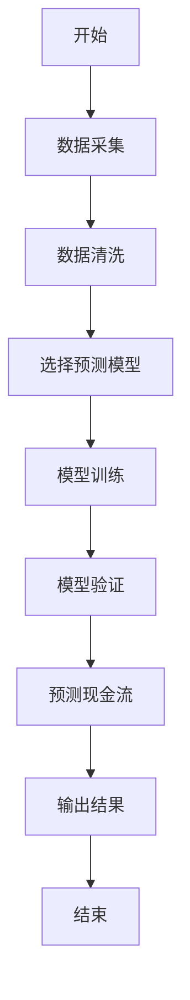
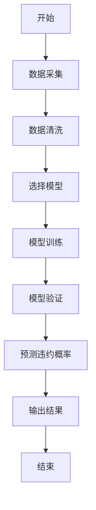
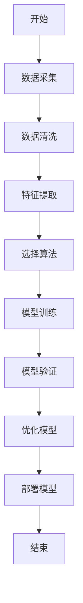
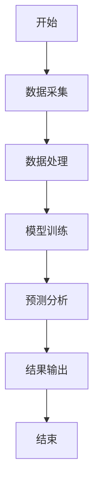
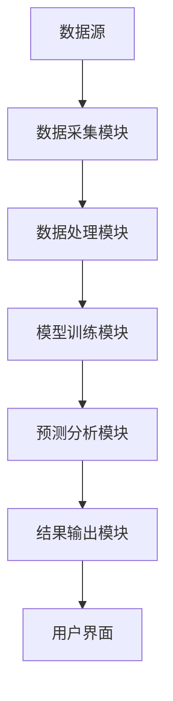
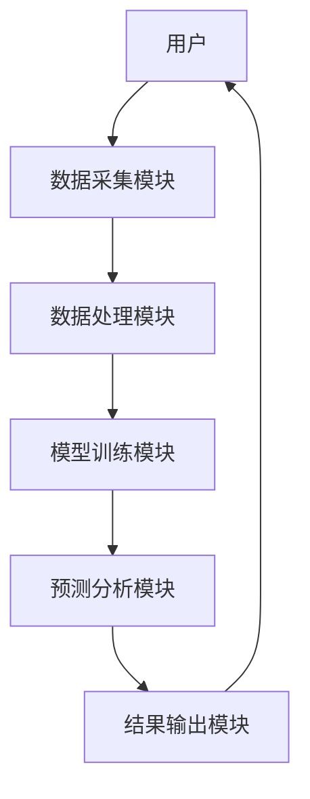

                 


# 构建智能化的资产证券化信用增级优化模型

> 关键词：资产证券化，信用增级，机器学习，现金流预测，违约概率

> 摘要：本文深入探讨了如何利用人工智能技术构建智能化的资产证券化信用增级优化模型。文章从资产证券化与信用增级的基本概念入手，详细分析了信用增级的核心原理，结合机器学习算法和数学模型，提出了基于现金流预测和违约概率的信用增级优化方案。同时，文章通过系统架构设计和项目实战，展示了如何将理论应用于实际，为读者提供了一套完整的智能化信用增级解决方案。

---

## 第一部分: 资产证券化与信用增级概述

### 第1章: 资产证券化与信用增级的基本概念

#### 1.1 资产证券化的定义与特点
资产证券化是一种将缺乏流动性的资产转化为可流通的证券的过程。其核心在于将资产池中的现金流进行分割、重组，并通过信用评级和增级手段，提高证券的信用等级，从而吸引更多的投资者。

#### 1.1.1 资产证券化的定义
资产证券化是指将一组具有未来现金流的资产（如贷款、应收账款等）打包，形成一个资产池，并通过结构化技术将其转化为可以在市场上流通的证券。这种证券通常分为优先级和次级两种，优先级证券的信用评级较高，次级证券则承担更大的风险。

#### 1.1.2 资产证券化的核心特点
1. **流动性增强**：将原本流动性较低的资产转化为可流通的证券。
2. **风险隔离**：通过结构化设计，将资产池的风险与原始发行人分离。
3. **信用增级**：通过外部增级机构或内部结构设计，提高证券的信用评级。

#### 1.1.3 资产证券化与传统融资方式的区别
| 特性                | 资产证券化                | 传统融资方式            |
|---------------------|--------------------------|-------------------------|
| 融资基础            | 资产池的现金流            | 企业的整体信用          |
| 风险承担            | 投资者按资产池风险分担    | 企业承担全部风险        |
| 信用评级            | 证券化后可提升信用等级    | 依赖企业自身信用        |

#### 1.2 信用增级的基本概念
信用增级是指通过某种方式提高资产证券的信用评级，从而降低投资者的风险 Perception。常见的信用增级方式包括设置优先级和次级证券、引入第三方担保或保险机制等。

#### 1.2.1 信用增级的定义
信用增级是指通过结构化设计或外部担保等方式，提高资产证券的信用评级，使其更符合投资者的风险偏好。

#### 1.2.2 信用增级的主要方式
1. **优先级与次级结构**：优先级证券的信用评级较高，次级证券则吸收大部分风险。
2. **第三方担保**：由第三方机构提供担保，承诺在发生违约时承担部分或全部损失。
3. **超额抵押**：通过提供超额抵押品，降低违约风险。

#### 1.2.3 信用增级在资产证券化中的作用
信用增级是资产证券化成功的关键因素之一。通过信用增级，可以吸引更多投资者，降低融资成本，并提高资产证券的市场流动性。

#### 1.3 资产证券化中的信用风险
信用风险是资产证券化过程中需要重点关注的风险之一。资产池中资产的违约概率和违约损失率直接影响证券的信用评级和市场价值。

#### 1.3.1 信用风险的定义与分类
信用风险是指债券发行人或资产池中的债务人未能按期偿还债务的风险。根据风险来源的不同，信用风险可以分为系统性风险和非系统性风险。

#### 1.3.2 资产证券化中的信用风险来源
1. **资产池的质量**：资产池中资产的违约概率和损失率直接影响证券的信用评级。
2. **市场波动**：宏观经济波动可能影响资产池的整体信用质量。
3. **结构设计缺陷**：结构化设计不合理可能导致风险无法有效分散。

#### 1.3.3 信用风险对投资者的影响
信用风险直接影响投资者的收益和本金安全。信用评级越高，投资者面临的信用风险越小，投资回报也越稳定。

### 第2章: 资产证券化信用增级的背景与需求

#### 2.1 资产证券化市场的现状与发展趋势
资产证券化市场近年来发展迅速，尤其是在金融创新和技术进步的推动下，智能化信用增级成为市场的重要需求。

#### 2.1.1 全球资产证券化市场的规模与结构
全球资产证券化市场规模庞大，涵盖房地产、汽车贷款、应收账款等多种资产类型。近年来，随着技术的进步，智能化信用增级逐渐成为市场主流。

#### 2.1.2 中国资产证券化市场的特点与发展
中国资产证券化市场起步较晚，但发展迅速。随着金融改革的推进，资产证券化在盘活存量资产、优化融资结构方面发挥了重要作用。

#### 2.1.3 资产证券化在金融创新中的地位
资产证券化是金融创新的重要组成部分，通过结构化设计和信用增级，为市场提供了更多元的金融产品和融资方式。

#### 2.2 信用增级在资产证券化中的必要性
信用增级是资产证券化成功的关键因素之一，通过提高证券的信用评级，可以吸引更多投资者，降低融资成本。

#### 2.2.1 信用增级的经济意义
信用增级通过提高证券的信用评级，降低了投资者的风险 Perception，从而提高了资产证券的市场价值和流动性。

#### 2.2.2 投资者对信用增级的需求
投资者通常对高信用评级的证券需求更高，信用增级可以满足投资者对低风险产品的偏好。

#### 2.2.3 信用增级对发行人的价值
信用增级可以帮助发行人降低融资成本，扩大融资规模，并提高资产证券的市场认可度。

#### 2.3 智能化信用增级的需求驱动
随着数据科学和人工智能技术的发展，智能化信用增级成为可能。

#### 2.3.1 传统信用增级方式的局限性
传统信用增级方式依赖人工判断，效率低、成本高，且容易受到主观因素的影响。

#### 2.3.2 数据驱动与人工智能技术的兴起
大数据和人工智能技术的兴起为信用增级提供了新的工具和方法，可以通过机器学习算法自动分析资产池的风险特征，优化信用增级方案。

#### 2.3.3 智能化信用增级的市场前景
智能化信用增级能够提高信用增级的效率和准确性，降低成本，未来有望成为资产证券化的主流方式。

---

## 第二部分: 资产证券化信用增级模型的核心概念与原理

### 第3章: 资产池与现金流预测模型

#### 3.1 资产池的基本概念
资产池是资产证券化的核心，由一组具有未来现金流的资产组成。

#### 3.1.1 资产池的定义与构成
资产池由一组具有相似信用特征的资产组成，通常包括贷款、应收账款、租赁等。

#### 3.1.2 资产池的分类与选择标准
资产池可以分为住宅抵押贷款、商业抵押贷款、应收账款等多种类型，选择标准包括资产的信用质量、期限、规模等。

#### 3.1.3 资产池的质量评估指标
资产池的质量评估指标包括违约概率（PD）、违约损失率（LGD）、回收率（RR）等。

#### 3.2 现金流预测模型
现金流预测模型是资产证券化中的关键组成部分，用于预测资产池未来产生的现金流。

#### 3.2.1 现金流预测的基本原理
现金流预测模型基于资产池的历史数据和市场环境，预测未来现金流的分布和规模。

#### 3.2.2 现金流预测的关键因素
现金流预测的关键因素包括资产池的违约率、回收率、利率变动、宏观经济指标等。

#### 3.2.3 现金流预测的数学模型
现金流预测模型可以通过蒙特卡洛模拟、时间序列分析等方法进行建模。

#### 3.3 现金流预测的数学模型
现金流预测模型可以通过以下公式进行建模：
$$
CF_t = \sum_{i=1}^{n} (1 - PD_i) \times LGD_i \times A_i
$$
其中，$CF_t$ 表示第 $t$ 期的现金流，$PD_i$ 是资产 $i$ 的违约概率，$LGD_i$ 是违约损失率，$A_i$ 是资产 $i$ 的面值。

#### 3.4 现金流预测的流程图


#### 3.5 现金流预测的Python代码实现
```python
import numpy as np
import pandas as pd
from sklearn.linear_model import LinearRegression

# 数据准备
data = pd.DataFrame({
    '违约概率': [0.05, 0.03, 0.02, 0.04, 0.06],
    '违约损失率': [0.3, 0.2, 0.25, 0.35, 0.4],
    '面值': [100, 200, 150, 250, 300]
})

# 模型训练
model = LinearRegression()
X = data[['违约概率', '违约损失率']]
y = data['面值']
model.fit(X, y)

# 预测现金流
predicted_CF = model.predict(X)
print(predicted_CF)
```

---

### 第4章: 信用评分与违约概率模型

#### 4.1 信用评分的基本概念
信用评分是评估资产池信用质量的重要指标，通常用于确定证券的信用评级。

#### 4.1.1 信用评分的定义与作用
信用评分是通过一系列指标和模型，对资产池的信用风险进行量化评估。

#### 4.1.2 信用评分的主要方法
信用评分的主要方法包括线性回归、逻辑回归、决策树等。

#### 4.1.3 信用评分的评价标准
信用评分的评价标准包括准确率、召回率、F1分数等。

#### 4.2 违约概率模型
违约概率模型是信用评分的核心，用于预测资产池中资产的违约概率。

#### 4.2.1 违约概率的定义与计算
违约概率是指资产在未来一定时期内违约的可能性。

#### 4.2.2 违约概率的影响因素
违约概率的影响因素包括宏观经济指标、行业风险、资产池的结构等。

#### 4.2.3 违约概率的数学表达式
违约概率可以通过以下公式计算：
$$
PD = P(违约 | 资产池特征)
$$

#### 4.3 违约概率模型的流程图


#### 4.4 违约概率模型的Python代码实现
```python
import numpy as np
import pandas as pd
from sklearn.svm import SVC

# 数据准备
data = pd.DataFrame({
    '特征1': [0.1, 0.2, 0.3, 0.4, 0.5],
    '特征2': [0.6, 0.5, 0.4, 0.3, 0.2],
    '违约标志': [0, 1, 0, 1, 0]
})

# 模型训练
model = SVC()
X = data[['特征1', '特征2']]
y = data['违约标志']
model.fit(X, y)

# 预测违约概率
predicted违约概率 = model.predict_proba(X)[:, 1]
print(predicted违约概率)
```

---

### 第5章: 资产证券化信用增级模型的构建与优化

#### 5.1 资产证券化信用增级模型的构建
资产证券化信用增级模型的构建需要结合资产池的现金流预测和违约概率模型。

#### 5.1.1 模型构建的基本步骤
1. 数据采集与清洗
2. 模型选择与训练
3. 模型验证与测试
4. 模型优化与部署

#### 5.1.2 数据采集与处理方法
数据采集可以通过数据库查询、API接口等方式进行，数据处理包括数据清洗、特征提取等。

#### 5.1.3 模型的验证与测试
模型的验证与测试可以通过交叉验证、回测等方法进行，确保模型的稳定性和准确性。

#### 5.2 基于机器学习的信用增级优化
基于机器学习的信用增级优化可以通过以下步骤实现：

#### 5.2.1 机器学习在信用增级中的应用
机器学习可以通过分析资产池的历史数据，预测未来的违约概率和现金流，从而优化信用增级方案。

#### 5.2.2 常见的机器学习算法及其特点
1. 线性回归：适合线性关系的预测。
2. 逻辑回归：适合二分类问题，如违约与非违约。
3. 支持向量机：适合小样本数据的分类和回归。
4. 随机森林：适合高维数据和非线性关系的预测。

#### 5.2.3 机器学习算法在信用增级中的流程图


#### 5.2.4 机器学习算法的Python代码实现
```python
import numpy as np
import pandas as pd
from sklearn.ensemble import RandomForestClassifier

# 数据准备
data = pd.DataFrame({
    '特征1': [0.1, 0.2, 0.3, 0.4, 0.5],
    '特征2': [0.6, 0.5, 0.4, 0.3, 0.2],
    '违约标志': [0, 1, 0, 1, 0]
})

# 模型训练
model = RandomForestClassifier()
X = data[['特征1', '特征2']]
y = data['违约标志']
model.fit(X, y)

# 预测违约概率
predicted违约标志 = model.predict(X)
print(predicted违约标志)
```

---

## 第三部分: 系统分析与架构设计方案

### 第6章: 资产证券化信用增级优化系统的架构设计

#### 6.1 系统功能设计
资产证券化信用增级优化系统需要具备数据采集、模型训练、预测分析、结果输出等功能。

#### 6.1.1 系统功能模块
1. 数据采集模块
2. 数据处理模块
3. 模型训练模块
4. 预测分析模块
5. 结果输出模块

#### 6.1.2 系统功能流程图


#### 6.2 系统架构设计
系统架构设计需要考虑系统的可扩展性、可维护性和高效性。

#### 6.2.1 系统架构图


#### 6.2.2 系统接口设计
系统接口设计需要考虑模块之间的数据传递和功能调用。

#### 6.2.3 系统交互流程图


---

## 第四部分: 项目实战与案例分析

### 第7章: 资产证券化信用增级优化系统的实现

#### 7.1 环境安装与配置
项目实战需要安装Python、NumPy、Pandas、Scikit-learn等库。

#### 7.1.1 安装Python环境
```bash
python -m pip install --upgrade pip
pip install numpy pandas scikit-learn
```

#### 7.1.2 安装NumPy
```bash
pip install numpy
```

#### 7.1.3 安装Pandas
```bash
pip install pandas
```

#### 7.1.4 安装Scikit-learn
```bash
pip install scikit-learn
```

#### 7.2 系统核心实现
系统核心实现包括数据采集、数据处理、模型训练、预测分析和结果输出。

#### 7.2.1 数据采集
```python
import pandas as pd

# 数据采集
data = pd.read_csv('asset_pool.csv')
print(data.head())
```

#### 7.2.2 数据处理
```python
import pandas as pd
from sklearn.impute import SimpleImputer

# 数据清洗
data = data.dropna()
imputer = SimpleImputer(strategy='mean')
data_imputed = imputer.fit_transform(data)
```

#### 7.2.3 模型训练
```python
from sklearn.ensemble import RandomForestClassifier

# 模型训练
model = RandomForestClassifier()
model.fit(X_train, y_train)
```

#### 7.2.4 预测分析
```python
# 预测分析
y_pred = model.predict(X_test)
print(y_pred)
```

#### 7.2.5 结果输出
```python
# 结果输出
print(classification_report(y_test, y_pred))
```

#### 7.3 案例分析与详细解读
案例分析需要结合具体的数据和业务场景，详细解读模型的预测结果和优化方案。

#### 7.3.1 案例分析
假设我们有一个包含1000笔贷款的资产池，我们需要预测未来一年的违约概率。

#### 7.3.2 详细解读
通过模型预测，我们发现违约概率较高的资产集中在信用评分较低的借款人，可以通过调整优先级和次级证券的比例来优化信用增级方案。

#### 7.3.3 案例总结
通过智能化信用增级优化模型，我们可以显著降低资产证券的风险，提高投资者的收益。

---

## 第五部分: 总结与展望

### 第8章: 资产证券化信用增级优化模型的总结与展望

#### 8.1 总结
本文深入探讨了资产证券化信用增级优化模型的构建与优化，通过机器学习算法和数学模型，提出了智能化信用增级的解决方案。

#### 8.2 展望
未来，随着人工智能技术的不断发展，智能化信用增级将更加精准和高效，为资产证券化市场的发展提供更多的可能性。

---

## 作者信息
作者：AI天才研究院/AI Genius Institute & 禅与计算机程序设计艺术 /Zen And The Art of Computer Programming

