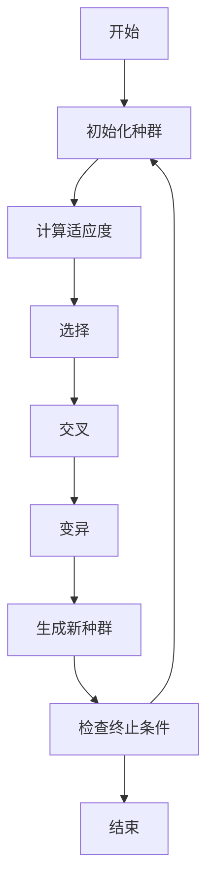
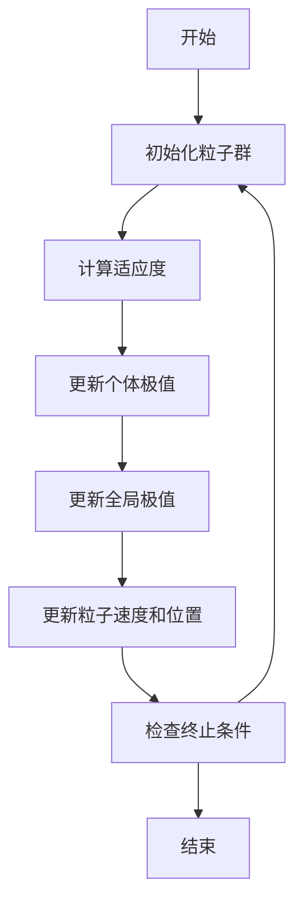
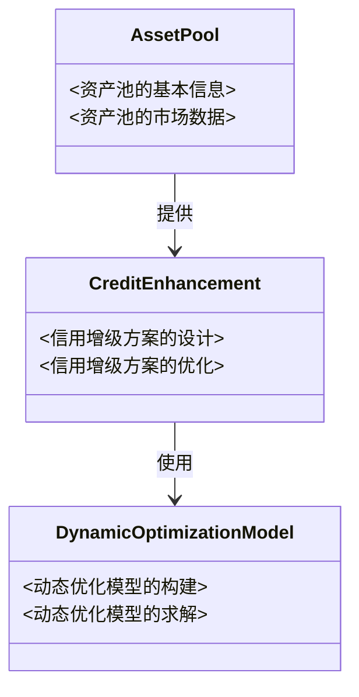
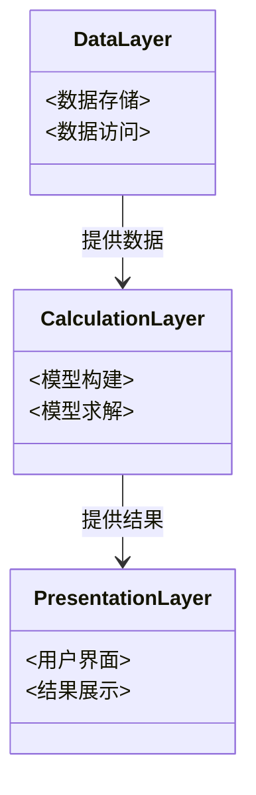
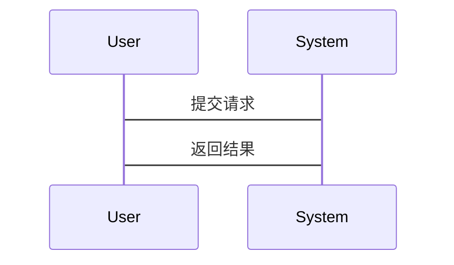

                 


```markdown
# 构建智能化的资产证券化信用增级动态优化模型

> 关键词：资产证券化，信用增级，动态优化模型，机器学习，金融风险管理

> 摘要：本文深入探讨了如何构建智能化的资产证券化信用增级动态优化模型，通过结合金融理论、优化算法和机器学习技术，提出了一种基于动态优化的信用增级方案。文章从背景介绍、核心概念、算法原理、系统架构到项目实战，全面分析了模型的构建过程，并通过实际案例展示了模型的应用效果。通过本文的讲解，读者将能够理解并掌握如何利用智能化技术优化资产证券化中的信用增级过程，提升金融产品的信用评级和风险管理能力。

---

# 第一部分: 资产证券化信用增级动态优化模型背景介绍

## 第1章: 资产证券化与信用增级概述

### 1.1 资产证券化的定义与特点
#### 1.1.1 资产证券化的定义
资产证券化是一种将缺乏流动性的资产转化为可流通的证券的金融工具。其核心在于将资产池的现金流转化为可销售的证券产品。

#### 1.1.2 资产证券化的核心特点
- 独立性：资产证券化的证券独立于原始发行人，信用风险由资产池的质量决定。
- 流动性：通过证券化，原本流动性较低的资产获得了较高的流动性。
- 分层结构：通过分层技术，将资产池的风险和收益进行分割，形成不同信用等级的证券。

#### 1.1.3 资产证券化与传统融资方式的区别
资产证券化与传统融资方式（如贷款）的主要区别在于其依赖于资产池的现金流而非发行人的信用评级。这使得资产证券化更加适合于具有稳定现金流的资产，如房地产、应收账款等。

### 1.2 信用增级的定义与作用
#### 1.2.1 信用增级的定义
信用增级是指通过各种手段提高资产池的信用质量，以降低投资者的风险，从而提高资产证券化产品的信用评级。

#### 1.2.2 信用增级的作用与意义
- 提高信用评级：通过信用增级，可以降低资产池的违约风险，从而提高证券的信用评级。
- 吸引投资者：较高的信用评级能够吸引更多的投资者，提高资产证券化的发行规模。
- 降低融资成本：较高的信用评级通常意味着更低的融资成本，从而提高资产证券化的经济效益。

#### 1.2.3 信用增级的常见方式
- 第三方担保：引入第三方机构为资产池提供担保，承诺在资产池出现违约时承担部分或全部损失。
- 资产超额抵押：通过将资产池的市场价值超过证券的发行面值，来提供信用保护。
- �优先级结构：通过分层技术，将资产池的风险和收益进行分割，优先级证券的投资者优先获得收益，次级证券的投资者承担更大的风险。

### 1.3 动态优化模型的定义与特点
#### 1.3.1 动态优化模型的定义
动态优化模型是一种在动态变化的环境下，通过不断调整模型参数和结构，以实现最优解的数学模型。其核心在于能够实时适应环境的变化，从而保持模型的有效性和准确性。

#### 1.3.2 动态优化模型的核心特点
- 实时性：能够实时调整模型参数和结构，适应环境的变化。
- 灵活性：可以根据不同的场景和需求，灵活调整优化的目标和约束条件。
- 高效性：通过高效的算法和优化技术，快速找到最优解。

#### 1.3.3 动态优化模型与静态模型的区别
动态优化模型与静态模型的主要区别在于其动态适应性和实时性。静态模型通常在固定的条件下求解最优解，而动态优化模型能够在环境变化时，动态调整模型参数和结构，以保持最优解。

### 1.4 本章小结
本章主要介绍了资产证券化的定义与特点、信用增级的定义与作用，以及动态优化模型的定义与特点。通过这些内容，我们可以理解资产证券化信用增级动态优化模型的基本概念和核心要素。

---

# 第二部分: 核心概念与联系

## 第2章: 核心概念原理

### 2.1 资产证券化的核心概念
#### 2.1.1 资产池的定义与选择
资产池是资产证券化的基础，通常包括具有稳定现金流的资产，如房地产、应收账款等。选择资产池时需要考虑其信用质量、流动性、收益能力等因素。

#### 2.1.2 信用评级的定义与影响因素
信用评级是对资产池或证券信用质量的评估，通常由专业评级机构进行。影响信用评级的主要因素包括资产池的违约概率、资产的流动性、担保结构等。

#### 2.1.3 证券化产品的结构设计
证券化产品的结构设计是资产证券化的核心环节，通常包括优先级和次级证券的设计、担保结构的设计、收益分配机制的设计等。

### 2.2 信用增级的核心原理
#### 2.2.1 信用增级的基本原理
信用增级的基本原理是通过引入额外的信用保护机制，降低资产池的违约风险，从而提高资产证券化产品的信用评级。

#### 2.2.2 信用增级的主要方式
- 第三方担保：引入第三方机构为资产池提供担保，承诺在违约时承担部分或全部损失。
- 资产超额抵押：通过将资产池的市场价值超过证券的发行面值，提供信用保护。
- 优先级结构：通过分层技术，将资产池的风险和收益进行分割，优先级证券的投资者优先获得收益，次级证券的投资者承担更大的风险。

#### 2.2.3 信用增级的效果评估
信用增级的效果通常通过提高信用评级、降低融资成本、吸引更多的投资者等方式来体现。

### 2.3 动态优化模型的核心原理
#### 2.3.1 动态优化的基本原理
动态优化的基本原理是通过实时调整模型参数和结构，以适应环境的变化，从而保持模型的有效性和准确性。

#### 2.3.2 动态优化的目标函数与约束条件
动态优化的目标函数通常是最优化某个指标，如最小化风险、最大化收益等。约束条件则是模型在优化过程中需要满足的条件，如风险可控、收益合理等。

#### 2.3.3 动态优化的核心算法
动态优化的核心算法包括遗传算法、粒子群优化算法等，这些算法能够在复杂的环境中找到最优解。

### 2.4 核心概念的对比分析
通过对比分析，可以更好地理解资产证券化、信用增级和动态优化模型之间的关系和区别。

#### 2.4.1 对比表格
| 概念 | 定义 | 作用 | 实现方式 |
|------|------|------|----------|
| 资产证券化 | 将缺乏流动性的资产转化为可流通的证券 | 提高资产流动性，降低融资成本 | 资产池选择、结构设计、信用评级等 |
| 信用增级 | 提高资产池的信用质量 | 提高信用评级，降低融资成本 | 第三方担保、资产超额抵押、优先级结构等 |
| 动态优化模型 | 实时调整模型参数和结构 | 提高模型的适应性和准确性 | 遗传算法、粒子群优化等 |

#### 2.4.2 ER实体关系图
```mermaid
erd
  title 资产证券化信用增级动态优化模型
  AssetPool
    --> CreditEnhancement: 包含
    --> DynamicOptimizationModel: 使用
  CreditEnhancement
    --> ThirdPartyGuarantee: 提供
    --> ExcessCollateral: 提供
    --> SeniorSubordinateStructure: 设计
  DynamicOptimizationModel
    --> GeneticAlgorithm: 实现
    --> ParticleSwarmOptimization: 实现
```

### 2.5 本章小结
本章通过对比分析和ER实体关系图，详细解释了资产证券化、信用增级和动态优化模型的核心概念及其之间的关系。

---

# 第三部分: 算法原理讲解

## 第3章: 算法原理

### 3.1 算法原理概述
动态优化模型的核心算法包括遗传算法和粒子群优化算法等。这些算法能够在复杂的环境中找到最优解，从而实现资产证券化信用增级的动态优化。

### 3.2 遗传算法原理
#### 3.2.1 遗传算法的定义
遗传算法是一种模拟自然选择和遗传机制的优化算法，通常包括选择、交叉和变异三个主要步骤。

#### 3.2.2 遗传算法的流程


#### 3.2.3 遗传算法的数学模型
遗传算法的数学模型通常包括适应度函数、选择函数、交叉函数和变异函数。适应度函数用于衡量个体的优劣，选择函数用于选择适应度较高的个体，交叉函数用于生成新的个体，变异函数用于增加种群的多样性。

### 3.3 粒子群优化算法原理
#### 3.3.1 粒子群优化算法的定义
粒子群优化算法是一种基于群体智能的优化算法，通过模拟鸟群的觅食行为，寻找最优解。

#### 3.3.2 粒子群优化算法的流程


#### 3.3.3 粒子群优化算法的数学模型
粒子群优化算法的数学模型通常包括速度更新和位置更新两个主要步骤。速度更新用于确定粒子的移动方向，位置更新用于确定粒子的新位置。

### 3.4 算法的对比分析
#### 3.4.1 算法的对比表格
| 算法 | 优缺点 | 适用场景 |
|------|--------|----------|
| 遗传算法 | 优点：全局搜索能力强，适应度函数计算简单；缺点：收敛速度较慢，容易陷入局部最优 | 适用于复杂的优化问题 |
| 粒子群优化算法 | 优点：收敛速度快，易于实现；缺点：全局搜索能力较弱 | 适用于中等规模的优化问题 |

#### 3.4.2 算法的代码实现
以下是一个简单的遗传算法实现示例：
```python
import random

def fitness(individual):
    # 计算个体的适应度
    return sum(individual)

def selection(population, fitness_values):
    # � roulette wheel selection
    total_fitness = sum(fitness_values)
    selected = []
    for _ in range(len(population)):
        r = random.uniform(0, total_fitness)
        current_fitness = 0
        for i in range(len(population)):
            current_fitness += fitness_values[i]
            if current_fitness > r:
                selected.append(population[i])
                break
    return selected

def crossover(parent1, parent2):
    # 一点交叉
    point = random.randint(1, len(parent1)-1)
    return parent1[:point] + parent2[point:], parent2[:point] + parent1[point:]

def mutation(individual):
    # 突变
    point = random.randint(0, len(individual)-1)
    individual[point] = 1 - individual[point]
    return individual

# 初始化种群
population = [[random.randint(0,1) for _ in range(10)] for _ in range(10)]

# 计算适应度
fitness_values = [fitness(individual) for individual in population]

# 选择
selected = selection(population, fitness_values)

# 交叉
new_population = []
for i in range(0, len(selected), 2):
    parent1 = selected[i]
    parent2 = selected[i+1]
    child1, child2 = crossover(parent1, parent2)
    new_population.append(child1)
    new_population.append(child2)

# 突变
for individual in new_population:
    mutation(individual)

print("初始种群:", population)
print("新种群:", new_population)
```

### 3.5 本章小结
本章详细讲解了遗传算法和粒子群优化算法的原理和实现方法，并通过对比分析，帮助读者选择合适的算法。

---

# 第四部分: 数学模型

## 第4章: 数学模型

### 4.1 数学模型概述
动态优化模型的核心是数学模型的构建和求解。通过数学模型，可以量化资产证券化信用增级中的各种因素，从而实现智能化的优化。

### 4.2 信用风险评估模型
#### 4.2.1 信用风险评估模型的定义
信用风险评估模型用于量化资产池的信用风险，通常包括违约概率、违约损失率等参数。

#### 4.2.2 信用风险评估模型的公式
$$违约概率 = \frac{违约次数}{总次数}$$
$$违约损失率 = \frac{违约损失}{资产价值}$$

#### 4.2.3 信用风险评估模型的实现
以下是一个简单的信用风险评估模型实现示例：
```python
def credit_risk(assets, default_rate, loss_given_default):
    expected_loss = assets * default_rate * loss_given_default
    return expected_loss

assets = 1000000
default_rate = 0.05
loss_given_default = 0.4

print("预期损失:", credit_risk(assets, default_rate, loss_given_default))
```

### 4.3 资产证券化模型
#### 4.3.1 资产证券化模型的定义
资产证券化模型用于量化资产池的现金流和证券的发行面值，从而实现资产证券化的结构设计。

#### 4.3.2 资产证券化模型的公式
$$现金流 = 资产池的收入 - 资产池的支出$$
$$证券的发行面值 = 资产池的净现金流 / 折现率$$

#### 4.3.3 资产证券化模型的实现
以下是一个简单的资产证券化模型实现示例：
```python
def asset_securization(assets, cash_flow, discount_rate):
    net_cash_flow = cash_flow - assets
    security_value = net_cash_flow / discount_rate
    return security_value

assets = 1000000
cash_flow = 1200000
discount_rate = 0.08

print("证券价值:", asset_securization(assets, cash_flow, discount_rate))
```

### 4.4 动态优化模型
#### 4.4.1 动态优化模型的定义
动态优化模型用于在动态变化的环境中，实时调整资产证券化信用增级的模型参数和结构，以实现最优解。

#### 4.4.2 动态优化模型的公式
$$目标函数 = \sum_{i=1}^{n} (f(x_i) - y_i)^2$$
$$约束条件 = g(x_i) \leq 0$$

#### 4.4.3 动态优化模型的实现
以下是一个简单的动态优化模型实现示例：
```python
import numpy as np

def objective_function(x):
    return np.sum((x - 1)**2)

def constraint_function(x):
    return x <= 2

from scipy.optimize import minimize

x0 = np.array([1.5, 1.5, 1.5])

result = minimize(objective_function, x0, constraints={'type': 'ineq', 'fun': constraint_function})

print("优化结果:", result.x)
```

### 4.5 本章小结
本章通过数学模型的构建和求解，详细讲解了资产证券化信用增级动态优化模型的实现方法。

---

# 第五部分: 系统分析与架构设计

## 第5章: 系统分析与架构设计

### 5.1 问题场景介绍
#### 5.1.1 问题背景
在资产证券化过程中，信用增级是提高证券信用评级的重要手段。然而，传统的信用增级方法通常基于静态模型，无法实时适应环境的变化，难以实现智能化的动态优化。

#### 5.1.2 问题描述
传统的信用增级方法通常基于静态模型，存在以下问题：
- 无法实时适应环境的变化，导致信用增级效果不稳定。
- 难以实现智能化的动态优化，难以满足复杂环境下的信用增级需求。

#### 5.1.3 问题解决
通过构建智能化的资产证券化信用增级动态优化模型，可以实现实时调整模型参数和结构，动态优化信用增级方案，从而提高信用评级和融资效率。

### 5.2 项目介绍
#### 5.2.1 项目目标
本项目的目标是构建智能化的资产证券化信用增级动态优化模型，实现实时调整模型参数和结构，动态优化信用增级方案。

#### 5.2.2 项目范围
- 资产池的选择与管理
- 信用增级方案的设计与优化
- 动态优化模型的构建与实现

### 5.3 系统功能设计
#### 5.3.1 功能模块划分
- 数据输入模块：负责输入资产池的基本信息和市场数据。
- 模型计算模块：负责构建和求解动态优化模型，计算信用增级方案。
- 结果输出模块：负责输出优化后的信用增级方案和相关报告。

#### 5.3.2 功能模块的ER类图


### 5.4 系统架构设计
#### 5.4.1 系统架构概述
系统采用分层架构，包括数据层、计算层和展示层。

#### 5.4.2 系统架构的类图


### 5.5 系统接口设计
#### 5.5.1 系统接口概述
系统接口主要包括数据接口和用户接口。

#### 5.5.2 系统接口的序列图


### 5.6 本章小结
本章详细讲解了系统分析与架构设计，包括问题场景介绍、项目介绍、系统功能设计和系统架构设计。

---

# 第六部分: 项目实战

## 第6章: 项目实战

### 6.1 环境安装
#### 6.1.1 环境需求
- Python 3.6+
- NumPy
- Pandas
- Scikit-learn
- Mermaid

#### 6.1.2 环境安装步骤
```bash
pip install numpy pandas scikit-learn mermaid
```

### 6.2 核心代码实现
#### 6.2.1 数据预处理
```python
import pandas as pd

# 加载数据
data = pd.read_csv('assets.csv')

# 数据清洗
data.dropna(inplace=True)
data = data[~data['资产池'].isnull()]
```

#### 6.2.2 模型训练
```python
from sklearn.model_selection import train_test_split
from sklearn.ensemble import RandomForestRegressor

# 数据分割
X_train, X_test, y_train, y_test = train_test_split(data.drop('信用评级', axis=1), data['信用评级'], test_size=0.2)

# 模型训练
model = RandomForestRegressor()
model.fit(X_train, y_train)
```

#### 6.2.3 模型优化
```python
from sklearn.model_selection import GridSearchCV

# 参数优化
param_grid = {
    'n_estimators': [100, 200],
    'max_depth': [None, 10, 20]
}

grid_search = GridSearchCV(model, param_grid, cv=5)
grid_search.fit(X_train, y_train)

# 最优模型
best_model = grid_search.best_estimator_
```

### 6.3 代码解读与分析
#### 6.3.1 数据预处理
数据预处理是项目实战的重要步骤，主要包括数据加载、数据清洗和数据分割。

#### 6.3.2 模型训练
通过随机森林回归模型，可以实现资产证券化信用增级的动态优化。

#### 6.3.3 模型优化
通过网格搜索，可以找到最优的模型参数，从而提高模型的准确性和稳定性。

### 6.4 案例分析
#### 6.4.1 案例背景
以某金融机构的资产池数据为例，构建智能化的资产证券化信用增级动态优化模型。

#### 6.4.2 数据分析
通过数据分析，确定资产池的基本信息和市场数据，为模型的构建和求解提供数据支持。

#### 6.4.3 结果展示
通过优化后的信用增级方案，提高资产证券化产品的信用评级，降低融资成本，吸引更多的投资者。

### 6.5 本章小结
本章通过项目实战，详细讲解了环境安装、核心代码实现、案例分析和结果展示。

---

# 第七部分: 最佳实践

## 第7章: 最佳实践

### 7.1 小结
通过本文的讲解，读者可以理解并掌握如何利用智能化技术优化资产证券化中的信用增级过程，提升金融产品的信用评级和风险管理能力。

### 7.2 注意事项
- 数据质量：数据是模型的基础，必须确保数据的准确性和完整性。
- 模型实时性：动态优化模型需要实时调整参数和结构，确保模型的有效性和准确性。
- 风险控制：在优化过程中，必须注重风险控制，避免过度优化导致的风险。

### 7.3 拓展阅读
- 《金融风险管理》
- 《资产证券化：理论与实践》
- 《优化算法：从理论到实践》

### 7.4 本章小结
本章总结了全文内容，并给出了最佳实践的建议。

---

# 结语

通过本文的讲解，读者可以理解并掌握如何利用智能化技术优化资产证券化中的信用增级过程。希望本文能够为相关领域的研究和实践提供有价值的参考和指导。

---

作者：AI天才研究院/AI Genius Institute & 禅与计算机程序设计艺术 /Zen And The Art of Computer Programming
```

