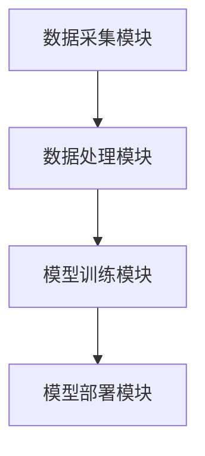
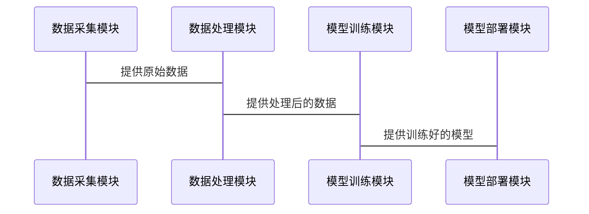

                 


# 构建智能化的资产证券化定价模型

> 关键词：资产证券化定价模型，智能化，时间序列分析，机器学习，系统架构设计

> 摘要：本文详细探讨了如何构建智能化的资产证券化定价模型，从背景介绍到数学基础，从模型构建到系统架构设计，再到项目实战，全面解析了该模型的构建过程。文章通过详细的技术分析和实际案例，展示了如何利用时间序列分析、机器学习等技术来提高资产证券化定价的准确性和效率。

---

## 第1章: 资产证券化定价模型概述

### 1.1 资产证券化的定义与流程

#### 1.1.1 资产证券化的定义
资产证券化（Asset Securitization）是一种将流动性较低的资产转化为可流通的证券的过程。通过将资产池中的现金流进行结构化处理，发行相应的证券，投资者可以通过购买这些证券获得收益。

#### 1.1.2 资产证券化的基本流程
1. **资产池的构建**：选择一组具有相似风险和收益特征的资产，形成资产池。
2. **信用增级**：通过结构化设计，提高资产池的信用评级，降低投资者的风险。
3. **证券发行**：根据资产池的现金流情况，发行不同期限和风险等级的证券。
4. **现金流分配**：根据证券的条款，将现金流分配给不同优先级的投资者。

#### 1.1.3 资产证券化的核心要素
- **资产池**：资产池中的资产决定了证券的收益和风险。
- **结构化设计**：通过结构化设计，优化资产池的现金流分配。
- **信用评级**：信用评级是资产证券化成功的关键因素之一。

### 1.2 资产证券化定价模型的背景

#### 1.2.1 传统资产定价模型的局限性
传统的资产定价模型（如CAPM和APT）主要基于市场风险和资产的贝塔系数进行定价，但在实际操作中，这些模型难以捕捉资产池的复杂性和动态变化。

#### 1.2.2 智能化定价的需求
随着金融市场的复杂化，传统的定价模型已无法满足需求。智能化定价模型能够利用大数据和机器学习技术，更准确地预测资产池的现金流和风险。

#### 1.2.3 资产证券化定价模型的现状
当前，资产证券化定价模型主要依赖于传统的统计方法和简单的机器学习模型。然而，随着计算能力的提升和数据量的增加，更复杂的模型（如深度学习模型）逐渐被引入。

### 1.3 资产证券化定价模型的核心概念

#### 1.3.1 资产证券化定价模型的定义
资产证券化定价模型是一种利用数学模型和算法，对资产池的现金流进行预测和定价的模型。

#### 1.3.2 模型的输入与输出
- **输入**：资产池的历史数据、市场数据、宏观经济指标等。
- **输出**：证券的预期收益率、信用评级、风险评估等。

#### 1.3.3 模型的分类与特点
- **传统模型**：基于统计方法，如ARIMA模型。
- **机器学习模型**：基于深度学习和神经网络的模型。
- **混合模型**：结合传统统计方法和机器学习技术的模型。

## 第2章: 时间序列分析与预测

### 2.1 时间序列的基本概念

#### 2.1.1 时间序列的定义
时间序列是一种按时间顺序排列的数据序列，通常用于分析数据的变动趋势和周期性。

#### 2.1.2 时间序列的分类
- **平稳时间序列**：均值和方差恒定。
- **非平稳时间序列**：均值或方差随时间变化。

#### 2.1.3 时间序列分析的方法
- **趋势分析**：识别数据的长期趋势。
- **周期性分析**：识别数据的周期性波动。
- **异常值检测**：识别数据中的异常点。

### 2.2 时间序列预测模型

#### 2.2.1 ARIMA模型
ARIMA（Autoregressive Integrated Moving Average）模型是一种广泛应用于时间序列预测的经典模型。其基本思想是通过自回归和移动平均的组合，对数据进行预测。

#### 2.2.2 LSTM模型
长短期记忆网络（LSTM）是一种基于循环神经网络（RNN）的深度学习模型，特别适用于处理长序列数据。

#### 2.2.3 Prophet模型
Prophet模型是由Facebook开源的一种时间序列预测模型，适用于具有较强周期性的数据。

### 2.3 时间序列预测的数学公式

#### 2.3.1 ARIMA模型的公式
$$ ARIMA(p, d, q) $$
其中，p为自回归阶数，d为差分阶数，q为移动平均阶数。

#### 2.3.2 LSTM模型的公式
LSTM模型通过门控机制来控制信息的流动，其核心公式包括输入门、遗忘门和输出门。

#### 2.3.3 Prophet模型的公式
Prophet模型的数学公式较为复杂，主要包括趋势预测、周期性预测和噪声预测三个部分。

### 2.4 时间序列预测的实现

#### 2.4.1 数据预处理
- **数据清洗**：处理缺失值和异常值。
- **数据转换**：对数据进行标准化或归一化处理。

#### 2.4.2 模型训练
- **训练数据分割**：将数据分为训练集和验证集。
- **模型调参**：通过交叉验证调整模型参数。

#### 2.4.3 模型预测与评估
- **预测结果**：生成未来时间段内的预测值。
- **模型评估**：通过均方误差（MSE）、平均绝对误差（MAE）等指标评估模型性能。

## 第3章: 资产证券化定价模型的构建与实现

### 3.1 数据采集与预处理

#### 3.1.1 数据来源
- **资产池数据**：包括资产的现金流、期限和风险等级等。
- **市场数据**：包括利率、汇率和市场指数等。
- **宏观经济指标**：包括GDP增长率、通货膨胀率等。

#### 3.1.2 数据清洗
- **处理缺失值**：使用均值、中位数或插值法填充缺失值。
- **处理异常值**：通过箱线图或Z-score方法识别并处理异常值。

#### 3.1.3 数据特征工程
- **特征提取**：从原始数据中提取有用的特征，如资产池的平均收益率、波动率等。
- **特征选择**：通过相关性分析或特征重要性排序选择关键特征。

### 3.2 模型训练与优化

#### 3.2.1 模型选择
- **传统模型**：如ARIMA模型。
- **机器学习模型**：如LSTM模型和随机森林模型。

#### 3.2.2 模型训练
- **数据分割**：将数据分为训练集、验证集和测试集。
- **模型调参**：通过网格搜索或随机搜索优化模型参数。

#### 3.2.3 模型优化
- **正则化方法**：如L1/L2正则化，防止模型过拟合。
- **集成方法**：如投票法和堆叠法，提高模型的泛化能力。

### 3.3 模型评估与优化

#### 3.3.1 模型评估指标
- **均方误差（MSE）**：衡量预测值与真实值之间的差距。
- **平均绝对误差（MAE）**：衡量预测值与真实值之间的绝对差距。
- **R平方值（R²）**：衡量模型的拟合优度。

#### 3.3.2 交叉验证
通过K折交叉验证评估模型的泛化能力，避免过拟合。

#### 3.3.3 超参数优化
使用网格搜索或随机搜索优化模型的超参数，如学习率、批次大小等。

### 3.4 模型部署与应用

#### 3.4.1 模型部署
将训练好的模型部署到生产环境中，实现对新数据的实时预测。

#### 3.4.2 实时监控
通过监控模型的预测结果和性能指标，及时发现并解决问题。

#### 3.4.3 模型维护
定期更新模型，确保其在变化的市场环境中的准确性。

## 第4章: 系统架构设计

### 4.1 系统功能设计

#### 4.1.1 系统模块划分
- **数据采集模块**：负责采集资产池、市场数据和宏观经济指标。
- **数据处理模块**：负责数据清洗、特征工程和数据预处理。
- **模型训练模块**：负责模型训练、调参和优化。
- **模型部署模块**：负责模型部署、实时预测和结果输出。

#### 4.1.2 系统功能流程
1. 数据采集模块从多个数据源获取数据。
2. 数据处理模块对数据进行清洗和特征工程。
3. 模型训练模块利用处理后的数据训练模型。
4. 模型部署模块将训练好的模型部署到生产环境，实现实时预测。

### 4.2 系统架构设计

#### 4.2.1 系统架构图


#### 4.2.2 系统交互图


### 4.3 系统接口设计

#### 4.3.1 数据接口
- **输入接口**：数据采集模块通过API接口获取数据。
- **输出接口**：数据处理模块通过API接口将处理后的数据传递给模型训练模块。

#### 4.3.2 模型接口
- **输入接口**：模型训练模块通过API接口接收处理后的数据。
- **输出接口**：模型训练模块通过API接口将训练好的模型传递给模型部署模块。

## 第5章: 项目实战

### 5.1 项目背景

#### 5.1.1 项目目标
构建一个智能化的资产证券化定价模型，能够对资产池的现金流进行准确预测和定价。

#### 5.1.2 项目需求
- **数据需求**：获取资产池的历史数据、市场数据和宏观经济指标。
- **模型需求**：选择合适的模型进行训练和优化。
- **部署需求**：将模型部署到生产环境，实现实时预测。

### 5.2 项目实现

#### 5.2.1 环境安装
- **安装Python**：安装Python 3.8及以上版本。
- **安装依赖库**：安装numpy、pandas、scikit-learn、keras、tensorflow等依赖库。

#### 5.2.2 核心实现代码
```python
import numpy as np
import pandas as pd
from sklearn.model_selection import train_test_split
from sklearn.metrics import mean_squared_error
from keras.models import Sequential
from keras.layers import LSTM, Dense

# 数据预处理
data = pd.read_csv('asset_data.csv')
features = data.drop('target', axis=1)
target = data['target']

# 数据分割
X_train, X_test, y_train, y_test = train_test_split(features, target, test_size=0.2, random_state=42)

# 模型构建
model = Sequential()
model.add(LSTM(64, input_shape=(X_train.shape[1], 1)))
model.add(Dense(1))
model.compile(optimizer='adam', loss='mean_squared_error')

# 模型训练
model.fit(X_train, y_train, epochs=10, batch_size=32, validation_split=0.2)

# 模型预测
y_pred = model.predict(X_test)
print(mean_squared_error(y_test, y_pred))
```

#### 5.2.3 代码应用解读与分析
上述代码展示了如何使用LSTM模型进行资产证券化定价模型的训练和预测。首先，数据预处理部分对数据进行了清洗和特征工程。然后，数据分割部分将数据分为训练集和测试集。模型构建部分使用LSTM网络进行训练，最后通过模型预测部分对测试数据进行预测，并计算均方误差作为模型的评估指标。

### 5.3 项目小结

#### 5.3.1 最佳实践
- **数据清洗**：确保数据的完整性和准确性。
- **特征工程**：选择合适的特征，提高模型的预测能力。
- **模型选择**：根据数据特征选择合适的模型，避免盲目使用复杂模型。

#### 5.3.2 注意事项
- **数据泄露**：避免在训练过程中泄露测试数据。
- **过拟合问题**：通过正则化和交叉验证防止过拟合。
- **模型维护**：定期更新模型，适应市场变化。

#### 5.3.3 拓展阅读
- **深度学习在金融中的应用**：了解深度学习在金融领域的其他应用。
- **时间序列分析的经典模型**：学习ARIMA、Prophet等经典时间序列模型的原理和应用。

---

## 作者：AI天才研究院/AI Genius Institute & 禅与计算机程序设计艺术 /Zen And The Art of Computer Programming

---

以上是构建智能化的资产证券化定价模型的技术博客文章的完整目录和内容。文章从背景介绍到数学基础，从模型构建到系统架构设计，再到项目实战，全面解析了如何构建智能化的资产证券化定价模型。希望对您有所帮助！

