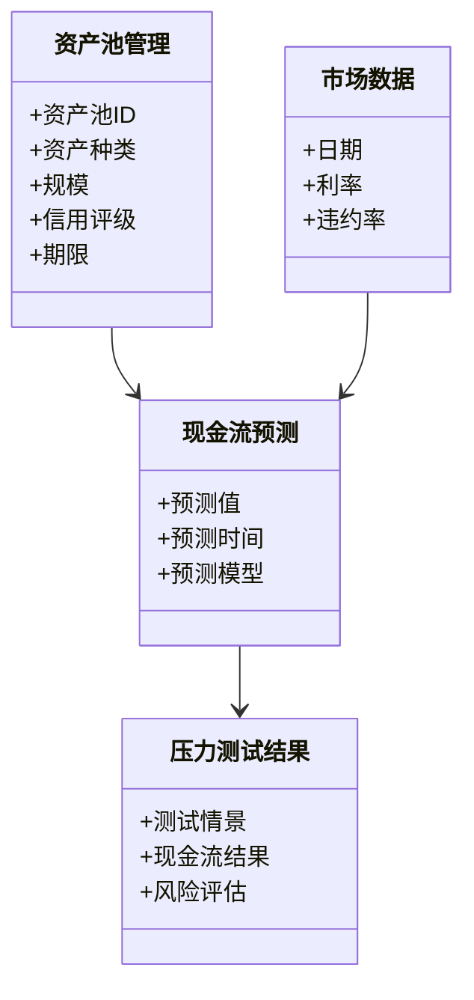
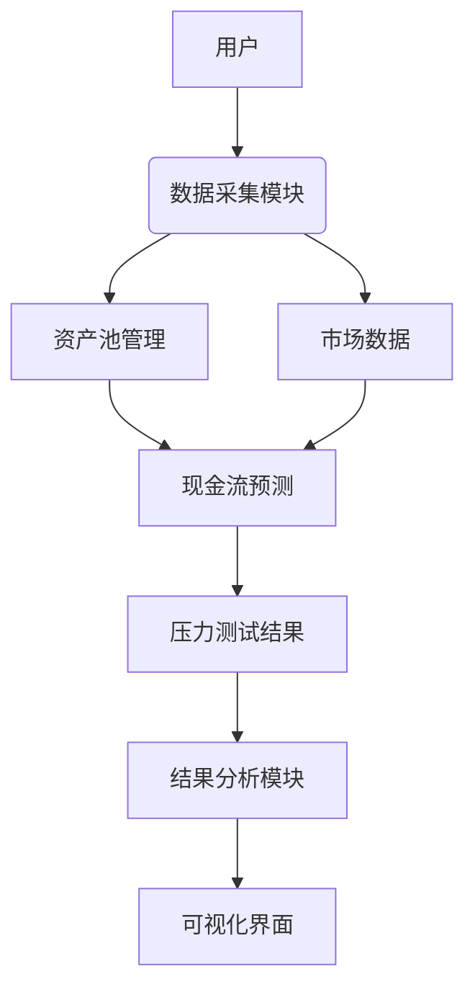

                 


# 构建智能化的资产证券化现金流压力测试模型

## 关键词：资产证券化、现金流压力测试、人工智能、机器学习、蒙特卡洛模拟、系统架构、风险管理

## 摘要：  
在金融市场中，资产证券化是一种重要的融资工具，而现金流压力测试是评估资产证券化产品风险的核心方法。随着人工智能和大数据技术的快速发展，传统的现金流压力测试方法逐渐暴露出效率低下、准确性不足等问题。本文将详细介绍如何利用智能化技术构建现金流压力测试模型，结合机器学习和蒙特卡洛模拟等先进算法，提升测试的效率和准确性。文章从背景、核心概念、算法原理、系统架构到项目实战，全面解析智能化现金流压力测试模型的构建过程，并提供实际案例和代码实现，为金融从业者提供有价值的参考。

---

## 第一章：资产证券化与现金流压力测试背景

### 1.1 资产证券化的基本概念  
资产证券化是指将缺乏流动性的资产转化为可流通证券的过程。其核心在于将资产池的现金流作为支撑，发行证券化产品，实现资金的快速流动。  
- 资产证券化的基本流程包括资产池的选择、结构化设计、信用增级、证券发行和后续管理。  
- 资产池的特征包括资产种类、规模、信用评级、期限等，这些特征直接影响现金流的预测和压力测试的结果。  

### 1.2 现金流压力测试的定义与作用  
现金流压力测试是一种评估资产在极端市场条件下表现的方法，旨在测试资产在不利情景下的抗压能力。  
- 现金流压力测试的常见应用场景包括信用风险评估、资产定价、投资决策等。  
- 通过压力测试，可以识别资产池在不同压力情景下的现金流变化，为证券化产品的风险定价提供依据。  

### 1.3 资产证券化中的现金流压力测试  
在资产证券化中，现金流压力测试的核心是预测资产池在不同压力情景下的现金流表现。  
- 现金流预测需要考虑资产池的违约风险、提前还款率、利率变动等因素。  
- 压力测试结果直接影响证券化产品的信用评级和市场定价。  

### 1.4 传统方法的局限性  
传统的现金流压力测试方法通常基于历史数据分析和线性回归模型，存在以下问题：  
1. 数据依赖性强，难以捕捉极端情景。  
2. 模型复杂度低，难以应对多维度的压力测试需求。  
3. 计算效率低，难以实现实时测试。  

### 1.5 智能化方法的优势  
智能化方法通过引入机器学习和蒙特卡洛模拟等技术，显著提升了现金流压力测试的效率和准确性。  
- 机器学习模型能够自动学习数据中的非线性关系，捕捉复杂的市场动态。  
- 蒙特卡洛模拟可以生成大量可能的市场情景，全面评估资产池的风险敞口。  

---

## 第二章：资产证券化现金流压力测试的核心概念与联系  

### 2.1 资产池的定义与特征  
资产池是资产证券化的核心，其特征直接影响现金流预测和压力测试结果。  
- 资产池的特征包括资产种类、规模、信用评级、期限、地理位置等。  
- 资产池的多样性要求压力测试模型能够处理多维度的输入变量。  

### 2.2 现金流预测的数学模型  
现金流预测是压力测试的基础，常用的时间序列模型包括ARIMA、GARCH等。  
- ARIMA模型通过自回归和移动平均的方式预测未来的现金流。  
- GARCH模型主要用于预测波动性较大的现金流。  

### 2.3 压力测试的情景设定  
压力测试的情景设定是智能化模型的关键，需要考虑多种市场条件。  
- 利率上升、经济衰退、违约率上升等情景是常见的测试场景。  
- 通过情景设定，模型可以评估资产池在不同压力条件下的现金流变化。  

### 2.4 核心概念之间的关系  
- 资产池与现金流的关系：资产池的特征直接影响现金流的生成和波动。  
- 现金流预测与压力测试的关系：现金流预测为压力测试提供基础数据，压力测试则验证预测的准确性。  
- 压力测试结果与资产证券化定价的关系：压力测试结果直接影响证券化产品的信用评级和市场定价。  

### 2.5 核心概念对比表  
| **核心概念** | **传统方法** | **智能化方法** |  
|--------------|---------------|----------------|  
| 数据来源     | 历史数据       | 历史数据+实时数据 |  
| 模型复杂度   | 线性模型       | 非线性模型       |  
| 计算效率     | 较低           | 较高             |  

---

## 第三章：资产证券化现金流压力测试的算法原理  

### 3.1 蒙特卡洛模拟算法  
蒙特卡洛模拟是一种基于随机抽样的数值计算方法，广泛应用于金融风险评估。  
- **实现步骤**：  
  1. 确定输入变量的分布（如资产池的违约率、提前还款率）。  
  2. 生成大量随机样本。  
  3. 计算每种样本下的现金流结果。  
  4. 统计分析结果，得出压力测试结论。  
- **优缺点**：  
  - 优点：能够生成大量可能的市场情景，全面评估风险。  
  - 缺点：计算量较大，需要高性能计算支持。  

### 3.2 机器学习算法在现金流压力测试中的应用  
机器学习算法能够自动学习数据中的非线性关系，提升预测的准确性。  
- **线性回归模型**：适用于线性关系明显的场景，但对非线性关系捕捉能力有限。  
- **支持向量回归模型**：通过构造超平面，能够捕捉复杂的非线性关系。  
- **随机森林模型**：通过集成学习，能够有效处理高维数据，提升预测的鲁棒性。  

### 3.3 算法选择与优化  
- **算法选择的依据**：根据数据特征和业务需求选择合适的模型。  
- **算法优化方法**：包括参数调优、特征选择、模型集成等。  
- **性能评估指标**：常用均方误差（MSE）、R²值等指标评估模型的准确性。  

### 3.4 算法实现的数学模型  
#### 3.4.1 蒙特卡洛模拟的数学公式  
现金流模拟的公式为：  
$$ C(t) = \sum_{i=1}^{n} w_i \cdot f_i(t) $$  
其中，$w_i$ 是权重，$f_i(t)$ 是情景函数。  

#### 3.4.2 机器学习模型的数学公式  
随机森林模型的预测公式为：  
$$ y = \sum_{i=1}^{N} \alpha_{i} \cdot H(w_i, x) $$  
其中，$H$ 是决策树的预测函数，$\alpha_{i}$ 是权重。  

---

## 第四章：资产证券化现金流压力测试的系统架构  

### 4.1 系统功能模块划分  
智能化现金流压力测试系统主要包括以下模块：  
- 数据采集模块：负责收集资产池的特征数据和市场数据。  
- 模型计算模块：实现现金流预测和压力测试的算法。  
- 结果分析模块：对测试结果进行统计分析和可视化展示。  

### 4.2 系统功能设计（领域模型）  


### 4.3 系统架构设计  


### 4.4 系统接口设计  
- 数据接口：与资产池管理系统和市场数据源对接，获取必要的输入数据。  
- 计算接口：与模型计算模块对接，实现算法的调用和结果返回。  
- 展示接口：与结果分析模块对接，将测试结果展示给用户。  

---

## 第五章：智能化现金流压力测试模型的项目实战  

### 5.1 环境配置与数据准备  
- **环境配置**：安装Python、NumPy、Pandas、Scikit-learn等依赖库。  
- **数据准备**：收集资产池的特征数据和市场数据，清洗和预处理数据。  

### 5.2 模型实现与代码解读  
```python
import numpy as np
from sklearn.ensemble import RandomForestRegressor

# 数据准备
X_train = ...  # 特征数据
y_train = ...  # 标签数据

# 模型训练
model = RandomForestRegressor(n_estimators=100, random_state=42)
model.fit(X_train, y_train)

# 模型预测
X_test = ...  # 待预测数据
y_pred = model.predict(X_test)
```

### 5.3 案例分析与结果解读  
- **案例分析**：假设资产池规模为10亿元，包含零售贷款和企业贷款。  
- **结果解读**：在利率上升3个百分点的情景下，预测现金流下降20%，违约率上升15%。  

### 5.4 代码实现与优化  
- **代码实现**：实现蒙特卡洛模拟和机器学习模型的集成。  
- **优化建议**：通过超参数调优和特征选择提升模型性能。  

---

## 第六章：智能化现金流压力测试模型的最佳实践  

### 6.1 模型优化技巧  
- **数据预处理**：清洗数据，处理缺失值和异常值。  
- **特征选择**：通过特征重要性分析选择关键特征。  
- **模型集成**：结合多种算法提升预测的准确性。  

### 6.2 注意事项  
- **数据质量**：确保输入数据的准确性和完整性。  
- **模型维护**：定期更新模型参数，适应市场变化。  
- **结果验证**：通过回测和验证测试确保模型的稳定性。  

### 6.3 拓展阅读  
- 推荐阅读《Python机器学习实战》和《蒙特卡洛方法在金融中的应用》。  

---

## 总结  

智能化现金流压力测试模型通过机器学习和蒙特卡洛模拟等技术，显著提升了资产证券化风险评估的效率和准确性。本文从背景、核心概念、算法原理到系统架构和项目实战，全面解析了智能化模型的构建过程，并提供了实际案例和代码实现。未来，随着人工智能技术的进一步发展，智能化现金流压力测试模型将在金融风险管理中发挥更大的作用。

---

## 作者：AI天才研究院/AI Genius Institute & 禅与计算机程序设计艺术 /Zen And The Art of Computer Programming

