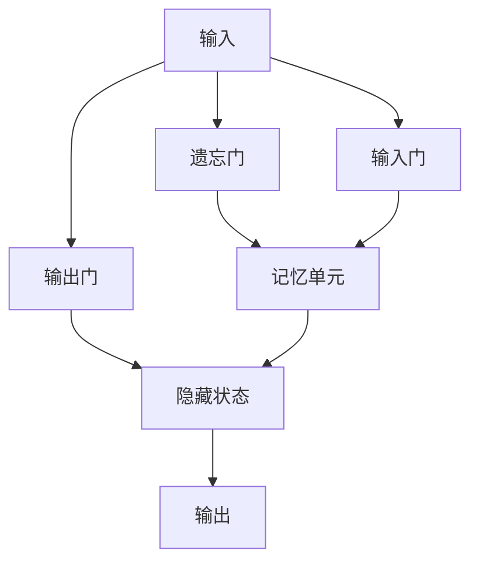
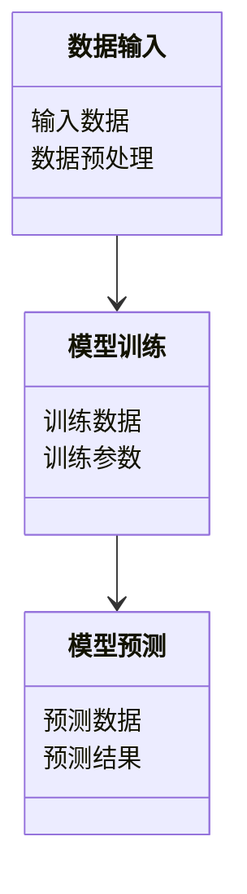
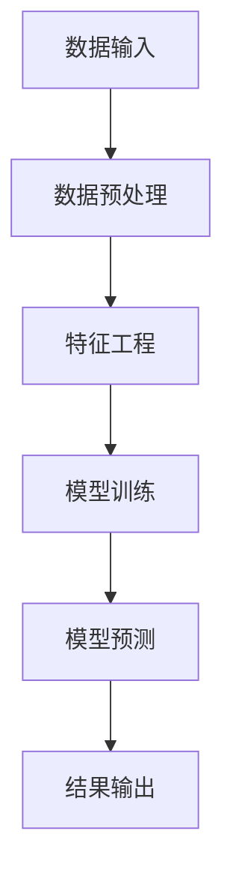

                 


# 构建智能化的资产证券化现金流预测模型

> 关键词：资产证券化、现金流预测、人工智能、时间序列分析、深度学习、数学模型、系统架构

> 摘要：  
> 资产证券化是现代金融的重要组成部分，而现金流预测是资产证券化过程中最关键的核心环节之一。随着人工智能和大数据技术的快速发展，智能化的现金流预测模型已经成为提升资产证券化效率和准确性的关键工具。本文将从资产证券化的背景出发，详细探讨现金流预测的核心概念、算法原理、系统架构设计以及项目实战，全面解析如何构建智能化的现金流预测模型。文章结合理论与实践，通过具体的案例分析和代码实现，为读者提供一份系统化、可操作的指导。

---

# 第一部分: 资产证券化现金流预测模型概述

# 第1章: 资产证券化与现金流预测模型概述

## 1.1 资产证券化的基本概念

### 1.1.1 资产证券化的定义与特点

资产证券化（Asset Securitization）是指将缺乏流动性的资产转化为可在市场上流动的证券的过程。其核心在于将资产的未来现金流进行分割、重组和信用增级，形成可以在市场上流通的金融产品。资产证券化的特点包括：

- **资产独立性**：证券化资产的现金流独立于原始权益人的其他资产。
- **风险隔离**：通过法律结构实现资产的风险隔离。
- **流动性提升**：将长期资产转化为短期可流通的证券，提高资金周转效率。

### 1.1.2 资产证券化的基本流程

资产证券化的基本流程包括以下几个关键步骤：

1. **资产选择**：选择适合证券化的基础资产，如应收账款、不动产收益权等。
2. **资产池构建**：将多个资产组合成一个资产池，以分散风险。
3. **信用评级**：对资产池进行信用评级，确定证券的信用级别。
4. **结构化设计**：设计证券的分层结构，根据风险等级分配收益和本金。
5. **发行与流通**：将证券发行到市场上，投资者通过购买证券获得现金流收益。

### 1.1.3 资产证券化与现金流预测的关系

现金流预测是资产证券化的核心环节，主要用于评估基础资产的未来现金流情况。准确的现金流预测能够帮助投资者评估证券的价值，降低投资风险。智能化的现金流预测模型能够显著提高预测的准确性和效率，从而提升资产证券化的整体质量。

## 1.2 现金流预测的核心作用

### 1.2.1 现金流预测在资产证券化中的重要性

现金流预测是资产证券化过程中最重要的环节之一。它不仅决定了证券的定价，还影响着证券的信用评级和投资者的决策。准确的现金流预测能够帮助发行人和投资者更好地理解资产的风险和收益，从而优化资产配置和投资策略。

### 1.2.2 现金流预测的常见方法

现金流预测的常见方法包括：

1. **简单线性预测**：基于历史数据，假设未来现金流与历史趋势一致。
2. **时间序列分析**：利用统计学方法预测未来的现金流。
3. **机器学习模型**：通过训练数据，使用算法预测未来的现金流。

### 1.2.3 智能化预测模型的优势

智能化预测模型通过结合人工智能和大数据技术，能够显著提高现金流预测的准确性和效率。与传统方法相比，智能化预测模型具有以下优势：

- **高精度**：利用机器学习算法，能够捕捉到数据中的复杂模式和非线性关系。
- **实时性**：能够快速响应数据变化，提供实时预测。
- **自适应性**：能够根据市场环境的变化自动调整预测模型。

## 1.3 智能化预测模型的背景与意义

### 1.3.1 传统现金流预测的局限性

传统现金流预测方法通常基于简单的线性回归或时间序列分析，难以捕捉数据中的复杂关系。此外，传统方法对数据的依赖性较强，且难以实时更新，无法适应快速变化的市场环境。

### 1.3.2 智能化预测模型的兴起

随着人工智能和大数据技术的快速发展，智能化预测模型逐渐成为现金流预测的主流方法。机器学习算法，如支持向量机（SVM）、随机森林（Random Forest）和长短期记忆网络（LSTM）等，能够更好地处理复杂的数据关系，提高预测的准确性。

### 1.3.3 智能化预测模型在资产证券化中的应用前景

智能化预测模型在资产证券化中的应用前景广阔。通过智能化预测模型，发行人和投资者能够更准确地评估资产的价值和风险，从而优化资产证券化的结构设计和投资决策。

## 1.4 本章小结

本章从资产证券化的背景出发，介绍了现金流预测的核心作用以及智能化预测模型的优势。通过对比传统方法和智能化方法，强调了智能化预测模型在资产证券化中的重要性。

---

# 第二部分: 现金流预测模型的核心概念与联系

# 第2章: 现金流预测模型的核心概念

## 2.1 现金流预测的基本原理

### 2.1.1 现金流预测的定义与分类

现金流预测是指根据历史数据和市场环境，预测未来某一时间段内现金流的大小和分布。根据预测的范围和方法，现金流预测可以分为以下几类：

- **短期预测**：预测未来几周或几个月的现金流。
- **中期预测**：预测未来几个月到几年的现金流。
- **长期预测**：预测未来几年到十年的现金流。

### 2.1.2 现金流预测的关键要素

现金流预测的关键要素包括：

- **历史数据**：预测的基础是历史现金流数据。
- **市场环境**：宏观经济环境、行业趋势等会影响现金流预测。
- **模型假设**：预测模型的假设条件，如增长率、波动率等。

### 2.1.3 现金流预测的数学模型

现金流预测的数学模型是预测的核心工具。常见的数学模型包括线性回归模型、时间序列模型和机器学习模型等。其中，时间序列模型是现金流预测中最常用的模型之一。

## 2.2 资产证券化中的现金流预测模型

### 2.2.1 资产证券化现金流预测的流程

资产证券化中的现金流预测流程通常包括以下几个步骤：

1. **数据收集**：收集基础资产的历史现金流数据。
2. **数据预处理**：对数据进行清洗和标准化处理。
3. **模型训练**：选择合适的预测模型，训练模型参数。
4. **模型验证**：通过历史数据验证模型的准确性。
5. **模型应用**：利用模型预测未来的现金流。

### 2.2.2 现金流预测模型的输入与输出

现金流预测模型的输入通常包括以下几类数据：

- **历史现金流数据**：基础资产的历史现金流。
- **市场数据**：宏观经济指标、行业趋势等。
- **资产特征**：资产的信用等级、期限等。

模型的输出是未来某一时间段内的现金流预测值。

### 2.2.3 现金流预测模型的评估指标

现金流预测模型的评估指标通常包括以下几个方面：

- **预测准确率**：预测值与实际值的接近程度。
- **均方误差（MSE）**：预测值与实际值的平方差的平均值。
- **平均绝对误差（MAE）**：预测值与实际值的绝对差的平均值。

## 2.3 核心概念的联系与对比

### 2.3.1 现金流预测与资产证券化的联系

现金流预测是资产证券化的核心环节，直接影响证券的定价和信用评级。准确的现金流预测能够帮助投资者更好地评估资产的风险和收益。

### 2.3.2 不同现金流预测模型的对比分析

以下是几种常见现金流预测模型的对比分析：

| 模型类型       | 优点                               | 缺点                               |
|----------------|------------------------------------|------------------------------------|
| 线性回归模型   | 简单易懂，计算速度快               | 预测精度低，难以捕捉复杂关系       |
| 时间序列模型   | 能够捕捉时间依赖性                 | 对非线性关系的处理能力较弱           |
| 机器学习模型   | 预测精度高，能够捕捉复杂关系       | 计算复杂，需要大量数据支持           |

### 2.3.3 现金流预测模型的优缺点

现金流预测模型的优缺点主要体现在以下几个方面：

- **优点**：能够提高预测的准确性，降低投资风险。
- **缺点**：对数据的依赖性强，计算复杂，难以实时更新。

## 2.4 本章小结

本章详细介绍了现金流预测的核心概念，包括预测的基本原理、模型的输入与输出以及评估指标。通过对比不同模型的优缺点，强调了智能化预测模型在资产证券化中的重要性。

---

# 第三部分: 现金流预测模型的算法原理

# 第3章: 时间序列分析与预测算法

## 3.1 时间序列分析的基本原理

### 3.1.1 时间序列的定义与特征

时间序列是指按照时间顺序排列的数据序列。时间序列分析的核心在于发现数据中的时间依赖性，即数据的变化是否与时间有关。时间序列的特征包括趋势、周期性、季节性等。

### 3.1.2 时间序列分析的常用方法

时间序列分析的常用方法包括：

1. **移动平均法（MA）**：通过计算过去若干期的平均值来预测未来值。
2. **指数平滑法（Exponential Smoothing）**：通过加权平均法对历史数据进行平滑处理，预测未来值。
3. **自回归积分滑动平均模型（ARIMA）**：一种广泛应用于时间序列预测的统计模型。

### 3.1.3 时间序列分析的数学模型

时间序列分析的数学模型主要基于自回归（AR）和移动平均（MA）的概念。ARIMA模型是一种常用的综合模型，其数学表达式为：

$$ ARIMA(p, d, q) = y_t = \phi_1 y_{t-1} + \phi_2 y_{t-2} + \dots + \phi_p y_{t-p} + \theta_1 \epsilon_{t-1} + \theta_2 \epsilon_{t-2} + \dots + \theta_q \epsilon_{t-q} + \epsilon_t $$

其中，\( p \) 是自回归阶数，\( d \) 是差分阶数，\( q \) 是移动平均阶数，\( \epsilon_t \) 是白噪声。

## 3.2 常见的时间序列预测算法

### 3.2.1 ARIMA模型

ARIMA模型是一种广泛应用于时间序列预测的统计模型。其核心思想是通过自回归和移动平均的方式，对历史数据进行建模，预测未来值。ARIMA模型的预测过程包括以下几个步骤：

1. **数据预处理**：对数据进行差分处理，消除趋势和季节性。
2. **模型选择**：确定自回归阶数 \( p \) 和移动平均阶数 \( q \)。
3. **模型训练**：基于历史数据，训练模型参数。
4. **模型预测**：利用训练好的模型，预测未来值。

### 3.2.2 LSTM网络

LSTM（Long Short-Term Memory）是一种基于循环神经网络（RNN）的时间序列预测模型。与传统RNN不同，LSTM通过引入记忆单元（Memory Cell）和遗忘门（Forget Gate），能够更好地捕捉数据中的长距离依赖关系。LSTM模型的结构如下图所示：



LSTM模型的数学表达式为：

$$
\begin{aligned}
    f_t &= \sigma(w_f \cdot [h_{t-1}, x_t] + b_f) \\
    i_t &= \sigma(w_i \cdot [h_{t-1}, x_t] + b_i) \\
    o_t &= \sigma(w_o \cdot [h_{t-1}, x_t] + b_o) \\
    g_t &= \tanh(w_g \cdot [h_{t-1}, x_t] + b_g) \\
    c_t &= f_t \cdot c_{t-1} + i_t \cdot g_t \\
    h_t &= o_t \cdot \tanh(c_t)
\end{aligned}
$$

其中，\( f_t \) 是遗忘门，\( i_t \) 是输入门，\( o_t \) 是输出门，\( g_t \) 是记忆门，\( c_t \) 是记忆单元，\( h_t \) 是隐藏状态，\( x_t \) 是输入数据。

### 3.2.3 Prophet模型

Prophet模型是由Facebook开源的时间序列预测模型。其核心思想是将时间序列数据分解为趋势（trend）、周期（seasonality）和余项（remainder）三部分。Prophet模型的数学表达式为：

$$
y_t = g_t + s_t + \epsilon_t
$$

其中，\( g_t \) 是趋势部分，\( s_t \) 是周期部分，\( \epsilon_t \) 是余项。

## 3.3 算法原理的数学模型与公式

### 3.3.1 ARIMA模型的公式推导

ARIMA模型的公式推导如下：

假设时间序列 \( y_t \) 满足以下关系：

$$ y_t = \phi_1 y_{t-1} + \phi_2 y_{t-2} + \dots + \phi_p y_{t-p} + \theta_1 \epsilon_{t-1} + \theta_2 \epsilon_{t-2} + \dots + \theta_q \epsilon_{t-q} + \epsilon_t $$

其中，\( \epsilon_t \) 是白噪声，服从均值为0、方差为 \( \sigma^2 \) 的正态分布。

### 3.3.2 LSTM网络的结构与公式

LSTM网络的结构与公式如上文所述，其核心在于通过遗忘门、输入门和输出门来控制记忆单元的状态。

### 3.3.3 Prophet模型的核心公式

Prophet模型的核心公式为：

$$
y_t = g_t + s_t + \epsilon_t
$$

其中，\( g_t \) 是趋势部分，\( s_t \) 是周期部分，\( \epsilon_t \) 是余项。

---

# 第四部分: 现金流预测模型的系统架构设计

# 第4章: 系统架构设计与实现

## 4.1 问题场景介绍

在资产证券化过程中，现金流预测模型需要满足以下需求：

- **高精度**：预测值需要尽可能接近实际值。
- **实时性**：能够快速响应数据变化，提供实时预测。
- **可扩展性**：能够处理大规模数据，适应业务扩展。

## 4.2 项目介绍

本项目旨在构建一个智能化的现金流预测模型，用于资产证券化过程中的现金流预测。项目目标包括：

1. **提高预测精度**：通过机器学习算法，提高现金流预测的准确性。
2. **实现实时预测**：构建实时预测系统，快速响应数据变化。
3. **提供决策支持**：为资产证券化提供科学的决策支持。

## 4.3 系统功能设计

### 4.3.1 领域模型（Domain Model）

领域模型描述了系统的功能模块及其之间的关系。如下图所示：



### 4.3.2 系统架构设计

系统架构设计如下图所示：



### 4.3.3 接口设计

系统接口设计如下：

- **输入接口**：接收基础资产的历史现金流数据和市场数据。
- **输出接口**：输出预测的未来现金流数据。

### 4.3.4 交互流程

系统的交互流程如下：

1. **数据输入**：用户输入基础资产的历史现金流数据和市场数据。
2. **数据预处理**：对输入数据进行清洗和标准化处理。
3. **特征工程**：提取特征，构建模型的输入向量。
4. **模型训练**：基于训练数据，训练现金流预测模型。
5. **模型预测**：利用训练好的模型，预测未来的现金流。
6. **结果输出**：输出预测结果，供用户查看和分析。

## 4.4 本章小结

本章详细介绍了现金流预测模型的系统架构设计，包括领域模型、系统架构图以及接口设计。通过系统的交互流程，展示了如何将模型应用于实际场景中。

---

# 第五部分: 现金流预测模型的项目实战

# 第5章: 项目实战与优化

## 5.1 环境配置

### 5.1.1 环境要求

- **操作系统**：Windows 10 或更高版本，或macOS 10.15 或更高版本。
- **Python版本**：Python 3.6 或更高版本。
- **依赖库**：Pandas、NumPy、Scikit-learn、Keras、Prophet等。

### 5.1.2 安装依赖

使用以下命令安装所需的依赖库：

```bash
pip install pandas numpy scikit-learn keras prophet
```

## 5.2 数据预处理

### 5.2.1 数据清洗

假设我们有一个基础资产的历史现金流数据集，如下所示：

| 日期       | 现金流（万元） |
|------------|----------------|
| 2020-01    | 100            |
| 2020-02    | 120            |
| 2020-03    | 110            |
| ...        | ...            |

首先，我们需要对数据进行清洗，处理缺失值和异常值。例如，使用Pandas库的 `dropna()` 方法删除缺失值：

```python
import pandas as pd

# 读取数据
data = pd.read_csv('cash_flow.csv')

# 删除缺失值
data.dropna(inplace=True)
```

### 5.2.2 数据标准化

为了方便模型训练，需要对数据进行标准化处理。例如，使用Scikit-learn库的 `StandardScaler` 进行标准化：

```python
from sklearn.preprocessing import StandardScaler

# 标准化处理
scaler = StandardScaler()
scaled_data = scaler.fit_transform(data[['现金流']])
```

## 5.3 特征工程

### 5.3.1 特征提取

根据业务需求，提取相关的特征。例如，提取历史现金流的移动平均值、波动率等。

```python
# 计算移动平均值
data['MA_3'] = data['现金流'].rolling(window=3).mean()

# 计算波动率
data['Volatility'] = data['现金流'].rolling(window=3).std()
```

### 5.3.2 特征选择

使用特征选择算法，选择对预测最重要的特征。例如，使用Scikit-learn库的 `SelectKBest` 方法：

```python
from sklearn.feature_selection import SelectKBest, f_regression

# 特征选择
selector = SelectKBest(score_func=f_regression, k=2)
selected_features = selector.fit_transform(data, target)
```

## 5.4 模型实现与优化

### 5.4.1 模型实现

使用Keras库构建LSTM模型：

```python
from keras.models import Sequential
from keras.layers import LSTM, Dense

# 构建模型
model = Sequential()
model.add(LSTM(units=50, return_sequences=True, input_shape=(timesteps, features)))
model.add(LSTM(units=50, return_sequences=False))
model.add(Dense(1))

# 编译模型
model.compile(optimizer='adam', loss='mean_squared_error')
```

### 5.4.2 模型优化

通过调整超参数（如学习率、批量大小、 epochs）来优化模型性能。例如，使用Keras的 `ModelCheckpoint` 和 `EarlyStopping` 进行模型优化：

```python
from keras.callbacks import ModelCheckpoint, EarlyStopping

# 定义回调函数
checkpointer = ModelCheckpoint(filepath='model.h5', verbose=1, save_best_only=True)
earlystopper = EarlyStopping(patience=10, monitor='val_loss')

# 训练模型
history = model.fit(X_train, y_train, epochs=100, batch_size=32, validation_data=(X_test, y_test), callbacks=[checkpointer, earlystopper])
```

### 5.4.3 模型评估

使用测试数据评估模型的性能。例如，计算均方误差（MSE）和平均绝对误差（MAE）：

```python
from sklearn.metrics import mean_squared_error, mean_absolute_error

# 预测值
y_pred = model.predict(X_test)

# 计算评估指标
mse = mean_squared_error(y_test, y_pred)
mae = mean_absolute_error(y_test, y_pred)

print(f'MSE: {mse}')
print(f'MAE: {mae}')
```

## 5.5 项目小结

本章通过实际案例，详细介绍了现金流预测模型的实现过程，包括数据预处理、特征工程、模型实现与优化。通过项目的实战，读者可以更好地理解理论知识，并能够将其应用于实际场景中。

---

# 第六部分: 模型优化与扩展

# 第6章: 模型优化与扩展

## 6.1 模型优化策略

### 6.1.1 超参数优化

通过调整模型的超参数（如学习率、批量大小、 epochs）来优化模型性能。例如，使用Scikit-learn库的 `GridSearchCV` 进行网格搜索：

```python
from sklearn.model_selection import GridSearchCV

# 定义参数范围
param_grid = {
    'learning_rate': [0.1, 0.01, 0.001],
    'batch_size': [32, 64, 128],
    'epochs': [50, 100, 150]
}

# 网格搜索
grid_search = GridSearchCV(estimator=model, param_grid=param_grid, cv=5)
grid_search.fit(X_train, y_train)

# 输出最优参数
print(grid_search.best_params_)
```

### 6.1.2 模型集成

通过集成多个模型（如ARIMA、LSTM、Prophet）的结果，进一步提高预测的准确性。例如，使用平均值法：

```python
# 集成模型
ensemble_pred = (arima_pred + lstm_pred + prophet_pred) / 3
```

### 6.1.3 模型解释性

通过可解释性分析（如SHAP值），帮助用户理解模型的预测结果。例如，使用SHAP库：

```python
import shap

# 解释模型
shap_values = shap.explainer(model, X_test)
shap_values.shap_values
```

## 6.2 模型的可解释性提升

### 6.2.1 可解释性分析

通过可解释性分析，帮助用户理解模型的预测结果。例如，使用SHAP值分析模型的特征重要性。

### 6.2.2 模型可视化

通过可视化工具（如TensorBoard）对模型的结构和训练过程进行可视化。

## 6.3 模型的扩展与应用

### 6.3.1 模型的扩展

将模型应用于其他资产证券化场景，如应收账款证券化、不动产收益权证券化等。

### 6.3.2 模型的实时预测

通过构建实时预测系统，快速响应数据变化，提供实时现金流预测。

## 6.4 本章小结

本章详细介绍了现金流预测模型的优化策略，包括超参数优化、模型集成和可解释性分析。通过模型的扩展与应用，展示了如何将模型应用于实际场景中。

---

# 结语

现金流预测是资产证券化过程中最关键的核心环节之一。随着人工智能和大数据技术的快速发展，智能化的现金流预测模型已经成为提升资产证券化效率和准确性的关键工具。本文通过理论与实践相结合的方式，详细介绍了现金流预测模型的构建过程，包括背景介绍、核心概念、算法原理、系统架构设计以及项目实战。希望本文能够为读者提供一份系统化、可操作的指导，帮助他们在实际项目中更好地应用智能化的现金流预测模型。

---

**作者：AI天才研究院/AI Genius Institute & 禅与计算机程序设计艺术/Zen And The Art of Computer Programming**

