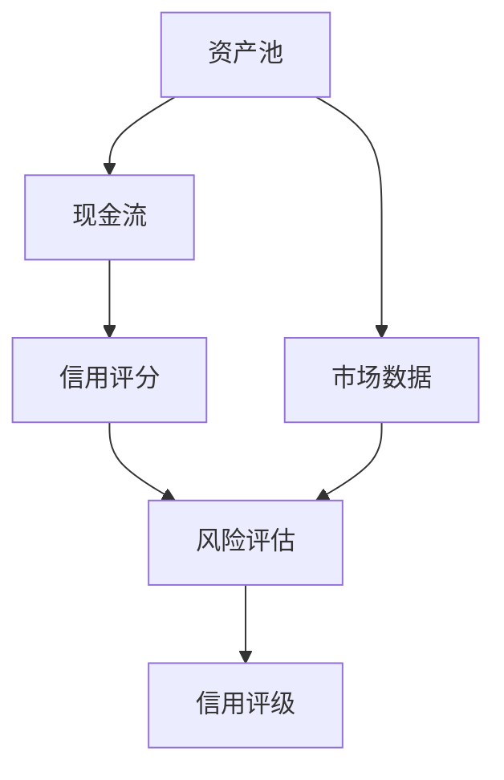
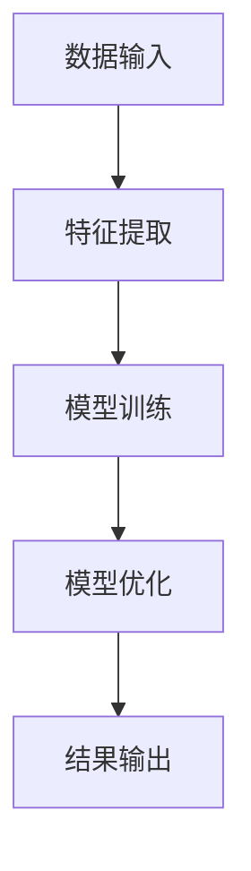
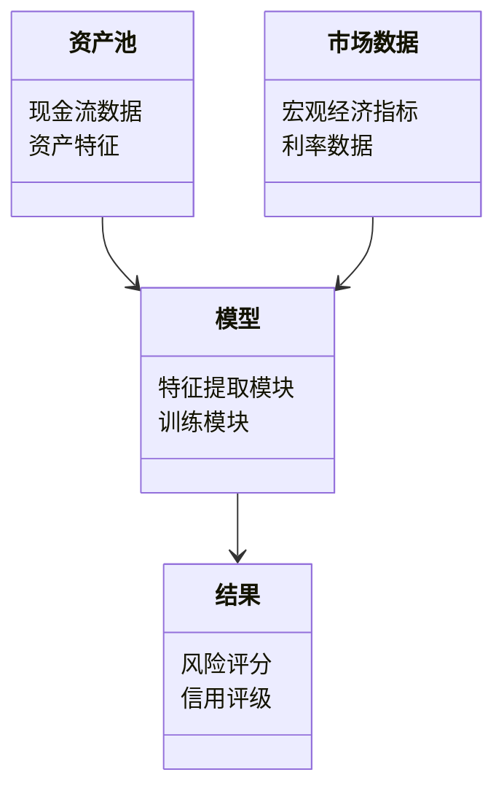
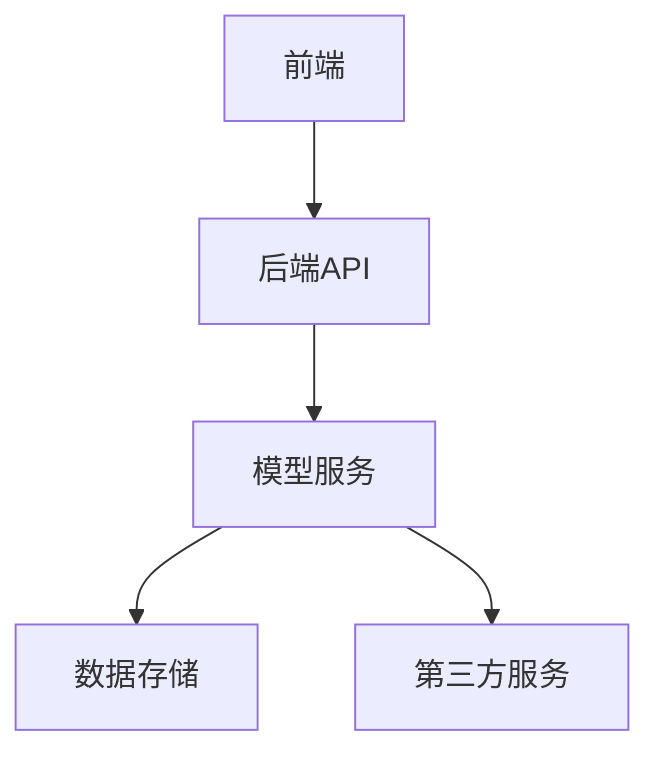
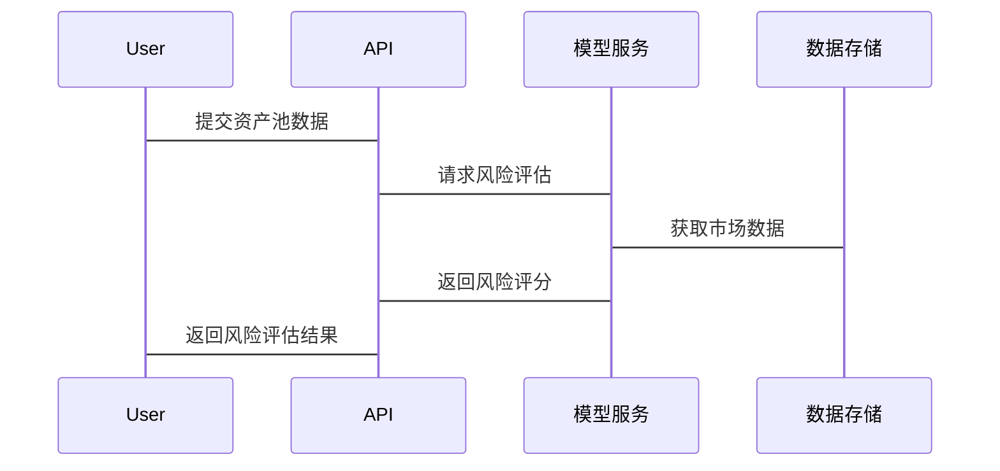

                 


# 构建智能化的资产证券化风险评估模型

## 关键词：资产证券化，风险评估，人工智能，机器学习，金融风险管理

## 摘要：本文详细探讨了如何利用人工智能和机器学习技术构建智能化的资产证券化风险评估模型。通过分析资产证券化的核心概念与风险类型，结合智能算法与系统架构设计，提出了一套完整的解决方案，包括数据预处理、特征提取、模型训练与优化、结果输出等关键步骤。文章还通过实际案例展示了模型的应用效果，并提供了最佳实践建议。

---

# 第一部分: 资产证券化风险评估模型概述

## 第1章: 资产证券化与风险评估背景

### 1.1 资产证券化的基本概念

#### 1.1.1 资产证券化的定义与特点
资产证券化（Asset Securitization）是将流动性较低的资产转化为可流通证券的一种金融工具。其核心在于将资产的未来现金流进行重组和分割，形成可以在市场上交易的金融产品。资产证券化的特点包括：
- **流动性增强**：将原本难以流动的资产转化为可交易的证券。
- **风险分散**：通过资产池的多样化，降低单一资产的风险。
- **信用增强**：通过结构化设计，提升证券的信用评级。

#### 1.1.2 资产证券化的基本流程
资产证券化的流程通常包括以下几个步骤：
1. **资产选择**：选择具有稳定现金流的资产（如贷款、应收账款等）。
2. **资产池构建**：将多个资产组合成资产池。
3. **信用增级**：通过结构化设计或外部信用增强工具提升证券的信用评级。
4. **证券发行**：将资产池打包成可流通的证券，发行给投资者。
5. **现金流分配**：根据证券的优先级，将现金流分配给不同投资者。

#### 1.1.3 资产证券化中的风险类型
资产证券化过程中可能面临的风险包括：
- **信用风险**：资产池中资产的违约风险。
- **市场风险**：证券市场价格波动带来的风险。
- **流动性风险**：资产池中资产的流动性不足导致的风险。
- **操作风险**：证券化过程中操作失误带来的风险。

### 1.2 风险评估在资产证券化中的重要性

#### 1.2.1 风险评估的基本概念
风险评估是通过分析资产池的信用风险、市场风险等因素，量化资产证券化产品的风险水平。其目的是帮助投资者和发行人更好地理解产品的风险特征。

#### 1.2.2 风险评估在资产证券化中的作用
- **定价依据**：风险评估结果是证券定价的重要依据。
- **投资者决策支持**：帮助投资者做出理性的投资决策。
- **风险管理工具**：发行人可以通过风险评估优化资产池结构，降低整体风险。

#### 1.2.3 风险评估的常见方法
- **传统的信用评分模型**：如PD（违约概率）和LGD（违约损失率）模型。
- **市场风险模型**：如VaR（Value at Risk）和CVaR（Conditional Value at Risk）。
- **组合风险模型**：通过分析资产池的多样性和相关性评估整体风险。

### 1.3 智能化风险评估的必要性

#### 1.3.1 传统风险评估的局限性
- **数据依赖性**：传统模型通常依赖于历史数据，难以捕捉非线性关系。
- **计算复杂性**：复杂资产池的风险评估需要大量计算资源。
- **动态调整能力**：传统模型难以快速适应市场变化。

#### 1.3.2 智能化技术在风险评估中的优势
- **非线性关系捕捉**：机器学习算法能够发现数据中的非线性关系，提升风险评估的准确性。
- **实时性**：智能化模型可以实时更新，快速响应市场变化。
- **自动化能力**：通过自动化数据处理和模型训练，降低人工干预成本。

#### 1.3.3 智能化风险评估的目标与意义
目标：
- 提高风险评估的准确性和效率。
- 实现资产证券化产品的动态风险管理。

意义：
- 通过智能化技术，提升资产证券化的风险管理能力，降低整体风险水平。

---

## 第2章: 资产证券化风险评估模型的核心概念

### 2.1 资产证券化风险评估模型的定义

#### 2.1.1 模型的输入与输出
- **输入**：资产池的历史数据、市场数据、宏观经济指标等。
- **输出**：资产证券化产品的信用评级、风险价值（VaR）、信用违约概率（CD）等。

#### 2.1.2 模型的核心要素
- **数据来源**：资产池的现金流数据、资产特征、市场环境等。
- **算法选择**：机器学习算法（如XGBoost、神经网络等）。
- **模型训练**：基于历史数据训练模型，优化模型参数。

### 2.2 模型的关键属性与特征

#### 2.2.1 数据特征分析
- **资产池多样性**：资产池中资产的类型和分布。
- **资产信用质量**：资产的违约概率和损失率。
- **市场环境波动**：宏观经济指标和市场波动性。

#### 2.2.2 模型的可解释性
- **解释性的重要性**：帮助用户理解模型的决策逻辑。
- **模型的透明度**：通过可解释性模型（如XGBoost）提升用户信任度。

#### 2.2.3 模型的鲁棒性与稳定性
- **鲁棒性**：模型在数据分布变化时的性能稳定性。
- **稳定性**：模型在不同场景下的表现一致性。

### 2.3 模型的构建目标与边界

#### 2.3.1 模型的构建目标
- **准确评估风险**：通过模型准确预测资产证券化产品的风险水平。
- **优化风险管理**：利用模型优化资产池结构，降低整体风险。

#### 2.3.2 模型的边界条件
- **数据范围**：明确数据的时间范围和资产类型。
- **模型适用性**：模型适用于特定的资产池和市场环境。
- **假设条件**：模型基于一定的假设（如资产池的稳定性）进行预测。

#### 2.3.3 模型的适用范围与限制
- **适用范围**：适用于具有稳定现金流的资产池。
- **限制**：模型无法预测黑天鹅事件或极端市场波动。

---

## 第3章: 资产证券化风险评估模型的结构与原理

### 3.1 模型的总体结构

#### 3.1.1 数据预处理模块
- **数据清洗**：处理缺失值、异常值。
- **数据转换**：将非数值型数据转化为数值型数据。
- **数据标准化**：对不同量纲的数据进行标准化处理。

#### 3.1.2 特征提取模块
- **特征选择**：根据业务需求选择关键特征。
- **特征工程**：通过组合、衍生等方式创造新的特征。
- **特征降维**：使用主成分分析（PCA）等方法减少特征维度。

#### 3.1.3 模型训练与优化模块
- **算法选择**：根据数据特征选择合适的算法。
- **模型训练**：基于训练数据训练模型。
- **模型调优**：通过交叉验证优化模型参数。

#### 3.1.4 结果输出与解释模块
- **风险评分**：输出资产证券化产品的风险评分。
- **风险解释**：解释模型输出结果的含义。

### 3.2 模型的核心原理

#### 3.2.1 数据特征的选择与提取
- **特征重要性分析**：通过特征重要性排序确定关键特征。
- **特征交互分析**：分析特征之间的交互作用。

#### 3.2.2 模型训练的基本原理
- **监督学习**：基于标记数据训练模型。
- **无监督学习**：发现数据中的潜在结构。

#### 3.2.3 模型优化与调优策略
- **交叉验证**：通过K折交叉验证评估模型性能。
- **超参数调优**：使用网格搜索或随机搜索优化模型参数。

### 3.3 模型的实体关系图



---

## 第4章: 资产证券化风险评估模型的算法原理

### 4.1 算法选择与实现

#### 4.1.1 算法选择
- **XGBoost**：适合处理分类和回归问题，具有高效率和强可解释性。
- **随机森林**：适用于特征工程复杂、数据量大的场景。

#### 4.1.2 算法实现流程



#### 4.1.3 算法实现代码

```python
import xgboost as xgb

# 数据准备
train_data = ...
test_data = ...

# 模型训练
model = xgb.XGBRegressor(n_estimators=100, learning_rate=0.1, max_depth=6)
model.fit(train_data.X, train_data.y)

# 模型预测
predictions = model.predict(test_data.X)
```

### 4.2 模型优化与调优

#### 4.2.1 超参数调优
- **参数范围**：如n_estimators、learning_rate、max_depth等。
- **调优方法**：使用网格搜索或随机搜索。

#### 4.2.2 模型评估
- **评估指标**：如均方误差（MSE）、R²系数。
- **交叉验证**：通过K折交叉验证评估模型性能。

### 4.3 算法的数学模型与公式

#### 4.3.1 XGBoost的数学公式
XGBoost的核心目标函数为：
$$
\text{目标函数} = \sum_{i=1}^{n} [w_i (y_i - f(x_i))^2 + \lambda f(x_i)^2]
$$
其中，\( w_i \) 为样本权重，\( \lambda \) 为正则化参数。

---

## 第5章: 资产证券化风险评估模型的系统分析与架构设计

### 5.1 系统分析

#### 5.1.1 问题场景介绍
- **场景描述**：对某资产池进行风险评估，目标是预测资产证券化产品的信用评级。

#### 5.1.2 系统功能设计
- **数据输入**：用户输入资产池数据和市场数据。
- **模型训练**：系统自动训练模型并输出风险评估结果。
- **结果解释**：系统提供风险评分和解释说明。

### 5.2 系统架构设计

#### 5.2.1 领域模型图


#### 5.2.2 系统架构图


#### 5.2.3 接口设计
- **输入接口**：接收资产池数据和市场数据。
- **输出接口**：返回风险评估结果。

#### 5.2.4 交互序列图


---

## 第6章: 资产证券化风险评估模型的项目实战

### 6.1 环境安装

#### 6.1.1 安装Python环境
```bash
python --version
pip install --upgrade pip
pip install xgboost
pip install pandas numpy scikit-learn
```

#### 6.1.2 安装Jupyter Notebook
```bash
pip install jupyter
jupyter notebook
```

### 6.2 系统核心实现

#### 6.2.1 数据预处理
```python
import pandas as pd
import numpy as np

# 数据加载
data = pd.read_csv('asset_data.csv')

# 数据清洗
data.dropna(inplace=True)
data = data[~data['target'].isnull()]
```

#### 6.2.2 特征工程
```python
from sklearn.preprocessing import StandardScaler

# 标准化处理
scaler = StandardScaler()
data[['feature1', 'feature2']] = scaler.fit_transform(data[['feature1', 'feature2']])
```

#### 6.2.3 模型训练
```python
from sklearn.model_selection import train_test_split
from xgboost import XGBRegressor
from sklearn.metrics import mean_squared_error

# 数据分割
X_train, X_test, y_train, y_test = train_test_split(data.drop('target', axis=1), data['target'], test_size=0.2, random_state=42)

# 模型训练
model = XGBRegressor(n_estimators=100, learning_rate=0.1, max_depth=6)
model.fit(X_train, y_train)

# 模型预测
y_pred = model.predict(X_test)

# 模型评估
print(mean_squared_error(y_test, y_pred))
```

### 6.3 案例分析

#### 6.3.1 数据来源与特征分析
- 数据来源：某公司发行的资产支持证券，资产池包含100笔个人贷款。
- 数据特征：借款人的信用评分、收入水平、贷款期限等。

#### 6.3.2 模型输出与解释
- 模型输出：资产证券化产品的信用评级为AA。
- 风险评分：模型预测的违约概率为1.5%。

### 6.4 项目总结

#### 6.4.1 项目成果
- 成功构建了智能化的资产证券化风险评估模型。
- 模型在测试集上的表现优于传统模型。

#### 6.4.2 项目经验
- 数据质量对模型性能影响重大。
- 模型的可解释性是实际应用中的重要考量。

---

## 第7章: 资产证券化风险评估模型的最佳实践

### 7.1 小结

- 智能化风险评估模型能够显著提升资产证券化的风险管理能力。
- 通过机器学习技术，模型可以捕捉非线性关系，提高风险评估的准确性。

### 7.2 注意事项

- 数据来源和质量直接影响模型性能。
- 模型需要定期更新，以适应市场变化。
- 模型的解释性是实际应用中的重要考量。

### 7.3 拓展阅读

- 《机器学习实战》
- 《Python机器学习》
- 《资产证券化：方法与应用》

---

## 作者：AI天才研究院/AI Genius Institute & 禅与计算机程序设计艺术/Zen And The Art of Computer Programming

---

以上是《构建智能化的资产证券化风险评估模型》的详细目录和内容概述，希望对您有所帮助！

