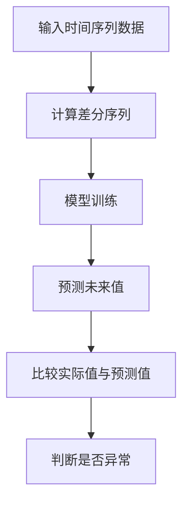
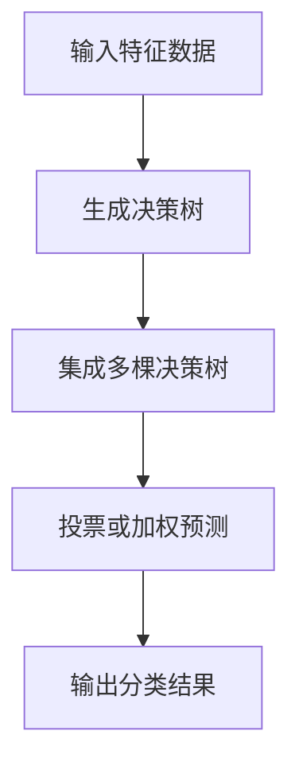
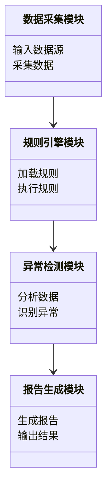
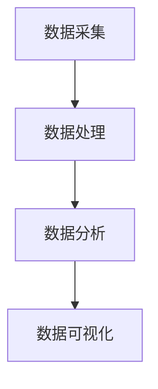

                 


# 《构建智能化的金融监管合规系统》

---

## 关键词：
- 金融监管  
- 智能化  
- 合规系统  
- 大数据  
- 人工智能  
- 实时监控  
- 风险控制  

---

## 摘要：
随着金融市场的快速发展和复杂性增加，传统的金融监管方式已难以应对日益增长的合规需求。智能化金融监管合规系统通过结合大数据、人工智能和实时监控技术，能够高效地识别和应对金融风险，确保金融机构的合规性。本文将从背景、核心概念、算法原理、系统架构、项目实战和最佳实践等多个维度，详细探讨如何构建一个智能化的金融监管合规系统。通过实际案例分析和代码实现，本文将为读者提供一套完整的解决方案，帮助金融机构在数字化时代实现高效、智能的监管合规。

---

# 第一章: 智能化金融监管合规系统的背景与挑战

## 1.1 金融监管的重要性
### 1.1.1 金融监管的定义与作用
金融监管是指通过法律、法规和制度，对金融机构的经营行为进行监督和管理，以维护金融市场的稳定和健康发展。其作用包括保护投资者利益、防范系统性风险、促进公平竞争等。

### 1.1.2 金融监管的核心目标
金融监管的核心目标包括：
1. **维护市场稳定**：防止金融市场的剧烈波动和系统性风险。
2. **保护投资者权益**：确保投资者的合法权益不受侵害。
3. **促进公平竞争**：防止金融机构之间的不公平竞争行为。
4. **防范金融犯罪**：打击洗钱、欺诈等违法犯罪活动。

### 1.1.3 金融监管的现状与问题
随着金融市场的全球化和复杂化，传统的金融监管方式面临以下问题：
- **数据量大**：金融机构每天产生的交易数据量巨大，人工监管难以处理。
- **监管滞后**：传统监管方式通常依赖事后审查，无法实现实时监控。
- **规则复杂**：金融监管规则繁多且不断更新，人工解读和执行难度大。

---

## 1.2 合规管理的挑战
### 1.2.1 合规管理的复杂性
合规管理涉及多个层面，包括法律、财务、内控等，且不同国家和地区的监管规则差异较大，增加了合规管理的复杂性。

### 1.2.2 传统合规管理的局限性
传统的合规管理方式主要依赖人工审核，存在以下问题：
- **效率低下**：人工审核耗时长，难以应对海量数据。
- **主观性较强**：人工审核依赖个人经验，存在主观判断偏差。
- **成本高昂**：需要大量人力和时间投入，增加了企业的合规成本。

### 1.2.3 数字化时代的合规需求
在数字化时代，金融机构需要更加高效、精准的合规管理方式，以应对快速变化的市场环境和复杂的监管要求。智能化合规管理成为必然趋势。

---

## 1.3 智能化监管的必要性
### 1.3.1 技术进步对监管的影响
大数据、人工智能和区块链等技术的快速发展，为金融监管提供了新的工具和方法。

### 1.3.2 数据驱动的监管优势
智能化监管利用大数据分析和机器学习算法，能够从海量数据中发现潜在风险，实现精准监管。

### 1.3.3 智能化监管的未来趋势
未来的金融监管将更加依赖智能化技术，通过实时数据分析和自动化决策，实现事前预警、事中监控和事后分析的全流程监管。

---

## 1.4 本章小结
本章从金融监管的重要性出发，分析了传统监管方式的局限性，提出了智能化监管的必要性。智能化监管通过技术手段解决传统监管的痛点，能够更高效、更精准地应对金融市场的复杂性。

---

# 第二章: 智能化金融监管的核心概念

## 2.1 智能化金融监管的定义
### 2.1.1 智能化监管的内涵
智能化金融监管是指利用人工智能、大数据等技术，通过对金融机构的经营行为和市场数据的实时分析，实现自动化、智能化的监管过程。

### 2.1.2 智能化监管的外延
智能化监管不仅包括对金融机构的实时监控，还包括对监管规则的动态调整和优化。

---

## 2.2 智能化监管的关键特征
### 2.2.1 数据驱动性
智能化监管依赖于海量数据的采集和分析，通过数据驱动的方式发现潜在风险。

### 2.2.2 实时性
智能化监管能够对市场数据进行实时分析，实现事中监控和实时预警。

### 2.2.3 自适应性
智能化监管系统能够根据市场变化和监管需求，动态调整监管规则和策略。

---

## 2.3 监管与合规的关系
### 2.3.1 监管与合规的定义对比
- **监管**：由监管机构对金融机构进行监督和管理。
- **合规**：金融机构自身遵守相关法律法规和内部规章制度。

### 2.3.2 监管与合规的相互作用
监管机构通过制定规则和监督执法，推动金融机构合规经营；而金融机构通过合规管理，降低被监管机构处罚的风险。

### 2.3.3 监管对合规的影响
监管政策的变化直接影响金融机构的合规要求，金融机构需要根据监管要求调整自身业务和管理流程。

---

## 2.4 核心概念对比表

| 概念 | 定义 | 特征 | 区别 |
|------|------|------|------|
| 传统监管 | 人工审核 | 离线、低效 | 依赖人工判断 |
| 智能化监管 | 数据驱动 | 实时、高效 | 自动化决策 |

---

## 2.5 本章小结
本章详细阐述了智能化金融监管的核心概念，包括智能化监管的定义、关键特征以及与传统监管的区别。智能化监管通过数据驱动和实时分析，能够更高效地实现监管目标。

---

# 第三章: 智能化金融监管的算法原理

## 3.1 监管规则引擎
### 3.1.1 规则引擎的定义
监管规则引擎是一种用于执行和管理监管规则的软件组件，能够根据预设的规则对数据进行分析和判断。

### 3.1.2 规则引擎的实现原理
监管规则引擎通常包括规则定义、规则执行和结果反馈三个环节。规则定义阶段通过编写或配置规则，规则执行阶段根据输入数据匹配规则，结果反馈阶段将执行结果返回给监管系统。

### 3.1.3 规则引擎的优缺点
- **优点**：规则引擎能够快速响应监管需求，支持动态调整规则。
- **缺点**：规则引擎的复杂性较高，需要专业知识进行配置和维护。

---

## 3.2 异常检测算法
### 3.2.1 异常检测的定义
异常检测是指通过数据分析技术，识别出与正常数据模式不符的异常数据。

### 3.2.2 基于时间序列的异常检测
时间序列异常检测是一种常见的异常检测方法，适用于金融市场的实时交易数据监控。

#### 示例：基于时间序列的异常检测算法
使用ARIMA（自回归积分滑动平均模型）进行时间序列预测，然后通过比较实际值和预测值的差异来识别异常。

#### ARIMA模型公式
$$ ARIMA(p, d, q) $$
其中：
- $p$ 是自回归阶数
- $d$ 是差分阶数
- $q$ 是移动平均阶数

#### 时间序列异常检测流程图


### 3.2.3 基于机器学习的异常检测
机器学习算法（如随机森林、神经网络等）可以用于异常检测，通过训练模型识别正常数据的特征，进而发现异常数据。

---

## 3.3 分类算法
### 3.3.1 分类算法的定义
分类算法是一种 supervised learning 技术，用于将数据分为不同的类别。

### 3.3.2 分类算法在金融监管中的应用
分类算法可以用于识别欺诈交易、预测市场走势等。

#### 示例：随机森林分类算法
随机森林是一种基于决策树的集成学习算法，适用于高维数据的分类和回归问题。

#### 随机森林分类流程图


---

## 3.4 本章小结
本章介绍了监管规则引擎、异常检测算法和分类算法的基本原理及其在金融监管中的应用。通过这些算法，智能化监管系统能够实现对金融数据的实时分析和异常识别。

---

# 第四章: 智能化金融监管的系统架构设计

## 4.1 系统应用场景
智能化金融监管系统适用于多种场景，包括实时交易监控、风险预警、合规报告生成等。

---

## 4.2 系统功能设计
### 4.2.1 领域模型设计
领域模型是系统设计的核心，包括数据采集、规则引擎、异常检测和报告生成等功能模块。

#### 领域模型类图


---

## 4.3 系统架构设计
### 4.3.1 系统架构图
系统架构包括数据采集、数据处理、数据分析和数据可视化四个主要模块。

#### 系统架构图


---

## 4.4 接口设计
系统需要与金融机构的交易系统、数据库等进行对接，通过API接口实现数据的实时传输和处理。

---

## 4.5 本章小结
本章详细描述了智能化金融监管系统的架构设计，包括功能模块、系统架构和接口设计。通过合理的架构设计，能够实现系统的高效运行和功能扩展。

---

# 第五章: 项目实战——智能化金融监管系统实现

## 5.1 环境安装
### 5.1.1 安装Python
```bash
# 安装Python
sudo apt-get install python3
```

### 5.1.2 安装依赖库
```bash
# 安装Pandas、NumPy、Scikit-learn等库
pip install pandas numpy scikit-learn
```

---

## 5.2 系统核心实现
### 5.2.1 数据采集模块
```python
import pandas as pd

def collect_data():
    # 从数据库采集数据
    data = pd.read_sql("SELECT * FROM transactions", con=connection)
    return data
```

### 5.2.2 规则引擎模块
```python
from sklearn.ensemble import RandomForestClassifier

def train_model(X, y):
    # 训练随机森林模型
    model = RandomForestClassifier()
    model.fit(X, y)
    return model
```

### 5.2.3 异常检测模块
```python
def detect_anomalies(data, model):
    # 使用训练好的模型进行异常检测
    predictions = model.predict(data)
    anomalies = data[predictions == -1]
    return anomalies
```

---

## 5.3 实际案例分析
### 5.3.1 案例背景
假设某银行的交易数据中存在欺诈交易行为，需要通过系统实现实时监控和异常检测。

### 5.3.2 数据分析与处理
```python
import pandas as pd

# 加载数据
data = pd.read_csv('transactions.csv')

# 数据预处理
data = data.dropna()
data = pd.get_dummies(data)
```

### 5.3.3 模型训练与验证
```python
from sklearn.model_selection import train_test_split
from sklearn.metrics import accuracy_score

# 划分训练集和测试集
X_train, X_test, y_train, y_test = train_test_split(X, y, test_size=0.2)

# 训练模型
model = RandomForestClassifier()
model.fit(X_train, y_train)

# 验证模型
y_pred = model.predict(X_test)
print("准确率:", accuracy_score(y_test, y_pred))
```

---

## 5.4 系统优化与总结
通过实际案例分析，可以发现智能化监管系统在实时监控和异常检测方面的优势。同时，也需要注意模型的准确性和性能优化。

---

## 5.5 本章小结
本章通过实际项目案例，详细讲解了智能化金融监管系统的实现过程，包括环境安装、核心代码实现和实际案例分析。通过这些内容，读者可以掌握系统开发的关键步骤和注意事项。

---

# 第六章: 最佳实践与展望

## 6.1 小结
智能化金融监管合规系统通过大数据、人工智能等技术，能够高效地实现金融监管和合规管理。本文详细探讨了系统的背景、核心概念、算法原理、架构设计和项目实现。

---

## 6.2 注意事项
在实际应用中，需要注意以下几点：
- 数据隐私和安全
- 模型的准确性和可解释性
- 系统的实时性和稳定性

---

## 6.3 未来展望
未来的智能化监管系统将更加智能化和自动化，可能的发展方向包括：
- 更加复杂的模型和算法
- 更高效的实时监控技术
- 更智能的决策支持系统

---

## 6.4 拓展阅读
推荐以下书籍和资源：
- 《机器学习实战》
- 《金融风险管理》
- 《大数据技术与应用》

---

# 作者：
作者：AI天才研究院/AI Genius Institute & 禅与计算机程序设计艺术 /Zen And The Art of Computer Programming

---

通过以上步骤，您可以根据实际需求进一步扩展和补充内容，以确保文章的完整性和深度。

