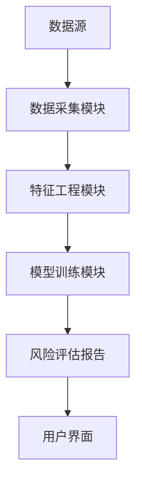

                 


# 构建精准的投资风险评估模型

## 关键词：投资风险评估，机器学习，数据分析，金融建模，风险管理

## 摘要：  
投资风险评估是金融领域的重要任务，旨在通过数据分析和建模技术，准确预测和量化投资风险。本文从背景介绍、核心概念、算法原理、系统架构、项目实战到最佳实践，全面解析如何构建精准的投资风险评估模型。通过结合理论与实践，帮助读者掌握从数据准备到模型部署的完整流程，提升投资决策的科学性和准确性。

---

# 第一部分: 投资风险评估模型概述

## 第1章: 投资风险评估模型的背景与意义

### 1.1 投资风险的基本概念
#### 1.1.1 什么是投资风险
投资风险是指在投资过程中，由于市场波动、经济环境变化等因素导致投资收益低于预期甚至出现损失的可能性。风险是投资决策中不可忽视的重要因素，准确评估风险可以帮助投资者制定更合理的投资策略。

#### 1.1.2 投资风险的分类
投资风险主要分为以下几类：
- **市场风险**：由于市场整体波动导致的投资损失风险。
- **信用风险**：债券或贷款等信用工具的发行人无法按时偿还本金或利息的风险。
- **流动性风险**：资产难以迅速以合理价格变现的风险。
- **操作风险**：由于内部操作失误或外部事件导致的损失风险。

#### 1.1.3 投资风险评估的重要性
准确评估投资风险有助于投资者：
- **优化投资组合**：通过分散投资降低整体风险。
- **制定风险管理策略**：在高风险情况下采取规避措施。
- **提高决策效率**：基于风险评估结果做出更明智的投资决策。

### 1.2 投资风险评估模型的现状
#### 1.2.1 当前主流的评估方法
传统上，投资风险评估主要依赖于统计方法和专家经验，如VaR（Value at Risk）模型和CVaR（Conditional Value at Risk）模型。然而，这些方法在面对复杂金融市场时存在局限性。

#### 1.2.2 数据驱动的评估模型发展
随着大数据和机器学习技术的发展，数据驱动的模型逐渐成为主流。这些模型能够处理海量数据，发现传统方法难以捕捉的复杂模式。

#### 1.2.3 数字化转型对投资风险评估的影响
数字化转型推动了金融领域的技术创新，使得风险评估更加自动化、智能化。云计算、人工智能等技术的应用，显著提升了风险评估的效率和精度。

### 1.3 构建精准模型的意义
#### 1.3.1 提高决策的准确性
精准的模型能够更准确地预测市场波动和资产风险，帮助投资者做出更科学的决策。

#### 1.3.2 优化投资组合管理
通过模型评估不同资产的风险收益比，投资者可以更好地优化投资组合，降低整体风险。

#### 1.3.3 提升市场应对能力
精准的模型能够帮助投资者快速识别市场风险，及时调整策略，提升应对市场变化的能力。

---

## 第2章: 投资风险评估的核心概念与联系

### 2.1 风险因素分析
#### 2.1.1 市场风险
市场风险是由于市场整体波动引起的，例如股市下跌、利率上升等。

#### 2.1.2 信用风险
信用风险主要集中在债券和贷款等信用资产上，反映了债务人违约的可能性。

#### 2.1.3 流动性风险
流动性风险是指资产在短时间内无法以合理价格变现的风险，特别是在市场低迷时期尤为明显。

#### 2.1.4 操作风险
操作风险来源于内部操作失误或外部事件，如系统故障、人为错误等。

### 2.2 数据特征与模型输入
#### 2.2.1 时间序列数据的重要性
投资风险评估通常涉及时间序列数据，如股票价格、指数波动等，这些数据能够反映市场的动态变化。

#### 2.2.2 市场指标的选择
常用的市场指标包括波动率、VaR、最大回撤、Beta系数等，这些指标能够帮助模型捕捉市场的风险特征。

#### 2.2.3 非结构化数据的处理
非结构化数据，如新闻、社交媒体信息，可以通过自然语言处理技术转化为结构化数据，丰富模型的输入特征。

### 2.3 模型输出与决策支持
#### 2.3.1 风险评分的定义
风险评分是对资产或投资组合风险程度的量化指标，通常以分数形式表示。

#### 2.3.2 风险概率的计算
模型输出的风险概率表示某种风险发生的可能性，帮助投资者评估不同情景下的风险敞口。

#### 2.3.3 投资组合的风险调整建议
基于模型评估结果，投资者可以调整投资组合的构成，优化风险收益比。

---

## 第3章: 核心概念与联系的ER实体关系图

### 3.1 实体关系图
```mermaid
er
    entity 投资者 {
        key: 投资者ID
        属性: 投资金额, 投资期限, 风险偏好
    }
    entity 资产 {
        key: 资产ID
        属性: 资产类型, 市场价值, 变动频率
    }
    entity 风险因素 {
        key: 风险因素ID
        属性: 风险类型, 风险强度, 相关性系数
    }
    entity 风险评估结果 {
        key: 评估报告ID
        属性: 风险评分, 风险概率, 优化建议
    }
    投资者 -[1..n] 风险评估结果
    资产 -[1..n] 风险评估结果
    风险因素 -[1..n] 风险评估结果
```

---

## 第4章: 常见算法与模型选择

### 4.1 线性回归模型
#### 4.1.1 线性回归的基本原理
线性回归是一种简单但强大的统计学习方法，适用于预测连续型目标变量。在投资风险评估中，线性回归可以用于预测资产的预期收益或风险值。

#### 4.1.2 模型的数学表达式
线性回归的数学模型可以表示为：
$$ y = \beta_0 + \beta_1x_1 + \beta_2x_2 + \cdots + \beta_nx_n + \epsilon $$
其中，$y$ 是目标变量，$x_i$ 是自变量，$\beta_i$ 是回归系数，$\epsilon$ 是误差项。

#### 4.1.3 代码实现示例
```python
import numpy as np
from sklearn.linear_model import LinearRegression

# 假设X为自变量矩阵，y为目标变量向量
X = np.array([[1, 2], [3, 4], [5, 6]])
y = np.array([7, 8, 9])

# 初始化线性回归模型
model = LinearRegression()

# 训练模型
model.fit(X, y)

# 预测结果
y_pred = model.predict(X)
print(y_pred)
```

---

### 4.2 非线性回归模型
#### 4.2.1 非线性回归的原理
非线性回归适用于目标变量与自变量之间存在非线性关系的情况。常用的非线性回归模型包括逻辑回归、多项式回归等。

#### 4.2.2 逻辑回归的应用
逻辑回归常用于分类问题，在投资风险评估中可以用于预测资产违约的概率。

#### 4.2.3 代码实现示例
```python
from sklearn.linear_model import LogisticRegression

# 假设X为特征矩阵，y为二分类目标变量
X = np.array([[1, 2], [3, 4], [5, 6]])
y = np.array([0, 1, 0])

# 初始化逻辑回归模型
model = LogisticRegression()

# 训练模型
model.fit(X, y)

# 预测结果
y_pred = model.predict(X)
print(y_pred)
```

---

### 4.3 支持向量机（SVM）模型
#### 4.3.1 SVM的基本原理
支持向量机是一种监督学习算法，适用于分类和回归问题。在投资风险评估中，SVM可以用于预测资产的信用评级。

#### 4.3.2 SVM的优势
SVM在高维空间中表现优异，适合处理小样本数据。

#### 4.3.3 代码实现示例
```python
from sklearn.svm import SVC

# 假设X为特征矩阵，y为分类目标变量
X = np.array([[1, 2], [3, 4], [5, 6]])
y = np.array([0, 1, 0])

# 初始化SVM模型
model = SVC()

# 训练模型
model.fit(X, y)

# 预测结果
y_pred = model.predict(X)
print(y_pred)
```

---

## 第5章: 算法原理的数学模型和公式

### 5.1 线性回归的损失函数
线性回归通常使用均方误差（MSE）作为损失函数：
$$ L = \frac{1}{N}\sum_{i=1}^{N}(y_i - \hat{y}_i)^2 $$

### 5.2 逻辑回归的损失函数
逻辑回归使用对数损失函数：
$$ L = -\frac{1}{N}\sum_{i=1}^{N} [y_i \ln p_i + (1 - y_i)\ln(1 - p_i)] $$
其中，$p_i$ 是预测概率，$y_i$ 是真实标签。

---

## 第6章: 系统分析与架构设计

### 6.1 问题场景介绍
在投资风险评估系统中，我们需要处理大量的金融数据，包括股票价格、市场指数、经济指标等。系统的目标是为投资者提供个性化的风险评估报告和投资建议。

### 6.2 系统功能设计
#### 6.2.1 数据采集模块
负责收集市场数据、财务报表等信息。

#### 6.2.2 特征工程模块
对数据进行清洗、特征提取和转换，生成适合模型输入的特征。

#### 6.2.3 模型训练模块
基于特征数据训练风险评估模型，输出风险评分和概率。

#### 6.2.4 报告生成模块
根据模型输出生成风险评估报告，提供优化建议。

### 6.3 系统架构设计


---

## 第7章: 项目实战

### 7.1 环境安装
安装必要的库，如Python、Pandas、Scikit-learn、TensorFlow等。

### 7.2 核心代码实现
```python
import pandas as pd
from sklearn.model_selection import train_test_split
from sklearn.metrics import accuracy_score

# 加载数据
data = pd.read_csv('investment_data.csv')

# 数据清洗和特征工程
X = data.drop('target', axis=1)
y = data['target']

# 划分训练集和测试集
X_train, X_test, y_train, y_test = train_test_split(X, y, test_size=0.2)

# 初始化模型
model = LogisticRegression()

# 训练模型
model.fit(X_train, y_train)

# 预测结果
y_pred = model.predict(X_test)

# 评估模型
print(accuracy_score(y_test, y_pred))
```

---

## 第8章: 最佳实践

### 8.1 小结
构建精准的投资风险评估模型需要结合理论与实践，合理选择算法，并进行充分的验证和优化。

### 8.2 注意事项
- 数据的质量和特征选择对模型性能影响重大。
- 需要定期更新模型，以适应市场变化。
- 注意模型的可解释性和实用性。

### 8.3 拓展阅读
推荐阅读《投资学》、《机器学习实战》等书籍，深入理解投资风险评估和机器学习技术。

---

## 作者：AI天才研究院/AI Genius Institute & 禅与计算机程序设计艺术 /Zen And The Art of Computer Programming

