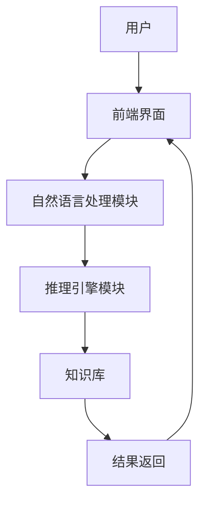

                 


# 构建跨平台AI Agent的技术挑战

> 关键词：跨平台、AI Agent、自然语言处理、机器学习、系统架构设计

> 摘要：本文深入探讨了构建跨平台AI Agent的技术挑战，涵盖从背景概念到系统架构设计的各个方面。通过详细的技术分析和实际案例，本文揭示了实现跨平台AI Agent的核心技术、算法原理和系统设计，帮助读者全面理解并掌握相关技术。

---

## 第一部分: 跨平台AI-Agent概述

### 第1章: 跨平台AI-Agent的背景与概念

#### 1.1 跨平台AI-Agent的背景
##### 1.1.1 人工智能与Agent的基本概念
人工智能（AI）是模拟人类智能的技术，而Agent（智能体）是能够感知环境并采取行动以实现目标的实体。AI Agent结合了这两者的核心思想，能够通过环境反馈不断优化行为。

##### 1.1.2 跨平台技术的发展与挑战
随着移动互联网和多平台应用的普及，跨平台开发技术（如React Native和Flutter）逐渐成熟，为AI Agent的跨平台实现提供了可能。然而，不同平台的差异性（如操作系统差异、硬件性能差异）给AI Agent的实现带来了挑战。

##### 1.1.3 跨平台AI-Agent的定义与特点
跨平台AI Agent是指能够在多个平台上运行的智能体，其核心特点包括：
- **多平台支持**：能够在Web、移动端、桌面应用等多种平台上运行。
- **一致性体验**：在不同平台上提供一致的用户体验。
- **高效性**：在不同平台上保持高性能，满足实时交互的需求。

#### 1.2 跨平台AI-Agent的核心要素
##### 1.2.1 多平台支持的需求
跨平台AI Agent需要支持多种操作系统（如iOS、Android、Windows、macOS等）和硬件架构（如x86、ARM等）。不同平台的差异性要求AI Agent具备高度的平台无关性。

##### 1.2.2 AI-Agent的核心功能
AI Agent的核心功能包括：
- **自然语言处理**：通过文本或语音与用户交互。
- **知识表示**：存储和处理知识。
- **推理引擎**：基于知识进行推理和决策。
- **自适应学习**：通过反馈不断优化行为。

##### 1.2.3 跨平台实现的关键技术
跨平台实现的关键技术包括：
- **跨平台开发框架**：如React Native和Flutter。
- **统一API设计**：在不同平台上使用统一的接口。
- **跨平台通信机制**：如WebSocket和HTTP。

#### 1.3 跨平台AI-Agent的应用场景
##### 1.3.1 跨平台应用的典型场景
跨平台AI Agent可以应用于多种场景，如：
- **智能助手**：如手机端的语音助手。
- **智能客服**：提供多平台的在线客服功能。
- **教育工具**：为不同平台的用户提供学习支持。

##### 1.3.2 AI-Agent在不同平台上的表现
在不同平台上，AI Agent的表现需要考虑平台的性能和用户体验。例如，在移动端需要优化性能以适应较低的硬件配置。

##### 1.3.3 跨平台AI-Agent的未来趋势
随着5G和物联网技术的发展，跨平台AI Agent将更加普及，并逐步融入人们的日常生活。

#### 1.4 本章小结
本章从背景、核心要素和应用场景三个方面介绍了跨平台AI Agent的基本概念和挑战，为后续章节的深入分析奠定了基础。

---

## 第二部分: 跨平台AI-Agent的核心技术

### 第2章: 跨平台AI-Agent的核心技术

#### 2.1 跨平台开发技术
##### 2.1.1 跨平台开发框架的选择
跨平台开发框架是实现AI Agent的关键技术。常用的框架包括React Native和Flutter。

- **React Native**：基于JavaScript，适合快速开发。
- **Flutter**：基于Dart语言，支持热重载，适合复杂界面的开发。

##### 2.1.2 跨平台技术的优缺点对比
- **React Native**：优点是社区支持强大，缺点是渲染性能略逊于原生。
- **Flutter**：优点是性能高，缺点是学习曲线较高。

##### 2.1.3 跨平台开发中的关键问题
- **平台差异**：不同平台的API和性能差异。
- **兼容性问题**：如何在不同平台上保持一致的用户体验。

#### 2.2 AI-Agent的核心算法
##### 2.2.1 自然语言处理算法
自然语言处理（NLP）是AI Agent与用户交互的核心技术。常用的算法包括：
- **Transformer模型**：如BERT和GPT。
- **词嵌入模型**：如Word2Vec和GloVe。

##### 2.2.2 机器学习算法
机器学习算法用于AI Agent的推理和决策。常用的算法包括：
- **决策树**：用于分类和回归。
- **支持向量机（SVM）**：用于分类任务。
- **神经网络**：用于复杂的模式识别任务。

##### 2.2.3 强化学习算法
强化学习算法用于AI Agent的自适应学习。常用的算法包括：
- **Q-Learning**：基于值函数的强化学习。
- **Deep Q-Networks（DQN）**：结合深度神经网络的强化学习。

#### 2.3 跨平台AI-Agent的实现挑战
##### 2.3.1 多平台兼容性问题
如何在不同平台上实现一致的功能和用户体验是跨平台AI Agent的核心挑战。

##### 2.3.2 性能优化与资源分配
在不同平台上，AI Agent需要根据硬件性能进行优化，确保用户体验。

##### 2.3.3 安全与隐私保护
跨平台AI Agent需要保护用户数据的安全和隐私，特别是在多平台环境下。

#### 2.4 本章小结
本章从跨平台开发技术和AI Agent的核心算法两个方面，详细探讨了跨平台AI Agent的技术挑战。

---

## 第三部分: 跨平台AI-Agent的系统架构设计

### 第3章: 跨平台AI-Agent的系统架构设计

#### 3.1 系统架构概述
##### 3.1.1 模块化设计
系统架构设计需要模块化，便于不同平台的开发和维护。

##### 3.1.2 分层架构
分层架构将系统划分为多个层次，如数据层、业务逻辑层和表示层。

##### 3.1.3 微服务架构
微服务架构将系统功能分解为多个独立的服务，便于跨平台部署。

#### 3.2 跨平台架构的关键设计
##### 3.2.1 平台无关性设计
平台无关性设计确保AI Agent可以在不同平台上运行。

##### 3.2.2 统一API设计
统一API设计简化了不同平台之间的交互。

##### 3.2.3 跨平台通信机制
跨平台通信机制包括WebSocket和HTTP。

#### 3.3 系统架构的实现
##### 3.3.1 系统模块划分
- **核心模块**：自然语言处理模块、推理引擎模块。
- **平台适配模块**：适配不同平台的API和性能。

##### 3.3.2 模块之间的交互设计
模块之间的交互需要通过统一的API进行，确保系统的灵活性和扩展性。

##### 3.3.3 架构图展示（Mermaid）



#### 3.4 本章小结
本章从系统架构设计的角度，探讨了跨平台AI Agent的实现方案，强调模块化设计和统一API的重要性。

---

## 第四部分: 跨平台AI-Agent的算法实现

### 第4章: 跨平台AI-Agent的算法实现

#### 4.1 自然语言处理算法
##### 4.1.1 Transformer模型
Transformer模型是一种基于自注意力机制的深度学习模型，广泛应用于自然语言处理任务。

##### 4.1.2 BERT模型
BERT模型是一种预训练语言模型，能够通过上下文理解文本。

##### 4.1.3 GPT模型
GPT模型是一种生成式语言模型，能够生成连贯的文本。

#### 4.2 机器学习算法
##### 4.2.1 决策树算法
决策树是一种基于树状结构的分类算法，适用于简单数据集。

##### 4.2.2 支持向量机（SVM）
SVM是一种监督学习算法，适用于分类和回归任务。

##### 4.2.3 神经网络算法
神经网络是一种模拟人脑神经网络的深度学习算法，适用于复杂的模式识别任务。

#### 4.3 强化学习算法
##### 4.3.1 Q-Learning算法
Q-Learning是一种基于值函数的强化学习算法，适用于离散动作空间。

##### 4.3.2 Deep Q-Networks（DQN）
DQN是一种结合深度神经网络的强化学习算法，适用于连续动作空间。

#### 4.4 本章小结
本章详细介绍了跨平台AI Agent的核心算法，包括自然语言处理算法、机器学习算法和强化学习算法。

---

## 第五部分: 跨平台AI-Agent的项目实战

### 第5章: 跨平台AI-Agent的项目实战

#### 5.1 项目介绍
##### 5.1.1 项目背景
本项目旨在开发一个跨平台智能助手，能够在Web、移动端和桌面应用上运行。

##### 5.1.2 项目目标
- 实现自然语言处理功能。
- 实现推理引擎。
- 实现知识库管理。

#### 5.2 环境安装
##### 5.2.1 开发工具安装
- 安装React Native或Flutter。
- 安装Python和TensorFlow库。

##### 5.2.2 依赖管理工具
- 使用npm或yarn管理JavaScript依赖。
- 使用pip管理Python依赖。

#### 5.3 系统核心实现
##### 5.3.1 自然语言处理模块
- 使用TensorFlow实现文本分类。
- 使用预训练模型进行文本生成。

##### 5.3.2 推理引擎模块
- 实现基于规则的推理。
- 实现基于机器学习的推理。

##### 5.3.3 知识库管理
- 使用数据库存储知识。
- 实现知识的动态更新。

#### 5.4 代码实现
##### 5.4.1 前端代码
```javascript
// React Native组件
import React from 'react';
import { View, Text, Button } from 'react-native';

function ChatInterface({ messages, onSendMessage }) {
  return (
    <View>
      {messages.map((message, index) => (
        <Text key={index}>{message.text}</Text>
      ))}
      <Button
        title="发送"
        onPress={onSendMessage}
      />
    </View>
  );
}
```

##### 5.4.2 后端代码
```python
# TensorFlow实现文本分类
import tensorflow as tf

model = tf.keras.Sequential([
    tf.keras.layers.Dense(64, activation='relu'),
    tf.keras.layers.Dense(1, activation='sigmoid')
])

model.compile(optimizer='adam', loss='binary_crossentropy', metrics=['accuracy'])
```

#### 5.5 系统交互设计
##### 5.5.1 系统交互流程


#### 5.6 本章小结
本章通过一个具体的项目案例，展示了跨平台AI Agent的实现过程，包括环境安装、系统设计和代码实现。

---

## 第六部分: 总结与展望

### 第6章: 总结与展望

#### 6.1 全书总结
本文从背景、核心技术、系统架构设计和项目实战四个方面，详细探讨了构建跨平台AI Agent的技术挑战。

#### 6.2 未来展望
随着技术的发展，跨平台AI Agent将更加智能化和普及化。未来的研究方向包括：
- 更高效的跨平台开发技术。
- 更强大的AI算法。
- 更安全的数据保护机制。

#### 6.3 最佳实践Tips
- 在跨平台开发中，优先选择成熟的框架。
- 在AI算法选择中，结合实际场景进行优化。
- 在系统设计中，注重模块化和可扩展性。

#### 6.4 小结
本文通过系统的分析和实践，为读者提供了构建跨平台AI Agent的全面指导。

---

## 作者信息

作者：AI天才研究院/AI Genius Institute & 禅与计算机程序设计艺术 /Zen And The Art of Computer Programming

