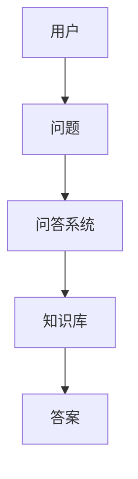
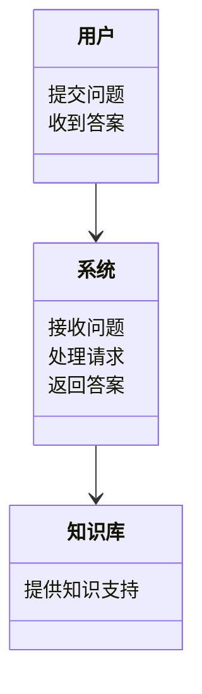

                 


# 《构建高效准确的金融知识自动问答系统》

> **关键词**：金融问答系统，自然语言处理，知识图谱，预训练语言模型，高效准确

> **摘要**：  
本文详细探讨了构建高效准确的金融知识自动问答系统的各个方面，从背景分析到核心算法，再到系统架构设计和项目实现，结合实际案例，深入剖析了该系统的关键技术与实现细节。通过本文，读者可以系统地了解如何利用自然语言处理、知识图谱和预训练语言模型等技术，构建一个能够快速、准确回答金融领域复杂问题的问答系统。

---

## 第1章: 金融知识自动问答系统概述

### 1.1 问题背景与需求分析

#### 1.1.1 传统金融问答的痛点  
传统的金融问答方式主要依赖人工客服或查阅文档，存在以下痛点：  
1. **效率低**：人工客服响应慢，无法快速解决大量重复性问题。  
2. **准确性不足**：依赖个人经验，容易出现理解偏差或知识遗漏。  
3. **成本高**：需要大量人力投入，运营成本高昂。  
4. **覆盖范围有限**：难以覆盖所有金融场景，尤其是复杂、专业的问题。  

#### 1.1.2 金融知识问答系统的需求  
为了应对上述痛点，金融知识问答系统需要满足以下需求：  
1. **快速响应**：能够实时处理用户提问，秒级反馈答案。  
2. **高准确性**：基于专业知识库，确保答案的权威性和准确性。  
3. **智能理解**：能够理解用户的意图，支持复杂语义解析。  
4. **可扩展性**：能够不断吸收新的金融知识，适应市场变化。  

#### 1.1.3 金融问答系统的边界与外延  
金融问答系统的边界包括：  
- 输入：用户的自然语言提问。  
- 输出：系统生成的结构化或非结构化答案。  
- 范围：仅限于金融领域的知识，不涉及其他领域。  

其外延包括：  
- 高级功能：如多轮对话、情感分析、风险提示等。  
- 拓展场景：如智能投顾、金融舆情分析等。  

---

### 1.2 核心概念与系统架构

#### 1.2.1 金融问答系统的定义  
金融问答系统是一种基于自然语言处理和知识检索技术，能够理解用户提问并从金融知识库中提取相关信息，最终生成准确答案的智能系统。

#### 1.2.2 系统的核心要素与组成  
金融问答系统的核心要素包括：  
1. **知识库**：存储金融领域的结构化和非结构化知识，如法规、产品说明、市场数据等。  
2. **自然语言处理引擎**：负责解析用户提问，生成关键词或语义表示。  
3. **检索算法**：基于关键词或语义向量，在知识库中匹配最相关的答案。  
4. **答案生成模块**：将匹配结果组织成自然语言回答。  

#### 1.2.3 金融问答系统与相关技术的联系  
- **自然语言处理（NLP）**：负责语义理解、意图识别和文本生成。  
- **知识图谱**：提供结构化的金融知识，支持语义检索。  
- **预训练语言模型**：用于提升问答的准确性和流畅性。  

---

## 第2章: 金融问答系统的核心概念与联系

### 2.1 核心概念原理

#### 2.1.1 信息检索与自然语言处理  
信息检索是金融问答系统的核心，主要通过以下步骤实现：  
1. **文本预处理**：分词、去停用词、实体识别。  
2. **语义表示**：将文本转换为向量表示（如TF-IDF、BM25）。  
3. **检索匹配**：基于向量相似度匹配最相关的文档或句子。  

#### 2.1.2 知识图谱与问答系统的关系  
知识图谱为问答系统提供结构化的知识支持：  
- **知识抽取**：从非结构化文本中提取实体、关系和属性。  
- **语义匹配**：基于知识图谱进行实体对齐和关系推理。  

#### 2.1.3 预训练语言模型的作用  
预训练语言模型（如BERT、GPT）通过大规模数据预训练，能够直接处理自然语言文本，生成高质量的回答。

---

### 2.2 核心概念属性特征对比

| **核心概念** | **定义** | **优势** | **劣势** |
|--------------|----------|----------|----------|
| 信息检索     | 基于关键词匹配的文本检索技术 | 实现简单，速度快 | 易受同义词和语义影响 |
| 知识图谱     | 结构化的知识存储与推理技术 | 高准确性，支持复杂推理 | 构建和维护成本高 |
| 预训练模型   | 预训练的深度语言模型 | 高效性，支持多种任务 | 需大量计算资源 |

---

### 2.3 ER实体关系图架构



---

## 第3章: 金融问答系统的核心算法原理

### 3.1 向量空间模型

#### 3.1.1 BM25算法原理  
BM25是一种基于向量空间模型的检索算法，公式如下：  
$$ BM25 = \sum_{i=1}^{n} \frac{\text{TF}(t_i) \cdot \text{IDF}(t_i)}{k_1 + k_2 \cdot \text{TF}(t_i)} $$  
其中，TF表示词频，IDF表示逆文档频率，k1和k2是调优参数。  

#### 3.1.2 TF-IDF权重计算  
TF-IDF用于衡量一个词在文档中的重要性：  
$$ TF-IDF(t, D) = \text{TF}(t, D) \times \text{IDF}(t) $$  

---

### 3.2 预训练语言模型

#### 3.2.1 BERT模型的问答处理流程  
1. **输入处理**：将用户提问和上下文输入BERT模型。  
2. **编码**：模型生成问题的语义向量。  
3. **检索**：基于向量相似度匹配知识库中的答案。  

#### 3.2.2 GPT模型的生成式问答机制  
GPT通过自注意力机制生成连贯的回答，适用于开放性问题。

---

### 3.3 相似度计算

#### 3.3.1 余弦相似度公式  
$$ \text{余弦相似度} = \frac{\vec{A} \cdot \vec{B}}{|\vec{A}| |\vec{B}|} $$  

#### 3.3.2 编辑距离计算  
编辑距离用于衡量两个文本的相似性：  
$$ \text{编辑距离} = \text{min}(d_{\text{删除}}, d_{\text{插入}}, d_{\text{替换}}) $$  

---

## 第4章: 金融问答系统的系统分析与架构设计

### 4.1 问题场景介绍

#### 4.1.1 智能投顾场景  
用户提问：“有哪些低风险的理财产品？”  
系统通过知识库匹配相关产品信息并生成回答。

#### 4.1.2 金融舆情分析  
用户提问：“近期银行股表现如何？”  
系统结合实时数据和知识库生成分析报告。

---

### 4.2 系统功能设计

#### 4.2.1 领域模型设计  


---

### 4.3 系统架构设计

#### 4.3.1 架构图  


---

## 第5章: 项目实战

### 5.1 环境安装

```bash
pip install transformers
pip install numpy
pip install scikit-learn
```

---

### 5.2 系统核心实现源代码

#### 5.2.1 提问处理模块

```python
from transformers import BertTokenizer, BertModel
import numpy as np

tokenizer = BertTokenizer.from_pretrained('bert-base-uncased')
model = BertModel.from_pretrained('bert-base-uncased')

def process_question(question):
    inputs = tokenizer(question, return_tensors='np')
    outputs = model(**inputs)
    return outputs.last_hidden_state.numpy()[0]
```

---

## 第6章: 最佳实践与小结

### 6.1 总结与经验分享  
- **系统优化**：定期更新知识库，优化检索算法。  
- **模型调优**：根据反馈调整BM25参数，提升准确率。  
- **数据安全**：确保用户数据和知识库的安全性。  

### 6.2 小结与展望  
金融问答系统是人工智能技术在金融领域的典型应用，未来可以通过结合实时数据和动态知识图谱，进一步提升系统的智能化水平。

---

**作者：AI天才研究院/AI Genius Institute & 禅与计算机程序设计艺术 /Zen And The Art of Computer Programming**

