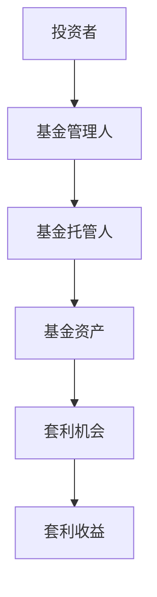
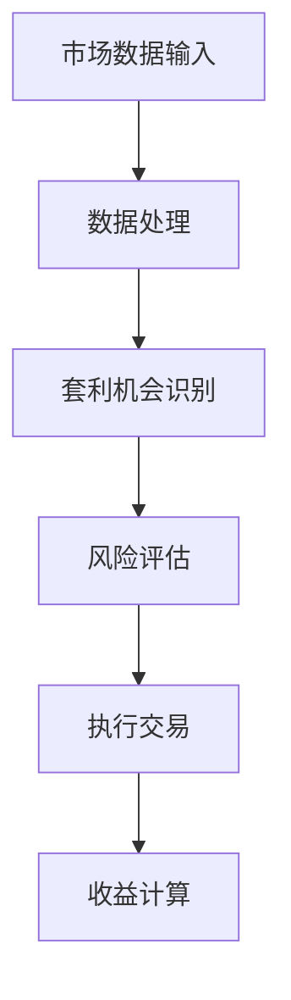
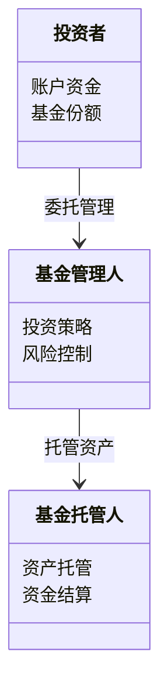
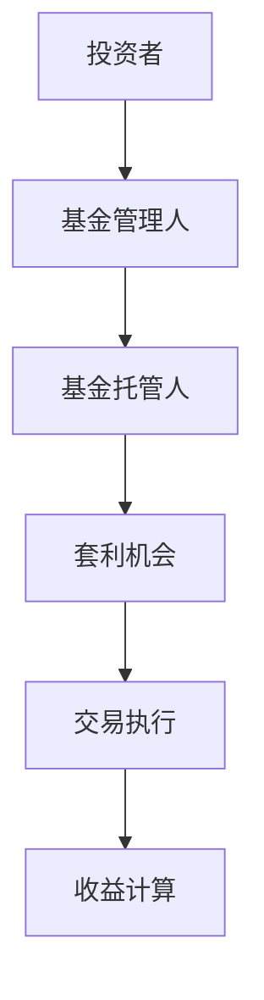
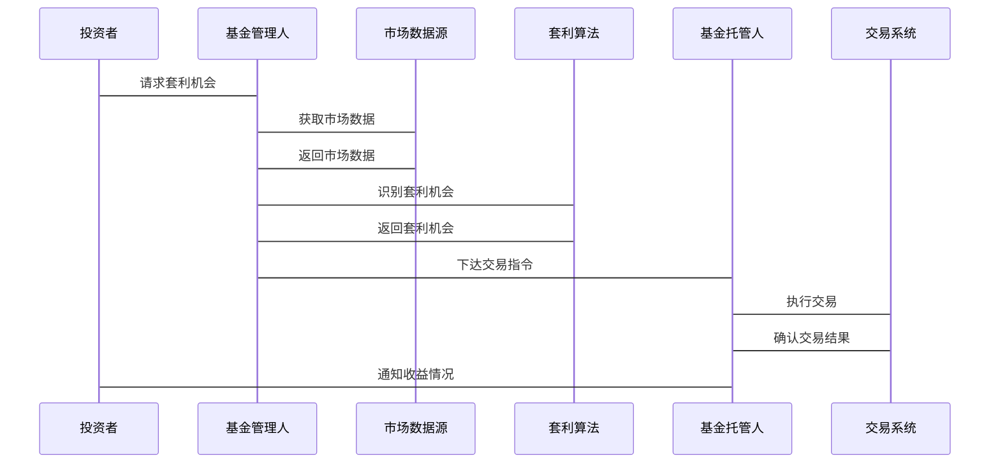

                 


# 契约型封闭基金套利的策略与实现

> 关键词：契约型封闭基金，套利策略，金融数学，算法设计，系统架构

> 摘要：本文深入探讨了查尔斯·布兰德的契约型封闭基金套利策略，分析其核心原理、算法实现、系统架构，并结合实际案例，详细解读了套利在契约型封闭基金中的应用与挑战。文章内容丰富，结构清晰，适合金融从业者、程序员和相关领域的读者阅读。

---

## 第一部分: 契约型封闭基金套利的背景与核心概念

### 第1章: 契约型封闭基金套利的背景介绍

#### 1.1 契约型封闭基金的定义与特点

##### 1.1.1 契约型封闭基金的定义
契约型封闭基金是一种通过契约方式设立的基金，基金份额在封闭期内不得赎回，投资者通过购买基金份额参与基金收益。其核心特征包括固定期限、封闭运作和契约约束。

##### 1.1.2 契约型封闭基金的核心特点
- **封闭运作**：基金份额在一定期限内不得赎回。
- **契约约束**：投资者与管理人通过契约明确权利义务。
- **收益共享**：投资者按份额比例分享收益，承担风险。

##### 1.1.3 契约型封闭基金与传统开放式基金的区别
| 特性               | 契约型封闭基金                     | 开放式基金                       |
|--------------------|------------------------------------|----------------------------------|
| 是否可赎回         | 不可赎回                          | 可赎回                          |
| 运作期限           | 有固定期限                        | 无固定期限                      |
| 投资策略           | 更灵活，适合长期投资              | 更注重流动性                    |
| 风险承担           | 投资者与管理人共担                 | 投资者自负                     |

#### 1.2 套利的基本概念与分类

##### 1.2.1 套利的定义
套利是指利用市场价差，通过同时买入低价资产和卖出高价资产，以无风险或低风险的方式赚取收益的行为。

##### 1.2.2 套利的分类与应用场景
- **跨市场套利**：利用不同市场间的价差进行套利。
- **跨期套利**：利用同一资产在不同时间点的价格差异进行套利。
- **统计套利**：基于资产价格统计特性进行套利。

##### 1.2.3 套利在金融市场的地位与作用
套利是金融市场的重要机制，能够提高市场效率，减少价格扭曲，促进资产合理定价。

#### 1.3 套利在契约型封闭基金中的特殊性

##### 1.3.1 契约型封闭基金套利的背景与问题背景
契约型封闭基金的封闭特性使其在特定市场条件下存在套利机会，例如市场低估或高估时。

##### 1.3.2 套利在契约型封闭基金中的问题描述
- 契约型封闭基金的封闭特性限制了套利的灵活性。
- 套利机会窗口较窄，需快速决策。

##### 1.3.3 套利在契约型封闭基金中的解决思路
- 利用数学模型识别套利机会。
- 结合市场数据，制定套利策略。

##### 1.3.4 套利在契约型封闭基金中的边界与外延
套利需在契约允许范围内进行，避免违背契约条款。

##### 1.3.5 套利在契约型封闭基金中的概念结构与核心要素组成
- 市场数据：价格、成交量等。
- 套利模型：识别套利机会。
- 执行策略：下单、结算。

---

## 第2章: 契约型封闭基金套利的核心概念与联系

### 2.1 套利的核心原理

#### 2.1.1 套利的基本原理
套利通过价格差异赚取无风险收益，核心在于发现并利用市场价差。

#### 2.1.2 套利在契约型封闭基金中的具体实现
- 利用契约型基金的封闭特性，捕捉市场低估或高估机会。
- 通过买卖操作，套取价差收益。

#### 2.1.3 套利与市场效率的关系
套利促进市场效率，减少价格偏差，推动资产合理定价。

### 2.2 套利策略的分类与对比

#### 2.2.1 套利策略的分类
- **跨市场套利**：利用不同市场间的价格差异。
- **跨期套利**：利用同一资产在不同时间点的价格差异。
- **统计套利**：基于资产价格统计特性。

#### 2.2.2 不同套利策略的特征对比（表格形式）
| 策略类型     | 适用场景       | 风险程度   | 复杂程度   |
|--------------|----------------|------------|------------|
| 跨市场套利   | 跨市场环境     | 中等风险   | 较低       |
| 跨期套利     | 时间差异明显   | 较低风险   | 较高       |
| 统计套利     | 数据驱动场景   | 较高风险   | 较高       |

### 2.3 套利的ER实体关系图


---

## 第3章: 套利的算法原理讲解

### 3.1 套利算法的基本流程


### 3.2 套利算法的数学模型
#### 3.2.1 数学模型的基本公式
$$ \text{收益} = \text{卖出价} - \text{买入价} $$

#### 3.2.2 风险评估公式
$$ \text{风险} = \text{标准差} \times \text{投资金额} $$

### 3.3 套利算法的实现代码
```python
import pandas as pd
import numpy as np

def calculate_profit(buy_price, sell_price):
    return sell_price - buy_price

def identify_arbitrage Opportunity(data):
    # 假设data是一个包含价格和成交量的数据框
    # 找到价格差异显著的资产对
    diff = data['price'].diff().abs()
    threshold = data['price'].std() * 2
    return diff[diff > threshold].index

# 示例数据
data = pd.DataFrame({
    'price': [100, 101, 99, 103, 98]
})

# 识别套利机会
opportunity = identify_arbitrage_opportunity(data)
print(opportunity)
```

---

## 第4章: 系统分析与架构设计方案

### 4.1 问题场景介绍
契约型封闭基金套利系统需实时监控市场数据，识别套利机会，并执行交易。

### 4.2 系统功能设计

#### 4.2.1 领域模型设计


### 4.3 系统架构设计

#### 4.3.1 系统架构图


#### 4.3.2 接口设计
- API接口：市场数据接口、交易执行接口。

#### 4.3.3 交互流程


---

## 第5章: 项目实战

### 5.1 环境安装
- 安装Python、Pandas、NumPy等库。

### 5.2 核心代码实现

#### 5.2.1 套利机会识别
```python
def identify_arbitrage_opportunity(data):
    diff = data['price'].diff().abs()
    threshold = data['price'].std() * 2
    return diff[diff > threshold].index
```

#### 5.2.2 交易执行
```python
def execute_trade(asset, quantity, price):
    return asset * quantity * price
```

### 5.3 代码解读与分析
- `identify_arbitrage_opportunity`函数通过计算价格差异识别套利机会。
- `execute_trade`函数执行具体的交易操作。

### 5.4 实际案例分析
假设市场中存在资产A和资产B的价格差异，通过套利算法识别并执行交易，最终获得无风险收益。

### 5.5 项目小结
项目实战展示了如何将套利算法应用于实际系统中，验证了算法的有效性。

---

## 第6章: 最佳实践与小结

### 6.1 小结
本文深入探讨了查尔斯·布兰德的契约型封闭基金套利策略，从理论到实践进行了详细讲解。

### 6.2 注意事项
- 套利需谨慎，避免违背契约条款。
- 风险控制是套利成功的关键。

### 6.3 拓展阅读
推荐阅读《算法交易》和《金融市场中的套利策略》。

---

## 作者：AI天才研究院 & 禅与计算机程序设计艺术

