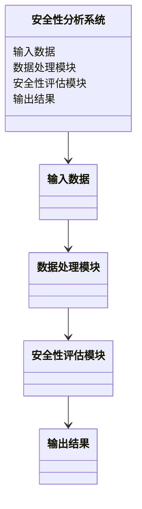
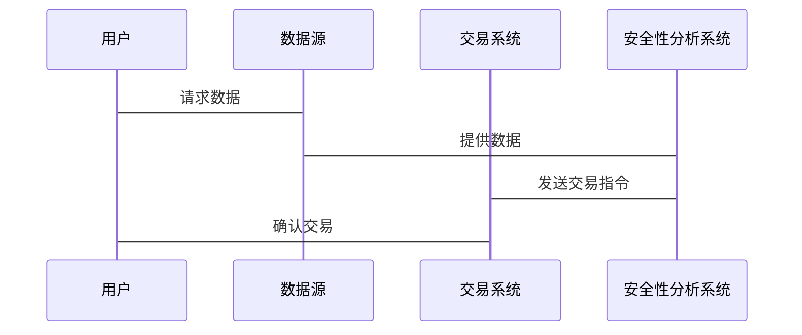

                 


# 格雷厄姆多德的安全性分析在现代市场的应用

> 关键词：安全性分析，现代市场，算法交易，风险管理，内在价值

> 摘要：本文深入探讨了格雷厄姆多德安全性分析在现代金融市场中的应用，结合传统投资理论与现代技术手段，分析了安全性分析的核心概念、算法原理、系统架构及项目实战。通过数学公式、mermaid流程图和代码实现，详细解读了安全性分析在现代市场的演变与应用，为投资者提供了理论支持与实践指导。

---

## 第1章: 格雷厄姆多德安全性分析的背景与核心概念

### 1.1 格雷厄姆多德安全性分析的起源与演变

#### 1.1.1 传统安全性分析的核心思想

格雷厄姆多德的安全性分析是一种以基本面分析为核心的投资方法，其核心思想是通过分析企业的财务状况、行业地位和未来盈利能力，评估其内在价值，并在市场价格低于内在价值时进行投资。这种方法强调安全边际，即市场价格与内在价值之间的差异，是投资安全性的保障。

#### 1.1.2 格雷厄姆多德投资体系的形成与发展

格雷厄姆和多德的投资体系起源于20世纪初的美国，当时市场波动剧烈，投资者普遍缺乏系统化的投资方法。格雷厄姆多德通过研究企业的财务报表，提出了基于内在价值的安全性分析方法。这种方法在《证券分析》一书中得到了系统阐述，并成为价值投资的基石。

#### 1.1.3 现代市场环境下的安全性分析新特点

现代市场环境发生了显著变化，包括算法交易的普及、高频交易的兴起、ESG投资的兴起等。这些变化对安全性分析提出了新的挑战，同时也带来了新的机会。传统安全性分析需要结合现代技术手段，如大数据分析和量化模型，才能更好地适应市场变化。

### 1.2 安全性分析的核心概念与框架

#### 1.2.1 安全边际的定义与计算

安全边际是市场价格与内在价值之间的差异，是投资的安全垫。计算公式如下：

$$\text{安全边际} = \text{市场价格} - \text{内在价值}$$

当安全边际为正时，投资是安全的；当安全边际为负时，投资存在风险。

#### 1.2.2 内在价值的评估方法

内在价值是基于企业未来现金流的现值计算得出的，公式如下：

$$\text{内在价值} = \sum_{t=1}^{\infty} \frac{\text{现金流}}{(1 + r)^t}$$

其中，$r$是折现率，通常基于市场利率和企业风险水平确定。

#### 1.2.3 资产质量与财务健康性分析

资产质量是安全性分析的重要组成部分，包括企业的资产负债表、利润表和现金流量表分析。以下是资产质量分析的关键指标：

- 资产负债表：分析企业的资产、负债和所有者权益结构。
- 利润表：分析企业的收入、成本和利润情况。
- 现金流量表：分析企业的现金流入和流出情况。

### 1.3 格雷厄姆多德分析与现代投资理论的结合

#### 1.3.1 现代投资组优化理论

现代投资组优化理论（MPT）由哈里·马科维茨提出，其核心是通过分散投资降低风险。安全性分析与MPT的结合可以通过优化投资组合的内在价值和市场价格分布，实现风险与收益的最优匹配。

#### 1.3.2 风险管理与安全性分析的融合

风险管理是安全性分析的重要组成部分，包括市场风险、流动性风险和信用风险的管理。通过量化模型和风险指标（如VaR、CVaR）可以更好地评估和管理投资风险。

#### 1.3.3 现代市场环境下的安全性分析框架

现代市场环境下的安全性分析框架需要考虑以下因素：

1. **算法交易**：高频交易和算法交易对市场价格的影响。
2. **ESG投资**：环境、社会和治理因素对内在价值的影响。
3. **大数据分析**：利用大数据技术进行更精准的内在价值评估。

---

## 第2章: 格雷厄姆多德安全性分析的核心原理

### 2.1 安全边际的数学模型与公式

#### 2.1.1 安全边际的计算公式

$$\text{安全边际} = \text{市场价格} - \text{内在价值}$$

当安全边际为正时，投资是安全的；当安全边际为负时，投资存在风险。

#### 2.1.2 内在价值的评估公式

$$\text{内在价值} = \sum_{t=1}^{\infty} \frac{\text{现金流}}{(1 + r)^t}$$

其中，$r$是折现率，通常基于市场利率和企业风险水平确定。

### 2.2 财务指标与资产质量分析

#### 2.2.1 资产负债表分析

资产负债表分析包括以下内容：

- 资产结构：分析企业的流动资产、非流动资产及其比例。
- 负债结构：分析企业的流动负债、非流动负债及其比例。
- 所有者权益：分析企业的净资产情况。

#### 2.2.2 利润表分析

利润表分析包括以下内容：

- 收入分析：分析企业的营业收入、其他收入及其增长情况。
- 成本分析：分析企业的营业成本、期间费用及其比例。
- 利润分析：分析企业的净利润及其增长情况。

#### 2.2.3 现金流量表分析

现金流量表分析包括以下内容：

- 经营活动现金流：分析企业的经营活动产生的现金流。
- 投资活动现金流：分析企业的投资活动产生的现金流。
- 筹资活动现金流：分析企业的筹资活动产生的现金流。

### 2.3 现代市场环境下的安全性分析调整

#### 2.3.1 算法交易对安全性分析的影响

算法交易通过高频交易和自动化决策影响市场价格，使得安全性分析需要考虑交易成本和流动性风险。

#### 2.3.2 ESG投资与安全性分析的结合

ESG投资将环境、社会和治理因素纳入内在价值评估，提高了投资的可持续性。

#### 2.3.3 数量化分析工具的应用

数量化分析工具（如Python、R）可以帮助投资者更高效地进行内在价值评估和风险分析。

### 2.4 核心概念对比表格

| 概念       | 格雷厄姆多德传统定义 | 现代市场调整 |
|------------|---------------------|--------------|
| 安全边际   | 市场价与内在价值差  | 包括流动性溢价 |
| 内在价值   | 现金流折现值       | 考虑ESG因素  |

### 2.5 本章小结

---

## 第3章: 现代市场环境下的安全性分析算法

### 3.1 现代安全性分析的数学模型

#### 3.1.1 现代投资组优化模型

$$\text{最大化} \mu - \lambda \sigma$$

其中，$\mu$是投资组合的预期收益，$\sigma$是投资组合的风险，$\lambda$是风险厌恶系数。

#### 3.1.2 风险调整后的内在价值计算

$$\text{调整后内在价值} = \text{内在价值} \times (1 - \text{风险系数})$$

### 3.2 算法交易对安全性分析的影响

#### 3.2.1 算法交易的定义与特点

算法交易是指通过计算机算法自动执行交易指令，具有高频交易、低延迟和自动化的特点。

#### 3.2.2 算法交易对市场流动性的冲击

算法交易可能导致市场流动性波动，影响市场价格和交易成本。

#### 3.2.3 算法交易与安全性分析的结合

通过算法交易可以实时监控市场价格变化，优化安全性分析的计算和决策。

### 3.3 现代安全性分析的系统架构

#### 3.3.1 系统功能设计



#### 3.3.2 系统架构设计

```mermaid
container 安全性分析系统 {
    组件1: 数据采集模块
    组件2: 数据处理模块
    组件3: 安全性评估模块
    组件4: 结果输出模块
}
```

#### 3.3.3 系统接口设计

安全性分析系统需要与数据源、交易系统和用户界面进行交互。

#### 3.3.4 系统交互流程



### 3.4 本章小结

---

## 第4章: 格雷厄姆多德安全性分析的项目实战

### 4.1 项目环境安装

#### 4.1.1 安装Python环境

使用Anaconda安装Python 3.8以上版本。

#### 4.1.2 安装必要的库

安装pandas、numpy、scipy等库。

### 4.2 系统核心实现源代码

以下是安全性分析系统的Python实现代码：

```python
import pandas as pd
import numpy as np

def calculate_intrinsic_value(cash_flows, discount_rate):
    return np.sum(cash_flows / (1 + discount_rate) ** np.arange(len(cash_flows)))

def calculate_margin_of_safety market_price, intrinsic_value:
    return market_price - intrinsic_value

# 示例数据
cash_flows = [100, 100, 100, 100, 100]
discount_rate = 0.05
market_price = 80

intrinsic_value = calculate_intrinsic_value(cash_flows, discount_rate)
margin_of_safety = calculate_margin_of_safety(market_price, intrinsic_value)

print(f"内在价值: {intrinsic_value}")
print(f"安全边际: {margin_of_safety}")
```

### 4.3 代码应用解读与分析

#### 4.3.1 代码实现

上述代码实现了内在价值和安全边际的计算。其中，`calculate_intrinsic_value`函数计算内在价值，`calculate_margin_of_safety`函数计算安全边际。

#### 4.3.2 代码分析

- `cash_flows`：企业未来现金流。
- `discount_rate`：折现率。
- `market_price`：市场价格。
- `intrinsic_value`：内在价值。
- `margin_of_safety`：安全边际。

### 4.4 案例分析

假设某企业未来五年的现金流分别为100、100、100、100、100，折现率为5%，市场价格为80。计算如下：

$$\text{内在价值} = \sum_{t=1}^{5} \frac{100}{(1 + 0.05)^t} \approx 428.67$$

$$\text{安全边际} = 80 - 428.67 = -348.67$$

由于安全边际为负，说明市场价格高于内在价值，投资存在风险。

### 4.5 本章小结

---

## 第5章: 格雷厄姆多德安全性分析的总结与展望

### 5.1 总结

格雷厄姆多德的安全性分析是一种经典的投资方法，其核心思想是通过内在价值评估和安全边际分析实现稳健投资。在现代市场环境下，安全性分析需要结合算法交易、大数据分析和ESG投资等新技术和新理念，才能更好地适应市场变化。

### 5.2 展望

未来，安全性分析将更加依赖于量化模型和人工智能技术，实现更精准的内在价值评估和风险管理。同时，ESG投资的兴起也将推动安全性分析向更可持续的方向发展。

---

## 作者：AI天才研究院/AI Genius Institute & 禅与计算机程序设计艺术/Zen And The Art of Computer Programming

