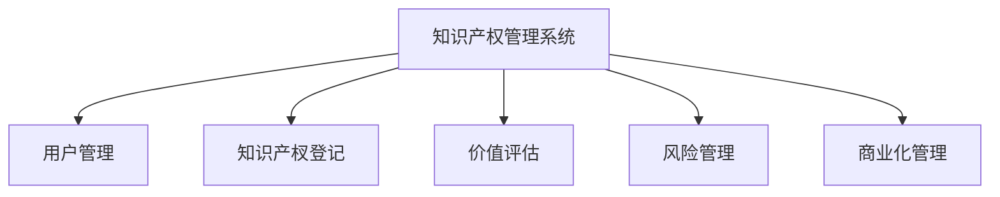

                 


# 格雷厄姆特价股票理论对公司数字知识产权战略的影响

> 关键词：格雷厄姆投资理论，数字知识产权，知识产权战略，价值投资，知识产权评估

> 摘要：本文探讨了格雷厄姆特价股票理论对公司数字知识产权战略的影响。通过分析格雷厄姆的价值投资理念、内在价值评估方法和安全边际概念，本文揭示了这些理论如何为数字知识产权的保护、评估和战略管理提供新的视角。结合实际案例，本文详细阐述了如何将格雷厄姆的投资策略应用于数字知识产权的管理中，为企业制定有效的知识产权战略提供参考。

---

## 第一部分：格雷厄姆投资理论与数字知识产权的背景介绍

### 1.1 格雷厄姆投资理论的核心概念

#### 1.1.1 价值投资的基本原理
价值投资是一种长期投资策略，强调以低于内在价值的价格购买优质资产。格雷厄姆在《聪明的投资者》中提出，股票的内在价值是其未来现金流的现值，可以通过详细分析企业的财务状况、行业地位和竞争优势来估算。

#### 1.1.2 内在价值与市场价值的关系
内在价值是资产的真实价值，而市场价值受市场情绪和短期因素影响。格雷厄姆认为，市场价值围绕内在价值波动，投资者应关注内在价值，避免被短期市场波动干扰。

#### 1.1.3 安全边际的重要性
安全边际是指资产的市场价格低于其内在价值的部分。格雷厄姆强调，通过购买市场价格远低于内在价值的资产，可以降低投资风险并提高收益的确定性。

### 1.2 数字知识产权的基本概念

#### 1.2.1 数字知识产权的定义
数字知识产权是指与数字资产相关的知识产权，包括软件、数据、数字内容、算法和其他数字化创新成果的知识产权。数字知识产权的核心在于其创造性和商业价值。

#### 1.2.2 数字知识产权的分类
数字知识产权可以分为以下几类：
- 软件知识产权：包括源代码、应用程序、系统设计等。
- 数据资产：包括数据库、用户数据、市场数据等。
- 数字内容：包括文本、图像、音乐、视频等内容的版权。

#### 1.2.3 数字知识产权的保护与管理
数字知识产权的保护需要法律手段（如专利、版权）、技术手段（如加密、数字签名）和管理手段（如生命周期管理、风险控制）的结合。

### 1.3 格雷厄姆投资理论与数字知识产权的联系

#### 1.3.1 格雷厄姆理论在知识产权评估中的应用
格雷厄姆的内在价值评估方法可以用于数字知识产权的价值评估。例如，通过分析知识产权的未来收益能力，可以估算其内在价值。

#### 1.3.2 数字知识产权的市场价值分析
数字知识产权的市场价值受供需关系、技术发展和法律环境的影响。格雷厄姆的价值投资理念可以帮助企业在数字知识产权市场中识别低估的资产。

#### 1.3.3 格雷厄姆策略对知识产权管理的启示
格雷厄姆的安全边际概念启示企业在购买知识产权时应关注价格与价值的差距，避免支付过高的溢价。分散投资策略则提醒企业应优化知识产权组合，降低单一知识产权的风险。

---

## 第二部分：数字知识产权战略的核心要素

### 2.1 数字知识产权的生命周期管理

#### 2.1.1 知识产权的创造阶段
在创造阶段，企业需要通过创新和研发产生有价值的知识产权。例如，软件开发中的发明专利和著作权。

#### 2.1.2 知识产权的保护阶段
保护阶段包括申请专利、注册版权、制定保护策略等。企业需要通过法律手段和技术手段确保知识产权的安全。

#### 2.1.3 知识产权的商业化阶段
商业化阶段包括 licensing、合作开发、技术转让等方式。企业需要通过有效的商业策略最大化知识产权的价值。

### 2.2 数字知识产权的战略价值

#### 2.2.1 知识产权在企业竞争中的作用
数字知识产权是企业核心竞争力的重要组成部分。例如，技术创新带来的市场垄断地位。

#### 2.2.2 知识产权对创新的推动作用
知识产权保护激励企业进行创新，确保创新成果能够转化为商业价值。

#### 2.2.3 知识产权的市场影响力
数字知识产权的市场影响力体现在其对行业格局的塑造和市场价值的提升上。例如，一项核心专利可能决定一个企业的市场地位。

### 2.3 数字知识产权的战略管理

#### 2.3.1 知识产权战略的制定步骤
1. 确定企业目标和资源。
2. 识别核心知识产权。
3. 评估知识产权的价值。
4. 制定保护和利用策略。

#### 2.3.2 知识产权战略的实施路径
1. 建立知识产权管理体系。
2. 加强内部培训和意识提升。
3. 优化知识产权组合。

#### 2.3.3 知识产权战略的监控与调整
企业需要定期评估知识产权战略的实施效果，及时调整以应对市场变化和技术进步。

---

## 第三部分：格雷厄姆理论与数字知识产权战略的结合

### 3.1 格雷厄姆理论在数字知识产权评估中的应用

#### 3.1.1 内在价值评估法在知识产权定价中的应用
通过分析知识产权的未来收益能力，可以使用格雷厄姆的内在价值公式进行定价：
$$ V = \sum_{t=1}^{n} \frac{CF_t}{(1 + r)^t} $$
其中，$V$ 是内在价值，$CF_t$ 是第 $t$ 年的现金流，$r$ 是折现率。

#### 3.1.2 安全边际概念在知识产权风险控制中的应用
通过比较知识产权的市场价格和内在价值，企业可以确定是否支付了合理的价格。例如：
$$ \text{安全边际} = \text{内在价值} - \text{市场价格} $$

#### 3.1.3 分散投资策略在知识产权组合管理中的应用
企业可以通过分散投资于不同类型和领域的知识产权，降低单一知识产权的风险。

### 3.2 数字知识产权战略的制定与实施

#### 3.2.1 知识产权战略的制定步骤
1. 确定企业目标和资源。
2. 识别核心知识产权。
3. 评估知识产权的价值。
4. 制定保护和利用策略。

#### 3.2.2 知识产权战略的实施路径
1. 建立知识产权管理体系。
2. 加强内部培训和意识提升。
3. 优化知识产权组合。

#### 3.2.3 知识产权战略的监控与调整
企业需要定期评估知识产权战略的实施效果，及时调整以应对市场变化和技术进步。

### 3.3 格雷厄姆理论对数字知识产权战略的启示

#### 3.3.1 价值投资理念对知识产权保护的启示
企业应关注知识产权的内在价值，避免盲目跟风购买高价的知识产权。

#### 3.3.2 风险控制策略对知识产权管理的启示
通过安全边际和分散投资，企业可以降低知识产权管理中的风险。

#### 3.3.3 长期投资理念对知识产权战略的启示
企业应注重长期价值，通过持续创新和优化知识产权组合，提升企业的核心竞争力。

---

## 第四部分：数字知识产权战略的系统架构与设计

### 4.1 知识产权管理系统架构设计

#### 4.1.1 系统功能模块
- 知识产权登记与管理模块。
- 价值评估与分析模块。
- 风险评估与预警模块。
- 商业化管理模块。

#### 4.1.2 系统架构图


### 4.2 知识产权价值评估算法设计

#### 4.2.1 价值评估模型
$$ V = \alpha \times \text{创新性} + \beta \times \text{市场潜力} + \gamma \times \text{法律保护} $$
其中，$\alpha, \beta, \gamma$ 是权重系数。

#### 4.2.2 算法实现
```python
def calculate_intrinsic_value(innovation, market_potential, legal_protection):
    alpha = 0.4
    beta = 0.3
    gamma = 0.3
    return alpha * innovation + beta * market_potential + gamma * legal_protection

# 示例计算
innovation = 80
market_potential = 70
legal_protection = 90
value = calculate_intrinsic_value(innovation, market_potential, legal_protection)
print(f"知识产权的内在价值为：{value}")
```

### 4.3 知识产权风险管理设计

#### 4.3.1 风险评估模型
$$ \text{风险值} = \sum_{i=1}^{n} w_i \times r_i $$
其中，$w_i$ 是风险因素的权重，$r_i$ 是风险因素的评分。

#### 4.3.2 风险控制策略
1. 建立风险预警机制。
2. 定期审查知识产权组合。
3. 制定应急预案。

---

## 第五部分：数字知识产权战略的实战案例分析

### 5.1 案例背景介绍

#### 5.1.1 企业概况
假设一家科技公司专注于人工智能领域的研发，拥有大量核心专利和技术秘密。

#### 5.1.2 面临的挑战
- 竞争对手的侵权风险。
- 知识产权的市场价值评估困难。
- 知识产权组合的优化问题。

### 5.2 案例分析与解决方案

#### 5.2.1 知识产权评估
通过格雷厄姆的内在价值公式，计算核心专利的内在价值：
$$ V = \sum_{t=1}^{n} \frac{CF_t}{(1 + r)^t} $$

#### 5.2.2 知识产权风险管理
建立风险预警机制，定期审查知识产权组合，并优化组合结构。

#### 5.2.3 知识产权商业化
通过 licensing 和技术转让等方式，最大化知识产权的商业价值。

### 5.3 实战总结

#### 5.3.1 成功经验
- 通过内在价值评估识别低估的知识产权。
- 通过分散投资优化知识产权组合。
- 通过安全边际控制投资风险。

#### 5.3.2 潜在问题
- 知识产权评估的准确性依赖于数据和模型的准确性。
- 市场波动可能影响知识产权的市场价值。

---

## 第六部分：结论与展望

### 6.1 研究总结

#### 6.1.1 核心结论
格雷厄姆的投资理论为数字知识产权的保护、评估和管理提供了新的视角。通过内在价值评估、安全边际控制和分散投资策略，企业可以更有效地管理知识产权资产。

#### 6.1.2 实践意义
本文的研究成果为企业的知识产权战略制定提供了理论依据和实践指导。

### 6.2 未来展望

#### 6.2.1 理论研究
未来可以进一步研究格雷厄姆理论在数字知识产权管理中的具体应用，探索更精确的价值评估方法。

#### 6.2.2 实际应用
企业可以结合自身的实际情况，优化知识产权管理系统，提升知识产权管理的效率和效果。

---

## 作者：AI天才研究院/AI Genius Institute & 禅与计算机程序设计艺术 /Zen And The Art of Computer Programming

