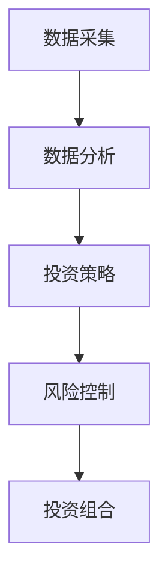

                 


# 格雷厄姆的Formula Investing：系统化投资方法

> 关键词：格雷厄姆，投资方法，系统化投资，价值评估，风险管理，投资组合优化

> 摘要：本文系统地介绍格雷厄姆的Formula Investing方法，从其背景、核心理念到具体的数学模型和系统架构，结合实际案例分析，深入探讨如何通过系统化的方法进行投资决策和风险管理。文章旨在帮助读者理解并应用格雷厄姆的投资理念，实现稳健的投资收益。

---

# 第一部分: 格雷厄姆的Formula Investing概述

## 第1章: 公式化投资方法的背景与核心理念

### 1.1 投资的基本问题与挑战

#### 1.1.1 投资的基本概念与问题背景
投资是通过将资金投入各种金融资产或实体项目，以期获得超过投入资本的收益。然而，投资过程中存在诸多挑战，包括市场的不确定性、信息的不透明性以及投资者情绪的波动性等。传统投资方法往往依赖于主观判断和市场直觉，这使得投资决策缺乏系统性和科学性。

#### 1.1.2 传统投资方法的局限性
传统投资方法通常基于市场趋势和技术分析，但这种方法存在以下问题：
- **主观性**：依赖个人经验和判断，容易受到情绪影响。
- **不可量化**：难以通过数学模型进行系统化分析。
- **风险控制不足**：缺乏系统化的风险管理方法。

#### 1.1.3 格雷厄姆的Formula Investing的提出
本杰明·格雷厄姆（Benjamin Graham）作为价值投资的鼻祖，提出了一种基于基本面分析和数学模型的投资方法——Formula Investing。这种方法的核心在于通过量化分析，筛选出具有安全边际的优质资产，从而降低投资风险并实现稳定收益。

---

### 1.2 格雷厄姆的投资理念与方法

#### 1.2.1 格雷厄姆的生平与投资思想
格雷厄姆是20世纪著名的投资大师，他的投资理念深刻影响了巴菲特等后来者。他主张以合理的价格购买具有内在价值的优质企业，强调安全边际和长期稳健的投资回报。

#### 1.2.2 Formula Investing的核心原则
Formula Investing的核心原则包括：
1. **内在价值**：通过基本面分析确定资产的真实价值。
2. **安全边际**：以低于内在价值的价格买入资产，以降低风险。
3. **分散投资**：通过分散投资降低特定资产的风险。
4. **长期视角**：关注长期收益，而非短期波动。

#### 1.2.3 公式化投资方法的适用场景
Formula Investing适用于以下场景：
- **长期价值投资者**：希望通过基本面分析寻找优质资产。
- **风险厌恶型投资者**：希望通过安全边际降低投资风险。
- **机构投资者**：需要系统化的方法进行投资组合管理。

---

### 1.3 公式化投资的核心要素

#### 1.3.1 投资标的的选择标准
格雷厄姆的Formula Investing方法要求投资者选择具有以下特征的资产：
- **低市盈率（P/E）**：市盈率低于行业平均水平。
- **低市净率（P/B）**：市净率低于行业平均水平。
- **高股息率**：股息率较高，且股息支付稳定。

#### 1.3.2 投资组合的构建原则
投资组合的构建需要遵循以下原则：
- **分散化**：避免过度集中于某一只资产。
- **价值导向**：优先选择具有安全边际的资产。
- **动态调整**：根据市场变化定期调整投资组合。

#### 1.3.3 风险控制的数学模型
格雷厄姆的Formula Investing方法通过以下数学模型进行风险控制：
1. **安全边际公式**：
   $$ \text{安全边际} = \text{内在价值} - \text{市场价格} $$
2. **投资组合风险模型**：
   $$ \text{总风险} = \sqrt{w_1^2 \sigma_1^2 + w_2^2 \sigma_2^2 + \ldots + w_n^2 \sigma_n^2} $$
   其中，\( w_i \) 是第 \( i \) 个资产的投资比例，\( \sigma_i \) 是第 \( i \) 个资产的收益率标准差。

---

## 第2章: 投资标的的内在价值评估

### 2.1 内在价值的定义与计算公式

#### 2.1.1 内在价值的公式化表达
内在价值是资产在未来现金流的现值。计算公式如下：
$$ \text{内在价值} = \sum_{t=1}^{n} \frac{C_t}{(1 + r)^t} $$
其中，\( C_t \) 是第 \( t \) 年的现金流，\( r \) 是折现率。

#### 2.1.2 格雷厄姆的内在价值评估模型
格雷厄姆提出了一种简化版的内在价值计算方法：
$$ \text{内在价值} = \frac{E \times (8.5 + 2)}{P} $$
其中，\( E \) 是企业净利润，\( P \) 是股价。

#### 2.1.3 内在价值与市场价值的对比分析
通过对比分析表格（见下文），可以看出内在价值与市场价值的区别：

| 项目               | 内在价值                     | 市场价值                     |
|--------------------|------------------------------|------------------------------|
| 定义               | 资产未来现金流的现值         | 当前市场上的价格             |
| 计算方式           | 基于基本面分析               | 市场供需决定                 |
| 用途               | 作为投资决策的参考           | 作为交易价格                 |

---

### 2.2 财务指标的公式化分析

#### 2.2.1 市盈率（P/E）的计算与应用
市盈率公式：
$$ \text{P/E} = \frac{\text{股价}}{\text{每股收益}} $$
应用：市盈率低于行业平均水平时，资产具有投资价值。

#### 2.2.2 市净率（P/B）的计算与应用
市净率公式：
$$ \text{P/B} = \frac{\text{股价}}{\text{每股净资产}} $$
应用：市净率低于1时，资产具有投资价值。

#### 2.2.3 股息率的计算与应用
股息率公式：
$$ \text{股息率} = \frac{\text{每股股息}}{\text{股价}} \times 100\% $$
应用：股息率高于行业平均水平时，资产具有投资价值。

---

### 2.3 投资标的筛选的数学模型

#### 2.3.1 基于多指标的筛选公式
通过以下步骤筛选投资标的：
1. 计算市盈率（P/E）和市净率（P/B）。
2. 筛选P/E低于行业平均水平且P/B低于1的资产。
3. 计算股息率，筛选股息率高于行业平均水平的资产。

#### 2.3.2 筛选模型的优化与调整
根据市场变化，动态调整筛选模型中的参数，例如：
- 调整折现率 \( r \) 以反映市场风险变化。
- 根据行业特点调整筛选指标的权重。

#### 2.3.3 模型的适用性与局限性
- **适用性**：适用于价值投资策略。
- **局限性**：无法预测市场短期波动，且模型需要根据市场变化进行调整。

---

## 第3章: 投资组合的构建与优化

### 3.1 投资组合的基本原理

#### 3.1.1 投资组合的定义与目标
投资组合是多种资产的组合，目标是通过多样化降低风险并实现稳健收益。

#### 3.1.2 投资组合的风险与收益平衡
- **风险与收益的权衡**：高收益通常伴随着高风险。
- **风险分散**：通过投资不同资产降低特定风险。

---

### 3.2 投资组合优化的数学模型

#### 3.2.1 基于均值-方差的优化模型
Markowitz的均值-方差优化模型：
$$ \min \sigma^2 \quad \text{subject to} \quad \mu \geq \text{目标收益} $$
其中，\( \mu \) 是收益均值，\( \sigma^2 \) 是收益方差。

#### 3.2.2 基于风险承受能力的优化策略
根据投资者的风险承受能力调整投资组合的配置比例。

#### 3.2.3 约束条件下的优化问题
考虑约束条件（如流动性、交易成本等）进行优化。

---

### 3.3 投资组合的动态调整方法

#### 3.3.1 市场变化对投资组合的影响
根据市场变化，定期重新评估投资组合的内在价值和安全边际。

#### 3.3.2 定期调整的策略与步骤
1. 评估市场变化。
2. 计算投资组合的当前价值。
3. 根据偏差调整资产配置。

#### 3.3.3 动态调整的数学模型
通过以下公式动态调整投资比例：
$$ w_i = \frac{v_i}{\sum v_j} $$
其中，\( v_i \) 是第 \( i \) 个资产的当前价值。

---

## 第4章: 投资系统的架构设计

### 4.1 系统功能模块划分

#### 4.1.1 数据采集模块
- 数据来源：股票市场数据、财务报表数据等。
- 功能：采集并存储数据。

#### 4.1.2 数据分析模块
- 功能：计算市盈率、市净率等指标，评估内在价值。

#### 4.1.3 投资策略模块
- 功能：根据筛选模型选择投资标的。

#### 4.1.4 风险控制模块
- 功能：动态调整投资组合，控制风险。

---

### 4.2 系统架构的Mermaid图


---

### 4.3 系统接口设计

#### 4.3.1 数据接口规范
- 输入：数据源（如CSV文件）。
- 输出：结构化数据（如JSON格式）。

#### 4.3.2 策略接口规范
- 输入：筛选条件。
- 输出：投资标的列表。

#### 4.3.3 风险控制接口规范
- 输入：当前投资组合。
- 输出：调整建议。

---

## 第5章: 项目实战与案例分析

### 5.1 环境安装与配置

#### 5.1.1 投资分析工具的安装
- 工具：Python（如Pandas、NumPy等）。
- 安装命令：`pip install pandas numpy`

#### 5.1.2 数据源的获取与配置
- 数据源：股票市场数据（如Yahoo Finance）。

---

### 5.2 核心实现源代码

#### 5.2.1 数据分析代码
```python
import pandas as pd
import numpy as np

# 示例数据
data = {
    '股价': [100, 80, 120, 90],
    '净利润': [20, 15, 30, 25]
}

df = pd.DataFrame(data)

# 计算市盈率
df['PE'] = df['股价'] / (df['净利润'] / 100)
print(df)
```

#### 5.2.2 投资策略实现
```python
# 筛选条件：PE < 15 且 PB < 1
pe_threshold = 15
pb_threshold = 1

selected_stocks = df[df['PE'] < pe_threshold & df['PB'] < pb_threshold]
print(selected_stocks)
```

---

### 5.3 案例分析与解读

#### 5.3.1 案例背景
假设我们有四只股票，数据如下：

| 股票 | 股价 | 净利润 | PE | PB |
|------|------|--------|----|----|
| A    | 100  | 20     | 5  | 2  |
| B    | 80   | 15     | 5.33| 1.6|
| C    | 120  | 30     | 4  | 1.5|
| D    | 90   | 25     | 3.6| 1.8|

---

#### 5.3.2 数据分析与策略实现
1. 计算PE和PB。
2. 筛选PE < 15 且 PB < 1的股票。
3. 结果：股票C满足条件，具有投资价值。

---

## 第6章: 总结与展望

### 6.1 本章小结
本文详细介绍了格雷厄姆的Formula Investing方法，从理论到实践，结合数学模型和系统架构，展示了如何通过系统化的方法进行投资决策和风险管理。

### 6.2 注意事项
- 投资需谨慎，市场波动较大，需根据实际情况调整策略。
- 系统化投资方法需要结合市场环境和投资者自身需求进行调整。

### 6.3 拓展阅读
- 《格雷厄姆投资经典》
- 《巴菲特的Formula Investing实践》

---

## 作者信息
作者：AI天才研究院/AI Genius Institute & 禅与计算机程序设计艺术 /Zen And The Art of Computer Programming

