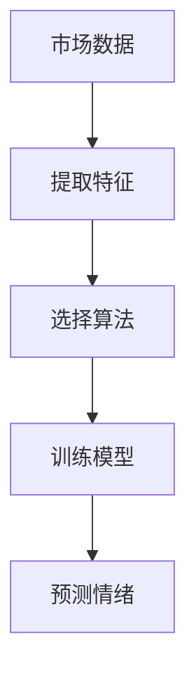
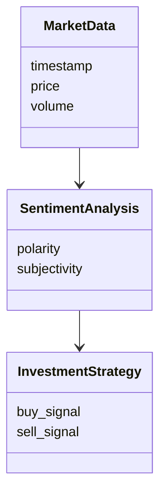

                 


# 格雷厄姆的Mr. Market比喻及其现代意义

> 关键词：格雷厄姆，Mr. Market，投资心理学，市场波动，价值投资，行为金融学，风险管理

> 摘要：本文深入探讨了本杰明·格雷厄姆提出的Mr. Market比喻，分析其在投资心理学中的核心作用，结合现代市场环境，揭示其在价值投资、行为金融学以及风险管理中的现代意义。文章从背景介绍、核心概念、算法原理、系统分析、项目实战等多个维度展开，旨在为投资者和金融从业者提供理论与实践相结合的深度见解。

---

## 第一部分: 引言

### 1.1 本书的目的与意义

#### 1.1.1 为什么研究Mr. Market比喻

Mr. Market是本杰明·格雷厄姆在其经典著作《聪明的投资者》中提出的一个比喻，用以解释市场波动与投资者情绪之间的关系。这一比喻不仅是价值投资理论的核心，也为现代行为金融学奠定了基础。在当今复杂多变的市场环境中，重新审视这一比喻，能够为投资者提供深刻的启示。

#### 1.1.2 本书的核心观点

- Mr. Market比喻揭示了市场波动的本质：市场的波动性来源于投资者情绪的非理性。
- 通过分析Mr. Market的现代意义，可以帮助投资者更好地理解市场行为和决策过程。
- 结合现代金融工具和技术，Mr. Market的理论在风险管理、投资策略制定等方面具有重要的应用价值。

#### 1.1.3 读者对象与预期收获

- 读者对象：投资者、金融从业者、心理学研究者、经济学爱好者。
- 预期收获：通过本文，读者将深入理解Mr. Market的理论框架，并能够将其应用于实际投资决策中。

---

## 第二部分: 格雷厄姆的Mr. Market比喻及其背景

### 2.1 Mr. Market比喻的核心背景

#### 2.1.1 格雷厄姆的背景介绍

本杰明·格雷厄姆（1894-1976）是价值投资的鼻祖，被誉为“价值投资之父”。他不仅是成功的投资者，还是著名的投资教育家，培养了包括沃伦·巴菲特在内的众多投资大师。格雷厄姆的投资理念强调安全边际和长期价值，主张以低于内在价值的价格买入优质资产。

#### 2.1.2 Mr. Market比喻的提出

为了帮助投资者理解市场波动的非理性本质，格雷厄姆提出了Mr. Market这一虚构角色。Mr. Market代表市场情绪，时而乐观，时而悲观，导致市场价格波动。投资者需要与Mr. Market保持理性的距离，避免被其情绪左右。

#### 2.1.3 格雷厄姆的其他主要观点

- 投资的第一目标不是打败市场，而是保护资本。
- 长期投资优于短期投机。
- 安全边际的重要性。

---

## 第三部分: Mr. Market比喻的核心思想

### 3.1 投资者心理与市场波动

#### 3.1.1 投资者心理的周期性

投资者情绪呈现周期性波动，从乐观到悲观，再从悲观到乐观。这种情绪波动直接影响市场价格，导致市场的非理性波动。

#### 3.1.2 Mr. Market与市场波动的关系

- Mr. Market的情绪波动是市场波动的直接原因。
- 投资者需要识别市场情绪的变化，并利用这种变化进行理性投资。

#### 3.1.3 理性与非理性决策的对比

- 理性决策：基于基本面分析和长期价值判断。
- 非理性决策：受市场情绪影响，做出短期、冲动的决策。

---

## 第四部分: 现代市场的演变与Mr. Market的现代意义

### 4.1 现代市场的特点

#### 4.1.1 技术进步对市场的影响

- 信息技术的发展加速了信息传播，导致市场反应更快。
- 算法交易的普及使得市场波动更加频繁和复杂。

#### 4.1.2 信息传播的速度与广度

- 网络时代下，信息传播速度极快，市场情绪容易被放大。
- 社交媒体对市场情绪的影响日益显著。

#### 4.1.3 市场参与者的多样性

- 机构投资者、散户投资者、算法交易员并存，市场行为更加多样化。

### 4.2 行为金融学与Mr. Market的现代应用

#### 4.2.1 行为金融学的基本概念

行为金融学研究投资者心理和行为对市场的影响，强调非理性因素在市场中的作用。

#### 4.2.2 Mr. Market比喻在行为金融学中的应用

- 行为金融学通过实验和模型验证了Mr. Market比喻的合理性。
- Mr. Market的理论为行为金融学提供了理论基础。

#### 4.2.3 现代市场中的投资者行为分析

- 羊群效应：投资者跟随市场情绪，导致价格的过度波动。
- 过度自信：投资者高估自己的判断能力，导致非理性决策。

---

## 第五部分: 算法原理与市场分析

### 5.1 市场情绪分析的算法模型

#### 5.1.1 基于文本挖掘的市场情绪分析

- 使用自然语言处理（NLP）技术分析新闻、社交媒体等内容，提取市场情绪指标。
- 示例代码：
  ```python
  from textblob import TextBlob
  def sentiment_analysis(text):
      blob = TextBlob(text)
      return blob.sentiment.polarity
  ```

#### 5.1.2 基于时间序列的市场波动预测

- 使用ARIMA模型预测市场波动。
- 示例代码：
  ```python
  from statsmodels.tsa.arima_model import ARIMA
  model = ARIMA(data, order=(5,1,0))
  model_fit = model.fit()
  ```

#### 5.1.3 算法原理的Mermaid流程图



---

## 第六部分: 系统分析与架构设计

### 6.1 问题场景介绍

- 需求：构建一个基于Mr. Market理论的市场情绪监控系统。
- 目标：实时监控市场情绪，提供投资建议。

### 6.2 系统功能设计

#### 6.2.1 领域模型



#### 6.2.2 系统架构设计

```mermaid
client
server
    client --> server: market_data
    server --> client: sentiment_analysis
    client --> server: investment_strategy
```

---

## 第七部分: 项目实战

### 7.1 环境安装与配置

- 安装必要的Python库：pandas, numpy, matplotlib, textblob。

### 7.2 核心实现代码

#### 7.2.1 数据获取与预处理

```python
import pandas as pd
data = pd.read_csv('market_data.csv')
data.head()
```

#### 7.2.2 情绪分析与可视化

```python
from textblob import TextBlob
import matplotlib.pyplot as plt

sentiments = []
for text in data['news']:
    blob = TextBlob(text)
    sentiments.append(blob.sentiment.polarity)

plt.hist(sentiments, bins=10)
plt.show()
```

#### 7.2.3 投资策略实现

```python
def investment_strategy(sentiments):
    if sentiments.mean() > 0.2:
        return "buy"
    else:
        return "sell"
```

---

## 第八部分: 总结与展望

### 8.1 核心观点回顾

- Mr. Market比喻揭示了市场波动的本质。
- 现代市场中，投资者情绪的影响更加显著。
- 结合行为金融学和算法分析，可以更好地理解和应用Mr. Market理论。

### 8.2 未来展望

- 结合人工智能技术，进一步提升市场情绪分析的准确性。
- 探索更多基于Mr. Market理论的投资策略。

---

作者：AI天才研究院/AI Genius Institute & 禅与计算机程序设计艺术 /Zen And The Art of Computer Programming

