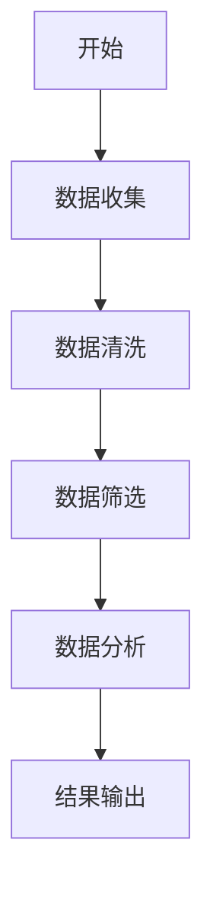
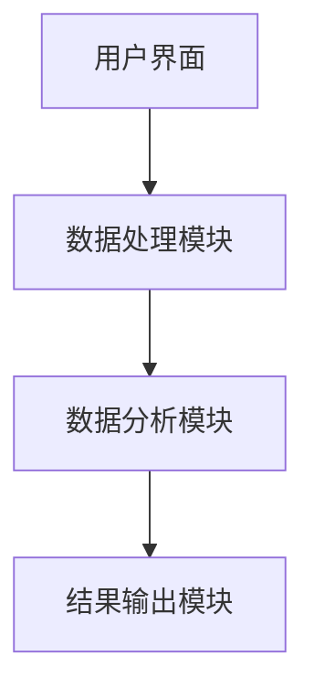
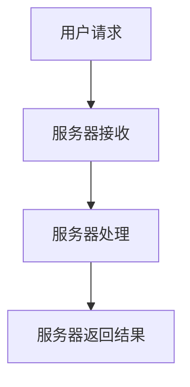

                 


# 格雷厄姆的Special Situations：寻找特殊机会

> **关键词：** 特殊机会、价值投资、格雷厄姆、投资策略、数学模型  
> **摘要：** 本文深入探讨了格雷厄姆的Special Situations投资策略，通过分析其核心概念、算法原理、系统架构及项目实战，为读者提供了一套寻找特殊机会的系统方法。文章结合理论与实践，帮助读者理解如何通过数学模型和系统架构设计，实现特殊机会的识别与评估。

---

# 第1章: 价值投资与Special Situations的背景

## 1.1 价值投资的起源与发展

### 1.1.1 价值投资的定义与核心理念
价值投资是一种以低于公平价值的价格买入优质资产的投资策略。其核心理念是通过深入分析企业的基本面，寻找市场低估的投资机会。格雷厄姆是价值投资的奠基人，他提出的“Margin of Safety”（安全边际）概念，强调在价格远低于内在价值时买入资产，以降低投资风险。

### 1.1.2 格雷厄姆与价值投资的贡献
 Benjamin Graham（本杰明·格雷厄姆）是20世纪最伟大的投资理论家之一，他的投资理念深刻影响了巴菲特、彼得·林奇等投资大师。格雷厄姆在《证券分析》和《聪明的投资者》中提出了一系列投资原则，其中包括：

1. **安全边际**：买入价格远低于内在价值的股票。
2. **价值投资**：关注企业的基本面，而非市场的短期波动。
3. **分散投资**：通过分散投资降低风险。

### 1.1.3 Special Situations的定义与特点
Special Situations（特殊机会）是指那些由于市场短期波动、公司困境或其他特殊原因导致市场价格远低于内在价值的投资机会。这些机会通常存在于以下几种情况：

- **困境企业**：公司因财务困境或管理问题而被市场低估。
- **重组机会**：企业通过资产重组或管理层变动带来价值回升。
- **市场错估**：市场因信息不对称或情绪波动导致价格偏离真实价值。

---

## 1.2 格雷厄姆的投资哲学

### 1.2.1 格雷厄姆的投资策略
格雷厄姆的投资策略基于以下原则：

1. **买入低估资产**：寻找市场价格低于内在价值的股票或资产。
2. **安全边际**：确保买入价格远低于内在价值，以降低风险。
3. **长期持有**：价值投资强调长期持有，等待市场回归理性。
4. **分散投资**：通过分散投资降低特定资产的风险。

### 1.2.2 格雷厄姆的估值方法
格雷厄姆提出了多种估值方法，包括：

1. **市盈率法**：通过比较市盈率与行业平均水平，寻找低估股票。
2. **市净率法**：比较市净率与行业平均水平，寻找低估股票。
3. **内在价值法**：通过对企业未来现金流的折现，计算内在价值。

### 1.2.3 格雷厄姆的选股原则
格雷厄姆的选股原则包括以下几点：

1. **关注低市盈率和低市净率的股票**。
2. **关注高分红率的股票**。
3. **关注财务稳健的企业**。

---

## 1.3 Special Situations的背景与现状

### 1.3.1 特殊机会的定义与类型
Special Situations（特殊机会）是指那些由于市场短期波动、公司困境或其他特殊原因导致市场价格远低于内在价值的投资机会。这些机会通常存在于以下几种情况：

1. **困境企业**：公司因财务困境或管理问题而被市场低估。
2. **重组机会**：企业通过资产重组或管理层变动带来价值回升。
3. **市场错估**：市场因信息不对称或情绪波动导致价格偏离真实价值。

### 1.3.2 特殊机会的市场环境
Special Situations通常出现在市场低迷或公司陷入困境时。这些情况下，市场情绪往往悲观，导致优质资产被低估。投资者需要具备敏锐的洞察力，才能发现这些特殊机会。

### 1.3.3 特殊机会的案例分析
以某家陷入财务困境的公司为例，假设该公司因管理问题导致股价大幅下跌。通过分析其财务报表，发现公司基本面并未恶化，且具有较高的内在价值。此时，投资者可以考虑买入该公司的股票，等待市场回归理性。

---

# 第2章: Special Situations的核心概念与联系

## 2.1 Special Situations的核心原理

### 2.1.1 格雷厄姆的内在价值理论
格雷厄姆认为，股票的内在价值是其未来现金流的现值。通过分析公司的财务报表和行业趋势，可以估算其内在价值。当市场价格低于内在价值时，投资者可以买入股票。

### 2.1.2 特殊机会的识别与评估
识别特殊机会需要结合定量分析和定性分析。定量分析包括计算市盈率、市净率等指标，定性分析包括研究公司的管理团队和行业地位。

### 2.1.3 特殊机会的风险与收益平衡
特殊机会通常具有较高的风险和收益潜力。投资者需要权衡风险与收益，确保投资决策的合理性。

---

## 2.2 Special Situations的核心要素对比

### 2.2.1 特殊机会与普通投资的对比
| **对比维度** | **特殊机会** | **普通投资** |
|--------------|--------------|--------------|
| 投资目标     | 寻找低估资产 | 获取稳定收益 |
| 投资风险     | 较高         | 较低         |
| 投资期限     | 中长期       | 短期或中长期 |

### 2.2.2 不同特殊机会的特征分析
以表格形式展示不同特殊机会的特征对比：

| **机会类型** | **特点**                     |
|--------------|------------------------------|
| 困境企业      | 财务状况不佳，股价低估       |
| 重组机会      | 企业通过重组提升价值       |
| 市场错估      | 市场情绪导致价格偏离真实价值 |

### 2.2.3 特殊机会的ER实体关系图
使用Mermaid语法绘制ER图：

```mermaid
erd
    Customer(cust_id, name, investment_amount)
    Investment(investment_id, company_id, cust_id)
    Company(company_id, name, market_value)
```

---

## 2.3 Special Situations的策略优缺点

### 2.3.1 优点
1. **高收益潜力**：特殊机会通常具有较高的收益潜力。
2. **低买高卖**：通过在低价买入高价卖出，实现收益。

### 2.3.2 缺点
1. **高风险**：特殊机会通常伴随着较高的投资风险。
2. **周期性**：特殊机会往往具有较强的周期性。

---

# 第3章: Special Situations的算法原理与数学模型

## 3.1 Special Situations的算法流程

### 3.1.1 算法流程图（Mermaid）
使用Mermaid语法绘制算法流程图：



### 3.1.2 数据清洗与筛选
通过Python代码实现数据清洗和筛选：

```python
import pandas as pd

# 数据清洗
data_clean = data.dropna()
data_clean = data_clean[~data_clean['price'].is outlier]

# 数据筛选
selected_data = data_clean[data_clean['pe'] < 15]
```

### 3.1.3 数据分析
使用数学模型进行数据分析：

$$ V = \sum_{t=1}^{n} \frac{CF_t}{(1 + r)^t} $$

其中，\( V \) 表示内在价值，\( CF_t \) 表示第 \( t \) 年的现金流，\( r \) 表示折现率。

---

## 3.2 Special Situations的数学模型

### 3.2.1 格雷厄姆的内在价值公式
$$ V = \frac{E}{1 + g} $$

其中，\( E \) 表示企业未来现金流的现值，\( g \) 表示增长率。

### 3.2.2 安全边际的计算公式
$$ \text{安全边际} = \frac{\text{内在价值} - \text{市场价格}}{\text{内在价值}} $$

---

## 3.3 Special Situations的算法实现

### 3.3.1 Python代码实现
```python
def calculate_intrinsic_value(cf, r, g):
    return sum(cf / (1 + r)**t for t in range(len(cf)))

def calculate_margin_of_safety(intrinsic_value, market_price):
    return (intrinsic_value - market_price) / intrinsic_value
```

### 3.3.2 算法实现的注意事项
1. **数据准确性**：确保输入数据的准确性。
2. **参数选择**：合理选择折现率和增长率。
3. **模型假设**：明确模型的假设条件。

---

# 第4章: Special Situations的系统分析与架构设计

## 4.1 系统功能设计

### 4.1.1 系统架构设计
使用Mermaid语法绘制系统架构图：



### 4.1.2 系统功能模块
1. **数据处理模块**：负责数据的收集和清洗。
2. **数据分析模块**：负责数据的筛选和分析。
3. **结果输出模块**：负责结果的展示和报告生成。

---

## 4.2 系统接口设计

### 4.2.1 API接口设计
```json
{
    "api": "/api/special_situations",
    "method": "POST",
    "params": {
        "data": "输入数据",
        "parameters": "算法参数"
    }
}
```

### 4.2.2 接口实现
```python
from flask import Flask, request, jsonify

app = Flask(__name__)

@app.route('/api/special_situations', methods=['POST'])
def special_situations():
    data = request.json['data']
    params = request.json['parameters']
    # 处理数据
    result = process_data(data, params)
    return jsonify(result)

if __name__ == '__main__':
    app.run()
```

---

## 4.3 系统交互设计

### 4.3.1 系统交互流程
使用Mermaid语法绘制交互流程图：



---

# 第5章: Special Situations的项目实战

## 5.1 项目环境安装

### 5.1.1 安装Python
```bash
python --version
```

### 5.1.2 安装依赖库
```bash
pip install pandas numpy matplotlib
```

---

## 5.2 项目核心实现

### 5.2.1 数据清洗与筛选
```python
import pandas as pd

# 数据清洗
data_clean = data.dropna()
data_clean = data_clean[~data_clean['price'].is outlier]

# 数据筛选
selected_data = data_clean[data_clean['pe'] < 15]
```

### 5.2.2 数据分析与建模
```python
def calculate_intrinsic_value(cf, r, g):
    return sum(cf / (1 + r)**t for t in range(len(cf)))

def calculate_margin_of_safety(intrinsic_value, market_price):
    return (intrinsic_value - market_price) / intrinsic_value
```

---

## 5.3 项目小结

### 5.3.1 项目总结
通过本项目，我们实现了一个基于格雷厄姆Special Situations策略的投资分析系统。该系统能够帮助投资者识别特殊机会，评估投资风险，并制定投资策略。

### 5.3.2 项目优化建议
1. **数据源扩展**：增加更多的数据源。
2. **模型优化**：引入机器学习算法，提升预测精度。
3. **用户界面优化**：开发友好的用户界面，方便用户使用。

---

# 第6章: Special Situations的最佳实践

## 6.1 小结

### 6.1.1 核心概念回顾
- **Special Situations**：寻找市场价格低于内在价值的投资机会。
- **安全边际**：确保买入价格远低于内在价值。
- **价值投资**：关注企业的基本面，长期持有优质资产。

### 6.1.2 投资策略总结
1. **关注低估资产**：寻找市场价格低于内在价值的股票。
2. **分散投资**：通过分散投资降低风险。
3. **长期持有**：等待市场回归理性。

---

## 6.2 注意事项

### 6.2.1 风险提示
- **市场风险**：市场波动可能导致投资亏损。
- **信息风险**：信息不对称可能导致投资决策失误。
- **操作风险**：操作失误可能导致投资失败。

### 6.2.2 投资纪律
- **严格执行纪律**：不盲目跟风，坚持价值投资。
- **定期复盘**：定期检查投资组合，及时调整策略。

---

## 6.3 拓展阅读

### 6.3.1 推荐书籍
1. 《证券分析》（作者：本杰明·格雷厄姆）
2. 《聪明的投资者》（作者：本杰明·格雷厄姆）
3. 《投资学原理》（作者：威廉·夏普）

### 6.3.2 推荐工具
1. **Python**：数据处理和分析的首选工具。
2. **Pandas**：数据分析库。
3. **Matplotlib**：数据可视化解密库。

---

# 作者：AI天才研究院/AI Genius Institute & 禅与计算机程序设计艺术 /Zen And The Art of Computer Programming

