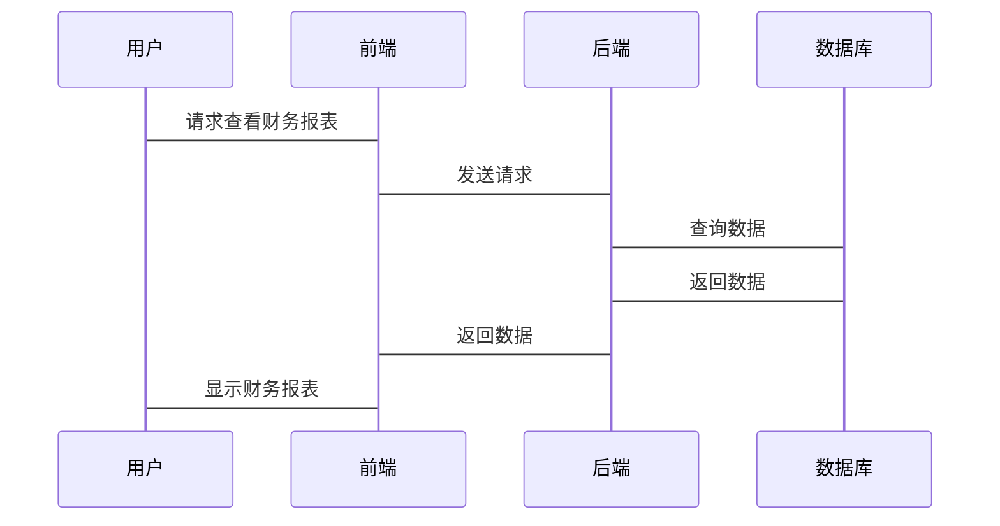

                 


# 格雷厄姆的Working Capital管理：运营效率的重要性

## 关键词：格雷厄姆, Working Capital, 运营效率, 资金流动性, 企业财务

## 摘要：本文深入探讨了格雷厄姆在Working Capital管理方面的理论与实践，分析了其对运营效率的重要性。通过系统的章节分析，文章详细阐述了Working Capital的构成、管理策略、数学模型、系统架构及项目实战，结合实例和图表，全面解析了如何通过优化Working Capital管理提升企业财务健康和运营效率。

---

# 第一部分: Working Capital管理概述

## 第1章: Working Capital管理概述

### 1.1 Working Capital的基本概念

#### 1.1.1 Working Capital的定义
Working Capital（营运资本）是指企业在一定时期内流动资产与流动负债的差额，反映了企业短期偿债能力和运营效率。公式为：
$$ \text{Working Capital} = \text{流动资产} - \text{流动负债} $$

#### 1.1.2 Working Capital的重要性
Working Capital是企业维持日常运营的核心资金来源，直接影响企业的偿债能力、资金周转和利润水平。充足的营运资本能够确保企业平稳运作，避免因资金短缺导致的运营中断。

#### 1.1.3 Working Capital与企业运营的关系
Working Capital贯穿企业运营的各个环节，从采购原材料到销售产品，再到支付员工薪酬，都需要依赖营运资本的合理配置。通过优化Working Capital管理，企业可以提高资金使用效率，降低成本，增强盈利能力。

### 1.2 Working Capital管理的目标

#### 1.2.1 提高资金流动性
通过合理配置流动资产和流动负债，确保企业有足够的现金流动性，避免因资金链断裂导致的经营风险。

#### 1.2.2 优化资产使用效率
减少非必要的流动资产持有，如过量的库存或应收账款，提高资金的周转速度，降低资金占用成本。

#### 1.2.3 控制负债规模
合理控制流动负债的增长，避免因短期债务过重导致的偿债压力，同时降低因负债过多带来的财务风险。

### 1.3 Working Capital管理的核心要素

#### 1.3.1 流动资产
流动资产包括现金及现金等价物、存货、应收账款和其他流动资产，是企业短期内可以变现或使用的资产。

#### 1.3.2 流动负债
流动负债包括应付账款、短期借款、应付职工薪酬和其他流动负债，是企业在短期内需要偿还的债务。

#### 1.3.3 净营运资本
净营运资本是流动资产减去流动负债的结果，是衡量企业短期偿债能力的重要指标。公式为：
$$ \text{净营运资本} = \text{流动资产} - \text{流动负债} $$

### 1.4 本章小结
本章介绍了Working Capital的基本概念、管理目标和核心要素，强调了其在企业运营中的重要性。通过合理管理Working Capital，企业可以提高资金流动性，优化资产使用效率，控制负债规模，从而提升整体运营效率。

---

## 第2章: Working Capital的构成与计算

### 2.1 流动资产的构成

#### 2.1.1 现金及现金等价物
现金及现金等价物是企业最流动的资产，包括库存现金、银行存款和短期投资等。

#### 2.1.2 存货
存货是企业为销售而持有的商品、原材料和在制品，包括原材料库存、在制品库存和成品库存。

#### 2.1.3 应收账款
应收账款是企业因赊销商品而产生的应收款项，是企业的一项重要流动资产。

#### 2.1.4 其他流动资产
其他流动资产包括预付账款、短期投资和其他可快速变现的资产。

### 2.2 流动负债的构成

#### 2.2.1 应付账款
应付账款是企业因购买原材料或服务而欠供应商的款项。

#### 2.2.2 短期借款
短期借款是企业在银行或其他金融机构取得的短期贷款。

#### 2.2.3 应付职工薪酬
应付职工薪酬是企业尚未支付给员工的工资、奖金和福利等。

#### 2.2.4 其他流动负债
其他流动负债包括预收账款、应付利息和其他短期负债。

### 2.3 净营运资本的计算公式

#### 2.3.1 净营运资本的计算
净营运资本是流动资产减去流动负债的结果，公式为：
$$ \text{净营运资本} = \text{流动资产} - \text{流动负债} $$

#### 2.3.2 净营运资本的正负意义
- 当净营运资本为正时，说明企业有足够的流动资产偿还短期负债。
- 当净营运资本为负时，说明企业流动资产不足以偿还短期负债，存在偿债风险。

### 2.4 本章小结
本章详细介绍了流动资产和流动负债的构成，并通过净营运资本的计算公式，说明了其在企业财务分析中的重要性。正确计算和分析净营运资本，有助于企业制定合理的财务策略。

---

## 第3章: Working Capital管理的策略

### 3.1 流动资产管理策略

#### 3.1.1 库存管理
通过ABC分类法优化库存管理，减少过剩库存，降低存储成本和资金占用。

#### 3.1.2 应收账款管理
建立严格的信用管理制度，缩短应收账款回收周期，降低坏账风险。

#### 3.1.3 现金管理
合理规划现金流量，确保企业有足够的现金储备，同时避免资金闲置。

### 3.2 流动负债管理策略

#### 3.2.1 应付账款管理
与供应商建立良好的合作关系，延长付款期限，优化现金流。

#### 3.2.2 短期债务管理
合理安排短期借款规模，选择合适的融资渠道，降低融资成本。

#### 3.2.3 现金流出管理
优化现金流支出结构，避免不必要的开支，确保资金使用效率。

### 3.3 优化净营运资本的方法

#### 3.3.1 提高资产周转率
通过加快存货周转和应收账款回收，提高资产使用效率。

#### 3.3.2 降低负债规模
合理控制短期负债规模，减少偿债压力。

#### 3.3.3 优化资本结构
通过调整流动资产和流动负债的比例，优化资本结构，降低财务风险。

### 3.4 本章小结
本章提出了优化Working Capital管理的具体策略，包括流动资产管理和流动负债管理两大方面。通过这些策略，企业可以有效提高资金流动性，降低财务风险，提升整体运营效率。

---

## 第4章: Working Capital管理的数学模型与分析

### 4.1 Working Capital的数学定义

#### 4.1.1 流动资产的数学表达
流动资产包括现金及现金等价物、存货、应收账款和其他流动资产，可以用公式表示为：
$$ \text{流动资产} = \text{现金} + \text{存货} + \text{应收账款} + \text{其他流动资产} $$

#### 4.1.2 流动负债的数学表达
流动负债包括应付账款、短期借款、应付职工薪酬和其他流动负债，可以用公式表示为：
$$ \text{流动负债} = \text{应付账款} + \text{短期借款} + \text{应付职工薪酬} + \text{其他流动负债} $$

#### 4.1.3 净营运资本的数学公式
净营运资本是流动资产减去流动负债的结果，公式为：
$$ \text{净营运资本} = \text{流动资产} - \text{流动负债} $$

### 4.2 Working Capital管理的优化模型

#### 4.2.1 优化目标
最小化净营运资本，同时满足以下约束条件：
1. 流动资产 ≥ 流动负债
2. 资金流动性 ≥ 最低要求
3. 资产周转率 ≥ 目标值

#### 4.2.2 数学模型
$$ \min \text{净营运资本} = \text{流动资产} - \text{流动负债} $$
$$ \text{约束条件}： $$
$$ \text{流动资产} \geq \text{流动负债} $$
$$ \text{资金流动性} \geq \text{最低要求} $$
$$ \text{资产周转率} \geq \text{目标值} $$

### 4.3 优化算法

#### 4.3.1 算法步骤
1. 收集企业流动资产和流动负债数据。
2. 计算净营运资本。
3. 优化流动资产和流动负债的配置，确保净营运资本最小化。
4. 输出优化后的流动资产和流动负债配置方案。

#### 4.3.2 算法实现
```python
def optimize_working_capital(fluid_assets, fluid_liabilities):
    net_working_capital = fluid_assets - fluid_liabilities
    if net_working_capital < 0:
        # 优化流动负债配置，降低负债规模
        adjusted_fluid_liabilities = fluid_liabilities * 0.9
        return fluid_assets, adjusted_fluid_liabilities
    else:
        # 优化流动资产配置，提高资产周转率
        adjusted_fluid_assets = fluid_assets * 0.95
        return adjusted_fluid_assets, fluid_liabilities
```

### 4.4 本章小结
本章通过数学模型和优化算法，展示了如何通过优化流动资产和流动负债的配置，降低净营运资本，提高企业资金流动性。算法实现部分提供了具体的优化方法，为企业的实际操作提供了参考。

---

## 第5章: Working Capital管理的系统架构与设计

### 5.1 问题场景介绍
企业需要一个系统化的解决方案，实时监控和管理Working Capital，优化资产配置，提高资金流动性。

### 5.2 系统功能设计

#### 5.2.1 数据采集模块
- 采集企业的流动资产和流动负债数据。
- 数据来源包括财务报表、银行对账单和其他财务系统。

#### 5.2.2 分析模块
- 计算净营运资本。
- 生成资产周转率和资金流动性报告。
- 提供优化建议。

#### 5.2.3 监控模块
- 实时监控净营运资本的变化。
- 设置预警机制，及时提醒企业潜在的财务风险。

#### 5.2.4 报表生成模块
- 生成详细的财务报表和分析报告。
- 提供可视化的数据展示。

### 5.3 系统架构设计

#### 5.3.1 系统架构
采用分层架构，包括前端、后端和数据库。

- **前端**：用户界面，展示实时数据和分析结果。
- **后端**：业务逻辑处理，包括数据采集、分析和优化建议生成。
- **数据库**：存储企业的财务数据和分析结果。

#### 5.3.2 接口设计
- 数据采集接口：与企业财务系统对接，获取流动资产和流动负债数据。
- 报告生成接口：输出财务报表和分析报告。

#### 5.3.3 系统交互流程图


### 5.4 本章小结
本章详细设计了一个基于Working Capital管理的系统架构，包括功能模块、系统架构和接口设计。通过系统的优化和监控，企业可以实时掌握Working Capital的变化，及时调整财务策略。

---

## 第6章: Working Capital管理的项目实战

### 6.1 环境安装

#### 6.1.1 安装Python和相关库
安装Python 3.x，安装Pandas、NumPy和Matplotlib库：
```bash
pip install pandas numpy matplotlib
```

#### 6.1.2 安装财务分析系统
安装并配置企业财务分析系统，确保与企业财务系统的对接。

### 6.2 核心代码实现

#### 6.2.1 计算净营运资本
```python
import pandas as pd

# 数据加载
df = pd.read_csv('financial_data.csv')

# 计算流动资产和流动负债
fluid_assets = df['现金'] + df['存货'] + df['应收账款'] + df['其他流动资产']
fluid_liabilities = df['应付账款'] + df['短期借款'] + df['应付职工薪酬'] + df['其他流动负债']

# 计算净营运资本
net_working_capital = fluid_assets - fluid_liabilities

print('净营运资本:', net_working_capital)
```

#### 6.2.2 优化配置算法
```python
def optimize_working_capital(fluid_assets, fluid_liabilities):
    net_working_capital = fluid_assets - fluid_liabilities
    if net_working_capital < 0:
        # 优化流动负债配置
        adjusted_fluid_liabilities = fluid_liabilities * 0.9
        return fluid_assets, adjusted_fluid_liabilities
    else:
        # 优化流动资产配置
        adjusted_fluid_assets = fluid_assets * 0.95
        return adjusted_fluid_assets, fluid_liabilities

# 调用优化函数
fluid_assets, fluid_liabilities = optimize_working_capital(fluid_assets, fluid_liabilities)
print('优化后的流动资产:', fluid_assets)
print('优化后的流动负债:', fluid_liabilities)
```

#### 6.2.3 可视化分析
```python
import matplotlib.pyplot as plt

plt.figure(figsize=(10,6))
plt.plot(df['日期'], df['净营运资本'], label='净营运资本')
plt.xlabel('日期')
plt.ylabel('金额（万元）')
plt.title('净营运资本变化趋势')
plt.legend()
plt.show()
```

### 6.3 项目小结
本章通过项目实战，展示了如何利用Python和相关库进行Working Capital的计算、优化和可视化分析。通过实际案例，读者可以掌握如何将理论应用于实践，优化企业的财务管理。

---

## 第7章: 总结与展望

### 7.1 本章总结
本文系统地探讨了格雷厄姆的Working Capital管理理论与实践，从基本概念到数学模型，再到系统架构和项目实战，全面解析了如何通过优化Working Capital管理提升企业运营效率。

### 7.2 未来展望
未来，随着人工智能和大数据技术的发展，Working Capital管理将更加智能化和精准化。企业可以通过机器学习算法预测资金需求，优化资产配置，实时监控财务状况，进一步提升财务管理水平。

---

## 作者：AI天才研究院/AI Genius Institute & 禅与计算机程序设计艺术 /Zen And The Art of Computer Programming

---

本文通过详细的章节分析，结合理论与实践，全面探讨了格雷厄姆的Working Capital管理方法。从基本概念到优化策略，从数学模型到系统设计，再到项目实战，为读者提供了全面的指导和深刻的见解。希望本文能够帮助企业在复杂多变的商业环境中，通过优化Working Capital管理，提升运营效率，实现可持续发展。

