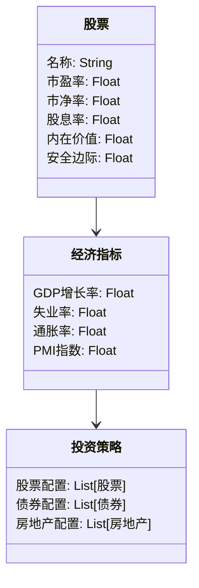
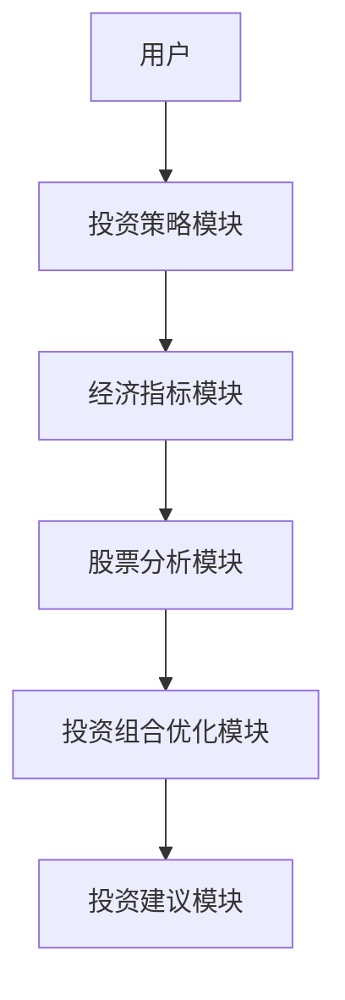
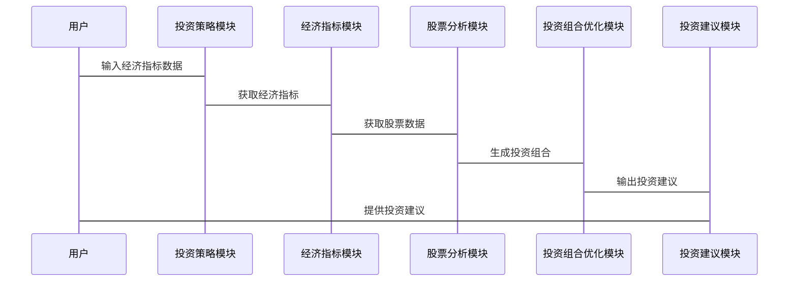

                 


# 格雷厄姆的价值投资在不同经济周期中的应用

## 关键词：价值投资，经济周期，格雷厄姆，投资策略，风险管理

## 摘要：  
本文深入探讨了格雷厄姆的价值投资理论在不同经济周期中的应用。通过分析经济周期的特点及其对投资策略的影响，本文提出了在不同经济阶段中如何调整价值投资策略的具体方法，并结合实际案例和系统架构，展示了如何在实际投资中应用这些理论。文章还讨论了价值投资的局限性和风险管理的重要性，为投资者提供了全面的指导。

---

## 第一部分: 格雷厄姆价值投资基础

### 第1章: 价值投资的核心理念

#### 1.1 价值投资的定义与核心要素

##### 1.1.1 价值投资的定义  
价值投资是一种基于对公司内在价值评估的投资策略，强调以低于内在价值的价格买入优质资产。格雷厄姆的价值投资理论强调安全边际和长期持有优质资产。

##### 1.1.2 格雷厄姆的价值投资理论核心要素  
格雷厄姆的价值投资理论包括以下核心要素：  
- **安全边际**：买入价格低于内在价值，以减少市场波动带来的风险。  
- **内在价值**：通过基本面分析计算出的公司股票的合理价格。  
- **长期视角**：关注企业的长期盈利能力，而非短期市场波动。  

##### 1.1.3 价值投资与成长投资的区别  
价值投资与成长投资的主要区别在于：  
- **价值投资**：关注低估值的股票，注重安全边际和内在价值。  
- **成长投资**：关注高成长性的公司，愿意为未来的增长支付更高的溢价。  

#### 1.2 格雷厄姆投资策略的关键原则

##### 1.2.1 安全边际的概念  
安全边际是格雷厄姆理论的核心，指的是买入价格与内在价值之间的差距。通过安全边际，投资者可以在市场波动中减少损失并获得超额收益。  

##### 1.2.2 股票内在价值的计算方法  
格雷厄姆提出了多种计算内在价值的方法，其中最常用的是基于市盈率（P/E）和市净率（P/B）的估值方法。  

##### 1.2.3 投资组合的构建原则  
格雷厄姆建议构建分散化的投资组合，以降低特定资产或行业带来的风险。  

#### 1.3 价值投资的适用场景与局限性

##### 1.3.1 价值投资的适用场景  
价值投资在经济衰退期和低增长期表现尤为突出，因为此时市场往往低估优质资产。  

##### 1.3.2 价值投资的局限性  
- 价值投资在高增长期可能表现不佳，因为市场可能更青睐成长性而非低估值。  
- 需要较长的时间周期才能体现价值。  

##### 1.3.3 价值投资与经济周期的关系  
价值投资在经济周期的不同阶段表现不同，需根据周期调整策略。  

---

## 第二部分: 经济周期的基本理论

### 第2章: 经济周期的定义与分类

#### 2.1 经济周期的定义与分类

##### 2.1.1 经济周期的定义  
经济周期是指经济活动的波动，包括扩张和收缩两个阶段。  

##### 2.1.2 经济周期的主要类型  
- **经济衰退期**：GDP下降，失业率上升，企业盈利减少。  
- **经济复苏期**：经济开始恢复，企业盈利逐步回升。  
- **经济繁荣期**：经济高速增长，企业盈利丰厚。  
- **经济滞胀期**：高通胀和低经济增长并存。  

##### 2.1.3 经济周期的指标与衡量方法  
常用的经济周期指标包括：GDP增长率、失业率、通胀率、PMI指数等。  

#### 2.2 不同经济周期的特点与影响

##### 2.2.1 经济衰退期的特点与影响  
- 特点：GDP下降，企业盈利减少，市场情绪低迷。  
- 影响：股票市场可能大幅下跌，债券收益率可能下降。  

##### 2.2.2 经济复苏期的特点与影响  
- 特点：经济开始恢复，企业盈利逐步回升。  
- 影响：股票市场可能反弹，房地产市场逐渐复苏。  

##### 2.2.3 经济繁荣期的特点与影响  
- 特点：GDP高速增长，企业盈利丰厚。  
- 影响：股票市场可能创新高，通胀压力上升。  

##### 2.2.4 经济滞胀期的特点与影响  
- 特点：高通胀和低经济增长并存。  
- 影响：股票市场可能震荡，债券收益率可能上升。  

#### 2.3 经济周期对投资策略的影响

##### 2.3.1 经济周期对股票市场的影响  
- 经济衰退期：股票市场可能下跌，价值投资机会增加。  
- 经济复苏期：股票市场可能反弹，成长投资机会增加。  
- 经济繁荣期：股票市场可能创新高，但价值投资可能表现不佳。  

##### 2.3.2 经济周期对债券市场的影响  
- 经济衰退期：债券收益率可能下降，债券价格上涨。  
- 经济复苏期：债券收益率可能上升，债券价格下跌。  

##### 2.3.3 经济周期对房地产市场的影响  
- 经济衰退期：房地产市场可能低迷，但优质资产可能被低估。  
- 经济复苏期：房地产市场逐步复苏，需求增加。  

---

## 第三部分: 格雷厄姆价值投资与经济周期的结合

### 第3章: 格雷厄姆价值投资在不同经济周期中的表现

#### 3.1 格雷厄姆价值投资在不同经济周期中的表现

##### 3.1.1 经济衰退期的价值投资机会  
- 企业估值可能被低估，安全边际较大。  
- 适合买入低估值的蓝筹股和优质债券。  

##### 3.1.2 经济复苏期的价值投资策略  
- 逐步转向成长性较高的资产，同时保持一定的安全边际。  

##### 3.1.3 经济繁荣期的价值投资风险  
- 市场可能高估，价值投资可能表现不佳。  
- 需要警惕泡沫破裂的风险。  

##### 3.1.4 经济滞胀期的价值投资调整  
- 降低股票配置，增加抗通胀资产如房地产和黄金。  

#### 3.2 不同经济周期下的投资策略选择

##### 3.2.1 经济衰退期的投资策略  
- 买入低估值的股票和债券，关注安全边际。  

##### 3.2.2 经济复苏期的投资策略  
- 逐步增加成长性资产，同时保持一定的防御性配置。  

##### 3.2.3 经济繁荣期的投资策略  
- 保持适度防御，关注估值合理且具备成长性的企业。  

##### 3.2.4 经济滞胀期的投资策略  
- 降低股票配置，增加抗通胀资产，如房地产和大宗商品。  

#### 3.3 经济周期对价值投资指标的影响

##### 3.3.1 市盈率（P/E）在不同经济周期中的表现  
- 经济衰退期：P/E可能较高，因为企业盈利下降。  
- 经济复苏期：P/E可能逐步回归合理水平。  
- 经济繁荣期：P/E可能较低，因为企业盈利增长快。  

##### 3.3.2 市净率（P/B）在不同经济周期中的表现  
- 经济衰退期：P/B可能较高，因为资产价值可能被低估。  
- 经济复苏期：P/B可能逐步回归合理水平。  
- 经济繁荣期：P/B可能较低，因为企业资产增长快。  

##### 3.3.3 股息率在不同经济周期中的表现  
- 经济衰退期：股息率可能较高，因为企业盈利下降，但股息支付率可能上升。  
- 经济复苏期：股息率可能逐步回归正常水平。  
- 经济繁荣期：股息率可能较低，因为企业盈利增长快，可能减少股息支付。  

---

## 第四部分: 格雷厄姆价值投资策略的实战案例

### 第4章: 格雷厄姆价值投资策略的实战案例

#### 4.1 美国经济周期中的价值投资案例

##### 4.1.1 2008年金融危机后的价值投资机会  
- 金融危机后，许多优质企业被低估，提供了买入机会。  
- 例如，买入被低估的金融企业股票，如美国银行。  

##### 4.1.2 2020年新冠疫情后的价值投资策略  
- 疫情期间，许多企业估值被低估，提供了买入机会。  
- 例如，买入被低估的科技股，如苹果和微软。  

#### 4.2 全球经济周期中的价值投资案例

##### 4.2.1 2000年互联网泡沫破裂后的价值投资  
- 网络泡沫破裂后，许多科技股被低估，提供了买入机会。  
- 例如，买入被低估的互联网企业股票，如亚马逊和谷歌。  

##### 4.2.2 2023年全球经济滞胀期的价值投资策略  
- 在滞胀期，需要降低股票配置，增加抗通胀资产。  
- 例如，买入房地产投资信托基金（REITs）和黄金。  

---

## 第五部分: 系统架构与项目实现

### 第5章: 系统架构与项目实现

#### 5.1 问题场景介绍  
- 需要开发一个基于格雷厄姆价值投资策略的投资管理系统，能够根据不同经济周期调整投资策略。  

#### 5.2 系统功能设计

##### 5.2.1 领域模型设计  


##### 5.2.2 系统架构设计  


##### 5.2.3 系统接口设计  
- 用户输入经济指标数据。  
- 系统根据经济指标生成投资策略。  
- 系统输出投资组合建议。  

##### 5.2.4 系统交互设计  


#### 5.3 项目实现

##### 5.3.1 环境安装  
- 需要安装Python、Pandas、NumPy、Matplotlib等库。  

##### 5.3.2 核心实现源代码  
```python
import pandas as pd
import numpy as np

def calculate_intrinsic_value(stock_data):
    # 假设股票数据包括市盈率、市净率、股息率等指标
    pe = stock_data['PE']
    pb = stock_data['PB']
    dividend_yield = stock_data['Dividend Yield']
    # 简单计算内在价值，可以根据实际情况调整
    intrinsic_value = (pe + pb + dividend_yield) / 3
    return intrinsic_value

def generate_investment_strategy(economic_indicators):
    strategy = {}
    if economic_indicators['GDP增长率'] < 2:
        # 经济衰退期
        strategy['股票配置'] = ['低估值蓝筹股', '优质债券']
        strategy['房地产配置'] = ['核心城市房地产']
    elif 2 <= economic_indicators['GDP增长率'] < 4:
        # 经济复苏期
        strategy['股票配置'] = ['成长性较高的股票', '低估值股票']
        strategy['债券配置'] = ['中期债券']
    elif economic_indicators['GDP增长率'] >= 4:
        # 经济繁荣期
        strategy['股票配置'] = ['高成长性股票', '优质股票']
        strategy['房地产配置'] = ['高端房地产']
    else:
        # 经济滞胀期
        strategy['债券配置'] = ['抗通胀债券']
        strategy['黄金配置'] = ['黄金']
    return strategy

# 示例数据
economic_indicators = {
    'GDP增长率': 3.5,
    '失业率': 5.2,
    '通胀率': 2.1,
    'PMI指数': 52
}

investment_strategy = generate_investment_strategy(economic_indicators)
print("投资策略:", investment_strategy)
```

##### 5.3.3 代码应用解读与分析  
- 该代码根据经济指标生成投资策略，适用于不同经济周期的投资决策。  

##### 5.3.4 实际案例分析  
- 假设当前处于经济复苏期，系统会建议增加成长性较高的股票和低估值股票。  

##### 5.3.5 项目小结  
- 通过系统架构和代码实现，可以将格雷厄姆的价值投资策略与经济周期分析结合起来，为投资者提供自动化和智能化的投资建议。  

---

## 第六部分: 总结与展望

### 第6章: 总结与展望

#### 6.1 总结  
- 格雷厄姆的价值投资在不同经济周期中的应用需要根据周期特点调整策略。  
- 经济衰退期适合买入低估值资产，经济复苏期适合增加成长性资产，经济繁荣期需要谨慎应对。  

#### 6.2 展望  
- 结合人工智能和大数据分析，进一步优化价值投资策略。  
- 开发更多自动化投资工具，帮助投资者更好地应对不同经济周期。  

---

## 附录: 参考文献

- 格雷厄姆《 Intelligent Investor》  
- 约翰·博格尔《Common Stocks and Uncommon Profits》  
- 巴菲特《 The Warren Buffett Way》  

---

## 作者：AI天才研究院/AI Genius Institute & 禅与计算机程序设计艺术 /Zen And The Art of Computer Programming

---

**文章结尾：**  
通过本文的分析，读者可以更好地理解格雷厄姆的价值投资理论在不同经济周期中的应用，并能够在实际投资中灵活运用这些策略。同时，结合系统架构和项目实现，投资者可以更科学地进行投资决策，降低风险，提高收益。

