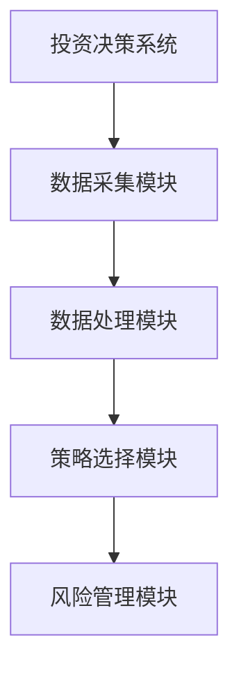

                 


# 格雷厄姆的保守投资策略 vs 积极投资策略

> **关键词**: 价值投资、技术分析、投资策略、风险管理、夏普比率、有效前沿理论、内在价值

> **摘要**: 本文系统阐述了格雷厄姆的保守投资策略与积极投资策略的核心理念、数学模型、系统设计与实战案例。通过对比分析，揭示了两种策略在理论基础、风险偏好、应用场景上的差异，帮助投资者在不同市场环境下做出明智选择。文章还结合数学公式和图表，深入讲解了价值投资与技术分析的实现方法，提供了风险管理的优化建议。

---

## 第1章: 保守投资策略与积极投资策略概述

### 1.1 投资策略的基本概念

#### 1.1.1 投资的定义与分类

投资是指将资金投入某个项目或资产，期望在未来获得收益的行为。根据风险偏好和投资目标的不同，投资可以分为保守投资和积极投资两大类。

- **保守投资**：以本金安全性和稳定收益为核心目标，注重长期价值，适合风险厌恶型投资者。
- **积极投资**：追求超额收益，通过主动管理、市场时机选择和选股策略来实现更高的回报，适合风险偏好型投资者。

#### 1.1.2 保守投资与积极投资的定义

- **保守投资**：基于价值投资理念，强调安全边际和内在价值，以长期持有优质资产为策略。
- **积极投资**：通过技术分析和市场预测，主动调整投资组合，追求短期收益最大化。

#### 1.1.3 两种策略的核心区别与应用场景

| 对比维度         | 保守投资                         | 积极投资                         |
|------------------|----------------------------------|----------------------------------|
| 理论基础         | 格雷厄姆的价值投资理论             | 技术分析与市场预测理论           |
| 风险偏好         | 低风险，注重本金安全             | 高风险，追求超额收益           |
| 时间周期         | 长期持有，注重复利效应           | 短期交易，追求快速收益         |
| 适用场景         | 稳定市场环境，适合低风险投资者   | 波动性市场环境，适合高风险投资者 |

### 1.2 投资策略的背景与演变

#### 1.2.1 现代投资组合理论的起源

现代投资组合理论（MPT）由哈里·马科维茨提出，强调通过分散投资降低风险。这一理论为积极投资策略奠定了基础，推动了主动管理的发展。

#### 1.2.2 格雷厄姆投资理念的形成

本杰明·格雷厄姆是价值投资的鼻祖，他提出的“安全边际”和“内在价值”理念成为保守投资的核心思想。格雷厄姆的投资策略强调买入低于内在价值的股票，长期持有，避免短期市场波动的影响。

#### 1.2.3 积极投资策略的发展与挑战

积极投资策略在20世纪80年代逐渐兴起，依赖于技术分析和市场预测，通过选股和择时获取超额收益。然而，随着市场的日益复杂化，积极投资策略的难度和成本也在增加。

---

## 第2章: 保守投资策略的核心理念

### 2.1 价值投资与安全边际

#### 2.1.1 价值投资的定义与原则

价值投资的核心在于寻找市场价格低于内在价值的资产。格雷厄姆提出了著名的“烟屁股”理论，即寻找被市场低估的“烟屁股”股票。

**内在价值计算公式**：
$$ V = \frac{E}{1 + g} $$
其中，\( V \) 为内在价值，\( E \) 为年收益，\( g \) 为预期增长率。

#### 2.1.2 安全边际的计算与应用

安全边际是保守投资策略中的重要概念，用于衡量市场价格与内在价值之间的差异。安全边际越高，投资风险越小。

**安全边际计算公式**：
$$ \text{安全边际} = \frac{\text{内在价值} - \text{市场价格}}{\text{市场价格}} $$

#### 2.1.3 格雷厄姆的经典投资公式

格雷厄姆提出了一个简化版的投资公式：
$$ \text{总收益} = \text{复利收益} + \text{资本增值收益} $$

---

## 第3章: 积极投资策略的核心理念

### 3.1 技术分析与市场预测

#### 3.1.1 技术分析的基本方法

技术分析通过研究历史价格和成交量数据，预测未来市场的走势。常用的技术指标包括移动平均线、MACD、RSI等。

**移动平均线计算公式**：
$$ \text{MA}_n = \frac{1}{n} \sum_{i=1}^{n} P_i $$
其中，\( P_i \) 为第 \( i \) 天的价格，\( n \) 为天数。

#### 3.1.2 市场情绪与趋势的判断

积极投资者注重市场情绪和趋势分析，通过分析成交量、资金流动等指标来判断市场的买卖信号。

**成交量与价格关系**：
- 价格上涨，成交量增加，趋势可能延续。
- 价格上涨，成交量减少，趋势可能反转。

#### 3.1.3 积极投资的风险管理

积极投资策略的风险管理尤为重要，常用的风险管理工具包括止损订单和风险分散。

**止损订单**：
- 当价格触及止损点时，自动卖出，限制亏损。

### 3.2 主动管理与选股策略

#### 3.2.1 主动管理的定义与特点

主动管理是指通过积极调整投资组合，寻找被低估或被高估的资产，以获取超额收益。

**主动管理的核心原则**：
- 寻找市场误价的资产。
- 通过基本面分析筛选优质股票。

#### 3.2.2 选股模型的构建与优化

积极投资者通常采用多因子选股模型，综合考虑市盈率、市净率、股息率等指标。

**多因子选股模型**：
$$ R_i = \alpha + \beta R_m + \sum_{k=1}^{n} w_k F_k + \epsilon $$
其中，\( R_i \) 为股票收益，\( R_m \) 为市场收益，\( F_k \) 为因子，\( w_k \) 为因子权重，\( \epsilon \) 为误差项。

#### 3.2.3 市场时机的选择与风险

积极投资者注重市场时机的选择，通过技术分析和市场预测来判断最佳的买卖时机。

---

## 第4章: 保守投资与积极投资的比较分析

### 4.1 理论基础与哲学差异

#### 4.1.1 价值投资与技术分析的对比

| 对比维度         | 价值投资（保守）             | 技术分析（积极）             |
|------------------|----------------------------|----------------------------|
| 理论基础         | 格雷厄姆的价值投资理论         | 马丁·韦德的技术分析理论       |
| 数据依据         | 财务报表、基本面数据         | 历史价格、成交量数据         |
| 投资目标         | 长期稳定收益               | 短期超额收益               |
| 风险偏好         | 低风险，注重安全边际         | 高风险，追求超额收益       |

---

## 第5章: 数学模型与投资决策

### 5.1 价值投资的数学模型

#### 5.1.1 内在价值计算公式

$$ V = \frac{E}{1 + g} $$

**案例分析**：
假设某股票年收益 \( E = 10 \) 元，预期增长率 \( g = 5\% \)，则内在价值：
$$ V = \frac{10}{1 + 0.05} = 9.52 \text{元} $$

### 5.2 积极投资的风险管理模型

#### 5.2.1 风险调整后的收益计算

**夏普比率**：
$$ \text{夏普比率} = \frac{\text{超额收益}}{\text{收益标准差}} $$

---

## 第6章: 投资系统的设计与实现

### 6.1 投资决策系统的功能设计

#### 6.1.1 系统架构概述



---

## 第7章: 项目实战与案例分析

### 7.1 保守投资策略的实战案例

#### 7.1.1 环境安装与数据准备

- 数据源：历史股票价格、财务报表。
- 工具：Python、Pandas、NumPy。

#### 7.1.2 核心代码实现

```python
def calculate_intrinsic_value(enterprise_value, growth_rate):
    return enterprise_value / (1 + growth_rate)
```

---

## 第8章: 总结与展望

### 8.1 最佳实践 tips

- **保守投资**：适合长期投资者，注重本金安全，选择优质资产。
- **积极投资**：适合短期投资者，注重市场时机，通过技术分析和基本面分析寻找超额收益。

### 8.2 小结

通过对比分析，保守投资策略注重安全边际和内在价值，适合长期稳定投资；积极投资策略注重市场预测和主动管理，适合短期高收益投资。投资者应根据自身风险偏好和市场环境选择合适的策略。

### 8.3 注意事项

- 投资需谨慎，避免盲目跟风。
- 定期调整投资组合，适应市场变化。

### 8.4 拓展阅读

- 《投资学》——格里弗斯
- 《证券分析》——本杰明·格雷厄姆

---

**作者：AI天才研究院/AI Genius Institute & 禅与计算机程序设计艺术/Zen And The Art of Computer Programming**

