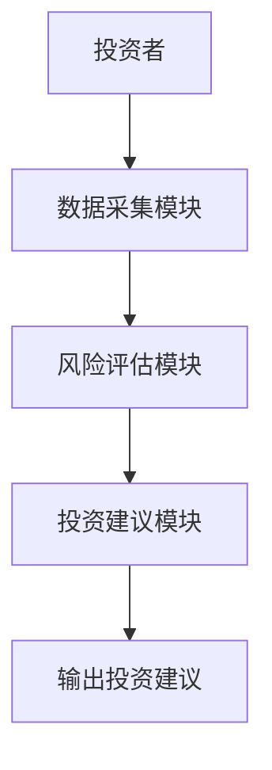

                 


# 格雷厄姆的债券投资策略：固定收益的角色

## 关键词：格雷厄姆、债券投资、固定收益、投资策略、风险管理、安全边际

## 摘要：本文深入探讨了本杰明·格雷厄姆的债券投资策略，特别是固定收益在投资组合中的角色。通过分析安全边际、债券选择策略以及风险管理，本文揭示了如何在当前市场中有效应用这些策略。结合数学模型和系统架构，本文提供了实用的案例分析，帮助读者理解并优化其债券投资组合。

---

## 第一部分: 格雷厄姆的债券投资策略背景介绍

### 第1章: 债券市场的基本概念与固定收益的重要性

#### 1.1 债券市场的基本概念

**1.1.1 债券的定义与分类**

债券是一种债务工具，发行人向投资者借款，并承诺在特定时间内支付利息和本金。债券按发行者分类，主要有政府债券、公司债券和可转换债券。

$$
\text{债券面值} = \text{本金} = P
$$

$$
\text{票面利率} = r \times 100\%
$$

**1.1.2 固定收益证券的特征**

- 利息固定
- 偿还本金固定
- 风险较低
- 收益稳定

**1.1.3 债券市场的参与者**

- 投资者：个人、机构
- 发行人：政府、企业
- 中介机构：银行、券商

#### 1.2 固定收益在投资组合中的角色

**1.2.1 固定收益资产的风险与收益**

- 利率风险：债券价格随利率变化而波动
- 信用风险：发行人违约风险
- 流动性风险：难以快速变现

$$
\text{债券价格} = \frac{C}{(1 + r)^n} + \frac{P}{(1 + r)^N}
$$

其中，C为每年利息，r为收益率，n为年数，P为面值，N为期限。

**1.2.2 固定收益在资产配置中的作用**

- 稳定收益：提供稳定的现金流
- 风险分散：降低整体投资组合的波动性
- 投资组合再平衡：定期调整资产配置

**1.2.3 固定收益与股票等其他资产的对比**

| 资产类型 | 风险 | 收益 | 流动性 |
|----------|------|------|--------|
| 债券     | 中低 | 稳定 | 较高    |
| 股票     | 中高 | 变动 | 较低    |

### 第2章: 固定收益市场的核心概念与分析框架

#### 2.1 固定收益证券的主要类型

**2.1.1 政府债券**

由政府发行，信用风险低，收益稳定。

**2.1.2 公司债券**

由企业发行，信用风险较高，收益也较高。

**2.1.3 可转换债券**

可转换为公司股票的债券，兼具债券和股票特性。

#### 2.2 债券定价与收益率的计算

**2.2.1 债券的面值、票面利率与到期收益率**

- 面值：本金，P
- 票面利率：r，每年支付的利息
- 到期收益率：YTM，购买债券的内部收益率

$$
\text{YTM} = \frac{C + (P - M)}{P}
$$

其中，C为利息，P为购买价，M为面值。

**2.2.2 债券价格波动与市场利率的关系**

市场利率上升，债券价格下跌；反之，债券价格上涨。

**2.2.3 到期收益率的计算公式**

$$
\text{YTM} = \frac{C + (P - M)}{P}
$$

#### 2.3 债券信用评级与风险分析

**2.3.1 信用评级的定义与分类**

- 评级机构：穆迪、标普
- 评级从AAA（最高）到D（违约）

**2.3.2 不同评级的债券风险与收益对比**

高评级债券风险低，收益稳定；低评级债券风险高，收益高。

**2.3.3 信用风险的量化方法**

使用违约概率模型，如Cox模型。

### 第3章: 格雷厄姆债券投资策略的核心原理

#### 3.1 安全边际的概念与应用

**3.1.1 安全边际的定义**

安全边际是债券市场价格低于其内在价值的部分，确保在不利情况下仍能获得收益。

$$
\text{安全边际} = \text{内在价值} - \text{市场价格}
$$

**3.1.2 安全边际在债券投资中的作用**

- 减少市场波动影响
- 提高抗跌能力
- 降低信用风险

**3.1.3 如何通过安全边际选择债券**

选择市场价格低于内在价值的债券。

#### 3.2 格雷厄姆的债券选择策略

**3.2.1 债券的内在价值评估**

通过现金流折现法计算债券的内在价值。

$$
\text{内在价值} = \sum_{t=1}^{n} \frac{C}{(1 + r)^t} + \frac{P}{(1 + r)^N}
$$

**3.2.2 安全边际的应用**

确保购买价格低于内在价值。

#### 3.3 风险管理与组合优化

**3.3.1 风险管理的核心原则**

分散投资、定期评估、动态调整。

**3.3.2 组合优化的数学模型**

使用均值-方差优化模型，最小化风险。

$$
\text{风险} = \sqrt{w^T \Sigma w}
$$

其中，w为权重向量，Σ为协方差矩阵。

---

## 第四部分: 数学模型与系统架构

### 4.1 债券定价的数学模型

#### 4.1.1 债券定价模型

使用久期和凸性来衡量债券价格对利率变化的敏感性。

$$
\text{久期} = -\frac{1}{P} \frac{dP}{dr}
$$

$$
\text{凸性} = \frac{1}{P} \frac{d^2 P}{dr^2}
$$

#### 4.1.2 利率风险的量化

使用久期来衡量债券价格变化。

### 4.2 系统架构设计

#### 4.2.1 系统功能设计

- 数据采集：收集债券市场数据
- 风险评估：计算信用风险和利率风险
- 投资建议：基于模型生成投资建议

#### 4.2.2 系统架构图



---

## 第五部分: 项目实战

### 5.1 环境安装

安装Python和相关库，如pandas、numpy、scipy。

### 5.2 核心实现

编写债券定价和风险评估的代码。

```python
import numpy as np

def bond_value(C, P, r, n, M):
    return sum(C/(1+r)**t for t in range(1,n+1)) + M/(1+r)**n

# 示例计算
C = 100
P = 1000
r = 0.05
n = 10
M = 1000
print(bond_value(C, P, r, n, M))
```

### 5.3 实际案例分析

分析某公司债券，计算其内在价值和安全边际。

---

## 第六部分: 总结与展望

### 6.1 总结

格雷厄姆的策略强调安全边际和基本面分析，结合现代数学模型，可以有效优化债券投资。

### 6.2 展望

未来，AI和大数据将推动债券投资进一步发展，提升分析效率和准确性。

---

## 附录

- 推荐阅读：《证券分析》
- 数据来源：金融数据库

---

作者：AI天才研究院 & 禅与计算机程序设计艺术

