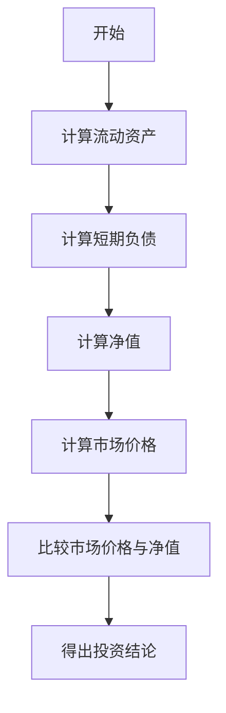
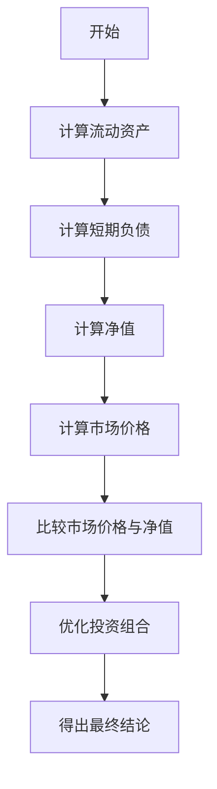
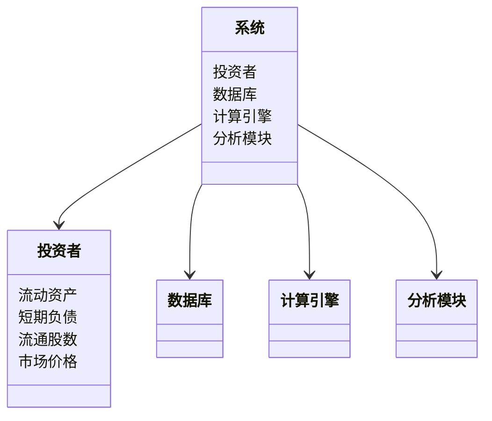
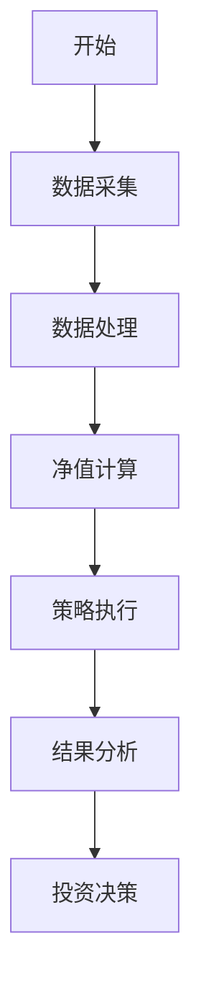

                 


# 格雷厄姆的净净策略在不同市场环境中的应用

> 关键词：格雷厄姆，净净策略，价值投资，股市分析，投资策略

> 摘要：本文系统地探讨了格雷厄姆的净净策略在不同市场环境中的应用，分析了该策略在牛市、熊市和震荡市中的优势，并通过数学模型和系统架构设计，展示了如何优化和实施这一策略。文章还结合实际案例，详细讲解了净净策略的实战应用，并总结了最佳实践和注意事项。

---

## 第一部分: 净净策略的核心概念与背景

### 第1章: 净净策略的核心概念与背景

#### 1.1 净净策略的定义与背景

格雷厄姆的净净策略是一种价值投资方法，旨在通过寻找市场价格低于其净流动资产的公司来实现超额收益。这一策略的核心在于识别那些被市场低估的公司，从而在长期投资中获得稳定的回报。

- **价值投资的起源与发展**：价值投资由本杰明·格雷厄姆和大卫·多德在20世纪初提出，强调通过基本面分析寻找被市场低估的股票。
- **净净策略的核心思想**：专注于公司的净流动资产，即流动资产减去短期负债，认为市场价格低于这一价值的股票具有投资潜力。
- **净净策略在投资中的地位**：作为价值投资的重要组成部分，净净策略帮助投资者在市场波动中寻找安全边际，降低投资风险。

#### 1.2 净净策略的数学模型与公式

净净策略的核心公式为：

$$ \text{净值} = \frac{\text{流动资产} - \text{短期负债}}{\text{流通股数}} $$

其中，市场价格与内在价值的关系为：

$$ \text{市场价格} < \text{内在价值} $$

这一公式帮助投资者计算每股市净率，识别具有投资价值的股票。

#### 1.3 净净策略的核心要素

- **流动资产**：包括现金、应收账款和存货等，是公司短期内可以变现的资产。
- **短期负债**：如应付账款和短期贷款，是公司短期内需要偿还的债务。
- **流通股数**：公司在外流通的股票数量，用于计算每股市净率。

### 第2章: 净净策略在不同市场环境中的应用

#### 2.1 牛市环境中的应用

- **牛市环境的特点**：市场情绪高涨，股价普遍上涨，投资者倾向于高估股票价值。
- **净净策略在牛市中的优势**：通过寻找被低估的股票，投资者可以在市场高估时规避风险，实现稳健收益。
- **典型案例分析**：例如，在2000年代互联网泡沫期间，许多科技股被高估，而采用净净策略的投资者成功避开了这些高风险股票，转投于基本面良好的公司。

#### 2.2 熊市环境中的应用

- **熊市环境的特点**：市场情绪低落，股价普遍下跌，投资者倾向于低估股票价值。
- **净净策略在熊市中的优势**：在市场恐慌时，许多优质股票被错杀，价格远低于其内在价值，为投资者提供了买入机会。
- **典型案例分析**：2008年全球金融危机期间，许多银行股价格暴跌，但其净流动资产依然稳健，采用净净策略的投资者在市场底部买入，获得了丰厚的回报。

#### 2.3 震荡市环境中的应用

- **震荡市环境的特点**：市场波动剧烈，股价频繁上下波动，投资者难以预测短期走势。
- **净净策略在震荡市中的优势**：通过长期持有被低估的股票，投资者可以规避短期波动带来的风险，实现长期稳定的收益。
- **典型案例分析**：2020年新冠疫情爆发期间，许多行业受到冲击，但一些具有强大基本面的公司股价被大幅低估，采用净净策略的投资者在市场震荡中抓住了投资机会。

## 第3章: 净净策略的数学模型与算法

### 3.1 净值计算的算法流程

以下是一个计算净值的算法流程图：



该流程图展示了从开始计算流动资产和短期负债，到最终得出投资结论的完整过程。

### 3.2 净净策略的优化算法

以下是一个优化净净策略的算法流程图：



该流程图展示了如何通过优化投资组合来进一步提高净净策略的收益。

## 第4章: 净净策略的系统分析与架构设计

### 4.1 系统功能设计

以下是一个基于净净策略的投资系统功能设计：



该类图展示了系统的核心组件及其关系，包括投资者、数据库、计算引擎和分析模块。

### 4.2 系统架构设计

以下是一个基于净净策略的投资系统架构设计：



该架构图展示了系统的整体流程，从数据采集到投资决策的每一步骤。

## 第5章: 净净策略的项目实战

### 5.1 环境安装与数据采集

为了实施净净策略，首先需要安装必要的工具和环境，包括数据采集工具、分析工具和交易执行系统。以下是一个Python环境的安装示例：

```bash
pip install pandas numpy matplotlib
```

### 5.2 核心算法实现

以下是计算净值和市场价格的Python代码示例：

```python
import pandas as pd

# 计算净值
def calculate_net_worth(fl_assets, short_liabilities):
    return (fl_assets - short_liabilities) / shares_outstanding

# 比较市场价格与净值
def is_undervalued(market_price, net_worth):
    return market_price < net_worth

# 示例数据
fl_assets = 1000000  # 流动资产
short_liabilities = 500000  # 短期负债
shares_outstanding = 1000000  # 流通股数
market_price = 1.5  # 市场价格

net_worth = calculate_net_worth(fl_assets, short_liabilities)
is_undervalued = is_undervalued(market_price, net_worth)

print(f"净值: {net_worth:.2f}")
print(f"市场价格是否低于净值: {is_undervalued}")
```

### 5.3 实战案例分析

以下是一个在A股市场中应用净净策略的案例分析：

- **环境搭建**：使用Python和相关库进行数据处理和分析。
- **数据收集**：从东方财富网获取相关股票的流动资产、短期负债和市场价格数据。
- **策略实现**：计算每股市净率，筛选出市场价格低于净值的股票。
- **结果分析**：分析筛选出的股票的历史表现和未来潜力，优化投资组合。

### 5.4 项目小结

通过实战案例，我们可以看到净净策略在实际应用中的有效性。然而，投资者需要不断优化策略，结合市场环境和公司基本面进行综合判断。

## 第6章: 净净策略的最佳实践与注意事项

### 6.1 最佳实践

- **持续学习与更新**：市场环境不断变化，投资者需要不断学习和更新自己的知识库。
- **风险控制**：合理分配资产，设置止损点，避免过度集中投资。
- **长期持有**：价值投资需要耐心，长期持有优质股票才能获得稳定收益。

### 6.2 小结

净净策略作为一种经典的价值投资方法，在不同市场环境中都有其独特的优势。通过系统的分析和优化，投资者可以更好地应用这一策略，实现稳健的投资回报。

### 6.3 注意事项

- **避免盲目跟从**：每个市场环境都有其特殊性，投资者需要根据实际情况调整策略。
- **关注公司基本面**：除了价格因素，公司基本面如盈利能力、管理团队等也需重点关注。
- **分散投资**：不要将所有资金投入到单一股票或行业，分散投资可以降低风险。

### 6.4 拓展阅读

- **书籍推荐**：《The Intelligent Investor》（《聪明的投资者》）——本杰明·格雷厄姆
- **相关论文**：探讨价值投资策略在不同市场环境下的应用效果。

---

## 作者简介

作者：AI天才研究院/AI Genius Institute & 禅与计算机程序设计艺术 /Zen And The Art of Computer Programming

---

通过本文的详细分析和系统设计，我们可以看到格雷厄姆的净净策略在不同市场环境中的广泛应用和有效性。无论是牛市、熊市还是震荡市，这一策略都能帮助投资者在复杂多变的市场中找到安全边际，实现稳健的投资回报。希望本文能为投资者提供有价值的参考，帮助他们在实际投资中更好地应用这一策略。

