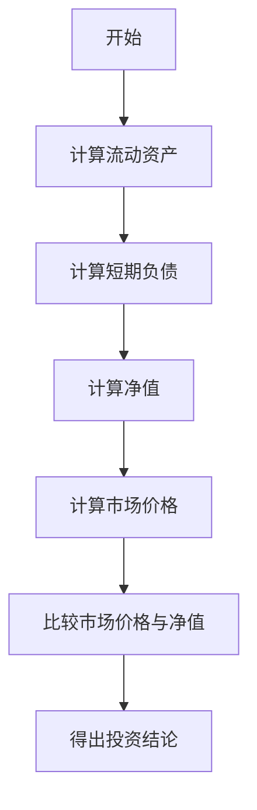
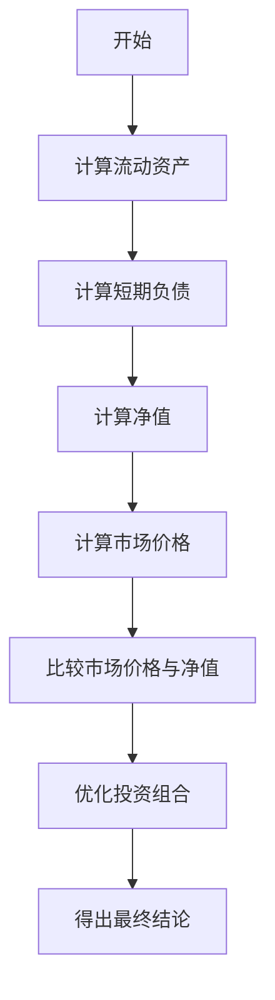
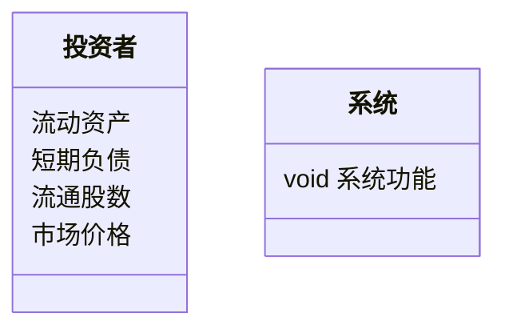

                 


# 格雷厄姆的净净策略在不同市场环境中的应用

> 关键词：格雷厄姆，净净策略，价值投资，市场环境，投资策略

> 摘要：本文深入探讨了格雷厄姆的净净策略在不同市场环境中的应用，从牛市、熊市到震荡市，分析了该策略的优势与局限性，并结合数学模型和系统架构，提出了优化方案。通过实际案例分析，展示了如何在A股市场中应用净净策略，并总结了最佳实践和注意事项。

---

# 第1章 净净策略的核心概念与背景

## 1.1 净净策略的定义与背景

### 1.1.1 价值投资的起源与发展

格雷厄姆是价值投资的鼻祖，他的投资理念深刻影响了巴菲特等众多投资者。净净策略是格雷厄姆提出的一种寻找被低估股票的方法，核心在于通过计算公司净值来判断其市场价格是否低于内在价值。

### 1.1.2 净净策略的核心思想

净净策略的核心在于关注公司的净流动资产，即流动资产减去短期负债。如果市场价格低于这一净流动资产，公司就被认为是被低估的投资标的。

### 1.1.3 净净策略在投资中的地位

作为价值投资的重要工具，净净策略在市场波动中为投资者提供了寻找安全边际的机会，尤其在熊市中表现突出。

## 1.2 净净策略的数学模型与公式

### 1.2.1 净值计算公式

$$ 净值 = \frac{流动资产 - 短期负债}{流通股数} $$

### 1.2.2 市场价格与内在价值的关系

$$ 市场价格 < 内在价值 $$

## 1.3 净净策略的核心要素

### 1.3.1 流动资产的定义与计算

流动资产包括现金、应收账款等，通常在资产负债表中列为流动资产部分。

### 1.3.2 短期负债的定义与计算

短期负债包括应付账款、短期借款等，通常在资产负债表中列为流动负债部分。

### 1.3.3 流通股数的定义与影响

流通股数是公司在外流通的股票数量，影响公司的总市值。

---

# 第2章 净净策略在不同市场环境中的应用

## 2.1 牛市环境中的应用

### 2.1.1 牛市环境的特点

牛市中市场情绪高涨，股价普遍上涨，但净净策略仍能找到被低估的股票。

### 2.1.2 净净策略在牛市中的优势

在牛市中，净净策略可以帮助投资者避免过度支付，寻找价值被低估的股票。

### 2.1.3 典型案例分析

分析某公司在牛市中的表现，展示净净策略的应用效果。

## 2.2 熊市环境中的应用

### 2.2.1 熊市环境的特点

熊市中市场情绪低迷，股价普遍下跌，净净策略在此时表现尤为突出。

### 2.2.2 净净策略在熊市中的优势

在熊市中，净净策略可以帮助投资者找到真正具有价值的股票，避免亏损。

### 2.2.3 典型案例分析

分析某公司在熊市中的表现，展示净净策略的应用效果。

## 2.3 震荡市环境中的应用

### 2.3.1 震荡市环境的特点

震荡市中市场波动较大，股价频繁波动，净净策略需要灵活调整。

### 2.3.2 净净策略在震荡市中的优势

在震荡市中，净净策略可以帮助投资者捕捉短期波动中的机会。

### 2.3.3 典型案例分析

分析某公司在震荡市中的表现，展示净净策略的应用效果。

---

# 第3章 净净策略的数学模型与算法

## 3.1 净值计算的算法流程



## 3.2 净净策略的优化算法



---

# 第4章 净净策略的系统分析与架构设计

## 4.1 系统功能设计



## 4.2 系统架构设计


---

# 第5章 净净策略的项目实战

## 5.1 环境搭建

### 5.1.1 安装Python环境

使用Anaconda安装Python 3.8及以上版本。

### 5.1.2 数据收集

从Yahoo Finance获取历史数据。

## 5.2 核心实现

### 5.2.1 净值计算

编写Python代码计算公司净值。

```python
import pandas as pd

# 计算流动资产和短期负债
流动资产 = company_data['流动资产']
短期负债 = company_data['短期负债']
净值 = (流动资产 - 短期负债) / company_data['流通股数']
```

### 5.2.2 市场价格比较

将计算出的净值与市场价格进行比较。

### 5.2.3 投资决策

根据比较结果决定是否投资。

## 5.3 实际案例分析

### 5.3.1 案例选择

选择某A股公司进行分析。

### 5.3.2 数据分析

展示数据分析的过程和结果。

### 5.3.3 结果解读

解释分析结果，并提出投资建议。

## 5.4 项目小结

总结项目实施过程中的经验教训，提出改进建议。

---

# 第6章 总结与展望

## 6.1 总结

净净策略在不同市场环境中的应用具有显著的优势，尤其是在熊市中表现突出。

## 6.2 展望

未来，结合机器学习和大数据分析，净净策略将进一步优化，为投资者提供更精准的投资决策支持。

---

作者：AI天才研究院/AI Genius Institute & 禅与计算机程序设计艺术 /Zen And The Art of Computer Programming

