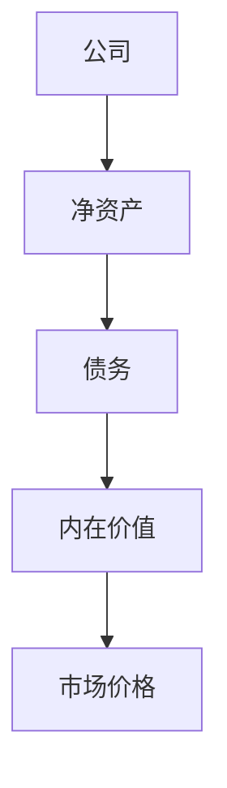
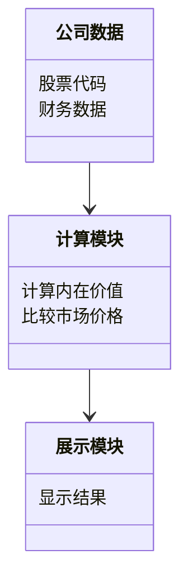
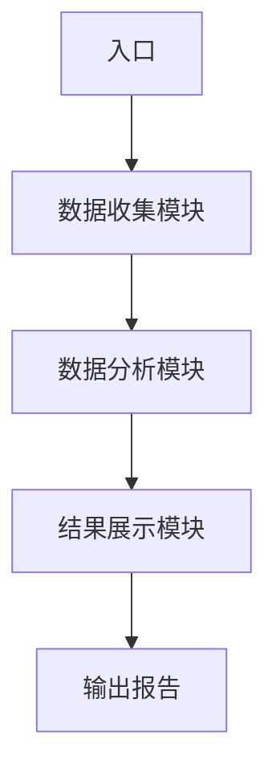
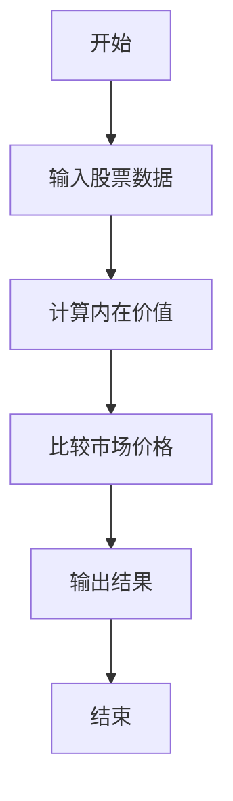

                 


# 格雷厄姆的净净股策略：寻找被低估的公司

> **关键词**：价值投资、净净股策略、低估公司、内在价值、格雷厄姆、烟屁股投资  
> **摘要**：本文深入探讨了格雷厄姆的净净股策略，从其核心理念、数学模型、系统架构到实际应用，全面解析了如何通过该策略寻找市场低估的公司。文章通过逻辑推理和实际案例，详细阐述了格雷厄姆的投资哲学及其在现代投资分析中的应用价值。

---

## 第一部分：格雷厄姆的净净股策略概述

### 第1章：格雷厄姆与净净股策略的背景介绍

#### 1.1 格雷厄姆的投资理念
##### 1.1.1 价值投资的起源
- 价值投资的定义：寻找市场价格低于其内在价值的资产。
- 格雷厄姆的学术背景： Columbia University，导师 Benjamin Graham。
- 格雷厄姆的投资哲学：安全边际与防御性投资。

##### 1.1.2 格雷厄姆的净净股策略背景
- 20世纪30年代经济大萧条的背景：市场恐慌导致股票价格被低估。
- 格雷厄姆提出“净净股”概念：寻找市场价格低于其净资产价值的公司。

##### 1.1.3 净净股策略的定义与目标
- 净净股的定义：市场价格低于其净资产价值的股票。
- 策略目标：通过寻找被市场低估的公司，实现长期稳定的投资收益。

#### 1.2 净净股策略的核心概念
##### 1.2.1 净净价值的计算
- 净净价值的公式：  
  $$ \text{内在价值} = \text{净资产价值} - \text{债务} $$
- 净净价值与市场价格的关系：  
  $$ \text{市场价格} < \text{内在价值} $$

##### 1.2.2 低估公司的识别标准
- 净净股的筛选标准：  
  - 市场价格低于净资产价值。
  - 市盈率低于行业平均水平。
  - 偿债能力较强，资产负债率低于行业平均水平。

##### 1.2.3 净净股策略的适用场景
- 市场恐慌：投资者情绪低落，股票价格被低估。
- 经济低迷：整体市场估值偏低，容易找到净净股。

---

### 第2章：净净股策略的核心概念与联系

#### 2.1 净净价值的计算公式
- 内在价值的计算公式：  
  $$ \text{内在价值} = \text{总资产} - \text{总负债} $$
- 净净股的筛选条件：  
  $$ \text{市场价格} < \text{内在价值} $$

#### 2.2 净净股策略的属性特征对比表
| 属性       | 特征                   |
|------------|------------------------|
| 计算基础     | 净资产                 |
| 策略目标     | 寻找低估公司             |
| 适用场景     | 市场恐慌或经济低迷       |

#### 2.3 净净股策略的ER实体关系图


---

### 第3章：净净股策略的系统分析与架构设计

#### 3.1 系统功能设计


#### 3.2 系统架构设计


---

## 第二部分：净净股策略的数学模型与算法原理

### 第4章：净净股策略的数学模型

#### 4.1 内在价值的数学表达
$$ \text{内在价值} = \text{总资产} - \text{总负债} $$

#### 4.2 净净股的筛选条件
$$ \text{市场价格} < \text{内在价值} $$

#### 4.3 算法流程图


---

## 第三部分：项目实战与案例分析

### 第5章：项目实战

#### 5.1 环境配置
- 数据来源：Yahoo Finance 或 Bloomberg。
- 工具安装：Python、Pandas、NumPy。

#### 5.2 核心代码实现
```python
import pandas as pd
import numpy as np

def calculate_intrinsic_value(assets, liabilities):
    return assets - liabilities

def is_net_net_stock(price, intrinsic_value):
    return price < intrinsic_value

# 示例数据
assets = 1000
liabilities = 800
price = 200

intrinsic_value = calculate_intrinsic_value(assets, liabilities)
result = is_net_net_stock(price, intrinsic_value)

print(f"内在价值: {intrinsic_value}")
print(f"是否为净净股: {result}")
```

#### 5.3 案例分析
- 案例1：假设某公司总资产为1000万元，总负债为800万元，市场价格为200万元。
  - 内在价值：200万元。
  - 市场价格：200万元。
  - 结论：市场价格等于内在价值，不满足净净股条件。

- 案例2：假设某公司总资产为1500万元，总负债为900万元，市场价格为300万元。
  - 内在价值：600万元。
  - 市场价格：300万元。
  - 结论：市场价格低于内在价值，满足净净股条件。

---

## 第四部分：总结与展望

### 第6章：最佳实践与总结

#### 6.1 小结
- 净净股策略的核心在于寻找市场价格低于内在价值的公司。
- 该策略适用于市场恐慌或经济低迷的时期。

#### 6.2 注意事项
- 数据质量：确保财务数据的准确性和完整性。
- 行业分析：不同行业适用性不同，需结合行业特点进行调整。

#### 6.3 拓展阅读
- 格雷厄姆的《 Intelligent Investor 》。
- 《价值投资实战手册》。

---

## 附录：术语表与参考文献

### 附录A：术语表
- 净资产：总资产减去总负债。
- 内在价值：基于公司财务状况计算的理论价值。
- 净净股：市场价格低于内在价值的股票。

### 附录B：参考文献
- Benjamin Graham,《 Intelligent Investor 》。
- 投资分析相关学术论文。

---

**作者：AI天才研究院/AI Genius Institute & 禅与计算机程序设计艺术 /Zen And The Art of Computer Programming**

