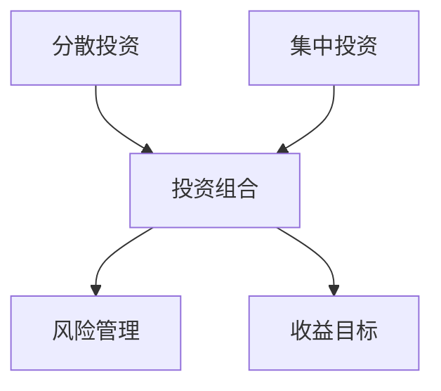

                 


# 格雷厄姆的分散投资原则 vs 巴菲特的集中投资：如何权衡

## 关键词：
- 投资策略
- 分散投资
- 集中投资
- 风险控制
- 投资组合
- 价值投资

## 摘要：
本文深入分析了格雷厄姆的分散投资原则和巴菲特的集中投资策略，探讨了两者的核心理念、优缺点及其适用场景。通过数学模型、系统架构和实际案例的分析，帮助读者理解如何根据自身情况权衡这两种投资策略，构建最优的投资组合。

---

## 第1章：投资策略基础与核心概念

### 1.1 格雷厄姆的分散投资原则

#### 1.1.1 格雷厄姆的生平与投资理念
本杰明·格雷厄姆（Benjamin Graham）是价值投资的鼻祖，被誉为“投资之父”。他主张以低于内在价值的价格购买优质股票，并通过分散投资降低风险。格雷厄姆的投资理念强调安全边际，即买入价格远低于内在价值的资产，以确保本金的安全。

#### 1.1.2 分散投资的核心原则
分散投资的核心在于“不要把所有鸡蛋放在一个篮子里”。通过投资多种不同的资产或行业，降低特定资产或市场波动带来的风险。格雷厄姆建议投资者将资金分散投资于多个股票和债券，以平衡风险和收益。

#### 1.1.3 分散投资的优缺点分析
- **优点**：
  - 降低单一资产波动带来的风险。
  - 通过多元化投资提高收益稳定性。
- **缺点**：
  - 可能错失某些高收益资产的表现。
  - 分散投资需要较高的管理成本。

### 1.2 巴菲特的集中投资策略

#### 1.2.1 巴菲特的生平与投资理念
沃伦·巴菲特（Warren Buffett）是格雷厄姆的学生，继承并发展了价值投资理念。他主张集中投资于少数优质企业，尤其是那些具有强大竞争优势和持续盈利能力的公司。巴菲特认为，集中投资能够更好地聚焦于高价值资产，长期实现超额收益。

#### 1.2.2 集中投资的核心原则
集中投资的核心在于“把所有的鸡蛋放在一个篮子里，但这个篮子必须是结实的”。巴菲特强调长期持有优质资产，避免频繁交易，以最大化复利效应。

#### 1.2.3 集中投资的优缺点分析
- **优点**：
  - 高收益潜力，通过投资优质资产实现长期增长。
  - 简化投资决策，降低管理成本。
- **缺点**：
  - 风险集中，市场波动可能带来较大回撤。
  - 对投资者的选股能力要求极高。

### 1.3 分散投资与集中投资的比较

#### 1.3.1 核心概念对比表格

| **核心维度**       | **分散投资**                          | **集中投资**                          |
|--------------------|---------------------------------------|---------------------------------------|
| **风险控制**        | 降低特定资产风险，适合风险厌恶型投资者 | 风险集中，适合风险承受能力强的投资者 |
| **收益潜力**        | 稳定但可能较低                        | 有机会实现超额收益                    |
| **管理难度**        | 较低                                  | 较高                                  |
| **适用场景**        | 不确定市场环境                        | 确定优质资产时                        |

#### 1.3.2 ER实体关系图


---

## 第2章：投资策略的数学模型与算法原理

### 2.1 分散投资的数学模型

#### 2.1.1 投资组合的方差计算
分散投资的收益波动可以通过方差来衡量。投资组合的方差计算如下：

$$\text{方差} = \sum_{i=1}^{n} w_i^2 \sigma_i^2 + \sum_{i \neq j} w_i w_j \sigma_{ij}$$

其中，$w_i$是第$i$个资产的权重，$\sigma_i^2$是第$i$个资产的方差，$\sigma_{ij}$是第$i$个资产和第$j$个资产之间的协方差。

#### 2.1.2 Python实现
```python
import numpy as np

def portfolio_variance(weights, covariance_matrix):
    return np.dot(weights.T, np.dot(covariance_matrix, weights))
```

### 2.2 集中投资的数学模型

#### 2.2.1 单一资产投资的期望收益计算
集中投资的期望收益计算如下：

$$E(r) = \sum_{i=1}^{n} p_i r_i$$

其中，$p_i$是第$i$个资产的概率，$r_i$是第$i$个资产的预期收益率。

#### 2.2.2 Python实现
```python
def expected_return(probabilities, returns):
    return np.dot(probabilities, returns)
```

### 2.3 投资组合优化的算法原理

#### 2.3.1 Markowitz有效前沿的计算
Markowitz有效前沿展示了在给定风险下，投资组合可能获得的最高收益。其计算涉及优化算法，通常使用凸优化方法。

#### 2.3.2 资产配置的动态调整
根据市场变化，定期重新平衡投资组合，以维持目标资产配置。

---

## 第3章：投资策略的系统分析与架构设计

### 3.1 投资组合构建的系统架构

#### 3.1.1 系统功能设计


#### 3.1.2 系统接口设计
- **投资者需求接口**：定义投资目标、风险承受能力和资金分配。
- **资产配置接口**：根据策略分配资产权重。
- **风险管理接口**：监控和调整投资组合以控制风险。

---

## 第4章：投资策略的项目实战

### 4.1 分散投资的实战案例

#### 4.1.1 环境安装与数据准备
使用Python的`pandas`和`numpy`库进行数据处理。

#### 4.1.2 投资组合优化的Python实现
```python
import pandas as pd
import numpy as np

def compute_portfolio_variance(weights, covariance_matrix):
    return np.dot(weights.T, np.dot(covariance_matrix, weights))

# 示例数据
returns = pd.DataFrame({
    '股票': [0.1, 0.05, -0.02],
    '债券': [0.05, 0.03, 0.02]
})
covariance_matrix = returns.cov()

weights = np.array([0.5, 0.5])
variance = compute_portfolio_variance(weights, covariance_matrix)
print("投资组合方差:", variance)
```

### 4.2 集中投资的实战案例

#### 4.2.1 单一资产投资的收益分析
假设投资于一家优质企业，长期持有，定期复盘收益。

#### 4.2.2 投资组合的动态调整
根据市场变化，定期审查并调整投资组合，确保符合投资策略。

---

## 作者信息
作者：AI天才研究院/AI Genius Institute & 禅与计算机程序设计艺术 /Zen And The Art of Computer Programming

---

这篇文章通过详细分析格雷厄姆和巴菲特的投资策略，结合数学模型、系统架构和实战案例，帮助读者理解如何在分散与集中之间做出权衡，构建适合自己的投资组合。

